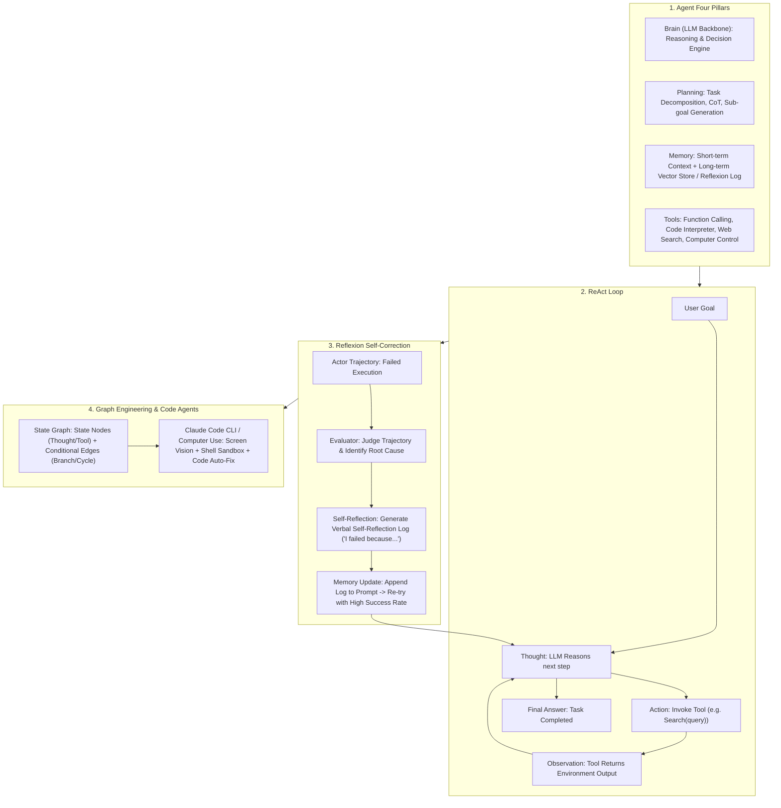

# 🌐 Agent Design Patterns: ReAct Loop, Reflexion Self-Correction, Plan-and-Execute & Graph Engineering

> **Core Executive Summary**: LLMs are evolving from static question-answering engines into autonomous **AI Agents**. Powered by four core pillars—**Brain (LLM)**, **Planning**, **Memory**, and **Tools**—agents plan and execute multi-step workflows in complex environments. This guide dissects ReAct loops, Reflexion self-correction logs, Plan-and-Execute dynamic replanning, LangGraph state engineering, and Claude Code CLI workflows.

---

## 💡 Interactive Mermaid Architecture Flowchart



---

## 💡 Classic Interview Followups & Core Cheatsheet

* **Key Topic 1**: Detail Thought-Action-Observation loop control logic and prompt parsing in ReAct framework.
  * *Standard Answer*: System prompt defines `Thought: ...`, `Action: tool[args]`, `Observation: ...`. The Python host loop parses the action via regex, pauses LLM generation, executes the tool, appends the output as `Observation:`, and resumes LLM completion until `Final Answer:` is emitted.

> 💡 **Intuition**: ReAct is "think → act → observe → repeat" — exactly how a person researches: decide what to search, click, read results, decide next. The Thought/Action/Observation format just exposes the inner monologue so the host program can act on it.
>
> 🎤 **Interview Answer**: "Conclusion: ReAct loops Thought-Action-Observation until a Final Answer. Why: the host while-loop regex-parses the LLM output; on Action it pauses generation, runs the tool, appends `Observation:` back into the prompt and resumes. Example: 'When was Python 3.12 released?' → Thought: need search → Action: Search[Python 3.12] → Observation: 2023-10-02 → Final Answer."

* **Key Topic 2**: Compare Reflexion self-correction memory mechanism vs standard ReAct in multi-step error recovery.
  * *Standard Answer*: Standard ReAct often gets trapped in infinite error loops when tool calls fail. Reflexion pauses execution on failure, invokes an Evaluator LLM to write a verbal self-reflection log, and appends it to memory, boosting multi-step coding/math success by 30%+.

> 💡 **Intuition**: ReAct circles the same pit after a failure — the short context is full of failed attempts. Reflexion pauses, reviews, writes a "what I did wrong" note into memory, then retries with the lesson already on top of the prompt.
>
> 🎤 **Interview Answer**: "Conclusion: Reflexion adds a verbal reflection log after failure, boosting multi-step success by 30%+. Why: plain ReAct loops on repeated bad actions; Reflexion runs an Evaluator over the failed trajectory, writes a natural-language lesson, and prepends it on the next attempt. Example: a SQL agent that forgot GROUP BY records 'check the schema before writing aggregate queries' and succeeds on retry."

* **Key Topic 3**: Why do linear chains fail in complex Agent systems? How does LangGraph solve infinite loops using Conditional Edges?
  * *Standard Answer*: Linear chains assume fixed A $\to$ B $\to$ C steps. LangGraph builds a `StateGraph` where **Conditional Edges** dynamically evaluate state to branch or cycle, backed by Checkpointers for state persistence and human-in-the-loop interrupts.

> 💡 **Intuition**: A linear chain is an assembly line — one-way only. Real tasks are a subway map with branches, loops, and get-off points (human-in-the-loop). LangGraph draws the agent as a graph; conditional edges are the transfer signs, checkpointers let you pause at any station.
>
> 🎤 **Interview Answer**: "Conclusion: complex agents need a state graph, not a linear chain. Why: chains assume fixed A→B→C; graphs route by state via conditional edges and persist state with checkpointers for interrupts. Example: a support agent's 'tool error → retry' branch and 'user confirms → continue' branch are conditional edges a chain cannot express."

* **Key Topic 4**: How to compress and synchronize Short-term Context Memory vs Long-term Vector Memory?
  * *Standard Answer*: Short-term context uses a Summarizer Agent to condense older dialog history once token limits are approached. Long-term memory stores user preferences and successful SOPs in a Vector DB, retrieving relevant past experiences into the prompt via semantic search.

> 💡 **Intuition**: Short-term memory is the sticky note for the current conversation — when full, a Summarizer condenses it. Long-term memory is the personal archive across sessions — vector search pulls the relevant folders back into the prompt.
>
> 🎤 **Interview Answer**: "Conclusion: compress short-term context, retrieve long-term memory. Why: near the token limit, recursively summarize history keeping key state and the last N turns; store cross-session preferences and successful SOPs in a vector DB and fetch by semantic similarity. Example: a coding agent writes 'this repo uses pnpm, not npm' into long-term memory after session one and retrieves it in session two."

* **Key Topic 5**: Analyze security isolation and robustness challenges in Computer Use (desktop control) vision and OS execution.
  * *Standard Answer*: Computer Use parses screenshots via VLM to compute click coordinates $(x, y)$. Robutness requires running in isolated VM/Docker sandboxes with action step limits and dangerous command filters.

> 💡 **Intuition**: Computer Use gives the model eyes (screenshots) and hands (clicks/typing) — but it mis-sees and mis-clicks, and with full permissions it deletes files. So it lives in a Docker/MicroVM sandbox with step limits and dangerous-command filters, like a trainee on a restored test machine.
>
> 🎤 **Interview Answer**: "Conclusion: Computer Use requires sandboxing, step caps, and dangerous-command filters. Why: a VLM parses screenshots into coordinates that PyAutoGUI clicks; resolution changes, popup overlays, and file deletion are real risks. Example: coordinates computed at one resolution miss by 20px on another — production fixes the display resolution and snapshots the VM for rollback."

---

## 📚 Section 1: Agent Design Patterns Comparison Matrix

**How to read this table**: Complexity and memory/state machinery grow top-to-bottom — ReAct fits single-task multi-tool work, Graph Engineering is the enterprise standard for all scenarios. Interview nuance: do not use Reflexion for two-step tasks — reflection burns tokens for nothing.

| Design Pattern | Core Decision Mechanism | Memory & Reflection | Target Complexity | Representative Framework |
| :--- | :--- | :--- | :--- | :--- |
| **ReAct** | Thought-Action-Obs step | Context-based (No formal log) | Medium | LangChain, AutoGen |
| **Reflexion** | Trial -> Evaluator Reflection | Verbal Reflexion Memory Log | High (Coding, Math) | Reflexion Agent |
| **Plan-and-Execute**| Planner -> Step Execution | Dynamic Replanner | Very High (Long projects) | BabyAGI, Plan-and-Solve |
| **Graph Engineering**| State Graph (Nodes+Edges) | State Machine + Checkpoints | **Enterprise Production** | **LangGraph, AutoGPT** |
| **Computer / Code Agent**| Vision/Shell -> Action | Codebase / OS feedback | Autonomous Software Eng | **Claude Code, Computer Use** |

---

## ⚡ Section 2: ReAct State Transition Formula

The formula is the host loop's branch rule: each round the parser chooses exactly one path — a `Action` output executes the tool (and loops with the Observation appended), a `Final Answer` output returns and exits.

$$S_{t+1} = \begin{cases} \text{ExecuteTool}(a_t), & \text{if } a_t \text{ is Action} \\ \text{ReturnAnswer}(m_t), & \text{if } m_t \text{ is Final Answer} \end{cases}$$

> 💡 **Intuition**: It is the if-else inside the while loop: is this a tool call or the final answer? The smaller the loop body and the clearer the branch, the more controllable the agent.
>
> 🎤 **Interview Answer**: "Conclusion: ReAct has exactly two state transitions per step. Why: parse the output — Action executes the tool and loops with the Observation appended; Final Answer returns and exits. Example: 'Action: Search[Python 3.12]' takes the ExecuteTool branch; 'Final Answer: released 2023-10-02' takes ReturnAnswer."

---

## 🐍 Section 3: Pure Python Handwritten ReAct State Machine

```python
import re

class PurePythonReActAgent:
    def __init__(self, tools: dict):
        self.tools = tools
        self.history = []
        
    def step(self, llm_output: str) -> tuple:
        self.history.append(llm_output)
        if "Final Answer:" in llm_output:
            return "FINISHED", llm_output.split("Final Answer:")[1].strip()
            
        match = re.search(r"Action:\s*(\w+)\[(.*)\]", llm_output)
        if match:
            name, arg = match.group(1), match.group(2).strip()
            if name in self.tools:
                obs = f"Observation: {self.tools[name](arg)}"
            else:
                obs = f"Observation Error: Tool '{name}' not found."
            self.history.append(obs)
            return "CONTINUE", obs
        return "ERROR", "Invalid format."

if __name__ == "__main__":
    tools = {"Search": lambda q: f"Result for '{q}': Python 3.12."}
    agent = PurePythonReActAgent(tools)
    status, obs = agent.step("Thought: Search python.\nAction: Search[Python 3.12]")
    print("✅ ReAct Step:", status, "|", obs)
```

> 💡 **Intuition**: This operator is the host engine in miniature: regex-parse `Action: tool[args]`, run the tool, wrap the output as `Observation:` and continue — `Final Answer:` is the only exit.
>
> 🎤 **Interview Answer**: "Conclusion: the ReAct host = regex parse + tool execute + observation feedback. Why: anything that is neither an Action nor a Final Answer returns ERROR to break loops. Example: step 1 returns CONTINUE with Search[Python 3.12]; step 2 hits Final Answer and returns FINISHED."

---

## 🚀 Key Takeaways & Best Practices

1. **Production Standard**: Use **LangGraph** for non-linear agent state graphs with cycle control and checkpointers.
2. **Error Self-Correction**: Integrate **Reflexion logs** for complex code and multi-step reasoning tasks.
3. **Sandbox Security**: Execute code and OS actions inside isolated **Docker / MicroVM sandboxes**.