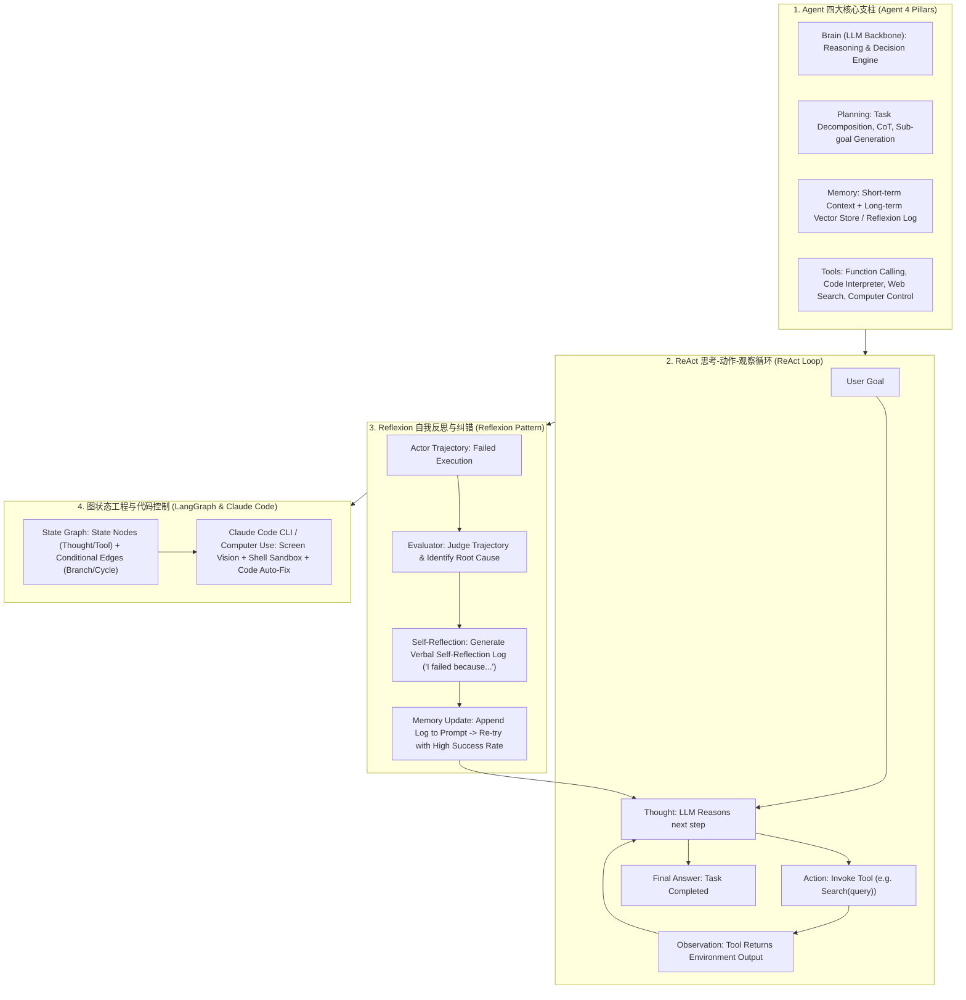

# 🌐 Agent 设计模式全景：ReAct 循环、Reflexion 自我反思、Plan-and-Execute 与 LangGraph 图工程

> **核心摘要**：大语言模型（LLM）不仅能作为无状态的问答工具，更能进化为具备自主决策能力的 **AI Agent (智能体)**。Agent 通过四大支柱——**Brain (大脑推理)**、**Planning (规划解构)**、**Memory (长短期记忆)** 和 **Tools (工具调用)**，能够在复杂非确定性环境中自主完成目标。本指南系统解构 ReAct 思考动作循环、Reflexion 反思日志自愈、Plan-and-Execute 动态重规划、LangGraph 图状态控制以及 Claude Code 自主代码工程范式。

---

## 💡 交互式 Mermaid 架构流程图



---

## 💡 经典面试追问与考点速查

* **考点 1**：详细剖析 ReAct 框架中 "Thought -> Action -> Observation" 的循环控制逻辑与 Prompt 结构解析？
  * *标准回答*：
    * **Prompt 格式定义**：在 System Prompt 中显式约束 LLM 的输出格式：
      `Thought: <推理为什么要做下一步>`
      `Action: <tool_name>[<args>]`
      `Observation: <等待系统注入工具执行结果>`
    * **循环控制逻辑**：Agent 引擎在 Python 中运行 `while` 循环。正则解析 LLM 的输出。若解析到 `Action`，则暂停 LLM 输出，调用对应的工具，将工具返回值拼接为 `Observation: ...` 重新追加进 Prompt 历史，送回 LLM 继续生成下一个 `Thought`，直到 LLM 输出 `Final Answer` 退出循环。

> 💡 **直观理解**: ReAct 把"想一步 → 做一步 → 看结果 → 再想"写成了循环，和人类查资料时"先想查什么 → 点搜索 → 看结果页 → 决定下一步"完全一样。Thought/Action/Observation 三段格式只是让模型把内心戏写在明面上，宿主程序才能接得住。
>
> 🎤 **面试速答**: "结论：ReAct = 思考-行动-观察循环，直到给出最终答案。原理：宿主用 while 循环解析 LLM 输出，正则匹配到 Action 就暂停生成、执行工具、把结果拼成 Observation 追加回 Prompt，再送回去生成下一个 Thought。例子：问'Python 3.12 何时发布？'——Thought: 需要搜索 → Action: Search[Python 3.12] → Observation: 2023-10-02 发布 → Final Answer，循环结束。"

* **考点 2**：对比 Reflexion 自我反思模式与传统 ReAct 在处理复杂多步错误修正时的 Memory 机制与成功率提升？
  * *标准回答*：
    * **ReAct 缺陷**：当 ReAct Agent 在第 5 步工具调用报错时，它很容易在接下来的 Prompt 中陷入死循环（一遍又一遍重复错误的 Action），因为短上下文里充斥着错误尝试；
    * **Reflexion 创新**：在试错失败后，暂停执行，启动一个专门的 Evaluator 提示词，让 LLM 针对刚才整条失败轨迹撰写一段**自然语言自我反思总结 (Verbal Reflection)**（如：“我之前在写 SQL 时忽略了 GROUP BY，下一次我应该先查看 Schema”）。将这段反思存入 Memory 并在下一次尝试时置顶。Reflexion 使复杂代码/数学任务成功率提升 30%+！

> 💡 **直观理解**: ReAct 犯错后会在同一个短路子里打转，像迷宫里原地兜圈；Reflexion 先"暂停、复盘、写检讨"再重试——把失败教训（自然语言反思）存进记忆，下次开局就带着攻略，绕开同样的坑。
>
> 🎤 **面试速答**: "结论：Reflexion 在失败后先反思再重试，复杂任务成功率提升 30%+。原理：ReAct 短上下文充满错误尝试容易死循环；Reflexion 用 Evaluator 对整条失败轨迹写'我失败是因为……'的反思日志并存入记忆置顶，下次尝试前可见。例子：写 SQL 时漏了 GROUP BY 报错，反思日志'先看 schema 再写聚合查询'让第二次尝试直接成功。"

* **考点 3**：为什么在复杂 Agent 项目中 "线性 Chain" 会失效？LangGraph 的状态图 (State Graph) 如何通过 Conditional Edges 解决死循环与状态持久化？
  * *标准回答*：
    * **线性 Chain 局限**：SeqChain 假定任务按固定的 A $\to$ B $\to$ C 顺序推进。但真实 Agent 存在分支选择、循环重试、人机协同 (Human-in-the-loop) 等复杂结构；
    * **LangGraph 状态图**：把 Agent 定义为有向图 (StateGraph)。节点 (Nodes) 表示计算步骤或 LLM 调用，边 (Edges) 代表流转。引入 **Conditional Edges (条件边)**，根据上一节点的 `State` 动态决定走向下一个节点还是**回退循环 (Cycle)**。同时内置 **Checkpointer 检查点**，支持在中途任何节点暂停、恢复或人工打断！

> 💡 **直观理解**: 线性 Chain 是"流水线"，只能直走；真实任务像"地铁换乘图"——有分叉、有回环、有中途下车（人工介入）。LangGraph 把 Agent 画成有向图，条件边像"换乘指示牌"，根据当前状态决定下一站，Checkpointer 则支持在任意站点暂停续走。
>
> 🎤 **面试速答**: "结论：复杂 Agent 要用状态图替代线性 Chain。原理：线性 Chain 假设 A→B→C 固定顺序，无法表达分支、循环、人工介入；LangGraph 用节点 + 条件边按 State 动态路由，Checkpointer 支持暂停/恢复/打断。例子：客服 Agent 里'工具报错→重试分支'和'用户确认→继续分支'都是条件边，纯 Chain 写不出来。"

* **考点 4**：Agent 的短期内存 (Short-term Memory) 与长期内存 (Long-term Vector Memory) 如何进行上下文压缩与检索同步？
  * *标准回答*：
    * **短期内存 (Context Window)**：存储当前 Task 对话轨迹。当上下文接近 Token 极限时，使用 **Summarizer Agent** 递归压缩历史，仅保留关键 State 摘要与最新 $N$ 轮 Interaction；
    * **长期内存 (Vector DB / Key-Value Store)**：保存跨 Session 的用户偏好、历史成功 SOP 与经验法则。通过 Semantic Search 动态检索与当前任务相关的高质量历史经验插入 Prompt。

> 💡 **直观理解**: 短期记忆是"当前对话的便签纸"，满了就请 Summarizer 把旧内容压成摘要；长期记忆是"个人经验档案柜"，跨会话存放偏好和成功 SOP，用向量检索把相关档案抽出来放进当前对话。
>
> 🎤 **面试速答**: "结论：短期内存用摘要压缩，长期内存用向量检索。原理：上下文接近上限时递归压缩历史、只留关键状态与最近 N 轮；长期记忆存跨会话偏好与成功经验，按语义相似度检索插入 Prompt。例子：写代码 Agent 每轮对话后把'本项目用 pnpm 不用 npm'写入长期记忆，下次新会话自动取回。"

* **考点 5**：分析 Computer Use (电脑桌面控制 Agent) 在屏幕截图 Vision 解析、坐标点击与 OS 交互中的安全隔离与鲁棒性挑战？
  * *Standard Answer*：
    * **Vision 解析与坐标计算**：Agent 接收屏幕截图，利用视觉大模型 (VLM) 输出目标 UI 元素的绝对坐标 $(x, y)$，通过 PyAutoGUI 触发 `click(x, y)` 或 `type(text)`；
    * **安全隔离与鲁棒性**：电脑控制极易因屏幕分辨率不同、弹窗遮挡或误操作删除重要文件产生风险。必须在**隔离的 Docker / VM 沙箱环境**中运行，并施加动作步数上限与危险指令过滤机制。

> 💡 **直观理解**: Computer Use 是"给模型一双眼睛（截图）+ 一只手（点击输入）"；但它看不清屏幕会乱点，权限无限会删文件——所以必须关进 Docker/MicroVM 沙箱，并加步数上限和危险操作黑名单，像给实习生配一台装了还原卡的测试机。
>
> 🎤 **面试速答**: "结论：Computer Use 必须沙箱隔离 + 步数限制 + 危险指令过滤。原理：VLM 解析截图输出 UI 坐标，PyAutoGUI 执行点击输入；分辨率变化、弹窗遮挡、误删文件都是真实风险。例子：Agent 在某分辨率下算出的坐标在另一屏幕偏了 20px 点错按钮，所以生产环境固定分辨率并用 VM 快照随时回滚。"

---

## 📚 第一章：Agent 设计模式特性对比矩阵

**怎么读这张表**: 纵向看"复杂度与状态管理能力逐步升级"——ReAct 适合中等复杂度的单任务多步工具调用，Graph Engineering 是工业级全场景标配。面试常考"什么时候不该上 Reflexion"——简单两步任务用反思机制纯属浪费 token。

| 设计模式 | 核心决策机制 | 记忆与反思 | 适合任务复杂度 | 代表框架 / 工具 |
| :--- | :--- | :--- | :--- | :--- |
| **ReAct** | Thought-Action-Obs 步进 | 无显式反思 (依赖 Context) | 中等 (单任务多步工具) | LangChain, AutoGen |
| **Reflexion** | 试错 -> Evaluator 反思 | 显式 Reflexion Memory 日志 | 高 (代码生成、数学推导) | Reflexion Agent |
| **Plan-and-Execute**| 先拆解 Planner -> 执行 | 动态 Replanner 调整 | 极高 (长周期复杂项目) | BabyAGI, Plan-and-Solve |
| **Graph Engineering**| 状态图 (Nodes + Edges) | 状态机 State + Checkpoint | **工业级全场景** | **LangGraph, AutoGPT** |
| **Computer / Code Agent**| Vision/Shell -> Action | 代码库/桌面环境反馈 | 自主软件工程与 OS 控制 | **Claude Code, Computer Use**|

---

## ⚡ 第二章：ReAct 循环算法与状态转换公式

该公式描述的是宿主循环的"分支规则"：LLM 每轮输出后，解析器在两条路径中二选一——输出是 `Action` 就走工具执行（并把 Observation 拼回去继续循环），输出是 `Final Answer` 就走答案返回（退出循环）。

ReAct 条件状态转换：
$$S_{t+1} = \begin{cases} \text{ExecuteTool}(a_t), & \text{if } a_t \text{ is Action} \\ \text{ReturnAnswer}(m_t), & \text{if } m_t \text{ is Final Answer} \end{cases}$$

> 💡 **直观理解**: 这就是 while 循环里的 if-else：每次生成完先判"这是工具调用还是最终答案"，对应执行工具或返回答案——循环体越简单、分支越明确，Agent 越可控。
>
> 🎤 **面试速答**: "结论：ReAct 每轮状态转移只有两条路。原理：解析输出，是 Action 就执行工具并把 Observation 拼回去继续循环，是 Final Answer 就返回并退出。例子：'Action: Search[Python 3.12]' 走 ExecuteTool 分支；'Final Answer: 2023-10-02 发布' 走 ReturnAnswer 分支。"

---

## 🐍 第三章：Pure Numpy / Python 手写 ReAct 状态机循环算子

```python
import re

class PurePythonReActAgent:
    """ Pure Python / Numpy 实现 ReAct (Thought-Action-Observation) 状态机循环算子 """
    def __init__(self, tools: dict):
        self.tools = tools
        self.history = []
        
    def step(self, llm_output: str) -> tuple:
        """
        解析 LLM 输出：识别 Thought, Action, Final Answer
        """
        self.history.append(llm_output)
        
        # 1. 检查是否到达 Final Answer
        if "Final Answer:" in llm_output:
            answer = llm_output.split("Final Answer:")[1].strip()
            return "FINISHED", answer
            
        # 2. 正则解析 Action: tool_name(arg)
        action_match = re.search(r"Action:\s*(\w+)\[(.*)\]", llm_output)
        if action_match:
            tool_name = action_match.group(1)
            tool_arg = action_match.group(2).strip()
            
            if tool_name in self.tools:
                try:
                    obs = self.tools[tool_name](tool_arg)
                    observation_str = f"Observation: {obs}"
                except Exception as e:
                    observation_str = f"Observation Error: {str(e)}"
            else:
                observation_str = f"Observation Error: Tool '{tool_name}' not found."
                
            self.history.append(observation_str)
            return "CONTINUE", observation_str
            
        return "ERROR", "Invalid ReAct output format."

# ==================== 测试验证 ====================
if __name__ == "__main__":
    # 定义测试工具
    mock_tools = {
        "Calculator": lambda expr: str(eval(expr)),
        "Search": lambda q: f"Search result for '{q}': Python 3.12 released."
    }
    
    agent = PurePythonReActAgent(mock_tools)
    
    # 模拟 LLM 步骤 1
    llm_step1 = "Thought: I need to search for Python 3.12.\nAction: Search[Python 3.12]"
    status, obs = agent.step(llm_step1)
    print("✅ ReAct 步骤 1 执行成功:", status, "|", obs)
    
    # 模拟 LLM 步骤 2
    llm_step2 = "Thought: Now I have the answer.\nFinal Answer: Python 3.12 is released."
    status, ans = agent.step(llm_step2)
    print("✅ ReAct 任务完成:", status, "| 最终答案:", ans)
```

> 💡 **直观理解**: 这段算子演示了宿主引擎的核心：正则解析 `Action: tool[args]`、执行工具、把结果包成 `Observation:` 追加进 history 再循环——`Final Answer:` 是唯一的出口。
>
> 🎤 **面试速答**: "结论：ReAct 宿主 = 正则解析 + 工具执行 + Observation 回填。原理：既没有 Action 也没有 Final Answer 就返回 ERROR，防止死循环。例子：步骤 1 解析出 Search[Python 3.12] 返回 CONTINUE，步骤 2 命中 Final Answer 返回 FINISHED。"

---

## 🚀 总结与工程最佳实践

1. **工业级 Agent 开发**：强烈推荐使用 **LangGraph** 替代线性 Chain，通过有向图机制管理状态与死循环；
2. **复杂任务容错**：在代码生成或长推导场景中接入 **Reflexion 反思日志** 机制；
3. **安全边界**：涉及电脑控制或 Shell 执行必须在隔离的 **MicroVM / Docker 沙箱** 中运行。