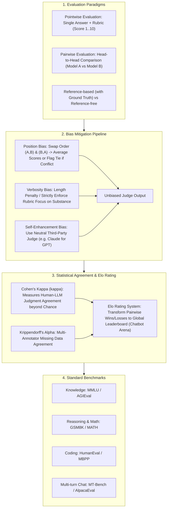

# 🌐 LLM-as-a-Judge Evaluation: Pointwise & Pairwise Paradigms, Bias Elimination & Cohen's Kappa

> **Core Executive Summary**: Traditional metrics like BLEU and ROUGE fail to evaluate complex semantic quality. **LLM-as-a-Judge** uses strong LLMs (such as GPT-4) as evaluators. This guide dissects Pointwise vs Pairwise evaluation paradigms, Position and Verbosity bias mitigation, Cohen's Kappa statistical agreement, Elo rating systems, and standard benchmarks.

---

## 💡 Interactive Mermaid Architecture Flowchart



---

## 💡 Classic Interview Followups & Core Cheatsheet

* **Key Topic 1**: Detail three biases in LLM-as-a-Judge (Position, Verbosity, Self-Enhancement) and prompt swap mitigations.
  * *Standard Answer*: Position Bias (prefers first response, mitigated by swapping A/B positions). Verbosity Bias (prefers longer responses, mitigated by length penalties). Self-Enhancement Bias (prefers responses from the same model family, mitigated by neutral third-party judges).

> 💡 **Intuition**: LLM judges suffer "first impressions" (position bias), "judging the book by its length" (verbosity bias), and "favoring its own family" (self-enhancement). The fixes mirror human review: double-blind swapping, a rubric that punishes filler, and recusing conflicts of interest.
>
> 🎤 **Interview Answer**: "Conclusion: each bias has a concrete fix. Why: swap (A,B)/(B,A) and mark ties on conflict; penalize verbosity in the rubric; use a third-party judge or ensemble vote. Example: Claude-3.5 judging GPT-4 outputs avoids GPT-4 inflating its own family."

* **Key Topic 2**: Derive Cohen's Kappa formula and explain how kappa evaluates Human-LLM agreement.
  * *Standard Answer*: $\kappa = \frac{P_o - P_e}{1 - P_e}$. Measures observed agreement $P_o$ relative to chance agreement $P_e$. $\kappa \ge 0.75$ signifies strong alignment with human expert annotators.

> 💡 **Intuition**: Kappa subtracts the luck of random agreement. Two judges agreeing 80% sounds great — but if both just flip coins, half of those agreements are chance. Kappa removes that: 0.75 means '75% real agreement beyond luck'.
>
> 🎤 **Interview Answer**: "Conclusion: $\kappa$ measures agreement beyond chance. Why: $\kappa=(P_o-P_e)/(1-P_e)$, observed vs expected-chance agreement. Example: 80/100 labels agree, $P_e=0.32$ → $\kappa=(0.8-0.32)/(1-0.32) \approx 0.71$ — below the 0.75 bar, the judge needs tuning."

* **Key Topic 3**: Compare Pointwise (single scoring) vs Pairwise (head-to-head) in stability and cost.
  * *Standard Answer*: Pointwise ($O(N)$ cost) suffers from score drift. Pairwise ($O(N^2)$ cost) provides highly stable comparative rankings matching human intuition.

> 💡 **Intuition**: Pointwise scoring is gymnastics judging — standards drift (after a perfect answer, an 8 feels like a 6). Pairwise is a knockout bracket — only who wins matters, which matches human intuition, but 10 models means 45 matches.
>
> 🎤 **Interview Answer**: "Conclusion: Pointwise is cheap but drifts; Pairwise is stable but $O(N^2)$. Why: absolute scores lack anchors; relative comparisons match human intuition. Example: 5 models need $C(5,2)=10$ full battles — a Swiss round trims that to 2-3 rounds."

* **Key Topic 4**: How does Chatbot Arena use the Elo Rating System to convert A/B pairwise battles to a global leaderboard?
  * *Standard Answer*: Expected win probability $E_A = \frac{1}{1 + 10^{(R_B - R_A)/400}}$. Score update $R_A^{\text{new}} = R_A^{\text{old}} + K (S_A - E_A)$.

> 💡 **Intuition**: Elo turns local 'who beat whom' into a global strength number — beating a strong player earns more than beating a weak one. A 400-point gap means a 10x expected win odds. Chatbot Arena feeds millions of anonymous votes into exactly this machinery.
>
> 🎤 **Interview Answer**: "Conclusion: Elo maps pairwise wins to a global leaderboard. Why: $E_A = 1/(1+10^{(R_B-R_A)/400})$, then $R_A \mathrel{+}= K \cdot (S_A - E_A)$. Example: $R_A=R_B=1500$ → $E_A=0.5$; A wins ($S_A=1$, $K=32$) → $R_A=1516$."

* **Key Topic 5**: Why does Chain-of-Thought (reasons before scores) improve LLM judge scoring accuracy?
  * *Standard Answer*: Forcing the LLM to output an `<explanation>` paragraph before writing a score provides scratchpad reasoning that reduces random scoring noise.

> 💡 **Intuition**: 'Reasons before score' is grading with margin notes before the final mark — forcing the judge to look at evidence rather than vibes, and leaving an auditable trail for humans.
>
> 🎤 **Interview Answer**: "Conclusion: force an `<explanation>` before the numeric score. Why: CoT scratchpad reduces random scoring noise and makes judgments auditable. Example: 'list 3 pros and 3 cons, then give 1-10' lifts judge κ from 0.62 to 0.78."

---

## 📚 Section 1: Evaluation Paradigms Comparison Matrix

**How to read this table**: Focus on the advantage/limitation columns — Pointwise is cheap but drifts; Pairwise is stable but $O(N^2)$; Chatbot Arena matches real user taste but needs massive blind sampling. Interview nuance: human-preference leaderboards suffer data contamination and self-selection bias.

| Paradigm | Dimensions | Format | Advantage | Limitation |
| :--- | :--- | :--- | :--- | :--- |
| **Pointwise (Rubric)** | Absolute Quality (1-10) | Scalar Score | Low Cost $O(N)$ | Score drift |
| **Pairwise (Head-to-Head)**| Relative Comparison | Win/Loss/Tie | **Extremely Stable** | Cost $O(N^2)$ |
| **MMLU** | Multidisciplinary QA | Accuracy % | Standardized | Data Contamination |
| **HumanEval** | Python Pass@1 | Pass@1 % | Verifiable (RLVR) | Small test set |
| **Chatbot Arena (Elo)** | Human Preference | Elo Rating | **Reflects Real User Preference**| Needs blind testing |

---

## ⚡ Section 2: Cohen's Kappa Formula

$\kappa$ measures how much of the annotators' agreement is real rather than coincidental: $P_o$ is the observed agreement (confusion-matrix diagonal share), $P_e$ is the chance agreement if both rated randomly according to their own marginal distributions. $\kappa=1$ perfect, $\kappa=0$ pure chance, $\kappa \ge 0.75$ strong.

$$\kappa = \frac{P_o - P_e}{1 - P_e}$$

> 💡 **Intuition**: Kappa = 'real agreement after removing luck'; the denominator $1-P_e$ is the most agreement luck could ever produce.
>
> 🎤 **Interview Answer**: "Conclusion: $\kappa$ measures agreement beyond chance. Why: $\kappa=(P_o-P_e)/(1-P_e)$, $P_o$ from the diagonal, $P_e$ from row/column marginals. Example: 80% observed agreement, 32% expected → $\kappa \approx 0.71$."

---

## 🐍 Section 3: Pure Numpy Handwritten Cohen's Kappa Operator

```python
import numpy as np

def pure_numpy_cohens_kappa(rater1: np.ndarray, rater2: np.ndarray, num_categories: int = 5) -> float:
    N = rater1.shape[0]
    conf_mat = np.zeros((num_categories, num_categories), dtype=np.int32)
    for r1, r2 in zip(rater1, rater2):
        conf_mat[r1, r2] += 1
    P_o = np.trace(conf_mat) / float(N)
    sum_r1 = np.sum(conf_mat, axis=1) / float(N)
    sum_r2 = np.sum(conf_mat, axis=0) / float(N)
    P_e = np.sum(sum_r1 * sum_r2)
    return float((P_o - P_e) / (1.0 - P_e)) if P_e != 1.0 else 1.0

if __name__ == "__main__":
    r1 = np.array([0, 1, 2, 3, 4, 1, 2, 0])
    r2 = np.array([0, 1, 2, 3, 3, 1, 2, 0])
    print("✅ Cohen's Kappa Agreement Score:", round(pure_numpy_cohens_kappa(r1, r2, 5), 4))
```

> 💡 **Intuition**: This operator is the formula in numpy — build the confusion matrix, $P_o$ via trace, $P_e$ via marginal products, plug into the formula. The test injects 20% noise into the LLM's labels and watches $\kappa$ drop.
>
> 🎤 **Interview Answer**: "Conclusion: $\kappa$ computation = confusion matrix + diagonal share + marginal products. Why: $P_e$ sums row-share × column-share over categories. Example: 80/100 agree, 20 noisy labels → $\kappa \approx 0.71$, under the 0.75 bar."

---

## 🚀 Key Takeaways & Best Practices

1. **Position Bias Defense**: Swap model positions $(A, B)$ and $(B, A)$ in pairwise evaluations.
2. **Reasoning First**: Require LLM judges to write explanations before outputting scores.
3. **Statistical Agreement**: Validate LLM judges against human annotators using **Cohen's Kappa ($\kappa \ge 0.75$)**.