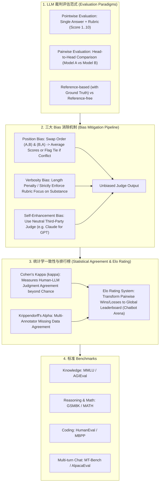

# 🌐 LLM-as-a-Judge 自动化评估全景：Pointwise 与 Pairwise 范式、三大 Bias 消除与 Cohen's Kappa 统计一致性

> **核心摘要**：随着 LLM 生成内容的日益复杂，传统基于 N-gram 重合度的 BLEU 和 ROUGE 指标无法衡量深刻的语义连贯性与事实准确性。**LLM-as-a-Judge** 采用更强大的 LLM (如 GPT-4) 作为裁判对生成结果进行自动化打分。本指南系统解构 Pointwise 与 Pairwise 评估范式、位置与长文偏置消除策略、Cohen's Kappa 统计学一致性校验、Elo 竞技场评分体系以及 MMLU/HumanEval 标准基准。

---

## 💡 交互式 Mermaid 架构流程图



---

## 💡 经典面试追问与考点速查

* **考点 1**：详细解构 LLM-as-a-Judge 中的三大 Bias (Position Bias, Verbosity Bias, Self-Enhancement Bias)，并给出具体的 Prompt 与位置调换消除方案？
  * *标准回答*：
    1. **Position Bias (位置偏置)**：LLM 裁判倾向于给放在第一个位置的模型 (Model A) 打高分。**消除方案**：交换位置重新评测一次 $(B, A)$，计算两次综合得分；若两次结果冲突则判定为平局 (Tie)；
    2. **Verbosity Bias (长文偏置)**：模型倾向于给字数更长、排版更精美的回答打高分，即使内容包含废话。**消除方案**：在 Rubric 中显式强调“惩罚冗余字数，专注于事实密度”，或对字数差进行 Length Normalization 正则化；
    3. **Self-Enhancement Bias (自偏置)**：GPT-4 倾向于给 GPT-4 生成的回答打高分。**消除方案**：采用第三方独立裁判（如用 Claude-3.5-Sonnet 评估 GPT-4），或结合多个裁判模型进行 Ensemble 投票。

> 💡 **直观理解**: LLM 裁判有"先入为主"（位置偏置）、"以貌取人"（长文偏置）、"护短"（自偏置）三个毛病。解法分别是：交换 AB 位置测两次、Rubric 里写明扣废话分、用第三方模型当裁判——和人类评审里"匿名双盲 + 评分标准 + 回避利益冲突"如出一辙。
>
> 🎤 **面试速答**: "结论：三大 bias 各有对应消除方案。原理：Position——交换 (A,B) 与 (B,A) 重测，冲突判平局；Verbosity——Rubric 惩罚冗余、只看事实密度；Self-Enhancement——用第三方裁判或多模型投票。例子：用 Claude-3.5 评 GPT-4 的输出，避免 GPT-4 给自己家族打高分。"

* **考点 2**：推导 Cohen's Kappa ($\kappa$) 统计一致性公式，并解释如何通过 $\kappa$ 值评估 LLM Judge 与人类专家标注者 (Human Annotators) 的一致程度？
  * *标准回答*：
    * **Cohen's Kappa 公式**：
      $$\kappa = \frac{P_o - P_e}{1 - P_e}$$
      其中 $P_o$ 为观测到的标注一致比例 (Observed Agreement)，$P_e$ 为随机偶然一致的概率 (Expected Chance Agreement)。
    * **物理含义**：若 $\kappa = 1$，说明完全一致；若 $\kappa = 0$，说明一致度纯属随机偶然；若 $\kappa \ge 0.75$，说明 LLM Judge 与人类专家一致性极高，可以完全替代人工标注！

> 💡 **直观理解**: Kappa 是"扣掉瞎猜的运气分之后还剩多少真实一致"。两个裁判都乱打分也有概率碰巧一致，kappa 把这种偶然一致从 100% 里减掉：0.75 意味着"排除运气后还有 75% 的实质一致"。
>
> 🎤 **面试速答**: "结论：kappa 衡量扣除偶然后的人机一致度。原理：$\kappa = (P_o - P_e)/(1 - P_e)$，$P_o$ 是实际一致率，$P_e$ 是随机一致率。例子：人机标注 100 条，80 条一致（$P_o=0.8$），偶然一致 0.32，$\kappa = (0.8-0.32)/(1-0.32) \approx 0.71$——未到 0.75 门槛，说明 LLM 裁判还要调。"

* **考点 3**：对比 Pointwise (单输出打分) 与 Pairwise (两输出对比) 在评估稳定性、胜率计算以及计算成本上的利弊？
  * *标准回答*：
    * **Pointwise (单项打分)**：直接给 1 个回答打 1~10 分。**优点**：计算复杂度低 ($O(N)$)；**缺点**：打分标准漂移严重（如前面看了极佳回答后，后面的中等回答会被打极低分）；
    * **Pairwise (两两对比)**：将两个模型的回答放在一起比胜负。**优点**：极度符合人类比较直觉，评分稳定性极高；**缺点**：计算复杂度高达 $O(N^2)$（$N$ 个模型两两对决），通常配合 Swiss-System 瑞士轮或 Elo 匹配减少对决场次。

> 💡 **直观理解**: 单项打分像"体操裁判给分"——标准容易漂移（前面看过满分后，后面的 8 分看着像 6 分）；两两对比像"打擂台"——只分胜负、不问绝对分，人类直觉天然适应，但 10 个模型要打 45 场。
>
> 🎤 **面试速答**: "结论：Pointwise 便宜不稳，Pairwise 稳定但贵。原理：Pointwise $O(N)$ 但分数漂移严重；Pairwise $O(N^2)$ 但接近人类直觉、抗漂移，用 Elo/Swiss 减场次。例子：5 个模型 pairwise 全对决要 $C(5,2)=10$ 场，用 Swiss 轮 2-3 轮就够。"

* **考点 4**：Chatbot Arena 如何利用 Elo Rating System (埃洛等级分) 将成对 A/B 投票转换为全局模型能力排行榜？
  * *标准回答*：
    * **期望胜率公式**：设模型 $A$ 和模型 $B$ 的 Elo 等级分为 $R_A$ 和 $R_B$，模型 $A$ 的期望胜率为：
      $$E_A = \frac{1}{1 + 10^{(R_B - R_A)/400}}$$
    * **更新公式**：比赛结束后（实际胜负结果 $S_A \in \{1, 0.5, 0\}$），更新得分：
      $$R_A^{\text{new}} = R_A^{\text{old}} + K \cdot (S_A - E_A)$$
      通过海量成对盲测对决，Elo 分数精确反应了模型的相对强弱。

> 💡 **直观理解**: Elo 把"谁赢了谁"这种局部信息，通过一次次更新变成全局能力分——赢强手加分多、输弱手扣分多。400 分差对应 10 倍胜率优势，和棋类比赛同一套逻辑，Chatbot Arena 就是把上百万次匿名投票喂给这套系统。
>
> 🎤 **面试速答**: "结论：Elo 把成对胜负映射成全局等级分。原理：期望胜率 $E_A = 1/(1+10^{(R_B-R_A)/400})$，赛后 $R_A \mathrel{+}= K \cdot (S_A - E_A)$。例子：$R_A=1500$ 打 $R_B=1500$，$E_A=0.5$；A 赢后 $S_A=1$、$K=32$，$R_A \to 1516$，连赢几次分差就拉开。"

* **考点 5**：在设计评估 Rubric (评分量规) 时，如何通过 Chain-of-Thought (先写理由再打分) 提高 LLM Judge 的打分准确性与抗噪能力？
  * *标准回答*：强制要求 LLM **在输出数字分数之前，首先输出 `<explanation>` 段落**，逐条列出回答的优缺点。CoT 推理过程充当了思考缓冲（Scratchpad），显著减少了 LLM 的随机盲目打分现象。

> 💡 **直观理解**: "先写理由再打分"就像老师批卷先写批注再给分——推理过程强制裁判把注意力放在证据上，而不是凭整体印象甩一个数，顺便把打分依据留痕给人类复核。
>
> 🎤 **面试速答**: "结论：要求 LLM 先输出 explanation 再输出分数。原理：CoT 思考缓冲（scratchpad）降低随机打分噪声，理由可审计。例子：Rubric 提示词写'列出 3 条优点 3 条缺点，再给 1-10 分'，评测集上 kappa 从 0.62 升到 0.78。"

---

## 📚 第一章：评估范式与 Benchmarks 对比矩阵

**怎么读这张表**: 重点看"优点 / 缺点"两列——Pointwise 便宜但漂移，Pairwise 稳定但 $O(N^2)$，Chatbot Arena 最接近真实用户体验但最贵。面试常考"为什么人类偏好榜单不能全信"——数据污染与盲测样本偏差。

| 评估范式 / Benchmark | 评价维度 | 输出格式 | 优点 | 缺点 / 挑战 |
| :--- | :--- | :--- | :--- | :--- |
| **Pointwise (Rubric)** | 绝对质量 (1-10 分) | 标量分数 | 低成本 $O(N)$ | 打分标准容易漂移 |
| **Pairwise (Head-to-Head)**| 相对优劣 (A/B) | Win/Loss/Tie | **极稳定，抗漂移** | 成本高达 $O(N^2)$ |
| **MMLU** | 多学科选择题知识 | Acc % | 标准化可比 | 存在数据污染 (Data Contamination) |
| **HumanEval** | Python 代码通过率 | Pass@1 % | 客观可验证 (RLVR) | 题目数量偏少 |
| **Chatbot Arena (Elo)** | 人类主观偏好 | Elo Rating | **真实反映人类真实体验**| 需要大量匿名盲测样本 |

---

## ⚡ 第二章：Cohen's Kappa 统计公式

$\kappa$ 度量"两位标注者的一致度中有多少是真实而非巧合"：$P_o$ 是观测一致率（混淆矩阵对角线占比），$P_e$ 是双方按各自边缘分布随机打分时"碰巧一致"的概率。$\kappa=1$ 完全一致，$\kappa=0$ 纯属偶然，$\kappa \ge 0.75$ 视为高度一致。

$$\kappa = \frac{P_o - P_e}{1 - P_e}$$

> 💡 **直观理解**: 见考点 2——kappa 就是"扣掉运气分后的真实一致率"，分母 $1-P_e$ 是"运气最多能贡献多少一致"。
>
> 🎤 **面试速答**: "结论：$\kappa$ 衡量超出偶然水平的一致度。原理：$\kappa=(P_o-P_e)/(1-P_e)$，$P_o$ 取混淆矩阵对角线比例，$P_e$ 按行列边缘分布乘积求和。例子：两道标注 80% 一致、偶然一致 32%，$\kappa \approx 0.71$。"

---

## 🐍 第三章：Pure Numpy 手写 Cohen's Kappa 标注者一致性算子

```python
import numpy as np

def pure_numpy_cohens_kappa(rater1: np.ndarray, rater2: np.ndarray, num_categories: int = 5) -> float:
    """
    Pure Numpy 实现 Cohen's Kappa (\kappa) 标注者一致性校验算子
    rater1: shape (N,)  值从 0 到 num_categories-1
    rater2: shape (N,)  值从 0 到 num_categories-1
    """
    N = rater1.shape[0]
    
    # 1. 构建混淆矩阵 (Confusion Matrix) (num_cats, num_cats)
    conf_mat = np.zeros((num_categories, num_categories), dtype=np.int32)
    for r1, r2 in zip(rater1, rater2):
        conf_mat[r1, r2] += 1
        
    # 2. 计算观测一致率 P_o
    P_o = np.trace(conf_mat) / float(N)
    
    # 3. 计算随机一致率 P_e
    sum_r1 = np.sum(conf_mat, axis=1) / float(N)
    sum_r2 = np.sum(conf_mat, axis=0) / float(N)
    P_e = np.sum(sum_r1 * sum_r2)
    
    # 4. 计算 Kappa
    if P_e == 1.0:
        return 1.0
    kappa = (P_o - P_e) / (1.0 - P_e)
    return float(kappa)

# ==================== 测试验证 ====================
if __name__ == "__main__":
    np.random.seed(42)
    # 模拟人类专家与 LLM Judge 对 100 个样本的评分 (0~4 分)
    human_labels = np.random.randint(0, 5, size=100)
    # 模拟 LLM 具有较高的关联系数
    llm_labels = human_labels.copy()
    noise_idx = np.random.choice(100, size=20, replace=False)
    llm_labels[noise_idx] = np.random.randint(0, 5, size=20)
    
    kappa_score = pure_numpy_cohens_kappa(human_labels, llm_labels, num_categories=5)
    print("✅ Cohen's Kappa 统计一致性得分:", round(kappa_score, 4))
```

> 💡 **直观理解**: 这段算子把 kappa 公式翻译成 numpy：建混淆矩阵 → `trace` 算 $P_o$ → 行列边缘乘积算 $P_e$ → 代入公式。测试里给 LLM 标注注入 20% 噪声，看 kappa 掉到多少。
>
> 🎤 **面试速答**: "结论：kappa 计算 = 混淆矩阵 + 对角线比例 + 边缘分布乘积。原理：$P_e$ 是 rater1 与 rater2 各自类别分布独立相乘求和。例子：100 条里 80 条一致、20 条噪声，kappa 输出约 0.71，低于 0.75 门槛说明裁判需迭代。"

---

## 🚀 总结与工程最佳实践

1. **偏差防护**：Pairwise 评估务必使用 **位置调换 $(A, B) \ \& \ (B, A)$** 计算平局与均分；
2. **CoT Prompt**：必须要求 LLM 裁判 **“先输出理由，再输出分数”**；
3. **一致性校验**：每次上线新 LLM Judge 必须计算 **Cohen's Kappa ($\kappa \ge 0.75$)** 校验人类对齐度。