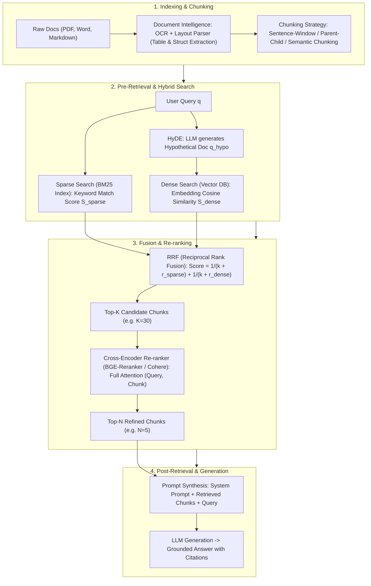

# 🌐 RAG Pipeline: From Naive RAG to Advanced RAG Architecture, Hybrid Search, RRF & Cross-Encoder

> **Core Executive Summary**: Large Language Models suffer from knowledge cutoffs and hallucinations. **RAG (Retrieval-Augmented Generation)** connects LLMs to external authoritative knowledge bases for real-time document grounding. Evolving from Naive RAG to multi-query, hybrid-search **Advanced RAG**, RAG forms the foundation of enterprise AI systems. This guide dissects chunking, BM25 + Dense hybrid retrieval, RRF fusion, Cross-Encoder re-ranking, and Document Intelligence parsing.

---

## 💡 Interactive Mermaid Architecture Flowchart



---

## 💡 Classic Interview Followups & Core Cheatsheet

* **Key Topic 1**: Compare Sparse Retrieval (BM25) vs Dense Retrieval (BGE Embeddings) in keyword matching and domain generalization.
  * *Standard Answer*: BM25 excels at exact keyword/serial-number matches without GPU overhead but lacks semantic generalization. Dense Retrieval captures deep semantic concepts but struggles with exact strings and un-finetuned domains.

> 💡 **Intuition**: Sparse search is like Ctrl+F (exact strings only); dense search is like reading for meaning (synonyms and paraphrase). Neither alone is enough — "Apple" vs "苹果" breaks keyword search, "RTX-4090" confuses semantic search.
>
> 🎤 **Interview Answer**: "Conclusion: use BM25 + dense hybrid, never one alone. Why: BM25 scores via term frequency × inverse document frequency — flawless on part numbers and proper nouns, blind to synonyms; dense retrieval scores via embedding cosine similarity — strong semantics, shaky on exact strings in cold domains. Example: searching 'iPhone' — BM25 surfaces docs containing 'Apple iPhone', dense surfaces docs about 'smartphones', RRF merges both into Top-5."

* **Key Topic 2**: Derive Reciprocal Rank Fusion (RRF) formula and explain constant $k$'s smoothing role.
  * *Standard Answer*: $\text{RRF\_Score}(d) = \sum_{m \in M} \frac{1}{k + r_m(d)}$. Constant $k \approx 60$ prevents top-ranked items from dominating score scaling across non-comparable score spaces.

> 💡 **Intuition**: RRF ignores raw scores and only keeps each retriever's rank — like two judges who cannot agree on a points scale but both know who finished 1st, 2nd, 3rd. The $k \approx 60$ constant compresses the gap between adjacent ranks so a single retriever's #1 does not dominate.
>
> 🎤 **Interview Answer**: "Conclusion: RRF fuses rankings, not scores. Why: BM25 scores (~15.2) and cosine similarities (~0.85) live on different scales, but ranks are comparable; each doc earns $1/(k+r)$ per list with $k=60$. Example: doc_1 ranks #1 in BM25 and #2 in dense → $1/61 + 1/62 \approx 0.0325$, beating any doc ranked high in only one list."

* **Key Topic 3**: Detail Sentence-Window Chunking vs Parent-Child Chunking in balancing context length vs search precision.
  * *Standard Answer*: Sentence-Window embeds single sentences while retrieving surround $W$ sentences for LLM context. Parent-Child embeds small Child Chunks (128 tokens) for precision search while returning the large Parent Chunk (1024 tokens) to LLM.

> 💡 **Intuition**: "Retrieve small, generate big" — the supermarket metaphor: remember the shelf number (small chunk) for precise navigation, but carry home the whole shelf (parent chunk) for context. Small chunks sharpen similarity; big chunks supply context.
>
> 🎤 **Interview Answer**: "Conclusion: decouple retrieval granularity from context size. Why: tiny chunks make embedding similarity precise but give too little context for generation; big chunks have context but dilute similarity. Sentence-Window embeds one sentence and expands ±2 sentences for the LLM; Parent-Child embeds 128-token children and returns their 1024-token parent. Example: legal QA — the sentence 'penalty 5%' hits, but the whole clause must go to the model."

* **Key Topic 4**: Compare Bi-Encoder vs Cross-Encoder in computational complexity and re-ranking accuracy.
  * *Standard Answer*: Bi-Encoder computes independent embeddings ($O(N)$ fast cosine dot-product). Cross-Encoder performs joint self-attention across (Query, Document) tokens ($O(K L^2)$ high accuracy, ideal for Top-30 re-ranking).

> 💡 **Intuition**: Bi-Encoder is "both sides write a profile, then compare profiles" — fast, lossy; Cross-Encoder is "two people read each other's every word face to face" — accurate, expensive, one pair at a time.
>
> 🎤 **Interview Answer**: "Conclusion: Bi-Encoder recalls, Cross-Encoder re-ranks. Why: Bi-Encoder pre-embeds all docs offline, so online cost is $O(N)$ dot products (milliseconds); Cross-Encoder concatenates (query, doc) for full cross-attention at $O(K \cdot L^2)$, so it only re-ranks Top-30 into Top-5. Example: BGE-Reranker after vector retrieval adds ~200ms but lifts precision from 'very high' to 'highest'."

* **Key Topic 5**: Explain HyDE (Hypothetical Document Embeddings) workflow and identify query failure modes.
  * *Standard Answer*: LLM generates a hypothetical answer, then embeds it for Doc-to-Doc search. Fails when the query asks about obscure/private facts where the LLM hallucinates incorrect hypothetical text.

> 💡 **Intuition**: A query is a "question vs document" cross-type match, which embeddings do poorly; HyDE translates the question into a fake answer first, making it "document vs document" same-type matching. Like sketching a wanted-poster portrait before scanning the photo wall.
>
> 🎤 **Interview Answer**: "Conclusion: HyDE generates a hypothetical document, embeds it, and retrieves with that. Why: doc-to-doc similarity is more reliable than query-to-doc. Example: ask 'why is Transformer parallelizable?' → the LLM writes a passage about self-attention → embed it → find real papers. Failure mode: queries about unknown/private facts produce hallucinated hypotheticals that steer retrieval in the wrong direction."

---

## 📚 Section 1: RAG Paradigm Comparison Matrix

**How to read this table**: Read bottom-up — latency climbs from <100ms to ~300ms while precision climbs from "Medium" to "Highest"; the "Context Integrity" column is the quality axis. The interview point: Hybrid + Cross-Rerank is the most expensive row because it fixes both the fixed-512-chunk and single-retriever weaknesses of Naive RAG.

| Paradigm | Search Mechanism | Context Integrity | Latency | Precision | Target Use Case |
| :--- | :--- | :--- | :--- | :--- | :--- |
| **Naive RAG** | Single Dense Vector | Fair (Fixed 512) | Low (<100ms) | Medium | Basic QA Demo |
| **Sentence-Window** | Sentence Vector + Window | High | Low | High | Legal / Regulatory QA |
| **Parent-Child** | Small Search $	o$ Big Input | Very High | Low-Medium | High | Technical Docs / Manuals |
| **Hybrid + RRF** | BM25 + Dense + RRF | High | Medium (<200ms) | Very High | **Enterprise Standard** |
| **Hybrid + Cross-Rerank**| Hybrid + Cross-Encoder | Very High | Medium-High (~300ms)| **Highest** | High-precision Finance/Medical |

---

## ⚡ Section 2: RRF Formula

RRF ignores raw scores (they live on different scales) and fuses **ranks**: each doc earns $1/(k + r)$ from every list. The constant $k \approx 60$ is a smoother — it keeps the score gap between adjacent ranks tiny so a doc ranked #1 by only one retriever cannot dominate.

$$\text{RRF\_Score}(d) = \sum_{m \in M} \frac{1}{k + r_m(d)}$$

> 💡 **Intuition**: Two judges who use different scoring systems can still agree on an order; RRF sums $1/(60+\text{rank})$ so "both lists approve" beats "one list loves".
>
> 🎤 **Interview Answer**: "Conclusion: RRF merges multiple rank lists into one score. Why: ranks are comparable across retrievers while raw scores are not; $k=60$ smooths the top. Example: a doc at rank 3 in one list and rank 2 in another gets $1/63 + 1/62 \approx 0.0323$, versus a single #1 worth only $0.0164$."

---

## 🐍 Section 3: Pure Numpy Handwritten RRF Fusion Operator

```python
def pure_numpy_rrf_fusion(rank_list1: list, rank_list2: list, k: int = 60) -> list:
    rrf_scores = {}
    for rank, doc_id in enumerate(rank_list1, start=1):
        rrf_scores[doc_id] = rrf_scores.get(doc_id, 0.0) + 1.0 / (k + rank)
    for rank, doc_id in enumerate(rank_list2, start=1):
        rrf_scores[doc_id] = rrf_scores.get(doc_id, 0.0) + 1.0 / (k + rank)
    return sorted(rrf_scores.items(), key=lambda x: x[1], reverse=True)

if __name__ == "__main__":
    bm25 = ["doc_1", "doc_2", "doc_3"]
    vector = ["doc_3", "doc_1", "doc_4"]
    print("✅ RRF Fused Results:", pure_numpy_rrf_fusion(bm25, vector))
```

> 💡 **Intuition**: This operator is the formula in six lines: a dict accumulates $1/(k+\text{rank})$ per doc across both rank lists, then sorts descending. That is the whole skeleton you would whiteboard in an interview.
>
> 🎤 **Interview Answer**: "Conclusion: RRF implementation is a dictionary accumulation. Why: every occurrence of a doc in any rank list adds $1/(k+\text{rank})$; sort by total. Example: with $k=60$, doc ranked #1 in list A and #2 in list B scores $0.0164 + 0.0161 = 0.0325$ — first overall."

---

## 🚀 Key Takeaways & Best Practices

1. **Enterprise Retrieval Standard**: Always implement **BM25 + Dense Hybrid Search** with **RRF score fusion**.
2. **Re-ranking Mandate**: Pipeline Top-30 hybrid candidates into a **Cross-Encoder (BGE-Reranker)** to yield Top-5 chunks.
3. **Chunking Best Practice**: Prefer **Parent-Child Chunking** to eliminate context truncation.