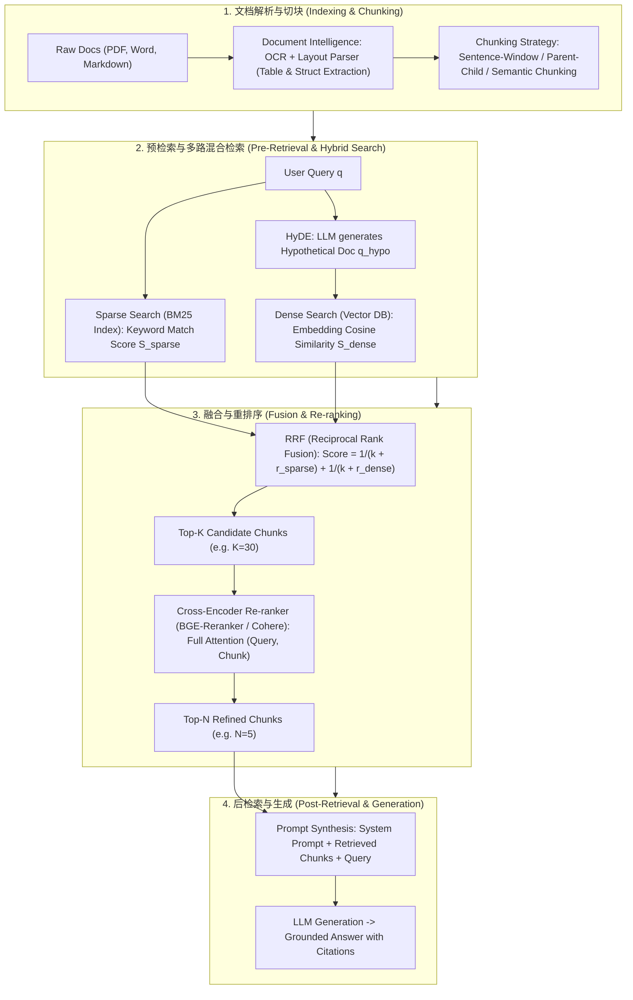

# 🌐 RAG 检索增强生成全景：从 Naive RAG 到 Advanced RAG、混合检索 (BM25 + Dense)、RRF 与 Cross-Encoder 重排序

> **核心摘要**：大语言模型受限于参数知识的截止日期与幻觉问题，**RAG (Retrieval-Augmented Generation)** 通过引入外部知识库，使得 LLM 在生成回答前能够实时检索准确、最新的权威文档。从简单的 Naive RAG，演进到具备预检索 (Pre-Retrieval)、后检索 (Post-Retrieval) 优化与多路混合检索的 **Advanced RAG**，RAG 已成为企业级 AI 系统落地的绝对核心。本指南系统解构 Chunking 策略、BM25 + Dense 混合检索、RRF 秩融合、Cross-Encoder 重排序以及 Document Intelligence 复杂的文档解析。

---

## 💡 交互式 Mermaid 架构流程图



---

## 💡 经典面试追问与考点速查

* **考点 1**：对比 Sparse Retrieval (如 BM25) 与 Dense Retrieval (如 BGE Embeddings) 在关键词匹配、领域泛化与语义理解上的优缺点？
  * *标准回答*：
    * **Sparse Retrieval (BM25 / TF-IDF)**：基于词频统计与逆文档频率。**优点**：对精确专有名词、产品型号（如 "RTX-4090"、人名、代码函数名）检索极其精准，零样本领域泛化强，无需 GPU 训练；**缺点**：无法处理同义词替换（如 "apple" 与 "苹果"）及深层语义理解；
    * **Dense Retrieval (Vector Embeddings)**：基于双塔神经网络（如 BGE、E5）计算余弦相似度。**优点**：具备极强的语义泛化与跨语言对齐能力；**缺点**：对精确字符串/数字型号敏感度低，在未微调的特定垂直领域易发生语义漂移。
    * **最佳实践**：必须采用 **BM25 + Dense 混合检索 (Hybrid Search)**！

> 💡 **直观理解**: Sparse 检索像"查字典——按字找词"，Dense 检索像"读意思——按语义找近义词"。单用前者，用户说"苹果"就找不到写"Apple"的文档；单用后者，搜 "RTX-4090" 会匹配到一堆显卡科普文。两个都不完美，所以工业界直接"两个都查，结果合并"。
>
> 🎤 **面试速答**: "结论：BM25 管精确匹配，Dense 管语义匹配，必须混合。原理：BM25 用词频 + 逆文档频率打分，对型号、人名等精确串零失误；Dense 用双塔 embedding 余弦相似度，能处理同义改写。例子：搜'苹果手机'，BM25 命中写 'iPhone' 的文档，Dense 命中写'智能手机'的文档，RRF 合并后 Top-5 都进 LLM 上下文。"

* **考点 2**：推导 RRF (Reciprocal Rank Fusion) 倒数秩融合公式，并解释常数 $k$ 在多路检索融合中的平滑作用？
  * *标准回答*：
    * **RRF 公式**：设文档 $d$ 在 $M$ 路检索结果中的排名为 $r_m(d) \in \{1, 2, \dots\}$，融合得分定义为：
      $$\text{RRF\_Score}(d) = \sum_{m \in M} \frac{1}{k + r_m(d)}$$
    * **常数 $k$ 的物理作用**：$k$ 是平滑常数（通常设为 60）。由于 BM25 的 Score（如 15.2）与 Vector Similarity（如 0.85）量纲完全不同，无法直接相加。RRF 只使用**排名 (Rank)** 而非原始得分。当 $k=60$ 时，第 1 名的得分为 $1/61 \approx 0.01639$，第 2 名为 $1/62 \approx 0.01612$，有效防止了高排名文档得分过于激进，平滑组合了多路检索结果。

> 💡 **直观理解**: RRF 相当于"只看名次、不看分数的多路裁判合并"。BM25 的 15.2 分和向量的 0.85 相似度没法直接相加，但"谁排第 1、谁排第 2"是可以比较的——把两路排名按 $1/(60+\text{名次})$ 折算后求和，让"两路都认可"的文档胜过"只有一路力捧"的文档。
>
> 🎤 **面试速答**: "结论：RRF 用排名代替原始分数融合多路检索。原理：BM25 分数和向量相似度量纲不同不能直接相加，所以取每路排名 $r$，计 $1/(k+r)$，$k$ 通常取 60，作用是平滑、让高名次不暴涨。例子：doc_1 在 BM25 排第 1、Dense 排第 2，融合分 $= 1/61 + 1/62 \approx 0.0325$，比任何只在一路进榜的文档都高，于是胜出。"

* **考点 3**：详细剖析 Sentence-Window Chunking 与 Parent-Child Chunking 如何解决 "检索切块过小缺乏上下文" 与 "切块过大稀释相似度" 的矛盾？
  * *标准回答*：
    * **Sentence-Window Chunking**：在切块时以单句子为最小检索 Token 存储向量。但在输入给 LLM 时，**动态扩展其前后 $W$ 个句子作为上下文 Window**（如前后各扩 2 句）。确保了检索阶段向量极度聚焦，而生成阶段上下文饱满；
    * **Parent-Child Chunking (小块检索，大块输入)**：建立两级切块树。将文档切分为较大的 Parent Chunks (1024 tokens)，再细切为 Child Chunks (128 tokens)。仅对 Child Chunks 向量化进行精确匹配；一旦选中某个 Child Chunk，则将其对应的整个 Parent Chunk 提交给 LLM。

> 💡 **直观理解**: 检索吃"小块"、生成吃"大块"——就像超市找货架：货架号（小块向量）记得牢、定位准，但搬回家的是整排货（Parent Chunk）。切块太小没上下文、太大又稀释相似度，Sentence-Window 和 Parent-Child 都是"小向量检索 + 大上下文喂给 LLM"的组合拳。
>
> 🎤 **面试速答**: "结论：检索粒度要小、喂给 LLM 的上下文要大。原理：块越小 embedding 越聚焦、相似度越准；块越大上下文越完整。Sentence-Window 按句向量检索、前后各扩 2 句喂给模型；Parent-Child 用 128 token 的 Child 块检索、命中后把 1024 token 的 Parent 块给 LLM。例子：法律条款 QA 里'违约金'这一句命中，但必须把整个条款段落给模型才能正确回答。"

* **考点 4**：对比 Bi-Encoder (双塔嵌入) 与 Cross-Encoder (交叉注意力重排) 在检索阶段的计算复杂度与重排序精度差异？
  * *标准回答*：
    * **Bi-Encoder (向量检索)**：Query 和 Document 独立经过 Transformer 编码得到 fixed-size Embedding，通过向量内积求解。**复杂度 $O(N)$，速度极快（毫秒级）**，但缺乏 Query 与 Doc 词与词之间的全交叉注意力交互；
    * **Cross-Encoder (重排序 Reranker)**：将 (Query, Document) 拼接为一个长序列一同输入 Transformer，使得每个 Query Token 与 Doc Token 在全层进行 Cross-Attention 交互。**精度极高**，但计算复杂度高达 $O(K \cdot L^2)$（$K$ 为候选数，$L$ 为序列长度），故只适合对向量检索粗筛出的 Top-30 候选进行二次精排。

> 💡 **直观理解**: Bi-Encoder 是"双方各自写好简介再比对简介"——快但丢细节；Cross-Encoder 是"两个人面对面把每个字都看过再打分"——准但一次只能比一对。所以检索阶段用 Bi-Encoder 从百万文档里粗筛 30 个，重排序阶段再用 Cross-Encoder 精挑 5 个。
>
> 🎤 **面试速答**: "结论：Bi-Encoder 粗筛、Cross-Encoder 精排。原理：Bi-Encoder 把 query 和 doc 分别编码成向量、离线算好所有 doc 向量，在线只做 $O(N)$ 点积，毫秒级；Cross-Encoder 把 (query, doc) 拼一起做全交叉注意力，精度高但复杂度 $O(K \cdot L^2)$。例子：1 千万文档库先向量检索 Top-30，再 BGE-Reranker 重排取 Top-5 进 Prompt，总延迟约 300ms。"

* **考点 5**：HyDE (Hypothetical Document Embeddings) 算法的工作流程是什么？在哪些 Query 场景下 HyDE 会失效？
  * *标准回答*：
    * **HyDE 流程**：先让 LLM 在没有检索的情况下直接根据 Query 生成一个“假设性文档 (Hypothetical Document)”，然后用 Embedding 模型将这个假设性文档向量化，去知识库中寻找相似的真实文档。**原因在于：Doc-to-Doc 的向量相似度远高于 Query-to-Doc**；
    * **失效场景**：当 Query 询问的是未知事实或冷门私有知识时，LLM 生成的假设文档包含严重的假信息 (Hallucination)，导致向量检索被引向错误的方向。

> 💡 **直观理解**: 用户的问题是"问题 vs 文档"的跨形态匹配，而 HyDE 先让 LLM 把问题"翻译"成一段假设答案，变成"文档 vs 文档"的同形态匹配——同类对同类，相似度天然更可靠。就像找人时先画一张"目标长相的画像"再去比对照片墙。
>
> 🎤 **面试速答**: "结论：HyDE 用 LLM 生成的假设文档去检索真实文档。原理：Doc-to-Doc 的向量相似度比 Query-to-Doc 更稳，所以先把 query 扩展成一篇假设答案再 embedding。例子：问'Transformer 为什么能并行？'，LLM 先生成一篇讲自注意力的假设短文，用它的向量去库里找真实论文。失效场景：问冷门私有事实时假设文档是幻觉，检索方向就被带偏。"

---

## 📚 第一章：RAG 检索范式与 Chunking 策略对比矩阵

**怎么读这张表**: 从下往上看——延迟从 <100ms 涨到 ~300ms，准确率从"中等"涨到"最高"；第三列"上下文完整度"是检索质量的核心轴。面试常考"Hybrid + Cross-Rerank 最贵为什么还要用"——因为它把 Naive RAG 的固定 512 切块、单路检索两大短板全部补齐。

| 范式 / 策略 | 检索机制 | 上下文完整度 | 计算/时间延迟 | 准确率 (Precision) | 适用场景 |
| :--- | :--- | :--- | :--- | :--- | :--- |
| **Naive RAG** | 单路 Dense 向量检索 | 一般 (固定 512 Chunk) | 低 (< 100ms) | 中等 | 简易问答系统 Demo |
| **Sentence-Window** | 单句向量 + 动态扩展窗 | 高 (无上下文断层) | 低 | 高 | 规则性条款 / 法律合同问答 |
| **Parent-Child** | 小块检索 $	o$ 大块输入 | 极高 (包含完整段落) | 低中 | 高 | 长篇技术文档 / 论文检索 |
| **Hybrid + RRF** | BM25 + Dense + RRF 融合 | 高 | 中 (< 200ms) | 极高 (**工业落地标配**) | 企业级知识库检索 |
| **Hybrid + Cross-Rerank**| Hybrid + Cross-Encoder | 极高 | 中高 (~ 300ms) | **最高** | 高精度客服 / 医疗金融 |

---

## ⚡ 第二章：BM25 与 RRF 算法数学公式

### 2.1 BM25 词频拟合得分公式

BM25 是 TF-IDF 的进阶版：对每个查询词 $q_i$ 算"这个词多稀有"（IDF 项）乘以"这个词在文档里出现得多有说服力"（饱和词频项）。分母里的两个旋钮是关键——$k_1$ 控制**词频饱和**（出现 5 次不等于 5 倍相关，出现 10 次后基本封顶），$b$ 控制**文档长度归一化**（文档越长，每个词被稀释得越厉害）。

$$\text{Score}_{\text{BM25}}(D, Q) = \sum_{i=1}^n \text{IDF}(q_i) \cdot \frac{f(q_i, D) \cdot (k_1 + 1)}{f(q_i, D) + k_1 \cdot \left(1 - b + b \cdot \frac{|D|}{\text{avgdl}}\right)}$$

> 💡 **直观理解**: 把 BM25 想成"稀有词加分 + 词频封顶 + 长文稀释"的查字典打分。词 "RTX-4090" 在语料里极少出现（IDF 大），文档里出现 3 次就高度相关；但 "the" 这种词 IDF 几乎为 0，出现 100 次也不加分——防止高频废话词刷分。
>
> 🎤 **面试速答**: "结论：BM25 用 IDF × 饱和词频给文档打分。原理：IDF 惩罚常见词、奖励稀有词；词频项用 $k_1$（默认 1.2）做饱和——出现 5 次和 10 次得分差不多；$b$（默认 0.75）做长度归一化，长文档的词频要打折。例子：文档平均 500 词，'RTX-4090' 出现 3 次的 200 词短文档分数最高。"

### 2.2 RRF 倒数秩融合得分公式

RRF 不直接加 BM25 分和余弦相似度（量纲不同），而是只看每路检索给出的**排名**，用 $1/(k + \text{rank})$ 折算成可比分数再求和。$k=60$ 让第 1 名与第 2 名的得分差只有 ~0.0003，防止单一检索路的排名垄断融合结果。

$$\text{RRF\_Score}(d) = \sum_{m \in M} \frac{1}{k + r_m(d)}$$

> 💡 **直观理解**: 像两位裁判各自给选手排名——"两名裁判都认可"的选手必进前三，而"只有一名裁判力捧"的选手拿不到多少分；$k$ 就像让第 1、2、3 名的分差变得极小的"宽容度调节钮"。
>
> 🎤 **面试速答**: "结论：RRF 把多路检索的排名融合成一个总分。原理：只取排名 $r$，算 $1/(k+r)$，$k=60$ 平滑名次差异，按总和排序。例子：doc_X 在 BM25 排第 3、Dense 排第 2，得分 $1/63 + 1/62 \approx 0.032$，明显高于只在单路排第 1 的 $1/61 \approx 0.016$。"

---

## 🐍 第三章：Pure Numpy 手写 BM25 词频计算与 RRF 融合算子

```python
import numpy as np

def pure_numpy_rrf_fusion(rank_list1: list, rank_list2: list, k: int = 60) -> list:
    """
    Pure Numpy / Python 实现倒数秩融合 (Reciprocal Rank Fusion, RRF) 算子
    rank_list1: 第一路检索排名的 Doc ID 列表 [doc_a, doc_b, ...]
    rank_list2: 第二路检索排名的 Doc ID 列表 [doc_c, doc_a, ...]
    """
    rrf_scores = {}
    
    # 处理第一路排名 (Rank 从 1 开始)
    for rank, doc_id in enumerate(rank_list1, start=1):
        rrf_scores[doc_id] = rrf_scores.get(doc_id, 0.0) + 1.0 / (k + rank)
        
    # 处理第二路排名
    for rank, doc_id in enumerate(rank_list2, start=1):
        rrf_scores[doc_id] = rrf_scores.get(doc_id, 0.0) + 1.0 / (k + rank)
        
    # 按 RRF 得分降序排序
    sorted_docs = sorted(rrf_scores.items(), key=lambda x: x[1], reverse=True)
    return sorted_docs

# ==================== 测试验证 ====================
if __name__ == "__main__":
    bm25_ranks = ["doc_1", "doc_2", "doc_3", "doc_4"]
    vector_ranks = ["doc_3", "doc_1", "doc_5", "doc_2"]
    
    fused_results = pure_numpy_rrf_fusion(bm25_ranks, vector_ranks, k=60)
    print("✅ RRF 多路检索融合排序结果:")
    for doc_id, score in fused_results:
        print(f"  Doc: {doc_id} | RRF Score: {round(score, 6)}")
```

> 💡 **直观理解**: 这段算子把上面的公式"翻译"成代码——两路排名的 doc_id 都往同一个字典里累加 $1/(k+\text{rank})$，最后按总分降序排序，核心就 6 行，面试手撕 RRF 时先写这个骨架。
>
> 🎤 **面试速答**: "结论：RRF 实现极简，字典累加即可。原理：每个 doc 在两路排名中各贡献 $1/(k+\text{rank})$，最后按总分排序。例子：$k=60$ 时 doc_1 得 $1/61+1/62 \approx 0.0325$，doc_3 得 $1/63+1/61 \approx 0.0323$，doc_1 总排名第一。"

---

## 🚀 总结与工程最佳实践

1. **工业级检索标准**：一律采用 **BM25 + Dense 向量** 混合检索，并通过 **RRF** 算法进行得分对齐；
2. **重排序必选**：在候选集粗筛 Top-30 后，务必接入 **BGE-Reranker (Cross-Encoder)** 压榨至 Top-5 输入给 LLM；
3. **Chunking 避坑**：优先采用 **Parent-Child Chunking**，彻底杜绝切块过小导致的上下文缺失问题。