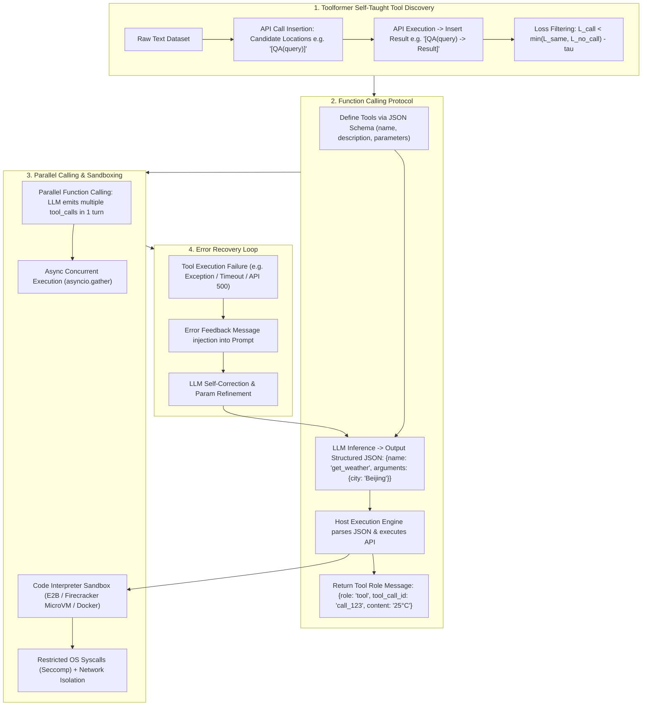

# 🌐 Tool Use & Function Calling: Toolformer Self-Taught Calls, JSON Schema & Sandbox Execution

> **Core Executive Summary**: LLMs cannot query real-time APIs or execute code natively. **Tool Use** and **Function Calling** bridge this gap by enabling LLMs to interact with external APIs, databases, and Code Interpreters via structured JSON protocols. This guide dissects Toolformer self-taught tool learning, OpenAI Function Calling protocols, Parallel tool calls, sandbox isolation, and error recovery loops.

---

## 💡 Interactive Mermaid Architecture Flowchart



---

## 💡 Classic Interview Followups & Core Cheatsheet

* **Key Topic 1**: Detail Toolformer self-supervised API insertion and derive loss filter formula $L_{\text{same}} - L_{\text{call}} > \tau$.
  * *Standard Answer*: Samples candidate API calls into raw text, executes real APIs, and filters via loss reduction: $L_{\text{call}} = \mathcal{L}(\text{text after API} \mid \text{text before} + \text{API} + \text{result})$. Retains API calls where $L_{\text{same}} - L_{\text{call}} \ge \tau$.

> 💡 **Intuition**: Toolformer is "let the model decide when to look things up": candidate API calls are sampled into unlabeled text, executed for real, and only kept for fine-tuning if the loss after the result drops significantly — like rewarding study behaviors that actually improve the next sentence.
>
> 🎤 **Interview Answer**: "Conclusion: Toolformer keeps API samples only when loss improves. Why: compute $L_{\text{call}}$ (with result) vs $L_{\text{same}}$ (empty result); keep when $L_{\text{same}} - L_{\text{call}} \ge \tau$ (e.g., 1.0). Example: 'Pittsburgh is known for [QA(...)] the steel industry' — perplexity drops from 4.2 to 1.8, so the sample is kept."

* **Key Topic 2**: Explain OpenAI Function Calling underlying prompt injection and constrained logit decoding.
  * *Standard Answer*: System prompt injects JSON Schema specifications. Inference engines apply constrained decoding (Grammar-guided sampling) to force 100% valid JSON output.

> 💡 **Intuition**: Native function calling = JSON Schema in the prompt + a decoder that welds the format shut. The engine masks any token that would break the JSON grammar, so the model physically cannot emit a malformed call.
>
> 🎤 **Interview Answer**: "Conclusion: constrained decoding guarantees 100% valid JSON. Why: the schema is injected as a system control prompt and a grammar/FSM mask zeroes out tokens that violate it. Example: get_weather with a city parameter can only emit `{name:'get_weather', arguments:{city:'Beijing'}}` — parsing never fails."

* **Key Topic 3**: Analyze Parallel Function Calling execution mechanisms and dependency decoupling.
  * *Standard Answer*: LLM emits an array of `tool_calls` in a single response turn. Host framework runs `asyncio.gather()` concurrently for independent tool requests, reducing latency by 70%+.

> 💡 **Intuition**: Parallel calling is "one order, many shipments at once" — the model declares three weather queries in a single turn; the host fires them concurrently with asyncio.gather and appends all results back at once, saving two round-trips.
>
> 🎤 **Interview Answer**: "Conclusion: parallelize independent tool calls. Why: the model emits multiple tool_calls in one turn; the host runs them concurrently and returns all results as tool messages. Example: three city-weather calls at 500ms each — serial 1500ms, parallel ~500ms, a ~70% latency cut."

* **Key Topic 4**: Compare Docker, Firecracker MicroVM, and gVisor in Code Interpreter sandbox isolation.
  * *Standard Answer*: Docker (fast 100ms startup, shared kernel). gVisor (intercepts syscalls in user-space). Firecracker MicroVM (KVM lightweight VM, 5ms startup, independent kernel—industry standard for E2B code execution).

> 💡 **Intuition**: Sandbox strength is "wall thickness vs boot speed". Docker is a room divider in a shared house (shared kernel, fast but breakable); gVisor is a self-translating syscall wall (safe, slower I/O); Firecracker is a separate mini-house (KVM, ~5ms, thickest wall) — the production standard for code interpreters.
>
> 🎤 **Interview Answer**: "Conclusion: production code interpreters run on Firecracker MicroVMs. Why: Docker shares the host kernel and privilege-escalation breaks it; gVisor intercepts syscalls in user space with I/O overhead; Firecracker is a KVM micro-VM with ~5ms startup and an independent kernel. Example: E2B gives every user code session its own Firecracker VM — crashes never leak."

* **Key Topic 5**: How to design Error Recovery Prompt strategies when a tool execution returns exceptions?
  * *Standard Answer*: Pass error stack traces back to LLM as a `role: "tool"` message (`content: "SyntaxError: invalid syntax on line 3"`). Allows LLM to analyze errors and self-correct tool arguments.

> 💡 **Intuition**: Do not crash on tool errors — wrap the stack trace as a tool message and hand it back, like showing a human the error log and letting them fix it. It is an LLM-driven debug loop with a 3-retry cap.
>
> 🎤 **Interview Answer**: "Conclusion: feed tool exceptions back as `role: 'tool'` messages for self-healing. Why: the error enters the next context; the LLM reads the trace, fixes parameters, and retries — capped at 3 attempts. Example: 'SyntaxError: invalid syntax on line 3' returns, and the model adds the missing parenthesis on the next round."

---

## 📚 Section 1: Function Calling Protocols & Sandbox Comparison Matrix

**How to read this table**: Watch the isolation-vs-latency columns — higher security usually means slower, but Firecracker breaks the rule (highest isolation, ~5ms boot), which is why it is the production pick. Interview point: never run user code in plain Docker because the host kernel is shared.

| Technology | Schema Constraint | Startup Latency | Isolation Security | Primary Target |
| :--- | :--- | :--- | :--- | :--- |
| **Toolformer** | Self-supervised Loss Filter | N/A (Internalized) | N/A | Base model pre-training API learning |
| **OpenAI Function Calling**| JSON Schema + Logit Constraints| 0ms | Dependent on Host | Enterprise API & RAG Tool Routing |
| **Docker Sandbox** | OS Namespace / Cgroups | ~ 200 ms | Medium (Shared kernel)| Internal trusted code execution |
| **gVisor Sandbox** | User-space Syscall Intercept | ~ 50 ms | High | Container security enhancement |
| **Firecracker MicroVM** | KVM Light VM (E2B) | **~ 5 ms** | **Highest (Separate kernel)**| **Production Code Interpreter** |

---

## ⚡ Section 2: Toolformer Filter Formula

The formula answers "is this API insertion worth keeping?": $\Delta L$ is the gap between the best baseline (no call or empty result) and the loss with the real result. Only a gap ≥ $\tau$ (usually 1.0) means the API genuinely reduced prediction perplexity.

$$\Delta L = \min(L_{\text{no\_call}}, L_{\text{same}}) - L_{\text{call}} \ge \tau$$

> 💡 **Intuition**: Loss is the model's surprise at the next sentence. If the API result drops surprise a lot, the call was useful; if it barely moves, it is noise — discard it.
>
> 🎤 **Interview Answer**: "Conclusion: keep an API sample only if it lowers loss by at least $\tau$. Why: $L_{\text{call}}$ must beat $\min(L_{\text{no\_call}}, L_{\text{same}})$ by the threshold (≈1.0). Example: (4.5, 4.2, 1.8) → $\Delta L = 2.4 \ge 1.0$ keep; (2.1, 2.0, 1.9) → $\Delta L = 0.1$ discard."

---

## 🐍 Section 3: Pure Numpy Toolformer Filter Operator

```python
def pure_numpy_toolformer_loss_filter(l_no_call: float, l_same: float, l_call: float, tau: float = 1.0) -> bool:
    return bool(min(l_no_call, l_same) - l_call >= tau)

if __name__ == "__main__":
    print("✅ Toolformer Filter Test 1:", pure_numpy_toolformer_loss_filter(4.5, 4.2, 1.8, 1.0))
    print("✅ Toolformer Filter Test 2:", pure_numpy_toolformer_loss_filter(2.1, 2.0, 1.9, 1.0))
```

> 💡 **Intuition**: This operator is the whole filter in six lines — min for the baseline, subtract $L_{\text{call}}$, compare to $\tau$. The two test cases demonstrate 'useful → keep' and 'useless → discard'.
>
> 🎤 **Interview Answer**: "Conclusion: Toolformer filtering is a threshold comparison. Why: keep iff $\min(l_{\text{no\_call}}, l_{\text{same}}) - l_{\text{call}} \ge \tau$. Example: test 1 (4.5, 4.2, 1.8) → 2.4 ≥ 1 keep; test 2 (2.1, 2.0, 1.9) → 0.1 < 1 discard."

---

## 🚀 Key Takeaways & Best Practices

1. **Schema Standardization**: Use **JSON Schema** definitions with **Constrained Decoding** for zero-fail JSON outputs.
2. **Production Sandbox**: Run code execution tasks inside **Firecracker MicroVMs (E2B)**.
3. **Self-Healing Error Handling**: Wrap tool exceptions into `tool` role prompt responses to enable automatic LLM retries.