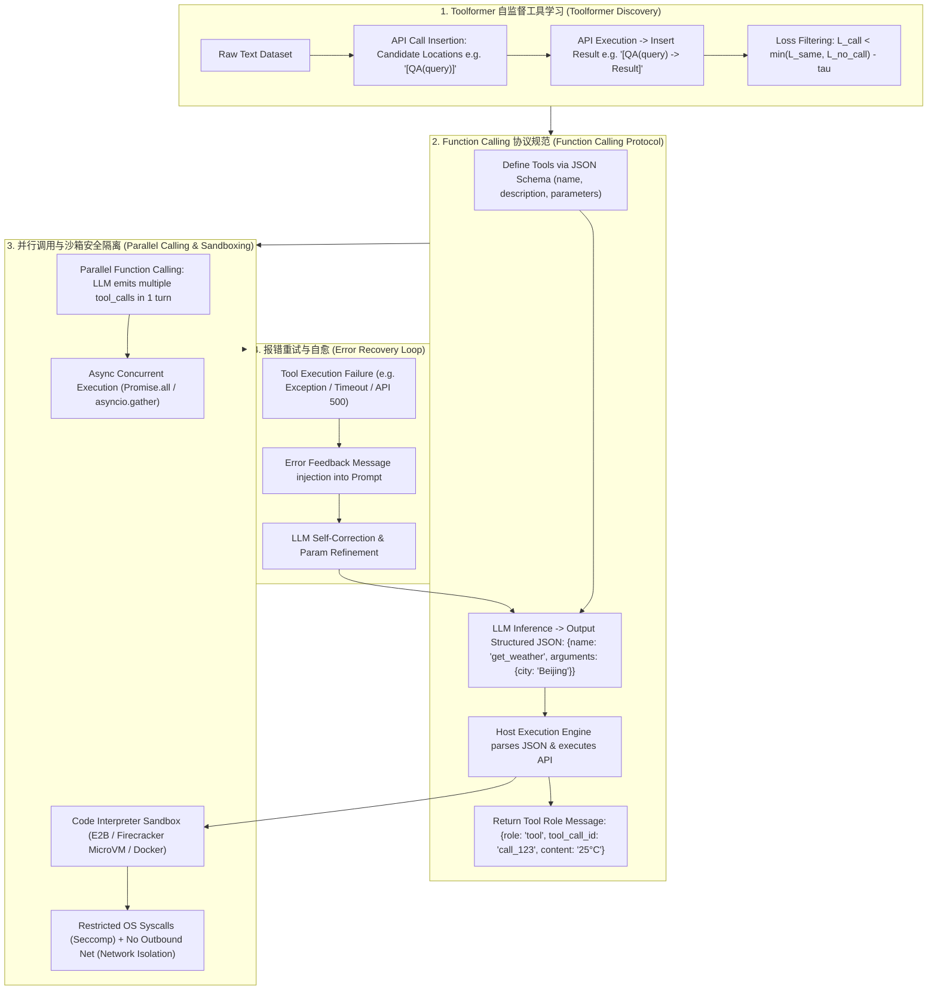

# 🌐 工具调用与 Function Calling 全景：Toolformer 自主插入、JSON Schema 规范与沙箱安全执行

> **核心摘要**：大语言模型（LLM）虽然具备强大的文本生成能力，但无法实时查询当前天气、无法直接进行精确的大数字浮点运算，也无法直接执行代码。**Tool Use (工具调用)** 与 **Function Calling** 突破了 LLM 的能力边界，使其能够通过结构化 JSON 规范与外部 API、数据库以及代码沙箱（Code Interpreter）交互。本指南系统解构 Toolformer 自监督工具学习、OpenAI Function Calling 协议、Parallel 并行调用、沙箱安全隔离以及工具报错重试机制。

---

## 💡 交互式 Mermaid 架构流程图



---

## 💡 经典面试追问与考点速查

* **考点 1**：详细剖析 Toolformer 如何通过自监督方式在无标注文本中自动插入 API 调用，并推导 Loss 过滤公式 $L_{\text{same}} - L_{\text{call}} > \tau$？
  * *标准回答*：
    * **插入阶段**：对于无标注文本，使用基座模型在可能需要 API 的地方（如提及数字、日期、事实问答处）自动采样插入 API 调用 Prompt，如 `"Pittsburgh is known for [QA("What is Pittsburgh known for?")] the steel industry."`；
    * **真实执行阶段**：调用真实的 API 并将返回结果拼接在 API Token 后面，即 $e(r)$；
    * **Loss 过滤公式**：仅当插入 API 及其结果后，后续 Token 的预测交叉熵 Loss **显著降低** 时，才保留该样本用于微调：
      $$L_{\text{call}} = \mathcal{L}(\text{text after API} \mid \text{text before API} + \text{API call} + \text{result})$$
      $$L_{\text{same}} = \mathcal{L}(\text{text after API} \mid \text{text before API} + \text{empty result})$$
      筛选条件为 $L_{\text{same}} - L_{\text{call}} \ge \tau$（如 $\tau = 1.0$）。该自监督筛选成功让模型学会了”什么时候调用工具、调用什么工具”。

> 💡 **直观理解**: Toolformer 是”让模型自己决定要不要查资料”——在没有人工标注的文本里试插 API 调用，只有当”插了 API 结果后后续文字明显更好预测”（loss 显著下降）才把这条样本留下来微调。就像老师只给”查了词典后句子变通顺”的学习行为发奖励。
>
> 🎤 **面试速答**: “结论：Toolformer 用 loss 下降作为信号，自监督筛选该插 API 的样本。原理：候选位置插 `[QA(...)]` → 真实执行 API → 算 $L_{\text{call}}$（带结果）与 $L_{\text{same}}$（空结果）→ 只有 $L_{\text{same}} - L_{\text{call}} \ge \tau$（如 1.0）才保留微调。例子：'Pittsburgh 以 [QA(...)] 钢铁工业闻名'，插入后困惑度从 4.2 降到 1.8，保留该样本。”

* **考点 2**：解析 OpenAI Function Calling 的底层提示词封装原理：模型是如何输出形如 `{name, arguments}` 的结构化 JSON 的？
  * *标准回答*：
    * **System Prompt 注入**：框架将用户定义的 JSON Schema 格式化为特殊的 System Prompt（如 `<tools>...</tools>`）并作为控制符注入。
    * **Grammar-Guided Decoding / Constrained Sampling**：在 LLM 输出 Token 时，推导引擎（如 vLLM / llama.cpp）使用 JSON 语法树 (Grammar Tree / RegEx) 限制 Token 的 Logits，**强制打压任何违反 JSON 格式的 Token 概率**，保证 100% 输出符合标准的结构化 JSON 对象。

> 💡 **直观理解**: 原生 Function Calling = "JSON Schema 塞进 Prompt + 解码器帮你焊死格式"。前半句是提示词，后半句是硬约束：推理引擎在每一步只允许采样能接得上合法 JSON 的 token，模型想输出 `{name: ..., arguments: {...}}` 之外的东西都发不出来。
>
> 🎤 **面试速答**: "结论：Function Calling 靠 constrained decoding 保证 100% 合法 JSON。原理：JSON Schema 注入 system prompt，推理引擎用语法树/正则掩码掉所有破坏 JSON 结构的 token 概率。例子：get_weather 定义 city 参数，模型只能输出 `{name:'get_weather', arguments:{city:'Beijing'}}`，解析永不失败。"

* **考点 3**：分析 Parallel Function Calling (并行工具调用) 的实现机制与依赖关系解耦？
  * *标准回答*：在单次生成中，模型可以同时输出多个 `tool_calls`（例如同时查询北京、上海、广州三地的天气）。主程序收到数组后，通过 `asyncio.gather()` 并行发起 HTTP 请求，将所有工具返回的 `tool` role 消息一次性追加回 Context。当多个工具之间**无数据依赖**（无 DAG 依赖）时，并行调用能将多轮交互的总时间缩短 70%+。

> 💡 **直观理解**: 并行调用就是"一次下单、多件商品同时发货"——模型在一轮里同时声明查北京、上海、广州天气，宿主用 asyncio.gather 同时发三个请求，等全部回来一次性拼进上下文，省掉两轮串行等待。
>
> 🎤 **面试速答**: "结论：无依赖的工具调用应并行执行。原理：模型一次输出多个 tool_calls，宿主并发执行（asyncio.gather），结果以多条 tool 消息一次性回填。例子：同时查三城天气，串行 3×500ms=1500ms，并行约 500ms，总时间缩短约 70%。"

* **考点 4**：如何在生产环境中构建安全的 Code Interpreter 沙箱？对比 Docker 容器、Firecracker MicroVM 与 gVisor 在隔离级别与启动开销上的差异？
  * *标准回答*：
    * **Docker 容器**：启动快 (100ms)，但共享宿主机 Linux 内核。若容器提权漏洞暴露，可能突破宿主机控制权；
    * **gVisor (Google)**：在用户态重写了 Linux 内核 syscall 拦截层。隔离性极佳，但由于虚拟化 syscall，高 I/O 密集型代码性能有损耗；
    * **Firecracker MicroVM (AWS / E2B)**：基于 KVM 的轻量级微型虚拟机。**毫秒级启动 (~ 5ms)，完全独立的内核隔离**，是当前大模型代码解释器 (Code Interpreter) 生产沙箱的行业标准。

> 💡 **直观理解**: 沙箱强度 = "墙有多厚、开门有多快"的权衡。Docker 是合租房的隔断（共享内核，快但容易破墙）；gVisor 是"自己翻译系统调用"的虚拟墙（稳但 I/O 慢）；Firecracker 是独立的迷你房子（KVM 虚拟化，5ms 开门，墙最厚）——所以生产代码解释器都用它。
>
> 🎤 **面试速答**: "结论：生产 Code Interpreter 用 Firecracker MicroVM。原理：Docker 共享宿主机内核、提权漏洞可突破；gVisor 用户态拦截 syscall、高 I/O 负载有性能损耗；Firecracker 是 KVM 轻量虚机、~5ms 启动、独立内核。例子：E2B 平台给每个用户代码执行会话分配一个 Firecracker 微虚机，崩溃互不影响。"

* **考点 5**：当 Tool 调用返回 Error (如 API 404 或 Python 语法错误) 时，系统的 Error Recovery Prompt 策略应该如何设计？
  * *标准回答*：切忌直接崩溃程序。应该将 Error Stack Trace 包装为标准的 `role: "tool"` 消息：
    `{role: "tool", name: "python_interpreter", content: "SyntaxError: invalid syntax on line 3"}`
    再次输入给 LLM。LLM 会在下一个 `Thought` 中自动读取该报错，分析错因，修改代码参数后重试。通常设定最大重试次数为 3 次。

> 💡 **直观理解**: 工具报错别崩溃——把报错原文"打包成一条 tool 消息"塞回给模型，让它像人看到报错提示一样自己改。这相当于把"报错→改→再试"的调试循环交给 LLM 自动跑，上限 3 次防死循环。
>
> 🎤 **面试速答**: "结论：把工具异常包装成 tool role 消息回喂 LLM 自愈。原理：错误信息进入下一轮上下文，LLM 读取 stack trace 分析原因并修正参数重试；设最大重试次数防死循环。例子：Python 代码返回 'SyntaxError: invalid syntax on line 3'，模型下一轮自动补上括号重跑，3 次内成功。"

---

## 📚 第一章：Function Calling 协议与沙箱对比矩阵

**怎么读这张表**: 看"隔离安全级别"与"启动开销"两列——安全等级越高通常越慢，但 Firecracker 打破了这条规律（最高隔离 + ~5ms 启动），所以它是生产标配。面试常考"为什么不用 Docker 跑用户代码"——共享宿主机内核是根因。

| 架构 / 技术 | 结构化约束机制 | 启动开销 (Latency) | 隔离安全级别 | 适用场景 |
| :--- | :--- | :--- | :--- | :--- |
| **Toolformer** | Loss 过滤自监督 Prompt | N/A (模型内化) | N/A | 基座模型 API 能力内化微调 |
| **OpenAI Function Calling**| JSON Schema + Constrained Logits| 0 (原生支持) | 依赖 Host 宿主 | 通用 API 调用 / RAG 工具路由 |
| **Docker Sandbox** | OS Namespace / Cgroups | ~ 200 ms | 中等 (共享内核) | 内部可信代码执行 |
| **gVisor Sandbox** | 用户态 Syscall 截获 | ~ 50 ms | 高 | 容器安全增强 |
| **Firecracker MicroVM** | KVM 轻量虚机 (E2B) | **~ 5 ms** | **极高 (独立内核)** | **生产级 Code Interpreter** |

---

## ⚡ 第二章：Toolformer Loss 过滤公式

该公式回答"这条 API 插入样本值不值得留"：$\Delta L$ 是"不调用/空结果"的最低 loss 与"带真实结果调用"的 loss 之差，只有差得足够大（≥ $\tau$）才证明 API 真的帮模型降低了预测困惑度。$\tau$ 通常取 1.0。

$$\Delta L = \min(L_{\text{no\_call}}, L_{\text{same}}) - L_{\text{call}} \ge \tau$$

> 💡 **直观理解**: 把 loss 当成"模型对下一句的惊讶程度"——插入 API 结果后惊讶度大幅下降，说明这条 API 真的有用；没变化甚至变差，说明调用是噪音，直接删掉。
>
> 🎤 **面试速答**: "结论：只有让 loss 显著下降的 API 样本才保留。原理：$L_{\text{call}}$（带结果）必须比 $\min(L_{\text{no\_call}}, L_{\text{same}})$ 低至少 $\tau$。例子：$l_{\text{no}}=4.5$、$l_{\text{same}}=4.2$、$l_{\text{call}}=1.8$ → $\Delta L = 2.4 \ge 1.0$ 保留；若 $l_{\text{call}}=1.9$ 而基线 2.0 → $\Delta L = 0.1$ 剔除。"

---

## 🐍 第三章：Pure Numpy / Python 手写 Toolformer Loss 过滤算子

```python
import numpy as np

def pure_numpy_toolformer_loss_filter(l_no_call: float, l_same: float, l_call: float, tau: float = 1.0) -> bool:
    """
    Pure Numpy / Python 实现 Toolformer API 插入自监督 Loss 过滤算子
    l_no_call: 未插入任何 API 标记时的文本预测 Cross-Entropy Loss
    l_same:    仅插入 API 动作但不注入返回结果时的 Loss
    l_call:    插入 API 动作且注入真实返回结果后的 Loss
    tau:       阈值常数
    """
    # 只有当包含 API 结果的 Loss 显著低于未调用和空结果 Loss 时，才保留该 API 样本
    min_baseline = min(l_no_call, l_same)
    loss_improvement = min_baseline - l_call
    
    return bool(loss_improvement >= tau)

# ==================== 测试验证 ====================
if __name__ == "__main__":
    # 模拟场景 1: API 调用带来了大量有用信息 (应该保留)
    l_no = 4.5
    l_sm = 4.2
    l_cl = 1.8
    keep_sample_1 = pure_numpy_toolformer_loss_filter(l_no, l_sm, l_cl, tau=1.0)
    print("✅ 场景 1 (有效 API 调用) 过滤结果:", keep_sample_1)
    
    # 模拟场景 2: API 调用返回的是冗余或无用信息 (应该剔除)
    l_no2 = 2.1
    l_sm2 = 2.0
    l_cl2 = 1.9
    keep_sample_2 = pure_numpy_toolformer_loss_filter(l_no2, l_sm2, l_cl2, tau=1.0)
    print("✅ 场景 2 (无用 API 调用) 过滤结果:", keep_sample_2)
```

> 💡 **直观理解**: 这段算子把 loss 过滤写成 6 行函数——`min` 取基线，减 $l_{\text{call}}$ 得到改善量，和 $\tau$ 比大小。两个测试场景正好演示"真有用（保留）"和"没用（剔除）"。
>
> 🎤 **面试速答**: "结论：Toolformer 过滤是一个阈值比较函数。原理：$\min(l_{\text{no\_call}}, l_{\text{same}}) - l_{\text{call}} \ge \tau$ 返回 True。例子：场景 1 (4.5, 4.2, 1.8, τ=1.0) → 2.4 ≥ 1 保留；场景 2 (2.1, 2.0, 1.9) → 0.1 < 1 剔除。"

---

## 🚀 总结与工程最佳实践

1. **协议规范**：一律采用 **JSON Schema** 定义工具参数，并配合 **Constrained Decoding** 确保 100% 格式合法；
2. **生产沙箱选型**：运行用户或 LLM 生成的代码务必部署 **E2B / Firecracker MicroVM** 隔离沙箱；
3. **容错重试**：将工具 Exception 转化为标准 `tool` role 消息输入 LLM 引导自愈。