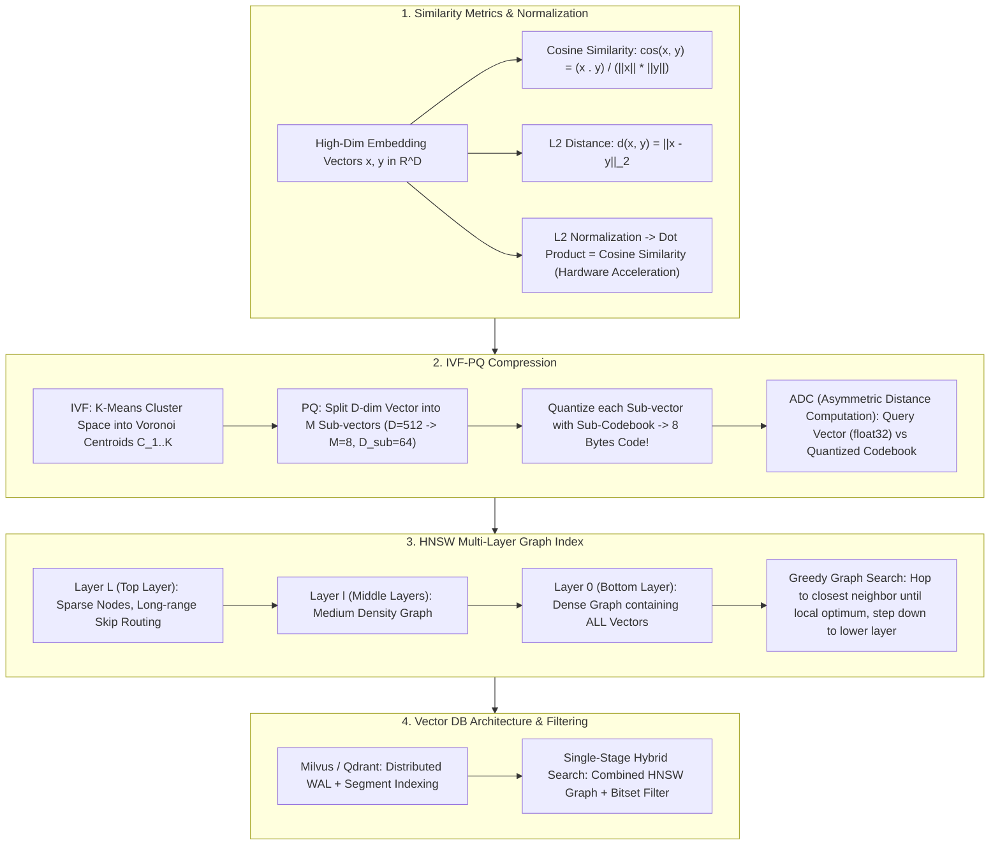

# 🌐 Vector Databases: HNSW Graph Indexing, IVF-PQ Quantization & ANN Similarity Search

> **Core Executive Summary**: High-dimensional vector search powers RAG and recommendation systems. Exact flat search $O(N \cdot D)$ fails at scale. **Vector Databases** leverage **ANN (Approximate Nearest Neighbor)** algorithms built on **HNSW graph indexing** and **IVF-PQ quantization**. This guide dissects distance metrics, IVF Voronoi partitions, PQ product compression, HNSW multi-layer routing, and enterprise database selection.

---

## 💡 Interactive Mermaid Architecture Flowchart



---

## 💡 Classic Interview Followups & Core Cheatsheet

* **Key Topic 1**: Detail HNSW probability multi-layer graph construction and derive its $O(\log N)$ greedy routing complexity.
  * *Standard Answer*: HNSW builds a skip-list graph. Top layers contain sparse nodes with long edges; Layer 0 contains all nodes. Searching starts at top enter point, greedily hopping to nearest neighbors before stepping down layers, achieving $O(\log N)$ search complexity.

> 💡 **Intuition**: HNSW is a "multi-layer map": highway layer (top) → main roads → alleyways (bottom). To find an address you take the highway toward the neighborhood, then step down to exact streets. Layer membership is decided by a coin-flip (exponential distribution), like a skip list.
>
> 🎤 **Interview Answer**: "Conclusion: HNSW reaches $O(\log N)$ search with a layered graph. Why: top layers hold few nodes with long edges to zoom across the space; layer 0 holds everything. Greedy search hops to the nearest neighbor, descends when locally optimal, and stops at layer 0 for Top-K. Example: 10M vectors ≈ 16 layers — a query touches dozens of nodes instead of 10 million."

* **Key Topic 2**: Explain how PQ (Product Quantization) achieves 16x-64x memory compression via sub-vector codebooks.
  * *Standard Answer*: Splits $D=512$ float32 vectors (2048 bytes) into $M=8$ sub-vectors. Quantizes sub-vectors into 256 centroids per sub-space. Vector becomes 8 byte indices (256x compression ratio). Asymmetric Distance Computation (ADC) uses look-up tables (LUT) for fast distance queries.

> 💡 **Intuition**: PQ is "compress a photo into a mosaic, then index the tile numbers". A 512-dim vector is cut into 8 pieces; each piece is replaced by its nearest of 256 centroids — the vector becomes 8 bytes. The query stays full precision, hence 'asymmetric'.
>
> 🎤 **Interview Answer**: "Conclusion: PQ splits vectors into sub-vectors and quantizes each against a codebook, achieving 16x-256x compression. Why: 512-dim float32 = 2048 bytes → 8 sub-vectors × 1-byte centroid index = 8 bytes; distances use ADC look-up tables. Example: 1B vectors at 40GB drops to ~160MB — fits one GPU."

* **Key Topic 3**: Compare Pre-filtering vs Post-filtering vs Single-Stage Hybrid Search in recall efficiency.
  * *Standard Answer*: Post-filtering drops recall if filtered candidates are sparse. Pre-filtering destroys HNSW graph topology into brute force. Single-Stage Hybrid Search evaluates Bitset constraints during graph traversal, keeping $O(\log N)$ efficiency with 100% filter precision.

> 💡 **Intuition**: It is about where you put the sieve. Post-filter: retrieve 100, then filter — a strict filter can leave 0. Pre-filter: filter IDs first, then brute-force — destroys the graph topology. Single-stage: carry a bitset into every graph hop — only allowed neighbors enter the queue.
>
> 🎤 **Interview Answer**: "Conclusion: use Single-Stage Hybrid Search for metadata filtering. Why: post-filtering collapses recall under strict filters; pre-filtering degenerates to brute force; single-stage evaluates the bitset during greedy traversal, keeping $O(\log N)$. Example: filtering a 100M catalog down to 200 'sports' items — post-filtering can return nothing; single-stage returns all 200."

* **Key Topic 4**: Why normalize embeddings with L2 Norm before vector search? Prove Cosine Similarity equals Dot Product.
  * *Standard Answer*: When $\|x\|_2 = 1$ and $\|y\|_2 = 1$, $\text{cos}(x, y) = x \cdot y$. Hardware GEMM instructions accelerate dot-products on AVX-512 and GPUs without square root or division overhead.

> 💡 **Intuition**: Cosine cares about direction, not magnitude. Normalize every vector to unit length and the denominator vanishes — dot product becomes cosine, and dot products are what SIMD/GEMM hardware is fastest at.
>
> 🎤 **Interview Answer**: "Conclusion: after L2 normalization, cosine similarity equals the dot product. Why: $\cos(x,y) = x \cdot y / (\|x\|\|y\|)$ and unit norms make the denominator 1; dot products run on AVX-512 / GPU GEMM without sqrt or division. Example: 768-dim sentence embeddings — switch Milvus to the IP metric after normalization: identical results, 2-5x faster throughput."

* **Key Topic 5**: Compare Pgvector vs Native Distributed Vector DBs (Milvus/Qdrant) in write scalability and read-write isolation.
  * *Standard Answer*: Pgvector fits smaller applications (<100K vectors) but lock contention during concurrent HNSW updates blocks transactions. Native DBs (Milvus/Qdrant) separate storage/compute and use LSM-tree log-structured memory segments for billion-scale search.

> 💡 **Intuition**: Pgvector is "a new shelf in the old warehouse" — convenient, but HNSW write locks contend with your transactions. Milvus/Qdrant are "automated new warehouses" — writes go down a conveyor belt (WAL/Kafka), get boxed into immutable segments, then shelved.
>
> 🎤 **Interview Answer**: "Conclusion: Pgvector for <100K vectors, native distributed DBs for billions. Why: Pgvector's HNSW update locks block transactions and scaling is hard; Milvus/Qdrant separate storage and compute with LSM-style memory segments. Example: 10M daily writes with >10K QPS — Pgvector lock contention collapses, Milvus absorbs it via WAL + segment flush."

---

## 📚 Section 1: Vector Index Algorithm Comparison Matrix

**How to read this table**: No free lunch — FLAT is exact but $O(N)$ and memory-heavy; IVF-PQ is tiny (~5% memory) but loses recall; HNSW pure graph is the million-scale high-precision pick. Interview detail: HNSW shows ~120% memory because edges are stored on top of the vectors themselves.

| Index Algorithm | Memory Overhead | Build Time | Search Latency | Recall Precision | Scalability |
| :--- | :--- | :--- | :--- | :--- | :--- |
| **FLAT (Brute Force)**| 100% | 0 (No index) | High ($O(N)$) | **100% (Exact)** | < 100K vectors |
| **IVF-FLAT** | 100% | Low | Medium | High | 1M - 10M vectors |
| **IVF-PQ** | **Minimal (~5%)** | Medium | Extremely Low (ADC) | Medium (Quantization Loss)| 100M - 1B vectors |
| **HNSW (Graph)** | High (~120%) | High | **Extremely Low ($O(\log N)$)**| **Very High (~98%+)**| 1M - 50M high precision |
| **HNSW + PQ** | Medium | High | Extremely Low | High | Tens of Millions |

---

## ⚡ Section 2: ADC Distance Formula

'Asymmetric' means the query stays in full float32 precision while database vectors exist only as 8-byte codes. Distance is computed per sub-vector between the query segment and the centroid the code points to — a look-up table (LUT) of query-vs-centroid distances is built once, then each vector's distance is $M$ table additions.

$$d_{\text{ADC}}(q, x) = \sum_{m=1}^M \|q_m - \mathcal{C}_m[q_m(x)]\|_2^2$$

> 💡 **Intuition**: Like a printed lookup table of "query vs templates" — after building the $M \times K$ table once, scoring any document is 8 table look-ups and an addition, no distance formula.
>
> 🎤 **Interview Answer**: "Conclusion: ADC replaces live distance math with look-ups. Why: precompute query-to-centroid distances into an $M \times K$ table; a doc's byte code indexes into it. Example: $M=8$, $K=256$ — each of 1B compressed vectors costs 8 table look-ups, microseconds with SIMD."

---

## 🐍 Section 3: Pure Numpy Handwritten PQ Operator

```python
import numpy as np

class PureNumpyPQQuantizer:
    def __init__(self, num_subvectors: int = 4, num_centroids: int = 16):
        self.M = num_subvectors
        self.K = num_centroids
        self.codebooks = []
        
    def fit(self, vectors: np.ndarray):
        N, D = vectors.shape
        D_sub = D // self.M
        self.codebooks = np.zeros((self.M, self.K, D_sub))
        for m in range(self.M):
            sub = vectors[:, m*D_sub : (m+1)*D_sub]
            idx = np.random.choice(N, self.K, replace=False)
            self.codebooks[m] = sub[idx]
            
    def encode(self, vectors: np.ndarray) -> np.ndarray:
        N, D = vectors.shape
        D_sub = D // self.M
        codes = np.zeros((N, self.M), dtype=np.uint8)
        for m in range(self.M):
            sub = vectors[:, m*D_sub : (m+1)*D_sub]
            dists = np.linalg.norm(sub[:, None, :] - self.codebooks[m][None, :, :], axis=2)
            codes[:, m] = np.argmin(dists, axis=1)
        return codes

if __name__ == "__main__":
    data = np.random.randn(100, 32).astype(np.float32)
    pq = PureNumpyPQQuantizer(4, 16)
    pq.fit(data)
    codes = pq.encode(data)
    print("✅ PQ Encoded Shape:", codes.shape)
```

> 💡 **Intuition**: This operator runs the full PQ pipeline — fit codebooks, encode each sub-vector to its nearest centroid index, then build a LUT and score by table look-ups.
>
> 🎤 **Interview Answer**: "Conclusion: PQ has three steps — fit, encode, ADC. Why: nearest-centroid encoding turns each sub-vector into one byte; distances come from a pre-built query-to-centroid table. Example: 32-dim vectors, $M=4$, $K=16$ — 100 vectors compress from 12800 bytes to 400 bytes with small distance error."

---

## 🚀 Key Takeaways & Best Practices

1. **High Precision Standard**: Use **HNSW Pure Graph Indexing** for million-scale high recall applications.
2. **Billion-Scale Compression**: Use **IVF-PQ** when memory cost is the primary constraint.
3. **Metadata Filtering**: Always use **Single-Stage Hybrid Search** to avoid recall degradation.