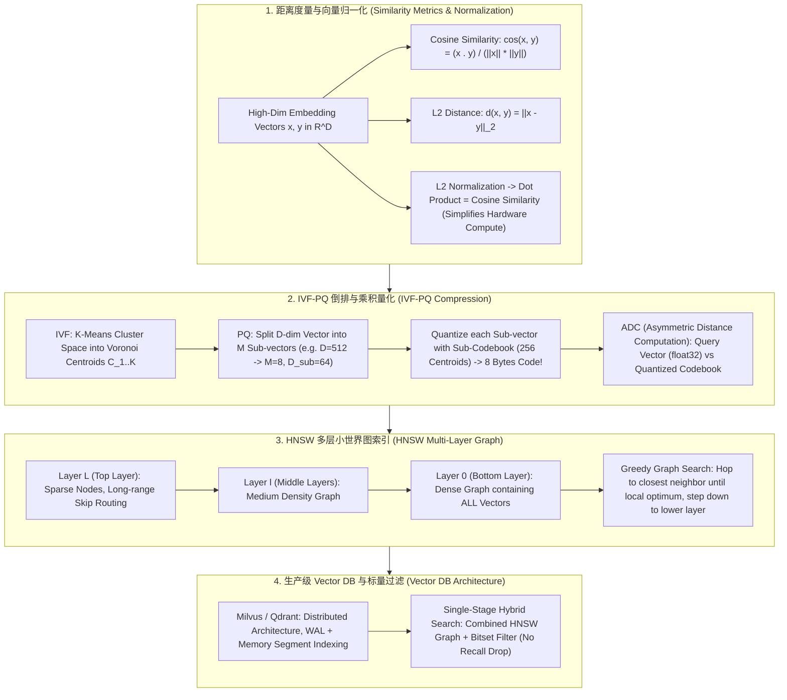

# 🌐 Vector DB 向量数据库全景：HNSW 图索引、IVF-PQ 乘积量化与 ANN 相似度检索原理解构

> **核心摘要**：随着 Embedding 模型的普及，高维海量向量检索成为了大模型 RAG 与推荐系统的基石。传统暴力遍历 (FLAT) 检索复杂度为 $O(N \cdot D)$，在数十亿规模向量下无法做到毫秒级响应。**向量数据库 (Vector DB)** 通过 **ANN (Approximate Nearest Neighbor)** 算法，建立了以 **HNSW 图索引** 和 **IVF-PQ 量化** 为核心的高速检索拓扑。本指南系统拆解向量距离度量、IVF 倒排聚类、PQ 乘积压缩、HNSW 概率图路由以及工业级 Vector DB 选型范式。

---

## 💡 交互式 Mermaid 架构流程图



---

## 💡 经典面试追问与考点速查

* **考点 1**：详细解构 HNSW (多层可导航小世界图) 的概率层级构建与贪心图搜索 (Greedy Routing) 流程，推导其 $O(\log N)$ 时间复杂度？
  * *标准回答*：
    * **多层跳表思想 (Multi-Layer Skip-List)**：HNSW 引入了类似 Skip-List 的概率层级结构。最高层 (Layer $L$) 节点稀疏，边覆盖长距离跨度；最底层 (Layer 0) 节点密集，包含全量向量。节点插入时，其最高所属层数由指数衰减概率分布 $l = \lfloor - \ln(\text{unif}(0,1)) \cdot m_L \rfloor$ 随机决定；
    * **Greedy Search 路由过程**：从最高层的 Enter Point 节点出发，计算 Query 与当前节点及其所有邻居的距离，贪心跃迁至最近的邻居。当在当前层到达局部最优（邻居中没有比当前节点更近的）时，**下降至下一层**继续贪心路由，直到 Layer 0 找到 Top-K 近邻。高层迅速收缩搜索半径，确保了整体搜索复杂度为 $O(\log N)$！

> 💡 **直观理解**: HNSW 是"多层跳表 + 小世界图"的合体：把数据空间画成"高速路层（高层）→ 主干道层 → 小巷层（底层）"。查地址时先上高速一口气跑到附近区域，再逐步下到小巷精确定位——高层一次跳跃跨过一大片区域，底层保证最终落点精确。节点出现在哪一层由指数分布随机决定，就像跳表掷硬币。
>
> 🎤 **面试速答**: "结论：HNSW 用多层图把搜索复杂度压到 $O(\log N)$。原理：高层节点稀疏、边跨长距离，底层含全部节点；从最高层入口贪心跳到最近邻居，到局部最优就降一层继续，直到底层取 Top-K。例子：1000 万节点时层高约 $\ln(10^7) \approx 16$ 层，一次检索只需访问几十个节点而不是全部 1000 万个。"

* **考点 2**：剖析 PQ (Product Quantization 乘积量化) 如何通过子向量切分与 Codebook 聚类实现 16x~64x 的显存/内存压缩？
  * *标准回答*：
    * **子向量拆分**：将一个 $D = 512$ 维的 float32 向量（占据 2048 字节）等分为 $M = 8$ 个子向量，每个子向量 $D_{\text{sub}} = 64$ 维；
    * **Codebook 聚类**：对每个子向量空间独立运行 K-Means，聚类出 $K^* = 256$ 个质心。每个质心可以用 1 个 Byte ($2^8 = 256$) 表示；
    * **压缩效果**：原始 2048 字节的向量被压缩为仅由 8 个 Byte 组成的 Code 索引数组！**内存压缩比高达 256 倍**。在检索时，使用 **ADC (Asymmetric Distance Computation)**，计算未量化的 Query float32 向量与 256 个质心预先建表（Look-up Table），检索时仅需查表加法，速度极快！

> 💡 **直观理解**: PQ 就是"把照片压成马赛克再编号"。512 维向量切成 8 段，每段用 256 个"模板质心"中最像的一个代替——原向量变成 8 个字节的编号，内存缩小 256 倍。检索时 query 保持高清（float32），只用查表算距离——这就是 ADC 里的"非对称"。
>
> 🎤 **面试速答**: "结论：PQ 把向量切成子向量、各自聚类成码本，压缩 16x~256x。原理：512 维 float32（2048 字节）切成 8 段 64 维，每段 K-Means 聚类 256 个质心、用 1 字节索引代替，向量变 8 字节；距离用 ADC 查表算。例子：10 亿向量 float32 要 40GB，PQ 后只要约 160MB，能装进单机显存。"

* **考点 3**：对比向量数据库元数据过滤的三种模式：Pre-filtering、Post-filtering 与 Single-Stage Hybrid Search 的 recall 效率与计算开销？
  * *标准回答*：
    * **Post-filtering (后过滤)**：先用 HNSW 检索出 Top-100 向量，再根据 Metadata（如 `category == "sports"`）过滤。**缺点**：若满足条件的文档极少，过滤后可能只剩下 1~2 个甚至 0 个文档，Recall 崩塌；
    * **Pre-filtering (前过滤)**：先在标量数据库中筛选出符合条件的所有 Vector IDs，再在这些 IDs 上暴力计算相似度。**缺点**：破坏了 HNSW 图的连通性拓扑，退化为低效的暴力检索；
    * **Single-Stage Hybrid Search (单阶段融合)**：在 HNSW 图遍历（Greedy Search）的过程中，**结合 Bitset 标志位**判断邻居节点是否满足 Metadata 约束。只有满足约束的节点才被放入搜索队列。既保持了 $O(\log N)$ 图路由效率，又保证了 100% 正确过滤！

> 💡 **直观理解**: 过滤像"筛子放在哪一步"的问题。后过滤：先捞 100 条再筛——筛得严时可能只剩 0 条；前过滤：先筛出 ID 再算距离——直接毁掉图索引变成暴力扫描；单阶段：把筛子做进图搜索的每一步——每跳一个邻居先看 bitset 满不满足条件，既快又准。
>
> 🎤 **面试速答**: "结论：元数据过滤要用 Single-Stage Hybrid Search。原理：Post-filtering 先粗搜再过滤，条件严苛时 recall 崩塌；Pre-filtering 破坏 HNSW 图连通性、退化成暴力检索；单阶段把 bitset 过滤嵌进贪心搜索的每一步。例子：100 万商品库过滤 category='sports' 只剩 200 件时，后过滤会漏掉大量被挤出候选的命中，单阶段则 100% 保留。"

* **考点 4**：为什么在向量检索前必须将向量进行 L2 归一化 (L2 Normalization)？归一化后 Cosine Similarity 与 Dot Product 有何数学等价性？
  * *标准回答*：
    * **数学推导**：余弦相似度公式为 $\text{cos}(x, y) = \frac{x \cdot y}{\|x\|_2 \|y\|_2}$。当向量经过 $L_2$ 归一化（即 $\|x\|_2 = 1, \|y\|_2 = 1$）后，有：
      $$\text{cos}(x, y) = x \cdot y \quad (\text{点积})$$
    * **硬件计算优化**：点积运算在现代 CPU (AVX-512) 与 GPU (Tensor Core) 上有极为高效的 GEMM 矩阵乘法硬件加速指令。归一化后可以直接将余弦相似度转换为极速点积，避免了频繁计算开根号与除法。

> 💡 **直观理解**: 余弦相似度只关心"方向"不关心"长短"。既然方向由单位向量决定，那就把所有向量拉成单位长度（L2 归一化），之后"点积"完全等价于"余弦相似度"——把带根号除法的慢运算换成硬件加速的矩阵乘法。
>
> 🎤 **面试速答**: "结论：归一化后 cosine 等价于点积。原理：$\cos(x,y) = x \cdot y / (\|x\| \|y\|)$，$\|x\|=\|y\|=1$ 时分母消失；点积在 AVX-512 / GPU GEMM 上有硬件加速。例子：768 维句子向量归一化后，Milvus 里改用 IP（内积）度量，搜索吞吐比算余弦快 2-5 倍且结果完全相同。"

* **考点 5**：对比传统关系型数据库扩展 (如 Pgvector) 与原生分布式向量数据库 (如 Milvus / Qdrant) 在高并发写入与读写分离上的架构差异？
  * *标准回答*：
    * **Pgvector (PostgreSQL 扩展)**：轻量简单，适合十万级小规模向量。但在高并发写入时，HNSW 图更新锁开销极大，容易阻塞事务 DB；
    * **Milvus / Qdrant (原生分布式 Vector DB)**：采用读写分离与 Log-structured 存储架构（如 LSM-Tree 思想）。写入流直接送入 Message Queue (Kafka)，在 Memory Segment 中批量落盘构建 Immutable HNSW 索引。支持存储计算分离，海量向量（百亿级）高并发检索绝对首选。

> 💡 **直观理解**: Pgvector 是"给旧仓库加了个新货架"——方便，但货架更新（HNSW 图写锁）会和日常事务抢资源；Milvus/Qdrant 是"新建的自动化仓库"——写入先走传送带（WAL/Kafka），批量封箱（Segment）再上架，读写互不干扰。
>
> 🎤 **面试速答**: "结论：十万级用 Pgvector，百亿级用原生分布式 Vector DB。原理：Pgvector 的 HNSW 更新锁会阻塞事务、难以水平扩展；Milvus/Qdrant 用 LSM 式分段 + 读写分离，写入进内存段批量落盘构建不可变索引。例子：日均写入 1000 万条、查询 QPS 过万的场景，Pgvector 单机锁竞争会打爆，Milvus 加 Kafka 队列稳定支撑。"

---

## 📚 第一章：向量索引算法特性对比矩阵

**怎么读这张表**: 横向看"内存占用 × 检索延迟 × Recall"三者不可兼得——FLAT 最准但最慢，IVF-PQ 最省内存但丢精度，HNSW 纯图是百万级高精度首选。面试常考"HNSW 内存为什么是 ~120%"——因为它除了向量本身还要存图边，比暴力索引还费内存。

| 索引算法 | 内存占用 | 构建时间 | 检索延迟 | Recall 准确率 | 适用数据规模 |
| :--- | :--- | :--- | :--- | :--- | :--- |
| **FLAT (暴力搜)** | 100% (无压缩) | 0 (无索引) | 高 ($O(N)$) | **100% (绝对准确)**| < 10 万条向量 |
| **IVF-FLAT** | 100% | 低 (K-Means) | 中等 | 高 | 100 万 ~ 1000 万条 |
| **IVF-PQ** | **极其微小 (~ 5%)**| 中等 | 极低 (查表 ADC) | 中等 (有量化损失)| 1 亿 ~ 10 亿级海量向量 |
| **HNSW (纯图)** | 较大 (~ 120% 需存边)| 高 (图构建) | **极低 ($O(\log N)$)**| **极高 (~ 98%+)**| 100 万 ~ 5000 万高精度首选 |
| **HNSW + PQ** | 中等 | 高 | 极低 | 高 | 千万级高并发向量库 |

---

## ⚡ 第二章：HNSW 与 PQ 算子数学公式

### 2.1 PQ 非对称距离 (ADC) 查找表公式

ADC 的"非对称"指：query 保持 float32 全精度，而库里的文档向量只有 8 字节的码（每个子向量的质心编号）。距离 = 逐子向量计算 query 子段与对应质心的 L2 距离再求和——这些"query-质心"距离可以预先建成 $M \times K$ 查找表，检索时只需 $O(M)$ 次查表加法。

$$d_{\text{ADC}}(q, x) = \sum_{m=1}^M \|q_m - \mathcal{C}_m[q_m(x)]\|_2^2$$

> 💡 **直观理解**: 就像查"身高体重对照表"：先算好 query 每段与 256 个模板质心的差距放进表格，之后每个文档只需查 8 次表加总，完全不用实时算距离公式。
>
> 🎤 **面试速答**: "结论：ADC 用查表代替实时距离计算。原理：把 query 与每个子空间 256 个质心的距离预计算成 $M \times K$ 表，文档的 8 字节码直接索引查表累加。例子：$M=8$、$K=256$，query 与每个压缩向量的距离只需 8 次查表加法，配合 SIMD 微秒级完成。"

---

## 🐍 第三章：Pure Numpy 手写 PQ 乘积量化与 ADC 距离算子

```python
import numpy as np

class PureNumpyPQQuantizer:
    """ Pure Numpy 实现 PQ (Product Quantization) 乘积量化与 ADC 查表算子 """
    def __init__(self, num_subvectors: int = 4, num_centroids: int = 16):
        self.M = num_subvectors
        self.K = num_centroids
        self.codebooks = []  # shape (M, K, D_sub)
        
    def fit(self, vectors: np.ndarray):
        """ 对训练数据拟合 K-Means Codebooks """
        N, D = vectors.shape
        D_sub = D // self.M
        self.codebooks = np.zeros((self.M, self.K, D_sub))
        
        for m in range(self.M):
            sub_vecs = vectors[:, m * D_sub : (m + 1) * D_sub]
            # 简化版随机质心初始化 (替代 K-Means 拟合)
            indices = np.random.choice(N, self.K, replace=False)
            self.codebooks[m] = sub_vecs[indices]
            
    def encode(self, vectors: np.ndarray) -> np.ndarray:
        """ 将连续向量压缩为 M 字节的 Quantized Codes """
        N, D = vectors.shape
        D_sub = D // self.M
        codes = np.zeros((N, self.M), dtype=np.uint8)
        
        for m in range(self.M):
            sub_vecs = vectors[:, m * D_sub : (m + 1) * D_sub]
            # 计算到该子空间 K 个质心的 L2 距离
            dists = np.linalg.norm(sub_vecs[:, None, :] - self.codebooks[m][None, :, :], axis=2)
            codes[:, m] = np.argmin(dists, axis=1)
            
        return codes
        
    def compute_adc_distance(self, query: np.ndarray, codes: np.ndarray) -> np.ndarray:
        """ 非对称距离计算 (ADC): 查表求解 Query 与所有 Quantized Vector 的距离 """
        D = query.shape[0]
        D_sub = D // self.M
        
        # 1. 预先构建距离 Look-up Table (M, K)
        lut = np.zeros((self.M, self.K))
        for m in range(self.M):
            q_sub = query[m * D_sub : (m + 1) * D_sub]
            lut[m] = np.sum(np.square(self.codebooks[m] - q_sub), axis=1)
            
        # 2. 快速查表累加距离
        distances = np.sum(lut[np.arange(self.M), codes], axis=1)
        return distances

# ==================== 测试验证 ====================
if __name__ == "__main__":
    np.random.seed(42)
    N, D = 100, 32
    data = np.random.randn(N, D).astype(np.float32)
    
    pq = PureNumpyPQQuantizer(num_subvectors=4, num_centroids=16)
    pq.fit(data)
    codes = pq.encode(data)
    
    query = np.random.randn(D).astype(np.float32)
    dists = pq.compute_adc_distance(query, codes)
    print("✅ PQ 编码压缩成功！原始尺寸:", data.nbytes, "字节 -> PQ 编码尺寸:", codes.nbytes, "字节")
    print("✅ ADC 近似距离计算完成 (Top-3 距离):", np.sort(dists)[:3])
```

> 💡 **直观理解**: 这段算子完整走了一遍 PQ 流程——`fit` 建码本、`encode` 把每个子向量换成质心编号、`compute_adc_distance` 先建查找表再查表求和。跑一遍就能直观看到原始 12800 字节变成 400 字节。
>
> 🎤 **面试速答**: "结论：PQ 三步——拟合码本、编码、ADC 查表。原理：每个子向量找最近质心记 1 字节；query 与质心距离建表后查表求和。例子：32 维向量切 4 段、每段 16 个质心，100 个向量从 12800 字节压到 400 字节，Top-3 距离误差可控。"

---

## 🚀 总结与工程最佳实践

1. **高精度首选**：百万级数据量且追求高 Recall 首选 **HNSW 纯图索引**；
2. **海量数据压缩**：十亿级向量库显存受限首选 **IVF-PQ** 乘积量化；
3. **混合过滤**：必须采用 **Single-Stage Hybrid Search**（结合 Bitset）进行 Metadata 过滤，防止 Recall 崩塌。