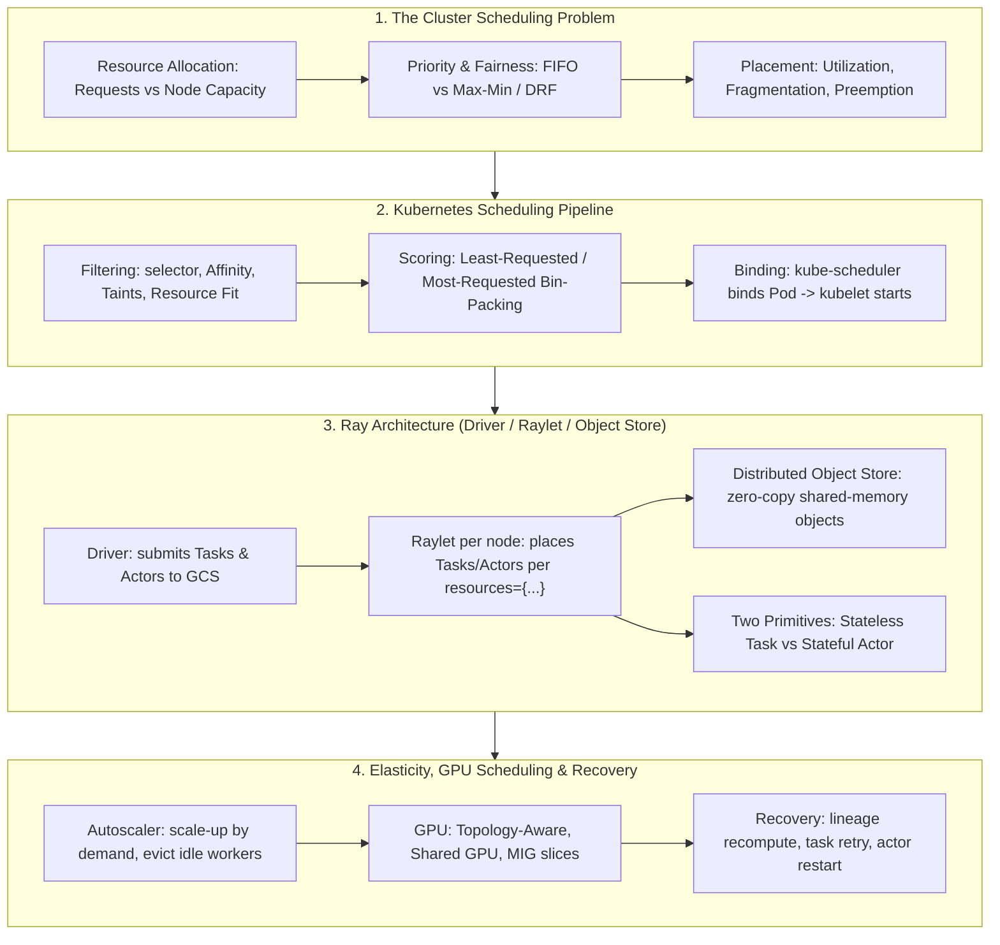

# 🌐 Cluster Scheduling & Ray: K8s Scheduling Pipeline, Raylet Architecture, Object Store, Autoscaling & GPU Scheduling

> **Core Executive Summary**: Every ML platform asks one question: given $N$ nodes of CPU/GPU/memory, how do we place $M$ tasks so resources are utilized, users treated fairly, and failures don't kill the job? This guide covers the cluster scheduling problem (resource allocation, priority, fairness), the Kubernetes two-phase scheduling pipeline (filtering, scoring, taints, affinity), Ray's architecture (Driver, Raylet, Object Store, Task vs Actor), its scheduling and autoscaling policies, GPU-aware scheduling (topology, sharing, MIG), Ray Train + DP/TP integration, fault recovery and retries, and finally Ray vs Spark.

---

## 💡 Interactive Mermaid Architecture Flowchart



---

## 💡 Classic Interview Followups & Core Cheatsheet

* **Key Topic 1**: How does kube-scheduler place a Pod, and how do taints, tolerations and affinity affect it?
  * *Standard Answer*: kube-scheduler runs a **two-phase pipeline** per unscheduled Pod. **Filtering** (hard) drops nodes that can't host it: resource fit (requests ≤ allocatable), nodeSelector, node affinity, taints vs tolerations (a `gpu=true:NoSchedule` taint only admits Pods with the matching toleration). **Scoring** (soft) ranks survivors, e.g. Least-Requested:
    $$\text{Score}_{\text{least}}(n) = 10 \times \frac{C_n - \sum_{p \in \text{Pods}(n)} r_p}{C_n}$$
    The highest-scored node gets the binding via the API server; the kubelet starts containers.
  * *30-second Oral Answer*: "Bottom line: filter impossible nodes, then score the rest. Why: filtering enforces hard constraints (resources, selector, affinity, taints) and scoring applies soft preferences like least-requested to spread load. Example: an 8-CPU node with 6 used scores $10 \times (8-6)/8 = 2.5$, an idle node scores 10 — the idle one wins."

* **Key Topic 2**: How does Raylet schedule a task declared `resources={"gpu": 1}`, and what happens if resources are insufficient?
  * *Standard Answer*: Each node runs a **Raylet** with a resource ledger. A submitted task is routed to a node whose free resources satisfy **all** declared demands; the Raylet starts a Worker for it. If none fit, the task is **queued (backpressure)** — Ray does **not preempt** running tasks. **Placement groups** add gang scheduling: all bundles are placed atomically, so multi-GPU groups never partially land.
  * *30-second Oral Answer*: "Bottom line: the Raylet ledger only places `resources={'gpu': 1}` tasks on nodes with a free GPU, otherwise they wait. Why: scheduling is distributed per-node with ~1-10ms dispatch, and there is no preemption. Example: 2 GPUs, 8 queued GPU tasks — 2 run, 6 wait; adding `num_cpus=2` also requires a free CPU pair on the same node."

* **Key Topic 3**: Compare Task vs Actor, and how does the Object Store enable zero-copy exchange?
  * *Standard Answer*: A **Task** is a stateless function in a fresh Worker — re-execution is free, so it fits pure transforms. An **Actor** is a stateful instance whose methods run serially on its own thread — it fits environments, model replicas, and buffers. Results flow through the **distributed Object Store** (Arrow/Plasma): task outputs live in shared memory and dependents read them **zero-copy**; larger objects spill to disk. On node death, objects are **recomputed from lineage** rather than replicated — trading recompute for memory.
  * *30-second Oral Answer*: "Bottom line: Tasks are stateless with free retries; Actors hold state and must checkpoint; the Object Store moves results at shared-memory speed. Why: outputs derive from lineage so failure re-executes, while actor state needs explicit persistence. Example: a 2GB tensor never touches disk or network — the consumer maps it directly from the producer's shared memory."

* **Key Topic 4**: How does the Autoscaler achieve elasticity, and how does it compare with Kubernetes HPA?
  * *Standard Answer*: The Autoscaler compares **pending demand** against cluster capacity: demand exceeding capacity **adds nodes** from the cloud (bounded by `min_workers`/`max_workers`); nodes idle past `idle_timeout` are **terminated**. Target node count per resource:
    $$N_{\text{target}} = \max_j \left\lceil \frac{\sum_i r_{i,j}}{C_j} \right\rceil$$
    Kubernetes HPA instead scales Pod *replicas*, with node resizing left to Cluster Autoscaler at second-to-minute granularity; KubeRay (Ray on Kubernetes) combines both.
  * *30-second Oral Answer*: "Bottom line: add nodes when pending demand exceeds capacity, evict idle ones after a timeout, bounded by min/max workers. Why: target count is $\max_j \lceil \sum_i r_{i,j}/C_j \rceil$; K8s separates replica scaling (HPA) from node scaling (Cluster Autoscaler). Example: 100 CPU requests on 8-CPU nodes needs $\lceil 100/8 \rceil = 13$ nodes; with 5 running, 8 are added, then reclaimed when idle."

* **Key Topic 5**: Position Ray against Spark: why Ray for RL and large-scale training, Spark for batch ETL?
  * *Standard Answer*: **Spark** schedules coarse **stages** over immutable RDD/DataFrame partitions on a JVM heap — excellent for deterministic batch analytics, but built for whole-stage recompute, not per-task dynamism. **Ray** schedules fine-grained **tasks and actors** individually with millisecond latency, supports stateful compute and a shared-memory object store — the natural substrate for distributed RL (millions of environment steps, per-iteration scheduling), Ray Train, Tune (HPO) and serving.
  * *30-second Oral Answer*: "Bottom line: Spark = batch data pipelines; Ray = dynamic compute graphs with actors and sub-second tasks. Why: Spark optimizes whole DAGs over immutable partitions; Ray optimizes individual placement and streams results through shared memory — prerequisites for RL loops. Example: 1M environment steps need 1M tiny scheduling decisions plus stateful model updates per iteration — Ray's ~1ms dispatch handles it; Spark's stage overhead would dominate."

---

## 📚 Section 1: The Cluster Scheduling Problem: Resources, Priority & Fairness

### 1.1 The core scheduling problem and its decision dimensions

A cluster scheduler is a **matchmaker**: decide how many resources (CPU/GPU/memory) each job gets, where it runs, when, and who wins when resources run out. A placement is legal only if every node respects capacity on every dimension:

$$\forall j: \quad \sum_{i \in \text{Pods}(n)} r_{i,j} \le C_{n,j}$$

| Dimension | Question | Typical policy |
| :--- | :--- | :--- |
| **Resource allocation** | How much CPU/GPU/memory per task? | requests + limits, fractional GPUs |
| **Placement** | Which node runs it? | bin-packing, topology-aware |
| **Priority** | Who goes first when scarce? | FIFO vs priority queues |
| **Fairness** | How is capacity shared among tenants? | max-min, DRF |
| **Preemption** | Can low-priority work be evicted? | priority preemption, gang scheduling |

How to read this table: the last two rows are the interview crux — **priority is ordering (who is served first), fairness is sharing (what each tenant ends up with)**; don't conflate them. Utilization, the metric everyone quotes afterwards:

$$U = \frac{\sum_i r_i \cdot t_i}{\sum_n C_n \cdot T}$$

> 💡 **Intuition**: The scheduler is a restaurant manager: allocation is "seats per party", placement is "which table", priority is "who is seated first when there is a queue", fairness is "how regulars and walk-ins fare over a week". The fit check $\sum r_{i,j} \le C_{n,j}$ is simply "never seat more people than chairs", per resource.
>
> 🎤 **Interview Answer**: "Bottom line: scheduling balances utilization, fairness and latency under per-node capacity constraints. Why: every placement must satisfy $\sum_i r_{i,j} \le C_{n,j}$; policies differ only in ordering and sharing inside that feasible set. Example: an 8-CPU node with two 6-CPU jobs — naive placement idles at 75% utilization, co-packable scheduling hits 100%; $U = \sum r_i t_i / \sum C_n T$ quantifies the gap."

### 1.2 Fairness: Max-Min Allocation & Dominant Resource Fairness (DRF)

When all tasks want CPUs, fair division is trivial — split evenly. Real clusters are heterogeneous, so **max-min fairness** gives each tenant the same share of the resource they need most, then redistributes leftovers. **DRF** (Mesos, 2011) formalizes "need most": each user's *dominant share* is their largest per-resource share, and DRF equalizes dominant shares:

$$D_i = \max_j \frac{c_{i,j}}{C_j} \quad \text{(user $i$'s dominant resource share)}$$

Concrete example: cluster 9 CPU + 18 GPU; user A demands (1 CPU, 4 GPU) per task, user B (3 CPU, 1 GPU). A's dominant resource is GPU ($4/18 = 0.22$), B's is CPU ($3/9 = 0.33$). Equalizing dominant shares under the two capacity constraints yields A = (3 CPU, 12 GPU), B = (6 CPU, 2 GPU) — both at dominant share $2/3$.

> 💡 **Intuition**: Each user cares about their scarcest resource — the one that caps how many tasks they can run. Equalizing dominant shares means giving every customer the same *percentage of their favorite dish* rather than the same plate of everything — that is why DRF beats naive proportional allocation on heterogeneous demand.
>
> 🎤 **Interview Answer**: "Bottom line: DRF = max-min fairness on each user's dominant resource share. Why: compute $D_i = \max_j c_{i,j}/C_j$, allocate until all dominant shares are equal and capacity binds. Example: 9 CPU + 18 GPU, A=(1,4), B=(3,1) → A=(3,12), B=(6,2), both at 2/3 dominant share and 100% CPU utilization — exactly what Mesos ships."

### 1.3 Priority, Preemption & Gang Scheduling

Beyond fairness, production schedulers add three levers. **Priority queues** order pending work (a deadline-bound training job beats best-effort rollouts). **Preemption** lets high-priority work evict low-priority work and reuse its resources immediately (Kubernetes PriorityClass, YARN). **Gang scheduling** requires all-or-nothing placement: a task group (e.g. a tensor-parallel group) must land *simultaneously* — a partially placed gang holds resources and deadlocks. Ray's **placement groups** are the gang primitive: bundles are reserved atomically, with pack/spread locality control.

> 💡 **Intuition**: Priority is the express lane; preemption is "push the slow shopper's cart aside"; gang scheduling is a group restaurant reservation — the whole party sits together or nobody does. A half-placed gang is worse than none: the seated members hold tables while the rest wait outside.
>
> 🎤 **Interview Answer**: "Bottom line: order by priority, evict lower-priority work, and place groups atomically. Why: priority expresses value, preemption keeps the cluster responsive, and gang placement prevents deadlock from partial allocation. Example: a TP=8 job without a placement group may grab 4 GPUs and idle waiting for the other 4 while blocking others; with one, Ray reserves all 8 bundles or queues the whole group."

---

## 📚 Section 2: Kubernetes Scheduling: Filtering, Scoring, Taints & Affinity

### 2.1 The kube-scheduler two-phase pipeline

kube-scheduler watches for unscheduled Pods and runs two passes: **filtering** throws away *impossible* nodes, **scoring** ranks what remains. The two-phase design matters because a hard constraint must never be violated by a soft preference — a node scoring 10 without the requested GPU is useless. Filtering (hard): nodeSelector, affinity, taints vs tolerations, resource fit, volume/zone constraints. Scoring (soft): Least-Requested spreads load, Most-Requested packs machines:

$$\text{Score}(n) = \sum_k w_k \cdot \text{score}_k(n), \quad \text{Score}_{\text{least}}(n) = 10 \cdot \frac{C_n - \sum_{p \in \text{Pods}(n)} r_p}{C_n}$$

> 💡 **Intuition**: Filtering is the bouncer (must clear the door), scoring is the rating system (preferences among those admitted). Least-requested seats new guests at the emptiest table — spreading load and cutting latency; most-requested packs full to save cost; the weighted sum blends both.
>
> 🎤 **Interview Answer**: "Bottom line: filter hard constraints, then score soft preferences and pick the max. Why: filtering (resources, selector, affinity, taints) guarantees feasibility; scoring picks the best feasible node. Example: with $w=1$ on least-requested, an 8-CPU node at 6 used scores $10 \cdot (8-6)/8 = 2.5$ while an idle one scores 10 — load spreads."

### 2.2 Node selection: nodeSelector, affinity, taints & tolerations

Four mechanisms control where Pods may and may not go. **nodeSelector** requires exact label equality. **Node affinity** generalizes it with operators (In, NotIn, Exists) and required/preferred semantics. **Pod affinity/anti-affinity** co-locates or separates *other Pods* (e.g. two replicas on different nodes for HA). A node **taint** (e.g. `gpu=true:NoSchedule`) repels every Pod lacking the matching **toleration** — how GPU nodes stay reserved for GPU workloads.

| Mechanism | Hard/soft | Semantics |
| :--- | :--- | :--- |
| **nodeSelector** | Hard | exact label match, AND semantics |
| **nodeAffinity** | Hard or soft | label operators, required/preferred |
| **podAffinity / antiAffinity** | Hard or soft | co-locate or separate other Pods |
| **taints + tolerations** | Hard | node repels Pods without matching toleration |

How to read this table: selectors/affinity say "run on a node *like this*" (workload-side preference); taints say "do NOT come here *unless* you carry the pass" (node-owner policy). Taints exist so *admins* protect resources without every workload knowing every node.

> 💡 **Intuition**: nodeSelector is "I only order at this exact restaurant"; affinity is "Italian works, pizza or pasta"; taints are a VIP lounge — the lounge doesn't choose guests, it sets a rule only pass-holders can enter. GPU nodes thus repel accidental CPU-only squatters.
>
> 🎤 **Interview Answer**: "Bottom line: affinity says where a Pod *wants* to go; taints say where it *cannot* go without a pass. Why: affinity is workload-side (labels + operators, required or preferred); taints are node-side policy enforced in the filter phase — no toleration, no placement. Example: tainting GPU nodes `gpu=true:NoSchedule` plus a toleration in the training Pod keeps CPU batch jobs off GPUs deterministically."

### 2.3 Kubernetes vs Ray: scheduling philosophy comparison

| Aspect | Kubernetes | Ray |
| :--- | :--- | :--- |
| **Scheduling unit** | Pod (container group) | Task / Actor |
| **Resource request** | `requests`/`limits` per container | `resources={"cpu": 1, "gpu": 1}` |
| **Decision point** | centralized kube-scheduler | per-node Raylet, heartbeat-based |
| **Dispatch latency** | ~100ms–seconds | ~1–10ms |
| **Preemption** | yes (PriorityClass) | no by default |
| **Gang scheduling** | not native | placement groups |
| **Sweet spot** | long-lived services, HA | dynamic DAGs, RL, training, serving |

How to read this table: everything above the line follows from the scheduling unit — Pods are chunky and long-lived, so a centralized two-phase scorer is affordable; tasks are tiny and short-lived, so Ray pushes the scheduler into every node and trades global optimality for millisecond dispatch.

> 💡 **Intuition**: Kubernetes is the apartment manager (leases, maintenance, rules) — coarse-grained and slow on purpose; Ray is the courier dispatcher (thousands of tiny orders per second, constant rerouting). Both schedule, but their units and time scales differ by orders of magnitude.
>
> 🎤 **Interview Answer**: "Bottom line: K8s schedules long-lived Pods centrally with preemption; Ray schedules millions of short tasks per second with distributed Rylets and no preemption. Why: K8s optimizes availability and declarative state; Ray optimizes dynamic compute-graph throughput. Example: 100k tiny RL evaluation tasks would mean 100k Pods on K8s (hours of overhead); Ray runs them in seconds on a few hundred workers."

---

## 📚 Section 3: Ray Core Architecture: Driver, Raylet & Object Store

### 3.1 System anatomy: Driver, GCS, Raylet, Object Store

Ray is a distributed task-graph engine: you write `@ray.remote` functions/classes, the **Driver** submits them, per-node **Rylets** dispatch to Worker processes, results land in a distributed **Object Store**, and the **GCS** keeps metadata consistent.

| Component | Role | Failure semantics |
| :--- | :--- | :--- |
| **Driver** | user entry point, submits graph | process dies → job ends |
| **GCS** | cluster metadata, ownership | rebuilt from surviving Rylets |
| **Raylet** (per node) | local scheduler + resource ledger | tasks move to other nodes |
| **Worker process** | executes tasks/actor methods | outputs recovered via lineage |
| **Object Store** | shared-memory store, spill to disk | objects recomputed from lineage |

How to read this table: the last column is the architectural signature — every component recovers by **recomputation, not replication**, the core difference from Hadoop/Spark's replicate-for-durability model.

> 💡 **Intuition**: The Driver is the conductor, Rylets are section leaders who read the score and assign players, the Object Store is the shared music stand (everyone reads the same sheet from shared memory), the GCS is the stage manager. Lose a player, the section leader re-assigns the part; the show goes on.
>
> 🎤 **Interview Answer**: "Bottom line: Driver submits, Rylets schedule locally, workers execute, the Object Store moves results in shared memory, GCS holds metadata. Why: per-node scheduling keeps latency at milliseconds, and objects recompute from lineage instead of replicating to save memory. Example: an 8-node Ray cluster streams a 2GB tensor between tasks without disk — it moves through Plasma shared memory and spills only past memory."

### 3.2 Two compute primitives: Task vs Actor

| Primitive | Stateless Task | Stateful Actor |
| :--- | :--- | :--- |
| **State** | none — fresh execution | persists across calls |
| **Retry after failure** | free, re-execute | checkpoint + restore |
| **Concurrency** | many concurrent copies | methods serialized per instance |
| **Typical use** | preprocessing, rollouts, pure functions | envs, model replicas, buffers |

How to read this table: the state column decides everything downstream — idempotent and cheap re-execution means use a Task and get free fault tolerance; accumulating history (an RL environment, a training loop) requires an Actor and its state management.

> 💡 **Intuition**: Tasks are photocopiers — every copy starts blank, so any copy does the job and a broken one is just replaced. Actors are whiteboards — content accumulates, only the holder writes, and if the board breaks you restore from a photo (checkpoint). The classic Ray pattern: Actors hold models/environments, Tasks do the stateless math around them.
>
> 🎤 **Interview Answer**: "Bottom line: Tasks are stateless with free retries; Actors are stateful instances with serialized methods. Why: task outputs derive from lineage so failure re-executes, while actor state must be explicitly checkpointed — RL environments and model replicas are actors, pure transforms are tasks. Example: `@ray.remote` a rollout function (task, 100k calls) but wrap the replay buffer and learner in `@ray.remote` classes so state survives iterations."

### 3.3 Resource requirements and Ray's scheduling policy

You must tell Ray what a task needs — otherwise it assumes 1 CPU and may oversubscribe GPUs. `@ray.remote(resources={"gpu": 1})` (or `num_gpus=1`) registers the demand; the Raylet ledger enforces:

$$\forall j: \quad r_{\text{task},j} \le \text{free}_j(\text{node})$$

Scheduling is **greedy and approximately FIFO**: queued tasks are served as resources free up, no preemption, and among fitting nodes Ray prefers locality (nodes already holding the task's input objects). Placement groups add atomic multi-bundle placement plus pack/spread topology control.

> 💡 **Intuition**: Declaring resources is booking a table with exact chair and table counts — the maître d' (Raylet) seats you only where both fit, and the reservation (placement group) guarantees your whole party sits together or waits. Without the declaration, Ray assumes a 1-CPU guest and will happily seat 8 GPU tasks on 1 GPU.
>
> 🎤 **Interview Answer**: "Bottom line: declare `resources={'gpu': 1}` so the Raylet ledger only places the task where a GPU is free; otherwise Ray assumes 1 CPU. Why: scheduling checks every declared dimension against free capacity, queues on miss, and placement groups give atomic bundles. Example: 2 GPUs and 8 queued GPU tasks → 2 run, 6 wait; adding `num_cpus=2` further requires a free CPU pair on the same node — that is how GPU oversubscription is prevented."

---

## 📚 Section 4: Elastic Scaling & GPU-Aware Scheduling

### 4.1 The Autoscaler: elastic scale-up and scale-down

Ray's Autoscaler is the procurement agent: it watches pending demand versus total capacity, **adds cloud nodes** when demand overflows, and **terminates** nodes idle past `idle_timeout` — bounded by `min_workers`/`max_workers`. Target node count per resource dimension:

$$N_{\text{target}} = \max_j \left\lceil \frac{\sum_i r_{i,j}}{C_j} \right\rceil$$

Node types (CPU/GPU/high-memory) are declared so it buys the right hardware, and a node is only terminated when it hosts no running tasks.

> 💡 **Intuition**: Like a call center adding agents when the queue grows past what current agents can handle, and letting agents go after quiet time. The formula is simply "how many nodes of this size cover total demand" — rounded up per resource, max across resources because all must fit.
>
> 🎤 **Interview Answer**: "Bottom line: add nodes when pending demand exceeds capacity; evict idle nodes after a timeout; respect min/max bounds. Why: target count $= \max_j \lceil \sum_i r_{i,j}/C_j \rceil$ is recomputed continuously, so you pay only while demand exists. Example: 100 CPU demand on 8-CPU nodes → $\lceil 100/8 \rceil = 13$ nodes; with 5 running, 8 are added — and reclaimed once idle."

### 4.2 GPU scheduling: topology awareness, shared GPU & MIG

GPUs need three more knobs. **Topology awareness**: a tensor-parallel group should share one node's NVLink mesh (~900GB/s) instead of crossing InfiniBand (~400Gbps), since each layer's All-Reduce traffic is:

$$\text{Comm}_{\text{per layer}} = 2 \times \frac{P-1}{P} \times \text{model\_size} \quad \text{bytes}$$

**Fractional GPUs**: `num_gpus=0.5` lets two small tasks share one GPU via MPS time-slicing, raising utilization. **MIG** hardware-partitions A100/H100 into isolated slices (`1g.5gb`, `2g.10gb`, `3g.20gb`) with dedicated SMs and memory — hard isolation for multi-tenant sharing.

| Mode | Granularity | Isolation | Typical use |
| :--- | :--- | :--- | :--- |
| Whole GPU | 1 task = 1 GPU | full | training, `num_gpus=1` |
| Fractional GPU | `num_gpus=0.5` | soft (MPS) | small models, serving |
| MIG slice | `1g.5gb` / `3g.20gb` | hard (SMs+memory) | multi-tenant inference |
| Topology group | NVSwitch-domain placement | n/a | TP groups, All-Reduce heavy |

How to read this table: pick by the job's *isolation requirement* — if a noisy neighbor can ruin your training, use MIG or whole-GPU; if jobs are small and bursty, fractional sharing wins on utilization; the topology row says proximity is speed when All-Reduce dominates.

> 💡 **Intuition**: Whole GPU is a private room, fractional GPU is co-working desks sharing a phone line (MPS), MIG is subdivided offices with real walls (isolated SMs/memory), and topology awareness is choosing offices *on the same floor* — for All-Reduce, NVLink is ~10x faster than InfiniBand.
>
> 🎤 **Interview Answer**: "Bottom line: four modes — whole GPU, fractional (MPS), MIG slices (hard isolation), and topology-aware placement for TP groups. Why: All-Reduce traffic is $2 \cdot (P-1)/P \cdot \text{model\_size}$ per layer, so NVLink proximity matters; MIG gives hardware isolation. Example: a TP=8 fine-tune at hidden=8192 sends ~64MB per All-Reduce per layer — only NVLink bandwidth fits, so the placement group pins all 8 GPUs inside one node."

---

## 📚 Section 5: Ray Train, Fault Recovery & Ray vs Spark

### 5.1 Ray Train: distributed training integration with DP/TP

Ray Train is a high-level API on Ray actors: `TorchTrainer` spawns N worker actors, shards the data (data parallelism), and All-Reduces gradients each step. Batch per worker and ideal speedup:

$$B_{\text{per worker}} = \frac{B_{\text{total}}}{N}, \qquad \text{Speedup} \approx \frac{T_1}{T_N} \le N$$

It plugs into DeepSpeed/FSDP for ZeRO-1/2/3 (sharded optimizer states) and FSDP's `sharding_strategy` for parameter/tensor sharding — **DP as the outer loop, ZeRO/TP for the memory bound, PP stages mapped to placement groups**. Checkpointing, fault tolerance and autoscaling come from the same actor substrate as the rest of the cluster.

> 💡 **Intuition**: Like an N-person study group: everyone reads a different chapter of the same book (data shards), then pools insights (gradient All-Reduce). DP replicates the model and splits data; ZeRO splits the book itself so nobody carries a full copy. The speedup formula just says N brains, N times faster — minus meeting overhead.
>
> 🎤 **Interview Answer**: "Bottom line: Ray Train runs DP over actor workers — batch sharded as $B/N$, gradients All-Reduced per step — with memory reduction delegated to DeepSpeed/FSDP ZeRO. Why: workers are Ray actors, so scheduler, object store and autoscaler serve training too; ZeRO partitions optimizer/grad/params when the model exceeds one GPU. Example: a 70B FP16 model needs ~140GB in weights; on 8×80GB GPUs, ZeRO-3 + DP lets each worker hold 1/8 — why Ray Train+DeepSpeed runs 70B on commodity 8-card nodes."

### 5.2 Failure recovery: lineage recomputation, retries & actor restarts

Three layers. **Object lineage**: the Object Store records which task produced each object; on node death its objects are *recomputed from lineage* rather than re-replicated. **Task retries**: `@ray.remote(max_retries=k)` re-executes with exponential backoff; with per-attempt success $p$:

$$P(\text{job survives}) = 1 - (1-p)^{k+1}$$

**Actor restarts**: `max_restarts` relaunches an actor, but in-memory state is lost — production code checkpoints actor state and restores it.

> 💡 **Intuition**: Lineage is receipt-based kitchen recovery: drop a plate, the kitchen re-cooks from the order ticket instead of keeping two of every plate. Tasks are re-cookable because they're stateless; actors are the soufflé that must be photographed (checkpointed) before it can be remade.
>
> 🎤 **Interview Answer**: "Bottom line: recompute objects from lineage (not replication), retry stateless tasks with max_retries, checkpoint-restart stateful actors. Why: objects store the recipe not the dish, tasks are idempotent, and actor state is volatile. Example: per-attempt success 0.9 with max_retries=3 gives $1 - 0.1^{4} = 99.99\%$ job survival — four nines, essentially free."

### 5.3 Ray vs Spark: positioning and selection

| Aspect | Spark | Ray |
| :--- | :--- | :--- |
| **Compute model** | DAG of coarse stages over RDD/DataFrame | dynamic task graph; tasks + actors |
| **Scheduling** | stage-level, whole-stage recompute | per-task, millisecond dispatch |
| **Data model** | immutable JVM in-memory partitions | shared-memory object store (zero-copy) |
| **Stateful compute** | limited (streaming state) | actors are first-class |
| **Best at** | ETL, SQL, batch analytics | RL, training, HPO, serving |
| **ML niche** | MLlib (classical ML) | Ray Train / RLlib / Tune |

How to read this table: *scheduling granularity* decides everything — Spark optimizes whole stages of immutable partitions, perfect for deterministic pipelines but awkward for per-iteration control loops; Ray schedules individual stateful tasks, powering dynamic graphs but offering no SQL.

> 💡 **Intuition**: Spark is the assembly line (build once, process large batches cheaply); Ray is the courier fleet (many small dynamic deliveries, individual decisions). An RL experiment is fundamentally a courier problem — 1M environment steps needing immediate scheduling decisions around a stateful learner — so Ray wins.
>
> 🎤 **Interview Answer**: "Bottom line: Spark for batch data pipelines; Ray for dynamic compute graphs, RL and training. Why: Spark's coarse stages and immutable partitions suit deterministic ETL; Ray's per-task scheduling, actors and shared-memory objects suit high-frequency dynamic workloads. Example: an RL job with 1M environment steps and a model update every 1k steps — Spark spends more time on stage boundaries than compute; Ray's ~1ms dispatch and actor-based learners are native, which is why RLlib/Tune/Ray Train back modern distributed RL."

---

## 🐍 Pure Numpy Implementation: A Minimal Cluster Scheduler Simulator

`simulate()` is a greedy event-driven scheduler for one node with capacity `(8 CPU, 1 GPU)` and 12 random tasks `[cpu, gpu, duration]`: free resources on completion, start tasks in policy order if they fit, advance the clock. Policies `fifo`, `best_fit` (largest CPU demand first), `random` show that *scheduling order changes utilization*. `drf()` reproduces the DRF allocation of Section 1.2.

```python
import numpy as np

def simulate(tasks, capacity, policy="fifo", seed=0):
    """tasks: (n,3) [cpu, gpu, duration]; capacity: (max_cpu, max_gpu)."""
    rng = np.random.default_rng(seed)
    n = len(tasks)
    order = np.arange(n)
    if policy == "best_fit":
        order = np.argsort(-tasks[:, 0])          # bin-packing: biggest first
    elif policy == "random":
        order = rng.permutation(n)
    max_cpu, max_gpu = capacity
    t = cpu_busy = 0.0
    running, done = [], np.zeros(n, dtype=bool)   # (idx, finish_time)
    cpu_used = gpu_used = next_idx = 0
    while not done.all():
        finished = [r for r in running if r[1] <= t + 1e-9]   # free finished
        for idx, _ in finished:
            cpu_used -= tasks[idx, 0]; gpu_used -= tasks[idx, 1]; done[idx] = True
        running = [r for r in running if r[1] > t + 1e-9]
        while next_idx < n and not done[order[next_idx]]:      # start what fits
            i = order[next_idx]
            cpu, gpu, dur = tasks[i]
            if cpu_used + cpu <= max_cpu and gpu_used + gpu <= max_gpu:
                running.append((i, t + float(dur)))
                cpu_used += cpu; gpu_used += gpu; next_idx += 1
            else:
                break
        if running:                                            # advance clock
            dt = min(r[1] - t for r in running)
            cpu_busy += cpu_used * dt; t += dt
        else:
            break
    return {"makespan": t,
            "cpu_utilization": cpu_busy / (max_cpu * t),
            "completed": int(done.sum())}

def drf(demand_a, demand_b, capacity):
    """DRF for 2 users, 2 resources: equalize dominant shares (Section 1.2)."""
    sa, sb = np.array(demand_a) / np.array(capacity), np.array(demand_b) / np.array(capacity)
    da, db = int(np.argmax(sa)), int(np.argmax(sb))
    ratio = demand_a[da] * capacity[db] / (demand_b[db] * capacity[da])   # x_b = ratio*x_a
    x_a = min(capacity[0] / (demand_a[0] + ratio * demand_b[0]),
              capacity[1] / (demand_a[1] + ratio * demand_b[1]))
    return x_a, ratio * x_a, da, db

if __name__ == "__main__":
    rng = np.random.default_rng(42)
    tasks = np.stack([rng.integers(1, 5, 12), rng.integers(0, 2, 12),
                      rng.uniform(1.0, 5.0, 12)], axis=1)      # cpu, gpu, duration
    for cap in [(8, 1), (8, 2)]:
        for policy in ["fifo", "best_fit", "random"]:
            r = simulate(tasks, cap, policy)
            print(cap, policy, f"makespan {r['makespan']:.2f}s "
                  f"util {r['cpu_utilization']*100:.1f}% done {r['completed']}/12")
    x_a, x_b, _, _ = drf([1, 4], [3, 1], [9, 18])              # Section 1.2 example
    print(f"DRF: A=({x_a:.0f}, {4*x_a:.0f}), B=({3*x_b:.0f}, {x_b:.0f}), "
          f"dominant shares {4*x_a/18:.2f} / {3*x_b/9:.2f}")
```

Verified output (seed=42): capacity (8,1) — all policies: makespan 28.68s, 43.0% utilization; capacity (8,2) — fifo 16.41s/75.1%, best_fit 19.38s/63.6%, random 17.96s/68.7%; DRF — A=(3,12), B=(6,2), dominant shares 0.67/0.67.

> 💡 **Intuition**: The two capacity runs tell a story. At (8,1) the single GPU is a hard serial bottleneck — every GPU task blocks everything else, so *no order helps* (identical 28.68s/43%). At (8,2) order suddenly matters: FIFO wins (75.1%) by interleaving CPU-only tasks into GPU gaps, while best_fit packs big CPU tasks into long contiguous blocks that fragment the schedule — greedy heuristics are not universally better.
>
> 🎤 **Interview Answer**: "Bottom line: with a fixed node, order changes utilization only when no single resource is saturated — and greedy can lose to FIFO. Why: the event loop frees resources, starts tasks that fit, advances to the next completion; order only matters when resources are flexible enough. Example: capacity (8,2), 12 random tasks — fifo 16.41s/75.1% beats best_fit 19.38s/63.6%; at (8,1) the GPU bottleneck makes all policies identical. DRF reproduces theory: A=(3,12), B=(6,2), dominant shares 2/3."

---

## 📝 Takeaways & Engineering Best Practices

1. **Declare resources explicitly**: always write `resources={"gpu": 1}` — Ray defaults every task to 1 CPU, and undeclared GPU demand silently oversubscribes the cluster.
2. **Match scheduler to granularity**: long-lived services on Kubernetes (lifecycle, HA, preemption); dynamic compute graphs on Ray; KubeRay combines both in production.
3. **Use placement groups for gang scheduling**: TP/PP groups must be placed atomically — partial placement deadlocks; pack/spread controls topology so All-Reduce stays on NVLink.
4. **Exploit elasticity, but bound it**: min/max workers plus a sane `idle_timeout` prevent cold-start stalls and bill thrash; reserve GPU nodes with K8s taints under KubeRay.
5. **Pick GPU sharing by isolation need**: whole-GPU for training, MPS fractional for bursty small models, MIG for hard multi-tenant isolation, topology-aware for TP groups.
6. **Make failures cheap by design**: stateless tasks with `max_retries` get four nines for free; checkpoint actor state; keep objects small enough to avoid Object Store spill.
7. **Pick the engine by control loop**: Spark for deterministic batch/ETL; Ray for RL, training (Ray Train + DeepSpeed ZeRO), HPO (Tune) and serving — scheduling granularity is the deciding factor.
