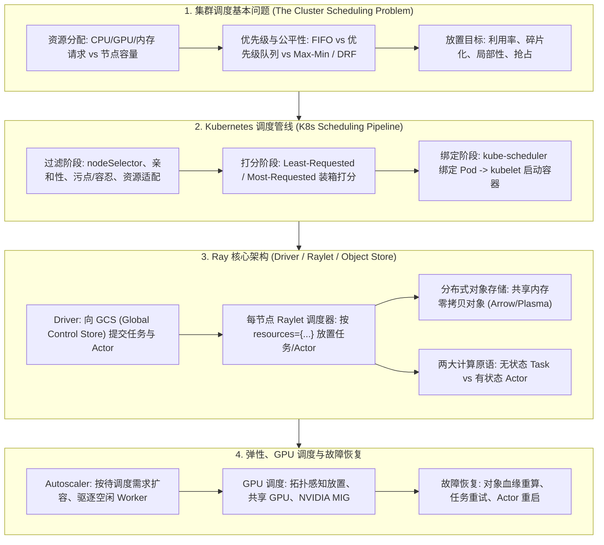

# 🌐 集群调度与 Ray：K8s 调度管线、Raylet 架构、分布式对象存储、弹性扩缩容与 GPU 调度全景

> **核心摘要**：任何 ML 平台都要回答同一个核心问题：给定 $N$ 台节点（CPU/GPU/内存），如何为 $M$ 个任务分配资源，使利用率最高、用户之间公平、且故障不拖垮整个作业？本指南从第一性原理拆解集群调度基本问题（资源分配/优先级/公平性），深入 Kubernetes 调度管线（过滤/打分两阶段、污点/亲和性），随后全面剖析 Ray 的核心架构（Driver/Raylet 调度器/分布式对象存储/任务与 Actor 双原语）、调度与弹性扩缩容策略（Autoscaler）、GPU 感知调度（拓扑感知/共享 GPU/MIG）、Ray Train 与 DP/TP 分布式训练集成、故障恢复与任务重试，最后给出 Ray 与 Spark 的定位对比。

---

## 💡 交互式 Mermaid 架构流程图



---

## 💡 经典面试追问与考点速查

* **考点 1**：完整走一遍 kube-scheduler 将 Pod 分配到 Node 的两阶段流程，并说明污点 (Taint)、容忍 (Toleration) 与节点亲和性 (Node Affinity) 如何影响最终决策？
  * *标准回答*：kube-scheduler 对每个未调度 Pod 执行**两阶段管线**。**过滤阶段**（硬约束）剔除无法容纳该 Pod 的节点：资源适配（requests ≤ allocatable）、nodeSelector、节点亲和性、以及污点/容忍（节点带 `gpu=true:NoSchedule` 污点时，只有携带匹配容忍的 Pod 才能进入）。**打分阶段**（软偏好）对幸存节点排名，例如 Least-Requested 给空闲节点 10 分、给满载节点 0 分：
    $$\text{Score}_{\text{least}}(n) = 10 \times \frac{C_n - \sum_{p \in \text{Pods}(n)} r_p}{C_n}$$
    调度器选择最高分节点，经 API Server 写入**绑定 (Binding)**，kubelet 随即启动容器。
> 💡 **直观理解**：过滤阶段是"门卫"（必须过关），打分阶段是"评分员"（在过关者里挑最好的）。Least-Requested 像服务员把新客引向最空的桌子——负载摊匀、延迟更低；Most-Requested 则把机器塞满省成本。加权求和让两种偏好可以混用。污点则是"贵宾厅规则"：厅主（管理员）设门槛，只有持通行证（容忍）的人能进——GPU 节点靠它防"普通任务误入"。
>
> 🎤 **面试速答**："结论：先过滤硬约束，再对幸存节点打分取最高分。原理：过滤处理资源适配、selector、亲和性、污点/容忍，保证可行性；打分（least-requested/most-requested/spread）通过加权和选最优可行节点。举个例子：8 核节点已用 6 核，least-requested 得 $10 \times (8-6)/8 = 2.5$ 分，空闲节点得 $10 \times 8/8 = 10$ 分——空闲节点胜出，负载自然摊匀。"

* **考点 2**：声明 `resources={"gpu": 1}` 后，Ray 的 Raylet 调度器如何为任务与 Actor 分配节点？资源不足时会发生什么？
  * *标准回答*：每个节点运行一个 **Raylet**，维护本节点空闲资源台账（CPU/GPU/内存）。Driver 提交任务时，带 `@ray.remote(num_gpus=1)`（或 `resources={"gpu": 1}`）的需求会被路由到**所有声明维度都能满足**的节点，Raylet 在该节点启动 Worker 进程执行。若无节点满足，任务**排队等待（背压）**直到资源释放——Ray 默认**不抢占**正在运行的任务。**Placement Group** 进一步提供**团伙调度 (Gang Scheduling)**：组内所有 Bundle 原子性放置，避免多卡训练组只放下一半导致死锁。
> 💡 **直观理解**：声明资源就像订位时精确报出"几张椅子、几张桌子"——领位员（Raylet）只在两者都能满足的桌子落座，整桌预订（Placement Group）保证"要么全坐下、要么一起等"。不声明资源时 Ray 默认每个任务是 1 CPU 的客人，会乐呵呵地把 8 个 GPU 任务安排在 1 张 GPU 桌上——这就是显式声明的意义。
>
> 🎤 **面试速答**："结论：Raylet 维护节点资源台账，`resources={'gpu': 1}` 的任务只落在有空闲 GPU 的节点上，否则排队等待。原理：调度是分布式的——每个 Raylet 本地调度、心跳同步，任务派发延迟 1-10ms；无抢占，缺资源就背压。举个例子：集群 2 张 GPU、队列 8 个 GPU 任务——2 个立即运行、6 个等待；再加 `num_cpus=2` 则同一节点还得有空闲的 2 核 CPU 才行。"

* **考点 3**：对比 Ray 的两种计算原语 Task 与 Actor，并解释分布式对象存储 (Object Store) 如何实现零拷贝数据交换？
  * *标准回答*：**Task** 是无状态函数，在全新 Worker 中执行——失败后重新执行即可，天然适配纯变换类工作（数据预处理、rollout 评估）。**Actor** 是有状态对象实例，方法在其独立线程上串行执行、状态跨调用保留——适配环境 (Env)、模型副本、缓冲区。数据流经**分布式对象存储**（Arrow/Plasma）：每个任务输出写入共享内存，依赖它的任务通过内存映射**零拷贝**读取（约 100GB 阈值内的对象，更大则落盘）。节点宕机时，其对象按**血缘 (Lineage)** 重算而非复制——用重算成本换显存。
> 💡 **直观理解**：Task 是复印机——每台复印机从空白开始，坏了一台换一台即可；Actor 是白板——内容不断累积，只有持有者能写，白板碎了得靠照片（checkpoint）恢复。Ray 的经典组合拳：Actor 持有模型/环境，Task 在外围做无状态数学。对象存储则是"共享乐谱架"：谱子放在共享内存里，所有人零拷贝直接读，不复制、不落地。
>
> 🎤 **面试速答**："结论：无状态 Task 免费重试，有状态 Actor 需 checkpoint；对象存储让结果在共享内存间零拷贝流转。原理：任务输出由血缘推导，节点挂了重算即可；Actor 状态必须显式保存，所以 RL 环境和学习器用 Actor、纯变换用 Task。举个例子：2GB 的中间张量从不落盘、不跨网络——消费者直接内存映射生产者写出的共享内存块，所有引用释放后自动回收。"

* **考点 4**：Ray 的 Autoscaler 如何实现弹性扩缩容？与 Kubernetes HPA / 静态节点池相比有何优劣？
  * *标准回答*：Autoscaler 持续对比**待调度资源需求**与集群现有容量：需求超过现有节点可承载量时，从云厂商**购买并加入节点**（受 `min_workers`/`max_workers` 约束）；空闲超过 `idle_timeout` 的节点被**终止**。目标节点数按资源维度计算：
    $$N_{\text{target}} = \max_j \left\lceil \frac{\sum_i r_{i,j}}{C_j} \right\rceil$$
    对比而言，K8s 的 HPA 只扩缩 **Pod 副本**，节点级扩容由 Cluster Autoscaler 单独负责，秒到分钟级粒度；**KubeRay**（Ray on Kubernetes）把两者结合——Ray 负责集群内细粒度调度，K8s 负责生命周期。
> 💡 **直观理解**：Autoscaler 像呼叫中心的调度员——队列超过现有人手承载能力就加派客服（加节点），闲下来超过设定时间就裁员（缩节点）。公式就是"总需求除以单节点容量、向上取整、各资源取最大"：所有资源维度都必须放得下，所以取 max。
>
> 🎤 **面试速答**："结论：Autoscaler 按待调度需求加节点、按 idle 超时缩节点，受 min/max 约束。原理：持续重算 $N_{\text{target}} = \max_j \lceil \sum_i r_{i,j} / C_j \rceil$，按需从云上买/退节点；K8s 则是 HPA 先扩 Pod、Cluster Autoscaler 再扩节点，链路更长。举个例子：100 个 CPU 请求、单节点 8 核，现有 5 台（容量 40）→ 需要 $\lceil 100/8 \rceil = 13$ 台，扩容 8 台；作业结束后空闲超时节点被回收，账单自动降下来。"

* **考点 5**：对比 Ray 与 Spark 的定位差异：为什么分布式强化学习与大规模训练场景选 Ray，而批处理 ETL 场景选 Spark？
  * *标准回答*：**Spark** 基于不可变 RDD/DataFrame 分区做**粗粒度 Stage 调度**，数据驻留 JVM 堆内存；擅长确定性的数据并行批处理（ETL、SQL），但其调度与血缘模型面向整 Stage 重算，不支持逐任务动态决策。**Ray** 以毫秒级延迟逐个调度**细粒度任务与 Actor**，支持有状态计算与共享内存对象存储，天然适配**分布式强化学习**（百万级环境步、每轮迭代都要调度）、模型训练（Ray Train）、超参搜索（Tune）与服务——这些场景更看重每步控制力与低延迟，而非 SQL 表达能力。
> 💡 **直观理解**：Spark 是流水线生产线（一次建好、大批量便宜处理），Ray 是快递车队（大量小件、每单独立决策）。RL 实验本质上是"快递问题"——百万环境步、每步都要立即调度、中间还夹着有状态的学习器——流水线的优势完全用不上，Ray 的细粒度调度自然胜出。
>
> 🎤 **面试速答**："结论：Spark 管批处理数据管线，Ray 管动态计算图、RL 与训练。原理：Spark 粗粒度 Stage 调度 + 不可变分区适合确定性 ETL；Ray 逐任务调度 + Actor + 共享内存对象存储适合高频动态负载。举个例子：RL 作业跑 100 万环境步、每 1k 步更新一次模型——Spark 的 Stage 边界开销会淹没计算本身，Ray 的 ~1ms 任务派发和有状态 Actor 原生承载，所以 RLlib、Tune、Ray Train 全跑在 Ray 上而不是 Spark 上。"

---

## 📚 第一章：集群调度基本问题：资源分配、优先级与公平性

### 1.1 核心调度问题与决策维度

用大白话讲，集群调度器就是一个**红娘**：为每个作业决定"给多少"资源（CPU/GPU/内存）、"放到哪"台节点、"什么时候跑"、以及"资源不够时谁优先"。形式上，任何放置方案都必须保证每个节点在每个资源维度上不超卖：

$$\forall j: \quad \sum_{i \in \text{Pods}(n)} r_{i,j} \le C_{n,j}$$

| 决策维度 | 回答的问题 | 典型策略 |
| :--- | :--- | :--- |
| **资源分配** | 每个任务给多少 CPU/GPU/内存？ | requests + limits、分数 GPU、超卖 |
| **放置 (Placement)** | 放到哪台节点？ | 装箱 (bin-packing)、拓扑感知、局部性 |
| **优先级** | 资源稀缺时谁先跑？ | FIFO vs 优先级队列 vs 截止时间 |
| **公平性** | 容量如何在租户/作业间分配？ | max-min、主导资源公平 (DRF) |
| **抢占** | 低优先级任务能被驱逐吗？ | 优先级抢占、团伙调度 |

> 📖 **怎么读这张表**：面试最常考的对比点是最后两行——**优先级是"排序"（谁先被服务），公平性是"份额"（最后各拿多少）**，别把二者混为一谈。随后被追问的指标是利用率公式：
>
> $$U = \frac{\sum_i r_i \cdot t_i}{\sum_n C_n \cdot T}$$
>
> 💡 **直观理解**：把调度器想成餐厅经理：资源分配是"每桌客人占几个座位"，放置是"坐哪桌"，优先级是"排队时谁先入座"，公平性是"一周下来老顾客和散客谁吃得多"。容量约束就是"永远不能安排比椅子更多的客人"——$\sum r_{i,j} \le C_{n,j}$ 正是这个查座动作，逐资源维度执行。
>
> 🎤 **面试速答**："结论：调度在每节点容量约束下权衡三大目标——高利用率、公平性、低延迟。原理：每个放置必须满足 $\sum_i r_{i,j} \le C_{n,j}$，不同策略的差别只在可行域内的排序与份额分配。举个例子：8 核节点上两个 6 核作业——朴素放置一次只跑一个、利用率 75%；能打包放置则 100%，利用率公式 $U = \sum r_i t_i / \sum C_n T$ 精确量化了这种差距。"

### 1.2 公平性：Max-Min 分配与主导资源公平 (DRF)

先讲大白话：当所有任务都只要 CPU 时，公平分配很简单——均分 CPU 即可。但真实集群是异构的：一个作业主要要 GPU，另一个主要要 CPU。**Max-Min 公平**迭代地给每个租户"最需要的那种资源"同等的份额，再把余量分给还能消化的人。**主导资源公平 (DRF)**（Mesos, 2011）将其形式化：对每个用户计算每种资源的份额占比，取最大者作为其**主导份额**，然后让所有用户的主导份额相等：

$$D_i = \max_j \frac{c_{i,j}}{C_j} \quad \text{(用户 $i$ 的主导资源份额)}$$

具体例子：集群 9 CPU + 18 GPU，用户 A 每个任务要 (1 CPU, 4 GPU)，用户 B 要 (3 CPU, 1 GPU)。A 的主导资源是 GPU（$4/18 = 0.22 > 1/9$），B 的主导资源是 CPU（$3/9 = 0.33 > 1/18$）。令主导份额相等并求解两个容量约束，得 A = (3 CPU, 12 GPU)、B = (6 CPU, 2 GPU)，双方主导份额都是 $2/3$。

> 💡 **直观理解**：DRF 回答的是"谁的'篮子'相对自己的需求最挤"。每个用户真正在意的是最稀缺的资源——它决定了能跑多少个任务。让主导份额相等，等于给每位顾客同等的"最爱菜品的百分比"，而不是每人一份相同的拼盘。这正是 DRF 优于朴素按比例分配的原因：它尊重异构的需求画像。
>
> 🎤 **面试速答**："结论：DRF = 对每个用户的主导资源份额做 max-min 公平。原理：先算 $D_i = \max_j c_{i,j}/C_j$，再分配使各主导份额相等并满足容量约束。举个例子：9 CPU + 18 GPU 集群，A 每任务 (1,4)、B 每任务 (3,1)——A 主导 GPU、B 主导 CPU，DRF 给 A=(3,12)、B=(6,2)，双方主导份额都是 2/3，CPU 利用率 100%。Mesos 和现代公平调度器用的就是这套。"

### 1.3 优先级、抢占与团伙调度 (Gang Scheduling)

公平之外，生产级调度器还有三个杠杆。**优先级队列**给待调度作业排序（有截止时间的训练作业优先于 best-effort 的 rollout）。**抢占 (Preemption)** 允许高优先级任务驱逐低优先级任务、立即复用其资源（K8s PriorityClass、YARN 均支持）。**团伙调度**要求"全或无"放置：一组任务（如张量并行训练组、分布式锁集合）必须**同时**被放置——若团伙只放下一部分，已占位的成员持有资源空等，其余成员等资源，形成死锁。Ray 的 **Placement Group** 正是团伙原语：Bundle 原子性预留，并用 pack/spread 策略控制同机或跨机分布。

> 💡 **直观理解**：优先级是"快捷通道"，抢占是"把慢顾客的购物车推到一边让急客先过"，团伙调度是餐厅的"团体订位"——整桌一起坐，或者谁都不坐。放下一半的团伙比完全不放更糟：已就座成员占着桌子，其余人在门外干等。
>
> 🎤 **面试速答**："结论：三个工具——按优先级排序、抢占低优先级作业、团伙原子放置。原理：优先级表达业务价值，抢占让集群对紧急任务即时响应，团伙放置避免部分分配造成的死锁。举个例子：TP=8 的训练作业不用 placement group，可能只拿到同节点 4 张 GPU，等其余 4 张时资源被空占、还挡住别人——用了 placement group，Ray 要么一次性预留全部 8 个 bundle，要么整组排队。"

---

## 📚 第二章：Kubernetes 调度原理：过滤、打分、污点与亲和性

### 2.1 kube-scheduler 两阶段管线

用大白话讲，kube-scheduler 持续监听没有节点的 Pod，然后跑两趟：第一趟（过滤）扔掉**不可能**的节点，第二趟（打分）给剩下的排序，最高分获胜。两阶段设计的意义在于：**硬约束绝不能因软偏好被突破**——一个打 10 分但没有所需 GPU 的节点毫无用处。

第一阶段 **过滤**（硬约束）：nodeSelector、节点/Pod 亲和性、污点 vs 容忍、资源适配（requests ≤ allocatable）、卷/可用区约束。第二阶段 **打分**（软偏好）：Least-Requested（摊匀负载）与 Most-Requested（装箱省钱），再由 spread/反亲和插件平衡：

$$\text{Score}(n) = \sum_k w_k \cdot \text{score}_k(n), \quad \text{Score}_{\text{least}}(n) = 10 \cdot \frac{C_n - \sum_{p \in \text{Pods}(n)} r_p}{C_n}$$

> 💡 **直观理解**：过滤是"门卫"（必须过关），打分是"评分员"（在过关者中挑最好的）。Least-Requested 像服务员把新客引向最空的桌子——负载摊匀、延迟更低；Most-Requested 则把机器塞满省成本。加权和让你同时要"摊匀"和"装箱"，按权重调和。
>
> 🎤 **面试速答**："结论：先过滤硬约束，再对幸存节点加权打分取最大。原理：过滤保证可行（资源适配、selector、亲和性、污点），打分选最优可行节点（least/most-requested、spread）。举个例子：$w=1$ 时，8 核节点用了 6 核得 $10 \cdot (8-6)/8 = 2.5$ 分，空闲节点得 10 分——空闲节点胜出。"

### 2.2 节点选择：nodeSelector、亲和性、污点与容忍

这四件套控制 Pod **能去哪、不能去哪**。**nodeSelector** 要求标签完全相等。**节点亲和性 (Node Affinity)** 用操作符（In/NotIn/Exists）推广，且区分"硬性 required"与"软性 preferred"语义。**Pod 亲和性/反亲和性** 管的是与其他 *Pod* 的关系（如两个模型副本必须放不同节点做 HA）。节点上的**污点 (Taint)**（如 `gpu=true:NoSchedule`）会排斥所有没有匹配**容忍 (Toleration)** 的 Pod——GPU 节点正是靠它保持"仅供 GPU 作业使用"。

| 机制 | 硬/软 | 语义 |
| :--- | :--- | :--- |
| **nodeSelector** | 硬 | 精确标签匹配（`gpu: "true"`），AND 语义 |
| **nodeAffinity** | 硬或软 | 带操作符的富标签匹配；required/preferred |
| **podAffinity / antiAffinity** | 硬或软 | 与其他 Pod 聚合（或隔离）放置 |
| **taints + tolerations** | 硬 | 节点污点排斥无匹配容忍的 Pod |

> 📖 **怎么读这张表**：nodeSelector 与亲和性都说"要跑在*像这样*的节点上"，而污点说"别来这里*除非*你带通行证"。面试官期望你讲出污点存在的理由：它让**节点所有者**（管理员）声明策略，而亲和性表达的是**工作负载**自身的偏好——两者方向相反、互为补充。
>
> 💡 **直观理解**：nodeSelector 是"我只在这家餐厅点单"；亲和性是"我偏好意餐，披萨意面都行"；污点/容忍是贵宾厅——厅主不挑客人，只立规矩"无证莫入"。污点保护 GPU 节点免遭"误入"的普通作业抢占，而不用每个工作负载都了解每台节点。
>
> 🎤 **面试速答**："结论：selector/亲和性说 Pod *想*去哪，污点说 *不能*去哪（除非带容忍）。原理：亲和性是负载侧偏好（标签+操作符，required 或 preferred），污点是节点侧策略，在过滤阶段生效——没有容忍直接不配位。举个例子：GPU 节点打 `gpu=true:NoSchedule` 污点、训练 Pod 带匹配容忍——CPU 批处理作业永远上不了 GPU 节点，GPU 作业则确定性落地。"

### 2.3 Kubernetes vs Ray：调度理念对比

| 维度 | Kubernetes | Ray |
| :--- | :--- | :--- |
| **调度单元** | Pod（容器组） | Task / Actor |
| **资源声明** | 每容器 `requests`/`limits` | 每任务/每 Actor `resources={"cpu": 1, "gpu": 1}` |
| **决策位置** | 集中式 kube-scheduler | 每节点 Raylet，分布式、心跳同步 |
| **派发延迟** | ~100ms–秒级（watch + bind） | ~1–10ms（进程内台账） |
| **抢占** | 支持（PriorityClass） | 默认不支持 |
| **团伙调度** | 非原生 | Placement Group |
| **擅长场景** | 长生命周期服务、微服务、高可用 | 细粒度动态 DAG、RL、训练、推理服务 |

> 📖 **怎么读这张表**：分界线之上的所有差异都源自**调度单元**。Pod 又大又长寿，集中式两阶段打分成本可接受；任务又小又短命，Ray 把调度器塞进每个节点，用全局最优性换毫秒级派发。
>
> 💡 **直观理解**：Kubernetes 是物业经理（租约、维护、规则）——刻意做粗粒度、慢决策；Ray 是外卖调度员（每秒成千上万个微单、不断重新规划路线）。两者都在"调度"，但调度单元与时间尺度差了数个数量级，架构自然不同。
>
> 🎤 **面试速答**："结论：K8s 集中式调度长生命周期 Pod、支持抢占；Ray 分布式 Raylet 每秒调度海量短任务、默认不抢占。原理：Pod 生命周期与延迟目标不同——K8s 优化可用性与声明式状态，Ray 优化动态计算图吞吐。举个例子：10 万个微型 RL 评估任务放 K8s 要建 10 万 Pod（小时级开销），Ray 用几百个 Worker 几秒跑完。"

---

## 📚 第三章：Ray 核心架构：Driver、Raylet 与分布式对象存储

### 3.1 系统解剖：Driver、GCS、Raylet、Object Store

用大白话讲，Ray 是一个分布式任务图引擎。你写 `@ray.remote` 函数/类；**Driver**（你的主进程）把任务提交进集群；每节点的 **Raylet** 把它们派发给 Worker 进程；结果写入分布式 **Object Store**；**GCS** 负责元数据一致性。组件表：

| 组件 | 职责 | 故障语义 |
| :--- | :--- | :--- |
| **Driver** | 用户入口，提交任务图 | 进程退出 → 作业结束 |
| **GCS** (Global Control Store) | 集群元数据、任务/对象所有权 | 由幸存 Raylet 重建 |
| **Raylet**（每节点） | 本地调度器 + 节点管理，资源台账 | 任务转移到其他节点 |
| **Worker 进程** | 执行任务/Actor 方法 | 任务输出按血缘恢复 |
| **Object Store** (Arrow/Plasma) | 分布式共享内存对象存储，可落盘 | 对象按血缘重算 |

> 📖 **怎么读这张表**：最值得看的是最后一列——每个组件都靠**"重算"而非"复制"**恢复。这个"用显存换冗余"的设计决策，是与 Hadoop/Spark 的"复制求持久"模型最大的架构分野。
>
> 💡 **直观理解**：Driver 是指挥，Raylet 是各声部首席——读谱（任务图）分派乐手（Worker）；Object Store 是共享谱架——所有人从共享内存读同一份谱，零拷贝；GCS 是舞台监督——保证大家的记录一致。乐手伤了，首席重新派活，演出照常。
>
> 🎤 **面试速答**："结论：Driver 提交、Raylet 本地调度、Worker 执行、Object Store 共享内存传结果、GCS 管元数据。原理：调度下沉到每节点以维持毫秒级延迟，对象按血缘重算而非复制以省显存。举个例子：8 节点集群里一个 2GB 张量在任务间流转从不落盘——走 Plasma 共享内存，总对象量超过内存时才溢写磁盘。"

### 3.2 两大计算原语：Task vs Actor

| 维度 | 无状态 Task | 有状态 Actor |
| :--- | :--- | :--- |
| **状态** | 无——每次全新执行 | 跨方法调用保留 |
| **失败重试** | 免费，直接重执行 | 必须 checkpoint + 恢复 |
| **并发** | 可大量并行副本 | 单实例内方法串行 |
| **典型用途** | 预处理、rollout 评估、纯函数 | 环境、模型副本、参数缓冲区、队列 |

> 📖 **怎么读这张表**：**状态列决定下游一切**。如果重执行是幂等且便宜的，用 Task 免费获得容错；如果对象会累积历史（RL 环境、训练循环），必须用 Actor，代价是状态管理。
>
> 💡 **直观理解**：Task 是复印机——每台都从空白开始，任何一台都能干活，坏了一台换一台；Actor 是白板——内容不断累积，只有持有者能写，白板碎了要靠照片（checkpoint）复原。Ray 经典范式：Actor 持模型/环境，Task 在周围做无状态数学。
>
> 🎤 **面试速答**："结论：Task 无状态、重试免费；Actor 有状态、方法串行、需显式 checkpoint。原理：任务输出可由血缘推导，失败重执行即可；Actor 状态易失必须持久化——所以 RL 环境与模型副本用 Actor，纯变换用 Task。举个例子：`@ray.remote` 一个 rollout 函数（Task，10 万次调用），但把回放缓冲和学习器写成 `@ray.remote` 类（Actor）——它们的状态要跨迭代存活。"

### 3.3 资源需求声明与 Ray 的调度策略

大白话：你必须告诉 Ray 任务需要什么——否则它默认每个任务 1 个 CPU，GPU 需求不声明就会悄悄超卖。`@ray.remote(resources={"gpu": 1})`（或 `num_gpus=1`）注册需求后，Raylet 台账检查空闲容量并强制：

$$\forall j: \quad r_{\text{task},j} \le \text{free}_j(\text{node})$$

调度是**贪心且近似 FIFO** 的：排队任务随资源释放依次被服务，无抢占；多个节点都放得下时按**局部性**选择（优先持有该任务输入对象的节点）。Placement Group 为多资源 Bundle 提供原子性，并可用 pack/spread 将任务组钉在同机或摊开跨机。

> 💡 **直观理解**：声明资源像订位时报"几张椅子、几张桌子"——领位员（Raylet）只带你去两者刚好够的桌；预订（placement group）则保证整桌一起坐或一起等。不声明时 Ray 默认每人 1 把椅子，会把 8 个 GPU 任务安排到 1 张 GPU 桌上。
>
> 🎤 **面试速答**："结论：声明 `resources={'gpu': 1}` 让 Raylet 台账只把任务放到有空闲 GPU 的节点；否则默认 1 CPU。原理：调度逐维度检查空闲容量，不满足则排队，placement group 提供多 bundle 原子放置。举个例子：`num_gpus=1`、2 张 GPU、8 个排队任务——2 个立即跑、6 个等待；再叠加 `num_cpus=2` 则同节点还需空闲 2 核——这正是防止 GPU 超卖的机制。"

---

## 📚 第四章：弹性扩缩容与 GPU 感知调度

### 4.1 Autoscaler：弹性扩缩容原理

大白话：Ray 的 Autoscaler 是"采购员"：盯着待调度任务和集群总容量，需求溢出就向云厂商买节点，节点空闲就退租。扩缩容按资源维度需求驱动：

$$N_{\text{target}} = \max_j \left\lceil \frac{\sum_i r_{i,j}}{C_j} \right\rceil$$

`min_workers`/`max_workers` 边界防止账单振荡；`idle_timeout`（默认 60s，生产常调大）防止抖动；节点类型（CPU/GPU/高内存）事先声明，Autoscaler 才能买到对的硬件；只有不承载任何运行中任务的节点才会被终止。

> 💡 **直观理解**：Autoscaler 像呼叫中心——队列超过现有人手负荷就加派客服，闲下来超过设定时长就让客服下班。公式就是"总需求 ÷ 单节点容量，向上取整，各资源维度取最大"——因为所有资源都得放得下，故取 max。
>
> 🎤 **面试速答**："结论：Autoscaler 在需求超容量时加节点、在 idle 超时后驱逐空闲节点，受 min/max 边界约束。原理：持续重算目标节点数 $\max_j \lceil \sum_i r_{i,j} / C_j \rceil$，弹性是云原生的——需求消失账单就降。举个例子：100 个 CPU 需求、单节点 8 核 → 需 $\lceil 100/8 \rceil = 13$ 台，现有 5 台则补 8 台；作业结束、节点空闲超时后被终止，集群缩回原样。"

### 4.2 GPU 调度：拓扑感知、共享 GPU 与 MIG

GPU 是最稀缺资源，调度需要再多三个旋钮。**拓扑感知**：放置要尊重 NVLink/NVSwitch 域——张量并行组应共享单机的 NVLink 网格（900GB/s）而非跨 InfiniBand（400Gbps），因为每层 All-Reduce 通信量正比于：

$$\text{Comm}_{\text{per layer}} = 2 \times \frac{P-1}{P} \times \text{model\_size} \quad \text{字节}$$

**共享 GPU / 分数分配**：`num_gpus=0.5` 让两个小任务共享一张卡（MPS 时间片），提升推理集群利用率。**MIG (Multi-Instance GPU)**：将 A100/H100 硬件切分为隔离切片（如 `1g.5gb`、`2g.10gb`、`3g.20gb`），各自独占 SM 与显存——租户获得硬隔离而非软共享。

| 模式 | 粒度 | 隔离性 | 典型用途 |
| :--- | :--- | :--- | :--- |
| 整卡 GPU | 1 任务 = 1 GPU | 完全 | 训练，`num_gpus=1` |
| 分数 GPU | `num_gpus=0.5` | 软（MPS） | 小模型、推理服务 |
| MIG 切片 | `1g.5gb` / `3g.20gb` | 硬（SM+显存） | 多租户推理 |
| 拓扑分组 | 同 NVSwitch 域放置组 | 不适用 | TP 组、All-Reduce 密集作业 |

> 📖 **怎么读这张表**：按**作业的隔离需求**选模式——噪声邻居会毁掉训练，就选 MIG 或整卡；作业又小又突刺，分数共享在利用率上完胜。拓扑行则提醒你：All-Reduce 场景下"距离就是速度"——NVLink 比 InfiniBand 快近 10 倍。
>
> 💡 **直观理解**：整卡是私享包间，分数 GPU 是共享工位（MPS 公用电话线），MIG 是带真墙的隔间（SM 与显存硬隔离），拓扑感知是选"同一层"的办公室——因为 All-Reduce 对距离极度敏感。A100 80GB 可切成 7 个 `1g.5gb` 或 2-3 个 `3g.20gb`，一片 MIG 约等于 1/7 到 3/7 的算力。
>
> 🎤 **面试速答**："结论：四种模式——整卡、分数（MPS）、MIG 切片（硬隔离）、拓扑感知放置（TP 组）。原理：每层 All-Reduce 通信量 $2 \cdot (P-1)/P \cdot \text{model\_size}$，所以 NVLink 邻近性决定性能；MIG 给多租户 GPU 共享提供硬件级隔离。举个例子：TP=8、hidden=8192 的微调，每次 All-Reduce 传约 64MB——只有 NVLink 带宽扛得住，所以 Ray placement group 把 8 张 GPU 钉在同一节点内。"

---

## 📚 第五章：Ray Train、故障恢复与 Ray vs Spark

### 5.1 Ray Train：与 DP/TP 结合的分布式训练

大白话：Ray Train 是跑在 Ray Actor 上的高层训练 API——`TorchTrainer` 拉起 N 个 Worker Actor，把数据分片（数据并行 DP），每步用 All-Reduce 同步梯度。每 Worker 的批次切片与理想加速比为：

$$B_{\text{per worker}} = \frac{B_{\text{total}}}{N}, \qquad \text{Speedup} \approx \frac{T_1}{T_N} \le N$$

Ray Train 对接 DeepSpeed/FSDP 实现 ZeRO-1/2/3（优化器状态分片）与 FSDP 的 `sharding_strategy`（张量/参数分片）——即 **DP 做外层循环、ZeRO/TP 解决显存上限、PP 各阶段映射到 placement group**。因为一切都跑在 Ray Actor 上，checkpoint、容错与扩缩容与集群其余负载共用同一套底座。

> 💡 **直观理解**：Ray Train 像 N 人学习小组：每人读同一本书的不同章节（数据分片），再碰头整合要点（梯度 All-Reduce）。DP 复制模型、拆分数据；ZeRO 更进一步——把书本身拆开分给每人，谁都不必带整本。加速比公式就是说：N 个脑子，N 倍速——再减去碰头（通信）开销。
>
> 🎤 **面试速答**："结论：Ray Train 用 Actor 跑 DP——每 Worker 分片 $B/N$、每步 All-Reduce 梯度——显存问题交给 DeepSpeed/FSDP 的 ZeRO 分层。原理：Worker 就是 Ray Actor，调度器、对象存储、Autoscaler 训练推理共用；模型超过单卡显存时由 ZeRO 切分优化器/梯度/参数。举个例子：70B FP16 模型权重约需 140GB——8×80GB 节点上 ZeRO-3 + DP 让每个 Worker 只持有 1/8 的状态，这就是 Ray Train+DeepSpeed 能跑 70B 的原因。"

### 5.2 故障恢复：血缘重算、任务重试与 Actor 重启

Ray 的恢复体系分三层。**对象血缘**：Object Store 记录每个对象的产出任务；节点宕机时其对象按血缘**重算**而非重新复制——用 CPU 换显存。**任务重试**：`@ray.remote(max_retries=k)` 带指数退避重执行失败任务；设单次尝试成功率为 $p$：

$$P(\text{作业存活}) = 1 - (1-p)^{k+1}$$

**Actor 重启**：`max_restarts` 允许 Ray 重新拉起 Actor，但内存态会丢失——生产代码周期性把 Actor 状态写入 checkpoint，重启后从 checkpoint 恢复。

> 💡 **直观理解**：血缘是"凭订单重做"的厨房：服务生打翻盘子，后厨照订单重做一份，而不是常备两份菜。Task 能重做是因为无状态（订单=输入）；Actor 是舒芙蕾——必须拍照（checkpoint）之后才能重做。
>
> 🎤 **面试速答**："结论：三个工具——对象按血缘重算（不复制）、无状态任务 max_retries 重试、有状态 Actor checkpoint 恢复。原理：对象存'配方'不存'菜'，任务幂等可重执行，Actor 状态易失需显式持久化。举个例子：单次成功率 0.9、max_retries=3，作业存活率 $1 - 0.1^{4} = 99.99\%$——无状态任务的 4 个 9 容错几乎是免费的。"

### 5.3 Ray vs Spark：定位差异与选型

| 维度 | Spark | Ray |
| :--- | :--- | :--- |
| **计算模型** | RDD/DataFrame 上的粗粒度 Stage DAG | 动态任务图；任务 + Actor |
| **调度** | Stage 级、整 Stage 重算 | 逐任务、毫秒级派发 |
| **数据模型** | 不可变 JVM 内存分区 | 共享内存对象存储（零拷贝） |
| **有状态计算** | 有限（流处理状态） | Actor 一等公民 |
| **擅长场景** | ETL、SQL、批量分析 | RL、训练、HPO、推理、通用分布式 Python |
| **ML 生态** | MLlib（经典 ML） | Ray Train / RLlib / Tune |

> 📖 **怎么读这张表**：**调度粒度这一行决定一切**——Spark 针对不可变分区的整批 Stage 做优化，适合确定性管线，却扛不住 RL 每轮迭代的控制循环；Ray 逐任务调度并支持状态，撑起动态图，但给不了你 SQL。
>
> 💡 **直观理解**：Spark 是流水线（一次性建好，大批量便宜处理），Ray 是快递车队（大量小件、逐单决策）。RL 实验本质是快递问题——100 万环境步、每步都要立即调度、中间夹着有状态学习器——流水线的优势用不上，Ray 自然胜出。
>
> 🎤 **面试速答**："结论：Spark 管批处理管线，Ray 管动态计算图、RL 与训练。原理：Spark 粗粒度 Stage 调度 + 不可变分区适合确定性 ETL；Ray 逐任务调度 + Actor + 共享内存对象存储适合高频动态负载。举个例子：跑 100 万环境步、每 1k 步更新一次模型的 RL 作业——Spark 光在 Stage 边界上的开销就超过计算本身；Ray 的 ~1ms 任务派发与 Actor 学习器原生承载，这正是 RLlib、Tune、Ray Train 全部基于 Ray 的原因。"

---

## 🐍 Pure Numpy 实现：最小集群调度模拟器

下面的脚本模拟一台容量 `(8 CPU, 1 GPU)` 的节点和 12 个随机任务 `[cpu, gpu, duration]`。`simulate()` 是贪心事件驱动调度器：任务完成释放资源、按策略顺序启动放得下的任务、时钟跳到下一完成事件。策略 `fifo`、`best_fit`（CPU 需求大的先放，经典装箱）、`random` 演示**调度顺序如何改变利用率**。`drf()` 复现第一章 1.2 节的 DRF 分配。

```python
import numpy as np

def simulate(tasks, capacity, policy="fifo", seed=0):
    """最小单节点集群调度模拟。
    tasks: np.ndarray (n, 3)，列为 [cpu, gpu, duration]
    capacity: (max_cpu, max_gpu)
    policy: 'fifo'（到达顺序）、'best_fit'（CPU 需求最大优先）、'random'
    """
    rng = np.random.default_rng(seed)
    n = len(tasks)
    order = np.arange(n)
    if policy == "best_fit":
        order = np.argsort(-tasks[:, 0])          # 经典装箱：大件优先
    elif policy == "random":
        order = rng.permutation(n)

    max_cpu, max_gpu = capacity
    t, cpu_busy_time = 0.0, 0.0
    running = []                                   # (task_idx, finish_time)
    done = np.zeros(n, dtype=bool)
    cpu_used = gpu_used = 0.0
    next_idx = 0

    while not done.all():
        # 1) 释放已完成任务的资源
        finished = [r for r in running if r[1] <= t + 1e-9]
        for idx, _ in finished:
            cpu_used -= tasks[idx, 0]; gpu_used -= tasks[idx, 1]; done[idx] = True
        running = [r for r in running if r[1] > t + 1e-9]

        # 2) 贪心启动放得下的任务（按策略顺序，不跳序）
        while next_idx < n and not done[order[next_idx]]:
            i = order[next_idx]
            cpu, gpu, dur = tasks[i]
            if cpu_used + cpu <= max_cpu and gpu_used + gpu <= max_gpu:
                running.append((i, t + float(dur)))
                cpu_used += cpu; gpu_used += gpu; next_idx += 1
            else:
                break

        # 3) 时钟推进到下一个完成事件
        if running:
            dt = min(r[1] - t for r in running)
            cpu_busy_time += cpu_used * dt
            t += dt
        else:
            break

    return {"makespan": t,
            "cpu_utilization": cpu_busy_time / (max_cpu * t),
            "completed": int(done.sum())}


def drf(demand_a, demand_b, capacity):
    """2 用户 2 资源的 DRF：令主导份额相等（第一章 1.2 节）。"""
    share_a = np.array(demand_a) / np.array(capacity)
    share_b = np.array(demand_b) / np.array(capacity)
    dom_a, dom_b = int(np.argmax(share_a)), int(np.argmax(share_b))
    # x_b = ratio * x_a 可令主导份额相等
    ratio = (demand_a[dom_a] * capacity[dom_b]) / (demand_b[dom_b] * capacity[dom_a])
    x_a = min(capacity[0] / (demand_a[0] + ratio * demand_b[0]),
              capacity[1] / (demand_a[1] + ratio * demand_b[1]))
    x_b = ratio * x_a
    return x_a, x_b, dom_a, dom_b


if __name__ == "__main__":
    rng = np.random.default_rng(42)
    n_tasks = 12
    tasks = np.stack([
        rng.integers(1, 5, n_tasks),      # cpu 需求 1-4
        rng.integers(0, 2, n_tasks),      # gpu 需求 0-1
        rng.uniform(1.0, 5.0, n_tasks),   # 时长 1-5s
    ], axis=1)

    for cap in [(8, 1), (8, 2)]:
        print(f"=== capacity {cap} ===")
        for policy in ["fifo", "best_fit", "random"]:
            res = simulate(tasks, capacity=cap, policy=policy, seed=0)
            print(f"{policy:9s} -> makespan {res['makespan']:6.2f}s, "
                  f"CPU utilization {res['cpu_utilization'] * 100:5.1f}%, done {res['completed']}/{n_tasks}")

    # 第一章 1.2 节 DRF 例子：集群 9 CPU + 18 GPU
    x_a, x_b, da, db = drf([1, 4], [3, 1], [9, 18])
    print(f"DRF: A gets ({x_a:.2f} CPU, {4 * x_a:.2f} GPU), B gets ({3 * x_b:.2f} CPU, {x_b:.2f} GPU) "
          f"-> dominant shares {4 * x_a / 18:.2f} / {3 * x_b / 9:.2f}")
```

已验证输出（seed=42）：

```text
=== capacity (8, 1) ===
fifo      -> makespan  28.68s, CPU utilization  43.0%, done 12/12
best_fit  -> makespan  28.68s, CPU utilization  43.0%, done 12/12
random    -> makespan  28.68s, CPU utilization  43.0%, done 12/12
=== capacity (8, 2) ===
fifo      -> makespan  16.41s, CPU utilization  75.1%, done 12/12
best_fit  -> makespan  19.38s, CPU utilization  63.6%, done 12/12
random    -> makespan  17.96s, CPU utilization  68.7%, done 12/12
DRF: A gets (3.00 CPU, 12.00 GPU), B gets (6.00 CPU, 2.00 GPU) -> dominant shares 0.67 / 0.67
```

> 💡 **直观理解**：两组容量跑出两段故事。(8,1) 时单 GPU 是硬串行瓶颈——所有 GPU 任务互相阻塞，**什么顺序都没用**：三个策略都是 28.68s、43% CPU 利用率。(8,2) 时 GPU 不再是唯一约束，顺序立刻变得重要——FIFO 恰好胜出（75.1%），因为它把 CPU-only 任务自然穿插进 GPU 的空档；best_fit（大任务优先）把大 CPU 任务排成连续长块，反而把调度切碎了。贪心启发式**并不普适**——真实调度器正是在与这种碎片化搏斗。
>
> 🎤 **面试速答**："结论：节点容量固定时，只有未被单一资源饱和，调度顺序才会改变利用率——而且贪心可能输给 FIFO。原理：事件循环依次做'释放资源→启动放得下的任务→推进时钟'，顺序只在资源有弹性时才有意义。举个例子：容量 (8,2)、12 个随机任务——fifo 16.41s/75.1% 胜过 best_fit 19.38s/63.6%；(8,1) 时 GPU 瓶颈使三种策略完全一致（28.68s/43%）。DRF 部分复现理论：A=(3,12)、B=(6,2)，主导份额都是 2/3。"

---

## 📝 总结与学习路线

1. **显式声明资源**：永远写 `resources={"gpu": 1}`（或 `num_gpus=1`）——Ray 默认每个任务 1 CPU，不声明的 GPU 需求会悄悄超卖集群。
2. **按负载粒度选调度器**：长生命周期服务放 Kubernetes（生命周期、HA、抢占）；动态计算图放 Ray；生产环境用 KubeRay 二者结合。
3. **团伙调度用 Placement Group**：TP/PP 组与多卡 Worker 必须原子放置——部分放置会死锁作业；pack/spread 控制拓扑（All-Reduce 留在 NVLink 内）。
4. **弹性要"放开但设界"**：min/max workers + 合理的 `idle_timeout` 防止冷启动卡顿与账单振荡；KubeRay 场景下用 K8s 污点预留 GPU 节点。
5. **按隔离需求选 GPU 共享模式**：训练用整卡、突发小模型用 MPS 分数共享、多租户硬隔离用 MIG、TP 组用拓扑感知放置。
6. **让故障变便宜**：无状态任务配 `max_retries` 免费获得 4 个 9 韧性；Actor 状态要 checkpoint；控制对象体积避免 Object Store 落盘。
7. **按控制循环选引擎**：确定性批处理/ETL 选 Spark，RL、训练（Ray Train + DeepSpeed ZeRO）、HPO（Tune）与推理服务选 Ray——调度粒度的需求就是最终判据。
