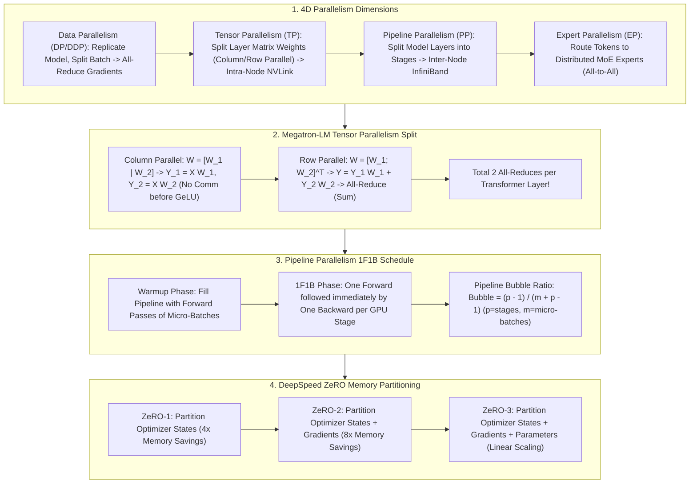

# 🌐 Distributed Training Parallelism: TP, PP, DP & DeepSpeed ZeRO 1/2/3

> **Core Executive Summary**: Single GPU VRAM cannot host 100B+ LLM training parameters, gradients, and optimizer states (a 70B FP16 model requires 1.12TB training VRAM). **4D Parallelism (DP, TP, PP, EP)** and **DeepSpeed ZeRO** partition memory across thousands of GPUs. This guide dissects Megatron-LM tensor parallelism, 1F1B pipeline bubble ratios, ZeRO 1/2/3 bounds, and 4D topology design.

---

## 💡 Interactive Mermaid Architecture Flowchart



---

## 💡 Classic Interview Followups & Core Cheatsheet

* **Key Topic 1**: Derive Pipeline Bubble ratio in 1F1B schedule and explain how increasing micro-batches reduces bubbles.
  * *Standard Answer*: $\text{Bubble Ratio} = \frac{p - 1}{m + p - 1}$. Increasing micro-batches $m \gg p$ reduces the bubble ratio toward 0.
> 💡 **Intuition**: Pipeline parallelism is like an 8-station assembly line: each micro-batch walks through all 8 stations. At startup the tail stations wait idle (filling the pipe); at shutdown the head stations wait (draining the pipe) — the bubble is that fixed fill/drain cost. More micro-batches spread it thinner. Example: p=8, m=16 -> 7/23 ~ 30%; m=64 -> 7/70 = 10%.
>
> 🎤 **Interview Answer**: "Bottom line: bubble ratio = (p-1)/(m+p-1). Why: the fill/drain idle steps are always p-1 out of m+p-1 total steps. Example: with 8 stages and 16 micro-batches the bubble is ~30%; raising micro-batches to 64 drops it to 10% — at the cost of activation memory, hence Activation Checkpointing."

* **Key Topic 2**: Explain Megatron-LM Column and Row Parallel GEMM splits in MLP layers, proving only 2 All-Reduces are needed per layer.
  * *Standard Answer*: Column Parallel splits $W_1$ by columns (no comm before activation). Row Parallel splits $W_2$ by rows, requiring only 1 All-Reduce (Sum) at the end of the MLP block. Total layer comms: 1 All-Reduce for Self-Attention + 1 All-Reduce for MLP = 2 All-Reduces.
> 💡 **Intuition**: Column parallel splits the weight "vertically" — each GPU computes its own slice with zero communication before the activation; Row parallel splits it "horizontally" — each GPU produces only a partial sum that must be added up (All-Reduce) at the block end. Like four people each tallying one column of a bill, then reconciling once. One transformer layer needs exactly 2 reconciliations: 1 for Attention, 1 for MLP.
>
> 🎤 **Interview Answer**: "Bottom line: a Megatron transformer layer needs exactly 2 All-Reduces (Attention + MLP). Why: column parallel needs no comm before GeLU; row parallel sums partial results with 1 All-Reduce at the block tail. Example: TP=8 with 4096 tokens, hidden 8192, FP16 -> 4096x8192x2B = 64MB per All-Reduce, 128MB per layer — that volume only fits NVLink (900GB/s), so TP must stay intra-node."

* **Key Topic 3**: Derive memory reductions for DeepSpeed ZeRO-1, ZeRO-2, and ZeRO-3 for Adam optimizer states, gradients, and weights.
  * *Standard Answer*: Total static memory = $16N$ bytes ($2N$ params + $2N$ grads + $12N$ Adam states). ZeRO-1 partitions Opt states ($2N + 2N + 12N/N_d$). ZeRO-2 partitions Opt states + Grads ($2N + 14N/N_d$). ZeRO-3 partitions all ($16N/N_d$ linear memory scaling).
> 💡 **Intuition**: Do the arithmetic: 16N = 2N params + 2N grads + 12N optimizer states. Adam's states (FP32 copy 4N + momentum 4N + variance 4N) are the elephant, 75% of the total! ZeRO is like a class sharing one set of notes: first split the thickest notebook (ZeRO-1: optimizer states), then the second (ZeRO-2: + gradients), finally rotate even the one being read (ZeRO-3: + parameters) — everyone ends up holding 16N/N_d.
>
> 🎤 **Interview Answer**: "Bottom line: ZeRO-1/2/3 partition optimizer states, gradients, and parameters, cutting memory from 16N to 2N+2N+12N/N_d -> 2N+14N/N_d -> 16N/N_d. Why: Adam states are 12N (75% of the 16N), so partitioning them first gives the most savings. Example: a 70B model needs 1120GB; with 8 GPUs of ZeRO-3 that's 140GB/GPU — still too big for an 80GB H100, which is why ZeRO must combine with TP/PP."

* **Key Topic 4**: Compare Tensor Parallelism (TP) vs Pipeline Parallelism (PP) in communication frequency and interconnect hardware.
  * *Standard Answer*: TP performs high-frequency All-Reduces per layer, requiring intra-node NVLink (900GB/s). PP performs point-to-point transfers at stage boundaries, suited for inter-node InfiniBand (400Gbps).
> 💡 **Intuition**: TP reconciles with teammates after every single operation (2 All-Reduces per layer); PP only hands the finished batch to the next station (1 P2P per micro-batch at stage boundaries). Two orders of magnitude difference in frequency: TP must stay in the NVLink "inner circle", PP can use the slower InfiniBand "highway" across racks.
>
> 🎤 **Interview Answer**: "Bottom line: TP is high-frequency per-layer All-Reduce (needs intra-node NVLink); PP is low-frequency per-micro-batch P2P (fits inter-node InfiniBand). Why: TP's per-message volume equals activation size times frequency; PP only ships activations at stage boundaries. Example: TP=8 sends 64MB per All-Reduce, 128MB per layer -> 900GB/s NVLink required; PP sends once per step -> 400Gbps IB suffices."

* **Key Topic 5**: Design optimal 4D hybrid parallelism (DP+TP+PP+EP) topology mapping for a 1024-GPU H100 cluster training a 409B MoE model.
  * *Standard Answer*: TP=8 (intra-node 8-GPU NVLink), EP=8 (NVSwitch domain token routing), PP=8 (inter-node stages), DP=16 ($1024 / (8 	imes 8) = 16$).
> 💡 **Intuition**: Topology design is like peeling an onion: the most frequent, latency-sensitive communication goes innermost, relaxing outward. TP (reconciles every layer) hugs the innermost 8-GPU NVLink; EP (token routing) sits in the rack's NVSwitch domain; PP (low-frequency P2P) crosses machines over IB; DP (one gradient sync per step) is the outermost global ring — each layer uses the fastest path for the most urgent traffic.
>
> 🎤 **Interview Answer**: "Bottom line: for 1024 GPUs training a 409B MoE model: TP=8 x EP=8 x PP=8 with DP=16. Why: order parallel dims by communication frequency — TP is most urgent (2 All-Reduces/layer) and must fill the 8-GPU NVLink domain; PP is infrequent so it can cross nodes. Example: TP x PP = 64, so DP = 1024/64 = 16: 16 full model replicas, each spanning 64 GPUs, gradients All-Reduced only across 16 replicas."

---

## 📚 Section 1: Parallelism Paradigm Comparison Matrix

| Mode | Split Target | Comm Primitive | Comm Frequency | Network Topology | Framework |
| :--- | :--- | :--- | :--- | :--- | :--- |
| **Data Parallel (DDP)** | Data Batch | All-Reduce | Step Backward End | Any Network | PyTorch DDP |
| **Tensor Parallel (TP)**| Matrix Weights | All-Reduce | **Per Transformer Layer**| **Intra-Node NVLink**| **Megatron-LM** |
| **Pipeline Parallel (PP)**| Layers | P2P | Per Micro-batch | Inter-Node IB | Megatron / DeepSpeed |
| **ZeRO-3** | Params/Grad/Opt| All-Gather + Reduce-Scatter | High | High-bandwidth Cluster | **DeepSpeed / FSDP** |
> **How to read this table**: Read three columns together: 1) what gets partitioned, 2) the communication primitive, 3) how often it communicates. The interview point is "frequency x bandwidth" matching: TP communicates every layer -> NVLink; PP every micro-batch -> inter-node IB; EP every MoE layer All-to-All -> NVSwitch rack. Chaining these three columns lets you derive the topology constraints of any parallelism config.

---

## ⚡ Section 2: ZeRO-3 Memory Bounds Formula

$$\text{Memory}_{\text{ZeRO-3}}(N, N_d) = \frac{16N}{N_d} \text{ Bytes}$$
> 💡 **Intuition**: This formula divides the three mountains of training memory — parameters, gradients, optimizer states — by the GPU count. The key is remembering the 16N breakdown: optimizer states are 12N, three quarters of the total, so ZeRO-1 (partitioning only those) already saves the majority; ZeRO-3 partitions everything and per-GPU memory truly scales inversely with card count.
>
> 🎤 **Interview Answer**: "Bottom line: ZeRO-3 memory = 16N/N_d, scaling linearly with GPU count. Why: 16N = 2N params + 2N grads + 12N Adam states, all shared across N_d GPUs. Example: a 70B model needs 16 x 70 = 1120GB; with 8 GPUs that is 140GB per card, with 16 GPUs only 70GB — exactly why 100B+ models require ZeRO-3/FSDP."

---

## 🐍 Section 3: Pure Numpy Megatron TP Operator

```python
import numpy as np

def pure_numpy_megatron_tp_split(x: np.ndarray, w1: np.ndarray, w2: np.ndarray, tp_world_size: int = 2) -> np.ndarray:
    sub_ffn = w1.shape[1] // tp_world_size
    tp_outs = []
    for rank in range(tp_world_size):
        w1_r = w1[:, rank*sub_ffn : (rank+1)*sub_ffn]
        w2_r = w2[rank*sub_ffn : (rank+1)*sub_ffn, :]
        tp_outs.append(np.dot(np.maximum(0.0, np.dot(x, w1_r)), w2_r))
    return np.sum(tp_outs, axis=0)

if __name__ == "__main__":
    x = np.random.randn(2, 8).astype(np.float32)
    w1, w2 = np.random.randn(8, 32).astype(np.float32), np.random.randn(32, 8).astype(np.float32)
    print("✅ TP Matrix Equivalence Error:", np.max(np.abs(np.dot(np.maximum(0.0, np.dot(x, w1)), w2) - pure_numpy_megatron_tp_split(x, w1, w2))))
```

---

## 🚀 Key Takeaways & Best Practices

1. **Intra-Node Isolation**: Restrict Tensor Parallelism (TP) to intra-node NVLink domains.
2. **Inter-Node Scaling**: Use Pipeline Parallelism (PP) or ZeRO-3 for cross-node scaling over InfiniBand.
3. **Memory Optimization**: Default to **FSDP or DeepSpeed ZeRO-3** for 100B+ LLM pre-training.