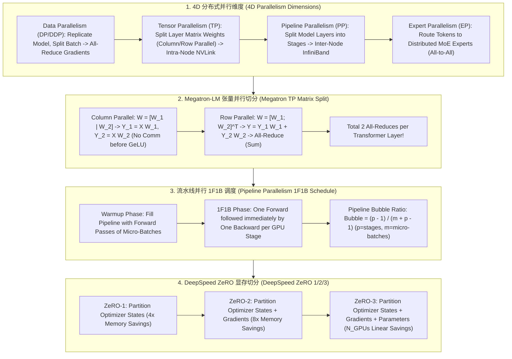

# 🌐 分布式并行训练全景：TP 张量并行、PP 流水线并行、DP 数据并行与 DeepSpeed ZeRO 1/2/3

> **核心摘要**：单张 GPU 的显存（如 H100 80GB）远不足以装载千亿参数大模型的权重、梯度和优化器状态（70B 模型 FP16 训练至少需要 1.12TB 显存）。**分布式 4D 并行体系 (DP, TP, PP, EP)** 与 **DeepSpeed ZeRO** 实现了跨千卡 GPU 集群的高效显存切分与算力扩展。本指南系统解构 Megatron-LM 张量切分、1F1B 流水线气泡控制、ZeRO 1/2/3 显存推导以及 4D 混合并行拓扑规划。

---

## 💡 交互式 Mermaid 架构流程图



---

## 💡 经典面试追问与考点速查

* **考点 1**：详细推导 1F1B (One Forward One Backward) 流水线并行中的 Pipeline Bubble (气泡) 占用比例公式，如何通过增加 Micro-batch 降低 Bubble？
  * *标准回答*：
    * **Bubble 比例推导公式**：设流水线 Stage 数量（卡数/深度）为 $p$，总 Micro-batch 数量为 $m$。在 1F1B 调度下，空闲气泡时间占总计算时间的比例为：
      $$\text{Bubble Ratio} = \frac{p - 1}{m + p - 1}$$
    * **降低气泡方法**：增加 Micro-batch 数量 $m$（例如让 $m \gg p$），使得 $m + p - 1 \approx m$，气泡比例趋向于 0。但这会增加激活值 (Activation) 显存开销，需配合 Activation Checkpointing (重算) 使用。
> 💡 **直观理解**：流水线并行就像一条 8 站式生产线：每个 micro-batch 要依次走过 8 个工位。开工时后段工位空等（管道"灌水"），收工时前段工位空等（管道"排水"），气泡就是这段固定的灌排成本。micro-batch 越多，固定成本被摊得越薄。举例：$p=8, m=16$ 时气泡 $\frac{7}{23} \approx 30\%$；$m$ 提到 64 后降到 $\frac{7}{70} = 10\%$。
>
> 🎤 **面试速答**："结论：气泡占比 = (p−1)/(m+p−1)。原理：流水线灌满和排空的空闲步数恒为 p−1，总步数为 m+p−1，两者一除就是气泡比例。举个例子：8 个 stage、16 个 micro-batch 时气泡约 30%；把 micro-batch 加到 64 个就降到 10%——代价是激活显存膨胀，所以要配 Activation Checkpointing。"

* **考点 2**：剖析 Megatron-LM 中 MLP 层 (GeLU 激活) 的 Column Parallel 与 Row Parallel 矩阵切分原理，证明其全流程仅需 2 次 All-Reduce？
  * *标准回答*：
    * **MLP 第一层 (Column Parallel)**：将权重 $W_1$ 按列拆分为 $[W_{1,1} \mid W_{1,2}]$。计算 $Y_1 = X W_{1,1}$ 和 $Y_2 = X W_{1,2}$，并独立经过 GeLU 激活函数 $\text{GeLU}(Y_1)$，**中间无需任何通信**；
    * **MLP 第二层 (Row Parallel)**：将权重 $W_2$ 按行拆分为 $[W_{2,1} \; W_{2,2}]^T$。计算 $Z_1 = \text{GeLU}(Y_1) W_{2,1}$ 和 $Z_2 = \text{GeLU}(Y_2) W_{2,2}$。最终全输出为 $Z = Z_1 + Z_2$，**仅在此处执行 1 次 All-Reduce (Sum)** 即可对齐结果！整个 Attention Block + MLP Block 全流程精准需要 **2 次 All-Reduce**。
> 💡 **直观理解**：列并行是把权重"竖着切"——每张卡各算各的互不相干（所以 GeLU 之前零通信）；行并行是把权重"横着切"——每张卡算出的只是部分和，必须加在一起才是完整答案（所以块尾要 All-Reduce）。就像四个人分头算同一份账单的四列，最后必须把结果对账相加。整个 Transformer 层（Attention 一次 + MLP 一次）只需 2 次"对账"。
>
> 🎤 **面试速答**："结论：Megatron 每个 Transformer 层全流程只需 2 次 All-Reduce（Attention 1 次 + MLP 1 次）。原理：列并行在激活函数前无需通信，行并行把部分和放在块尾一次性求和。举个例子：TP=8、单批 4096 tokens、hidden=8192、FP16 时，每次 All-Reduce 传 4096×8192×2B = 64MB，每层 128MB——这个量级只有 NVLink 900GB/s 才扛得住，所以 TP 严禁跨机。"

* **考点 3**：推导 DeepSpeed ZeRO-1、ZeRO-2 与 ZeRO-3 分别能将 Adam 优化器状态、梯度和模型参数的显存占用降低多少倍？
  * *标准回答*：
    * **训练显存开销组成**（以 $N$ 参数模型，FP16 混合精度 + FP32 Adam 优化器为例）：
      * 模型参数 (FP16)：$2N$ Bytes
      * 梯度 (FP16)：$2N$ Bytes
      * Adam 优化器状态 (FP32 参数副本 $4N$ + Momentum $4N$ + Variance $4N$)：$12N$ Bytes
      * **静态显存总和**：$16N$ Bytes（70B 模型需要 $16 \times 70 = 1120$ GB！）
    * **ZeRO 切分效果**（假设 DP 并行度为 $N_d$）：
      * **ZeRO-1**：切分 Optimizer States，显存降为 $2N + 2N + \frac{12N}{N_d}$；
      * **ZeRO-2**：切分 Optimizer States + Gradients，显存降为 $2N + \frac{2N + 12N}{N_d}$；
      * **ZeRO-3**：切分全量 (Params + Grad + Opt)，显存降为 $\frac{16N}{N_d}$（**随 GPU 节点数呈完全线性缩减！**）。
> 💡 **直观理解**：先算一笔账：16N = 2N 参数 + 2N 梯度 + 12N 优化器状态。Adam 的优化器状态（FP32 参数副本 4N + Momentum 4N + Variance 4N）是大头，独占 75%！ZeRO 就像全班共抄一份笔记：先切分最占地方的第一本（ZeRO-1 切优化器状态），再切第二本（ZeRO-2 切梯度），最后连正在看的第三本也轮流看（ZeRO-3 切参数）——三本全部分完，每人只留 16N/N_d。
>
> 🎤 **面试速答**："结论：ZeRO-1/2/3 分别切分优化器状态、梯度、参数，显存从 16N 依次降到 2N+2N+12N/N_d → 2N+14N/N_d → 16N/N_d。原理：Adam 状态占 12N（FP32 副本+momentum+variance 各 4N），是 16N 中的 75%，所以先切它收益最大。举个例子：70B 模型静态内存 1120GB，8 卡 ZeRO-3 后每卡 140GB——单靠 ZeRO 仍塞不进 80GB 的 H100，必须再叠加 TP/PP，这就是 3D 并行组合的原因。"

* **考点 4**：对比 Tensor Parallelism (TP) 与 Pipeline Parallelism (PP) 在通信频率、通信带宽 (NVLink vs InfiniBand) 以及跨机扩展上的差异？
  * *Standard Answer*：
    * **Tensor Parallelism (TP)**：每个 Layer 都要进行 All-Reduce 通信（高频、低延迟敏感）。必须限制在**单机内部 (Intra-Node)** 通过高带宽 **NVLink (900GB/s)** 连接；
    * **Pipeline Parallelism (PP)**：仅在 Stage 边界发送 Activation 张量（低频、点对点 P2P 通信）。适合运行在**跨节点 (Inter-Node)** 低带宽 **InfiniBand (400Gbps)** 网络上。
> 💡 **直观理解**：TP 是"每做一道工序都要和同伴对账"（每层 2 次 All-Reduce），PP 是"做完整批再传给下一站"（每个 micro-batch 只在 stage 边界传一次）。对账频率差了两个数量级：TP 必须待在 NVLink 的"小圈子"里用超快通道，PP 可以走慢一点的 InfiniBand"大马路"跨机箱。
>
> 🎤 **面试速答**："结论：TP 通信高频（每层 2 次 All-Reduce）必须锁单机 NVLink；PP 通信低频（每 micro-batch 一次 P2P）可以跨机走 InfiniBand。原理：TP 每次通信量和激活一样大，频率×单次量决定了带宽需求；PP 只在 stage 边界传激活。举个例子：TP=8 时单次 All-Reduce 传 64MB、每层 128MB，只有 900GB/s NVLink 撑得住；PP 每步只传一次激活，400Gbps 的 IB 就够，所以 8 卡单机内用 TP、跨机用 PP。"

* **考点 5**：在大规模集群 (如 1024 卡 H100) 训练 409B MoE 模型时，如何设计 4D 混合并行 (DP + TP + PP + EP) 的最优拓扑映射？
  * *Standard Answer*：
    * **物理拓扑映射规则**：
      1. **TP (张量并行)**：设为 8 (单机 8 卡 NVLink 占满)；
      2. **EP (专家并行)**：设为 8 或 16 (在机架内 NVLink/NVSwitch 范围传输 Token All-to-All)；
      3. **PP (流水线并行)**：设为 8 (跨机房/机柜，切分为 8 个 Pipeline Stage)；
      4. **DP / ZeRO-1 (数据并行)**：充当外层 $DP = 1024 / (TP \times PP) = 1024 / 64 = 16$。实现高吞吐、低气泡的千卡扩展！
> 💡 **直观理解**：拓扑设计像剥洋葱：通信最频繁、对延迟最敏感的维度放最里层，越往外通信越宽松。TP（每层都对账）贴在最里层的 8 卡 NVLink；EP（token 路由）在机架内 NVSwitch；PP（低频 P2P）跨机走 IB；DP（每步才同步一次梯度）放到最外圈全局互连——每层用"最快的路"做"最急的事"。
>
> 🎤 **面试速答**："结论：1024 卡训练 409B MoE 的经典拓扑是 TP=8 × EP=8 × PP=8、DP=16。原理：按通信频率从内到外排布——TP 每层 2 次 All-Reduce 最急，必须占满单机 8 卡 NVLink；PP 低频可跨机。举个例子：TP×PP=64，DP = 1024/64 = 16，即 16 份完整模型副本各吃 64 卡，梯度只在 16 个副本间做一次 All-Reduce，通信量被压到最低。"

---

## 📚 第一章：4D 并行范式对比矩阵

| 并行模式 | 切分对象 | 通信原语 | 通信频率 | 适用网络拓扑 | 代表框架 |
| :--- | :--- | :--- | :--- | :--- | :--- |
| **Data Parallel (DDP)** | Data Batch | All-Reduce | 每 Step 反向结束时 | 任意网络 (IB / RoCE) | PyTorch DDP |
| **Tensor Parallel (TP)**| Layer 内矩阵 | All-Reduce | **每 Transformer Layer**| **单机 NVLink (900GB/s)**| **Megatron-LM** |
| **Pipeline Parallel (PP)**| Layer 跨层 Stage| P2P (Send/Recv)| 每 Micro-batch | 跨机 InfiniBand | Megatron / DeepSpeed |
| **Expert Parallel (EP)**| MoE 专家维度 | All-to-All | 每 MoE Layer | 机架内 NVSwitch | DeepSpeed-MoE |
| **ZeRO-3** | Params/Grad/Opt| All-Gather + Reduce-Scatter | 高 | 高带宽集群 | **DeepSpeed / FSDP** |

> **怎么读这张表**：横向对比三列：①切分对象（谁被分掉）、②通信原语（怎么同步）、③通信频率（多久同步一次）。面试常考的是"频率 × 带宽"匹配：TP 每层都通信→必须 NVLink；PP 每 micro-batch 才通信→可以跨机 IB；EP 每 MoE 层做 All-to-All→锁在 NVSwitch 机架内。把这三列连起来读，就能自己推导出任何并行配置的拓扑约束。

---

## ⚡ 第二章：DeepSpeed ZeRO-3 显存推导公式

**一句话直觉**：分子 2N + 2N + 12N 是"参数 + 梯度 + 优化器状态"三本账的合计 16N，分母 N_d 是 DP 并行度——三本账全部被 N_d 张卡均摊，所以每卡显存随卡数线性下降。

$$\text{Memory}_{\text{ZeRO-3}}(N, N_d) = \frac{2N + 2N + 12N}{N_d} = \frac{16N}{N_d} \text{ Bytes}$$

> 💡 **直观理解**：这个公式就是把训练显存的三座大山（参数、梯度、优化器状态）一起除以 GPU 数。关键是记住 16N 的构成——优化器状态 12N 占了四分之三，所以 ZeRO-1 只切它就能省下大半；ZeRO-3 全切，每卡负担才真正与卡数成反比。
>
> 🎤 **面试速答**："结论：ZeRO-3 显存 = 16N/N_d，随 GPU 数线性缩减。原理：16N 由 2N 参数 + 2N 梯度 + 12N Adam 状态组成，全部分摊到 N_d 张卡上。举个例子：70B 模型 16×70=1120GB，8 卡后每卡 140GB，16 卡后每卡 70GB——正好说明为什么 100B+ 模型必须 ZeRO-3/FSDP 才能训练。"

---

## 🐍 第三章：Pure Numpy 手写 Megatron-LM 列/行并行矩阵切分算子

```python
import numpy as np

def pure_numpy_megatron_tp_split(x: np.ndarray, w1: np.ndarray, w2: np.ndarray, tp_world_size: int = 2) -> np.ndarray:
    """
    Pure Numpy 实现 Megatron-LM MLP 层 (Column + Row Parallel) 张量并行模拟算子
    x:  Input tensor shape (Batch, Hidden_Dim)
    w1: MLP 1st Layer Weight shape (Hidden_Dim, 4 * Hidden_Dim)
    w2: MLP 2nd Layer Weight shape (4 * Hidden_Dim, Hidden_Dim)
    """
    hidden_dim = x.shape[1]
    ffn_dim = w1.shape[1]
    sub_ffn_dim = ffn_dim // tp_world_size
    
    # 1. Column Parallel Split W1 along columns
    w1_splits = [w1[:, i * sub_ffn_dim : (i + 1) * sub_ffn_dim] for i in range(tp_world_size)]
    
    # 2. Row Parallel Split W2 along rows
    w2_splits = [w2[i * sub_ffn_dim : (i + 1) * sub_ffn_dim, :] for i in range(tp_world_size)]
    
    # 3. Simulate Parallel Execution on TP Devices
    tp_outputs = []
    for rank in range(tp_world_size):
        # Column Parallel Forward + GeLU (Simulated by Relu)
        h_rank = np.maximum(0.0, np.dot(x, w1_splits[rank]))
        # Row Parallel Forward
        y_rank = np.dot(h_rank, w2_splits[rank])
        tp_outputs.append(y_rank)
        
    # 4. All-Reduce (Sum) across TP Ranks
    output_tp = np.sum(tp_outputs, axis=0)
    
    return output_tp

# ==================== 测试验证 ====================
if __name__ == "__main__":
    x = np.random.randn(2, 8).astype(np.float32)
    w1 = np.random.randn(8, 32).astype(np.float32)
    w2 = np.random.randn(32, 8).astype(np.float32)
    
    # 单卡完整计算
    h_single = np.maximum(0.0, np.dot(x, w1))
    out_single = np.dot(h_single, w2)
    
    # 2 卡 TP 张量并行模拟计算
    out_tp = pure_numpy_megatron_tp_split(x, w1, w2, tp_world_size=2)
    
    diff = np.max(np.abs(out_single - out_tp))
    print("✅ Megatron TP 矩阵切分与单卡计算数学等价验证！最大误差:", diff)
```

---

## 🚀 总结与工程最佳实践

1. **单机内部**：TP 张量并行严格限制在单机 8 卡 NVLink 内；
2. **跨机扩展**：使用 PP (流水线并行) 或 ZeRO-3 进行跨机拓扑扩展；
3. **显存开销防护**：大规模训练首选 **PyTorch FSDP 或 DeepSpeed ZeRO-3**。