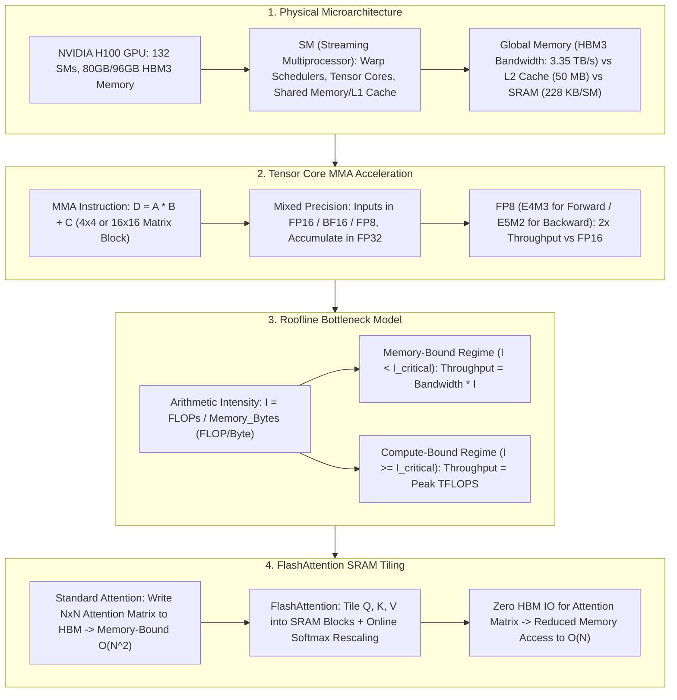

# 🌐 GPU Hardware Architecture: SM, Tensor Cores, HBM Bandwidth & Roofline Model

> **Core Executive Summary**: AI LLM performance relies directly on underlying GPU hardware physics. Modern GPUs like NVIDIA H100/A100 feature massively parallel architectures built of **Streaming Multiprocessors (SMs)**, **Tensor Cores**, and 3TB/s+ **HBM3** memory. This guide dissects SM microarchitecture, Tensor Core mixed-precision matrix multiplication, Roofline bottleneck modeling, and FlashAttention SRAM tiling.

---

## 💡 Interactive Mermaid Architecture Flowchart



---

## 💡 Classic Interview Followups & Core Cheatsheet

* **Key Topic 1**: Detail NVIDIA H100 microarchitecture: SM count, Tensor Core TFLOPS, and HBM3 memory bandwidth limits.
  * *Standard Answer*: H100 SXM5 features 132 SMs, 3.35 TB/s HBM3 bandwidth, 989 TFLOPS FP16 Tensor Core compute, and 1978 TFLOPS FP8 compute.
> 💡 **Intuition**: Think of the GPU as a factory: Tensor Cores are the machine tools (989 TFLOPS), HBM is the warehouse conveyor belt (3.35 TB/s). Generating 1 token requires moving all 140GB of weights (70B model in FP16) from the warehouse to the tools: 140GB ÷ 3.35TB/s ≈ 42ms of pure moving, versus only ~0.14ms of actual math — 99% of the time is spent waiting for the "raw materials". That's the memory wall.
>
> 🎤 **Interview Answer**: "Bottom line: H100 is 'compute-rich, bandwidth-poor', so single-token decoding is memory-bound. Why: every decoding step must stream all weights from HBM, yet only computes one token. Example: 70B FP16 = 140GB of weights, bandwidth 3.35TB/s → ~42ms to load, but the 140G FLOPs take only 0.14ms → under 1% compute utilization; that's why serving systems use continuous batching to raise the batch size."

* **Key Topic 2**: Derive the Roofline Model formula and compute critical arithmetic intensity $I_{\text{critical}}$ for FP16 GEMM on H100.
  * *Standard Answer*: $\text{Performance} = \min(\text{Peak Compute}, \text{Bandwidth} 	imes I)$. Critical intensity $I_{\text{critical}} = \frac{989 \text{ TFLOPS}}{3.35 \text{ TB/s}} approx 295.2 \text{ FLOPs/Byte}$.
> 💡 **Intuition**: Arithmetic intensity is "how many FLOPs you get per byte hauled from memory". 295 FLOPs/Byte is H100's break-even ratio: for every byte the conveyor delivers, the compute units must do at least 295 operations to stay busy. A large GEMM (e.g. 8192x8192) has intensity in the thousands and easily crosses the line; single-token decoding sits around 1 FLOP/Byte and is hopelessly starved.
>
> 🎤 **Interview Answer**: "Bottom line: H100's critical intensity I_critical ~ 295 FLOPs/Byte. Why: Roofline says performance = min(peak compute, bandwidth x intensity); the crossover is the critical point. Example: 989 TFLOPS / 3.35 TB/s ~ 295; FlashAttention is exactly the trick of lifting intensity past this line by cutting HBM traffic from O(N^2) to O(N)."

* **Key Topic 3**: Explain Tensor Core MMA hardware instructions and FP16 vs BF16 vs FP8 (E4M3/E5M2) throughput ratios.
  * *Standard Answer*: MMA performs $D = A \cdot B + C$ matrix blocks in hardware. FP8 delivers 2x throughput vs FP16. E4M3 is used for forward activations (higher precision), E5M2 for backward gradients (higher dynamic range).
> 💡 **Intuition**: MMA is "one hardware instruction computes a small matrix multiply" — like grabbing four tiles at once in a tile game. FP8 uses half the bits of FP16, so the same silicon fits twice the data per clock: throughput doubles and bandwidth needs halve. E4M3 vs E5M2 is like a "more precise scale" (more mantissa bits) vs a "wider-range scale" (more exponent bits).
>
> 🎤 **Interview Answer**: "Bottom line: FP8 Tensor Core throughput is 2x FP16/BF16. Why: MMA executes D = A×B + C in hardware; halving the bit width doubles the data per clock cycle. Example: H100 is 989 TFLOPS in FP16 and 1978 TFLOPS in FP8; use E4M3 for forward activations (precision) and E5M2 for backward gradients (dynamic range)."

* **Key Topic 4**: What is FlashAttention's core innovation? How do SRAM tiling and Online Softmax resolve memory-bound limits?
  * *Standard Answer*: Standard attention writes $N 	imes N$ matrices to HBM ($O(N^2)$ IO). FlashAttention tiles $Q, K, V$ into fast SRAM (Shared Memory) blocks and applies Online Softmax, reducing HBM access to $O(N)$.
> 💡 **Intuition**: Standard attention lays the NxN attention matrix "on the warehouse floor" (writes it to HBM) and fetches it back; FlashAttention computes in blocks on the SM's 228KB desk (SRAM) and rescales on the fly (Online Softmax) so the intermediate never leaves fast memory. One sentence: **keep intermediates out of HBM**.
>
> 🎤 **Interview Answer**: "Bottom line: FlashAttention cuts attention HBM traffic from O(N^2) to O(N), giving 2-4x speedup. Why: tile Q/K/V into SRAM, compute per block, fix up with Online Softmax rescaling, never materialize the NxN matrix. Example: at sequence length 8K, standard attention writes a 64M-element matrix to HBM; FlashAttention only touches O(N) of KV data."

* **Key Topic 5**: Explain CUDA Warp (32 threads), Warp Divergence, and Memory Coalescing optimization principles.
  * *Standard Answer*: Warp (32 SIMT threads). Warp Divergence happens when `if-else` branches serialize execution. Memory Coalescing combines 32 thread accesses into single 128-byte DRAM transactions.
> 💡 **Intuition**: A Warp is a 32-person squad that must march in lockstep (same instruction, same cycle). Divergence is the squad splitting left and right — they walk one direction at a time, halving efficiency. Coalescing is queueing the squad in a single line so one trip to the warehouse fetches all 128 bytes at once.
>
> 🎤 **Interview Answer**: "Bottom line: the Warp is the 32-thread SIMT scheduling unit; divergence and uncoalesced access both kill performance. Why: a Warp executes one instruction per cycle for all 32 threads, so branches serialize; contiguous addresses merge into one memory transaction. Example: 32 threads reading a contiguous 128-byte block = 1 HBM transaction; stride-16-byte access degenerates to 32 transactions and craters bandwidth utilization."

---

## 📚 Section 1: GPU Generation Comparison Matrix

| GPU Model | Architecture | HBM Bandwidth | FP16 Tensor Compute | FP8 Tensor Compute | Critical Intensity $I_{\text{critical}}$ |
| :--- | :--- | :--- | :--- | :--- | :--- |
| **V100** | Volta | 0.90 TB/s | 125 TFLOPS | N/A | 138.8 FLOPs/Byte |
| **A100** | Ampere | 2.00 TB/s | 312 TFLOPS | N/A | 156.0 FLOPs/Byte |
| **H100** | Hopper | **3.35 TB/s** | **989 TFLOPS** | **1978 TFLOPS** | **295.2 FLOPs/Byte** |

> **How to read this table**: Focus on the race between column 2 (bandwidth) and column 4 (FP16 compute) — their ratio is the last column, $I_{\text{critical}}$. Interview classic: why is H100's 295 higher than A100's 156? Because compute grew ~3.2x (989/312) while bandwidth grew only ~1.7x (3.35/2.0) — compute outruns bandwidth every generation, so memory-friendly algorithms matter more and more. That is the root cause behind FlashAttention and KV cache optimization.

---

## ⚡ Section 2: Roofline Intensity Formula

**One-line intuition**: FLOPs are "the work to do", Bytes are "the raw material to haul"; intensity is how much work you get per byte hauled — bigger I saves bandwidth, smaller I hits the memory wall.

$$I = \frac{\text{Total FLOPs}}{\text{Total HBM Memory Bytes}}$$

> 💡 **Intuition**: The formula is just "work ÷ bytes moved". Its power comes from combining it with the Roofline curve: below $I_{\text{critical}}$ the conveyor belt (bandwidth) is the ceiling; above it, the machine tools (compute) take over.
>
> 🎤 **Interview Answer**: "Bottom line: Roofline I = FLOPs / Bytes and I_critical = peak compute ÷ bandwidth. Why: performance = min(compute, bandwidth × I); the crossover is the turning point. Example: on H100 a big GEMM has intensity in the thousands (compute-bound), while single-token decoding sits at I≈1 (memory-bound) — that's why decode-path engineering is all about moving fewer bytes."

---

## 🐍 Section 3: Pure Numpy Roofline Analyzer Operator

```python
import numpy as np

def pure_numpy_roofline_analyzer(peak_tflops: float, bandwidth_tbs: float, flops: float, memory_bytes: float) -> dict:
    intensity = flops / max(memory_bytes, 1.0)
    i_crit = (peak_tflops * 1e12) / (bandwidth_tbs * 1e12)
    achievable = min(peak_tflops, (bandwidth_tbs * 1e12 * intensity) / 1e12)
    return {
        "intensity": round(intensity, 2),
        "i_critical": round(i_crit, 2),
        "regime": "Memory-Bound" if intensity < i_crit else "Compute-Bound",
        "achievable_tflops": round(achievable, 2)
    }

if __name__ == "__main__":
    print("✅ Roofline Analysis:", pure_numpy_roofline_analyzer(989.0, 3.35, 140e9, 140e9))
```

---

## 🚀 Key Takeaways & Best Practices

1. **Memory IO Reduction**: Use **FlashAttention** to avoid $O(N^2)$ HBM reads/writes.
2. **Quantized Compute**: Utilize **FP8 (E4M3)** precision to double Tensor Core throughput.
3. **Memory Coalescing**: Align CUDA memory access to 32-byte boundaries for maximum bandwidth.