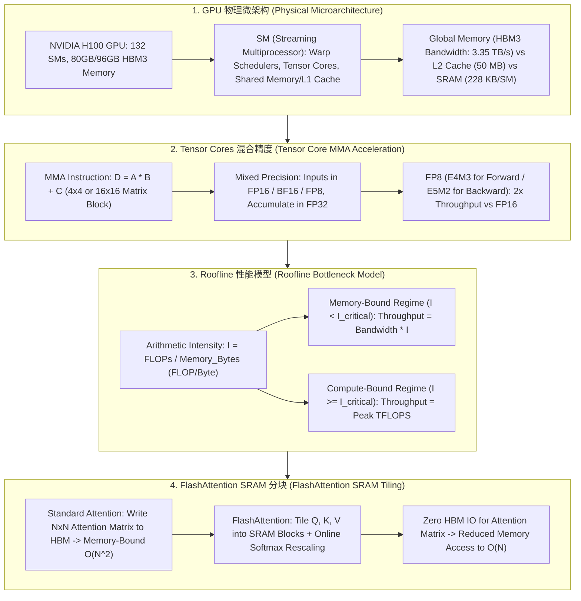

# 🌐 GPU 硬件架构全景：SM 流处理器、Tensor Core 混合精度、HBM 带宽与 Roofline 模型

> **核心摘要**：大模型训练与推理的高效落地极度依赖于底层 GPU 硬件的物理特性。NVIDIA H100 / A100 等 Modern GPU 拥有由数十个 **SM (Streaming Multiprocessor)** 组成的超大规模并行架构，并配备 **Tensor Cores** 与 3TB/s+ 吞吐量的 **HBM3** 显存。本指南系统解构 SM 微架构、Tensor Cores 混合精度乘法、Roofline 性能建模以及 FlashAttention SRAM 分块优化。

---

## 💡 交互式 Mermaid 架构流程图



---

## 💡 经典面试追问与考点速查

* **考点 1**：详细拆解 NVIDIA H100 GPU 的微架构：SM 数量、Tensor Core 算力 (TFLOPS) 与 HBM3 显存带宽 (TB/s) 的具体数值与瓶颈关系？
  * *标准回答*：
    * **H100 SXM5 规格**：包含 **132 个 SM**、80GB HBM3 显存、**3.35 TB/s 显存带宽**；
    * **算力巅峰**：FP16 Tensor Core 算力为 **989 TFLOPS** (无 Structure Sparsity) / 1978 TFLOPS (带稀疏)；FP8 算力高达 **1978 TFLOPS**；
    * **瓶颈比率**：显存带宽 3.35 TB/s 相对 989 TFLOPS 算力偏低，导致大部分 Batch Size=1 的推理算子极易沦为 Memory-Bound！
> 💡 **直观理解**：把 GPU 想成一家工厂：Tensor Core 是机床（加工速度 989 TFLOPS），HBM 是仓库与传送带（3.35 TB/s）。生成 1 个 token 要把 70B 模型的全部权重（FP16 = 140GB）从仓库搬上机床，搬一趟就要 140GB ÷ 3.35TB/s ≈ 42ms，而真正的计算只需 0.14ms——99% 的时间都在"等运料"，这就是"内存墙"。
>
> 🎤 **面试速答**："结论：H100 是'算力过剩、带宽不足'的典型，单 Token 解码是内存瓶颈（Memory-Bound）。原理：解码每步都要把全部权重从 HBM 搬一遍，而每步只算 1 个 token 的矩阵向量乘。举个例子：70B FP16 权重 140GB，带宽 3.35TB/s，搬运耗时约 42ms，而 140G FLOPs 计算只要 0.14ms，算力利用率不足 1%，所以推理必须靠连续批处理把 Batch 做上去才能吃满算力。"

* **考点 2**：推导 Roofline 模型公式，计算 H100 运行 FP16 GEMM 时的转折点 (Turnaround Point) 算术强度 $I_{\text{critical}}$？
  * *标准回答*：
    * **Roofline 性能限制公式**：
      $$\text{Performance (TFLOPS)} = \min\Big(\text{Peak Compute (TFLOPS)}, \text{Memory Bandwidth (TB/s)} \times \text{Arithmetic Intensity } I\Big)$$
    * **转折点算术强度推导**：当算力限制等于带宽限制时，算术强度达到临界点 $I_{\text{critical}}$：
      $$I_{\text{critical}} = \frac{\text{Peak Compute}}{\text{Memory Bandwidth}} = \frac{989 \text{ TFLOPS}}{3.35 \text{ TB/s}} \approx 295.2 \text{ FLOPs/Byte}$$
    * **结论**：算法的算术强度必须大于 **295.2 FLOPs/Byte**，才能吃满 H100 的 Tensor Core 算力，否则性能受限于 HBM 带宽！
> 💡 **直观理解**：算术强度 = 每从内存搬 1 字节数据，要配多少次运算。295 FLOPs/Byte 就是 H100 的"配比红线"：传送带每运来 1 字节，机床至少要干 295 次活才不算浪费。大矩阵乘（如 8192×8192 的 GEMM）算术强度轻松上千，稳稳过线；而逐 token 解码只有约 1 FLOPs/Byte，严重欠配，所以被带宽卡死。
>
> 🎤 **面试速答**："结论：H100 的临界算术强度 I_critical ≈ 295 FLOPs/Byte。原理：Roofline 取 '算力上限' 与 '带宽 × 算术强度' 两者较小值，交点就是临界点。举个例子：989 TFLOPS ÷ 3.35 TB/s ≈ 295；FlashAttention 把 Attention 的 HBM 读写从 O(N²) 降到 O(N)，本质就是把算术强度拉高、跨过这条线。"

* **考点 3**：什么是 Tensor Core 的 MMA (Matrix Multiply-Accumulate) 硬件指令？FP16、BF16 与 FP8 (E4M3 / E5M2) 的硬件吞吐倍率差异？
  * *标准回答*：
    * **MMA 指令**：Tensor Core 的核心是硬件级执行 $D = A \cdot B + C$ 的矩阵乘加指令（如 $16 \times 16 \times 16$ 矩阵块）。单时钟周期完成数百个 FMA (Fused Multiply-Add) 运算；
    * **数据类型与倍率**：FP16 与 BF16 吞吐量相同。**FP8 (8-bit Float)** 相比 FP16/BF16 吞吐量直接**翻倍 (2x)**！FP8 包含两种格式：**E4M3**（4位指数，3位尾数，高精度，适合前向传播与激活）与 **E5M2**（5位指数，2位尾数，高动态范围，适合反向传播梯度）。
> 💡 **直观理解**：MMA 就是"一条硬件指令算一小块矩阵乘法"，像打麻将一次摸四张牌；FP8 每个数只占 1 字节，位宽是 FP16 的一半，同一颗芯片同一时钟周期能塞进两倍的数据 → 吞吐翻倍、带宽需求减半。E4M3 与 E5M2 的区别就像"更精确的秤"（尾数多、精度高）vs "量程更大的秤"（指数多、动态范围宽）。
>
> 🎤 **面试速答**："结论：FP8 的 Tensor Core 吞吐是 FP16/BF16 的 2 倍。原理：MMA 指令在硬件上执行 D = A×B + C，位宽减半使单周期可处理的数据翻倍。举个例子：H100 FP16 是 989 TFLOPS，FP8 达到 1978 TFLOPS；前向传播用 E4M3 保精度，反向传播梯度用 E5M2 防溢出。"

* **考点 4**：FlashAttention 算法的核心创新是什么？它是如何利用 SRAM (Shared Memory) 分块与 Online Softmax 解决 Memory-Bound 问题的？
  * *标准回答*：
    * **传统 Attention 痛点**：标准 Attention 需要在 HBM 中写入并读取大小为 $N \times N$ 的 intermediate Attention Matrix $S = Q K^T$ 和 $P = \text{softmax}(S)$，访问 HBM 显存的复杂度为 $O(N^2)$；
    * **FlashAttention 创新**：利用 SM 内部速度极快但容量较小的 **SRAM (Shared Memory)**，将 $Q, K, V$ 划分为小 Block。在 SRAM 中分块计算 Attention，并通过 **Online Softmax** 动态缩放和累加局部结果。**完全不需要将 $N \times N$ 中间矩阵写回 HBM**！将 HBM 读写复杂度降低到 **$O(N)$**，提速 2x~4x！
> 💡 **直观理解**：标准 Attention 要把 N×N 的注意力矩阵"摊到仓库地板上"（写回 HBM）再搬回来取用；FlashAttention 直接在 SM 手边的 228KB 小桌（SRAM）上分批算完，softmax 需要全局归一化，就"边算边修正缩放因子"（Online Softmax）。本质一句话：**让中间结果永远不出快速内存**。
>
> 🎤 **面试速答**："结论：FlashAttention 把 Attention 的 HBM 读写从 O(N²) 降到 O(N)，提速 2~4 倍。原理：Q/K/V 分块进 SRAM 逐块算，Online Softmax 动态累计缩放修正，N×N 中间矩阵永不落 HBM。举个例子：序列长 8K 时，标准做法要写 64M 个元素的注意力矩阵到 HBM，FlashAttention 只需要读写 O(N) 的 KV 数据。"

* **考点 5**：解释 CUDA 中的 Warp (32 线程束)、Warp Divergence (分支发散) 以及 Memory Coalescing (显存合并访问) 优化的底层原理？
  * *标准回答*：
    * **Warp (32 线程束)**：CUDA 的基本调度单位是包含 32 个线程的 Warp，在 SIMT (Single Instruction, Multiple Threads) 模式下同步执行同一条指令；
    * **Warp Divergence**：若 Warp 内部 32 个线程执行了分支代码 (`if-else`)，会导致 32 个线程串行执行不同分支，算力折半；
    * **Memory Coalescing**：当 Warp 内 32 个线程访问连续的 128 字节 DRAM 显存块时，GPU 硬件将其合并为 1 次 HBM 事务 (Memory Transaction)，提升带宽利用率。
> 💡 **直观理解**：Warp 是 32 人的小队，必须"齐步走"（同一时刻执行同一条指令）；分支发散就是队伍里有人要左拐、有人要右拐，只能轮流走，效率折半；Coalescing 则是让 32 人排成一列取货，一次搬走一整排 128 字节，而不是每人单独跑一趟仓库。
>
> 🎤 **面试速答**："结论：Warp 是 32 线程的 SIMT 调度单元，分支发散和内存不连续访问都会严重损失性能。原理：同一 Warp 只能同步执行一条指令，if-else 让分支串行化；连续地址访问会被硬件合并成单次内存事务。举个例子：32 个线程访问连续 128 字节 = 1 次 HBM 事务；若每线程跳 16 字节步长，就退化成 32 次事务，带宽利用率暴跌。"

---

## 📚 第一章：GPU 硬件代际性能对比矩阵

| GPU 型号 | 架构 | HBM 带宽 | FP16/BF16 Tensor 算力 | FP8 Tensor 算力 | 临界算术强度 $I_{\text{critical}}$ |
| :--- | :--- | :--- | :--- | :--- | :--- |
| **NVIDIA V100** | Volta | 0.90 TB/s (HBM2) | 125 TFLOPS | N/A (不支持) | 138.8 FLOPs/Byte |
| **NVIDIA A100** | Ampere | 2.00 TB/s (HBM2e)| 312 TFLOPS | N/A (不支持) | 156.0 FLOPs/Byte |
| **NVIDIA H100** | Hopper | **3.35 TB/s (HBM3)**| **989 TFLOPS** | **1978 TFLOPS** | **295.2 FLOPs/Byte** |
| **B200 (Blackwell)**| Blackwell| **8.00 TB/s (HBM3e)**| **2250 TFLOPS** | **4500 TFLOPS** | **281.2 FLOPs/Byte** |

> **怎么读这张表**：重点看第二列带宽与第四列 FP16 算力的"赛跑"——两者的比值就是最后一列 $I_{\text{critical}}$。面试常考：为什么 H100 的临界值 295 比 A100 的 156 高近一倍？因为算力涨了 3.2 倍（989/312）而带宽只涨了 1.7 倍（3.35/2.0），算力增长更快，导致对"内存友好型算法"的要求越来越苛刻，这也是 FlashAttention、KV Cache 优化的根本动因。

---

## ⚡ 第二章：Roofline 模型算术强度公式

**一句话直觉**：FLOPs 是"要干的活"，Bytes 是"要从仓库搬的料"，算术强度就是每搬 1 字节料能干多少活——I 越大越省带宽，越小越容易撞上内存墙。

$$I = \frac{\text{Total FLOPs}}{\text{Total HBM Memory Bytes}}$$

> 💡 **直观理解**：这个公式本身只是"干活量 ÷ 搬运量"的比值。它的威力在于和 Roofline 曲线结合：低于 $I_{\text{critical}}$ 时性能被带宽（传送带速度）锁死，高于它才轮到算力（机床速度）做主。
>
> 🎤 **面试速答**："结论：Roofline 的 I = FLOPs / Bytes，I_critical = 峰值算力 ÷ 带宽。原理：Roofline 上性能 = min(算力, 带宽×I)，交点即转折点。举个例子：H100 上大 GEMM 的 I 有几千、是 Compute-Bound，而单 token 解码 I≈1、是 Memory-Bound——这就是为什么解码系统设计要围绕'减少字节搬运'展开。"

---

## 🐍 第三章：Pure Numpy 手写 Roofline 瓶颈分析算子

```python
import numpy as np

def pure_numpy_roofline_analyzer(peak_tflops: float, bandwidth_tbs: float, flops: float, memory_bytes: float) -> dict:
    """
    Pure Numpy 实现 Roofline 模型瓶颈判定算子
    peak_tflops: GPU 理论峰值算力 (TFLOPS)
    bandwidth_tbs: GPU 显存带宽 (TB/s)
    flops: 算法总浮点运算数
    memory_bytes: 算法总显存读写字节数
    """
    # 1. 计算算术强度 I (FLOPs / Byte)
    arithmetic_intensity = flops / max(memory_bytes, 1.0)
    
    # 2. 计算转折点 I_critical
    i_critical = (peak_tflops * 1e12) / (bandwidth_tbs * 1e12)
    
    # 3. 判定瓶颈区域与理论可达性能
    bandwidth_bound_tflops = (bandwidth_tbs * 1e12 * arithmetic_intensity) / 1e12
    achievable_tflops = min(peak_tflops, bandwidth_bound_tflops)
    
    regime = "Memory-Bound (内存限制区)" if arithmetic_intensity < i_critical else "Compute-Bound (算力限制区)"
    
    return {
        "arithmetic_intensity": round(arithmetic_intensity, 2),
        "i_critical": round(i_critical, 2),
        "regime": regime,
        "achievable_tflops": round(achievable_tflops, 2),
        "gpu_utilization_pct": round((achievable_tflops / peak_tflops) * 100.0, 2)
    }

# ==================== 测试验证 ====================
if __name__ == "__main__":
    # H100 规格: 989 TFLOPS FP16, 3.35 TB/s Bandwidth
    # 模拟 Batch Size=1 LLM Decoding 步: 70B 模型, FLOPs = 140G, Bytes = 140GB
    res_decoding = pure_numpy_roofline_analyzer(peak_tflops=989.0, bandwidth_tbs=3.35, flops=140e9, memory_bytes=140e9)
    print("✅ Decoding 阶段 Roofline 判定:", res_decoding)
```

---

## 🚀 总结与工程最佳实践

1. **算子开销优化**：对 Decoding 阶段算子使用 **FlashAttention 与 FlashDecoding** 减少 HBM I/O；
2. **混合精度**：前向推理首选 **FP8 (E4M3)** 压榨 2x Tensor Core 硬件算力；
3. **内存连续**：在 CUDA 编程中时刻注意 **Memory Coalescing 32-Byte 内存合并对齐**。