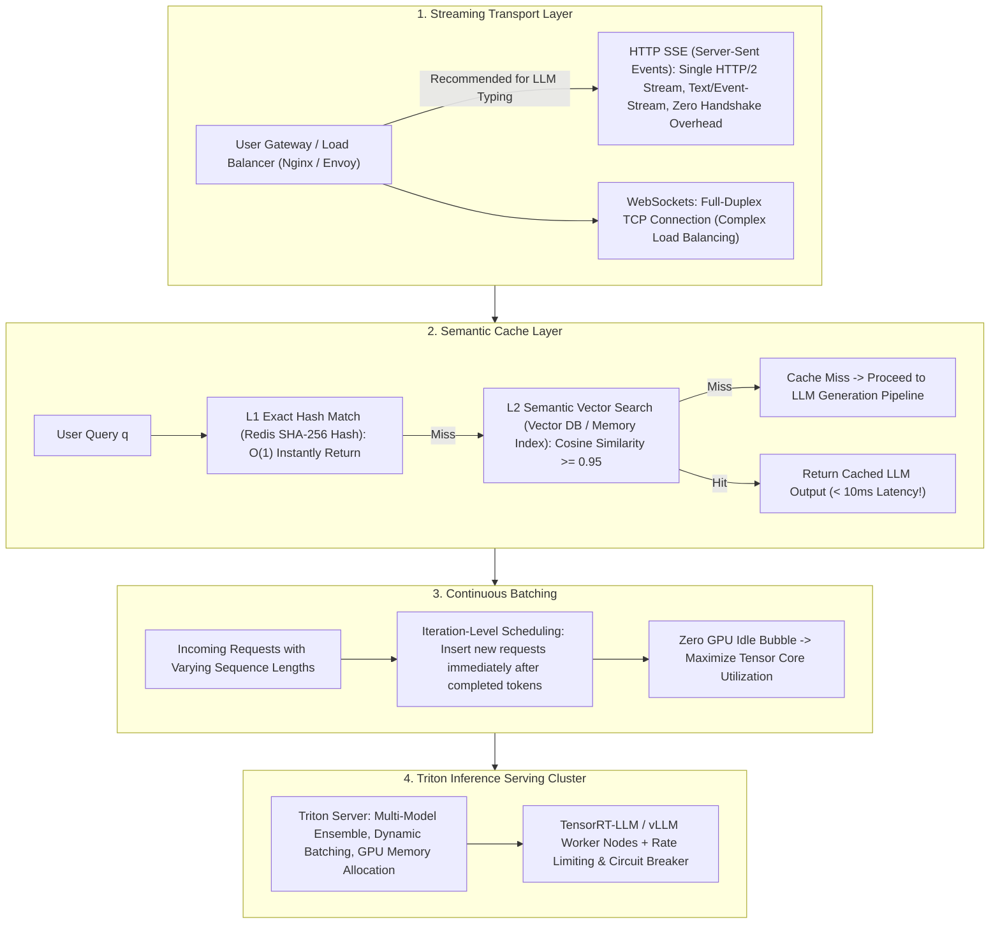

# 🌐 High-Concurrency AI System Design: SSE Streaming, Semantic Cache & ML Runtimes

> **Core Executive Summary**: Traditional web servers handle millisecond HTTP requests. LLM serving involves multi-second streaming responses. **High-Concurrency AI System Design** addresses typewriter streaming transport, continuous GPU iteration batching, semantic cache acceleration, and circuit-breaker rate limiting under traffic spikes.

---

## 💡 Interactive Mermaid Architecture Flowchart



---

## 💡 Classic Interview Followups & Core Cheatsheet

* **Key Topic 1**: Compare HTTP SSE vs WebSocket vs gRPC in streaming LLM typewriter outputs.
  * *Standard Answer*: HTTP SSE uses lightweight unidirectional HTTP/2 streams (`text/event-stream`), traversing firewalls effortlessly with zero SDK requirements. WebSockets add complex full-duplex overhead unnecessarily. gRPC is reserved for internal microservices.
> 💡 **Intuition**: SSE is a "one-way radio station" — the server opens a single HTTP long-lived connection and keeps broadcasting, and the browser comes with a built-in radio (`EventSource`). WebSocket is a "two-way walkie-talkie"; gRPC is an "internal leased line". A typewriter stream only needs server-to-browser one-way broadcast, so the lightest transport wins — no point paying handshake and proxy complexity for duplex capability you never use.
>
> 🎤 **Interview Answer**: "Bottom line: pick HTTP SSE for ChatGPT-style typewriter output. Why: SSE is a unidirectional long-lived connection over standard HTTP (text/event-stream), reusing existing web infrastructure — it traverses firewalls and Nginx/Envoy natively, the browser supports it via EventSource with auto-reconnect. Example: SSE adds zero extra handshakes, while WebSocket requires a TCP upgrade plus sticky sessions — full duplex is pure overhead for a read-only stream."

* **Key Topic 2**: Detail the two-stage Semantic Cache lookup: Exact Hash match + Vector Cosine Similarity threshold verification.
  * *Standard Answer*: L1 checks SHA-256 Redis hash ($<1\text{ms}$). L2 performs vector similarity search, returning cached responses when $\text{Cosine Similarity} \ge 0.95$, compressing latency from 3000ms to 10ms.
> 💡 **Intuition**: Two-stage caching is like a library: first flip through the index cards (exact hash, O(1)), and if that misses, let a clerk compare handwritten copies (vector similarity). The 0.95 threshold means "two synonyms still count as the same question": L1 catches identical requests, L2 catches "close enough" ones, and only a double miss reaches the LLM.
>
> 🎤 **Interview Answer**: "Bottom line: a semantic cache cuts answer latency from ~3000ms to <10ms using cosine similarity >= 0.95. Why: L1 SHA-256 exact-hash lookup returns instantly; on miss, L2 embeds the query and runs vector search — hit only if similarity clears the threshold. Example: hot FAQs or shared system prompts commonly hit >30% of traffic; every hit saves one full 70B forward pass. Add TTL=24h and disable caching for time-sensitive queries to prevent stale answers."

* **Key Topic 3**: Analyze Continuous Batching vs Static Batching in eliminating GPU idle bubbles caused by variable sequence lengths.
  * *Standard Answer*: Static batching forces early-finished requests to idle until the longest sequence completes. Continuous batching operates at the iteration step level, dynamically inserting new requests into finished slots.
> 💡 **Intuition**: Static batching is a bus that departs as one group and only parks when the slowest passenger arrives — short requests just wait, slots locked by padding. Continuous batching is a subway where passengers board and alight at every stop: the moment one request finishes, a new one takes its seat, so the GPU runs full every single iteration.
>
> 🎤 **Interview Answer**: "Bottom line: Continuous Batching boosts throughput by 200%-400%. Why: the scheduling granularity drops from 'whole request' to 'single iteration (one token)' — finished requests free their compute slot for new arrivals, eliminating padding and idle bubbles. Example: with 64 concurrent requests of lengths 128-512, static batching can idle below 30% GPU utilization, while vLLM/TensorRT-LLM continuous batching holds 80%+ — it is the main throughput lever in LLM serving."

* **Key Topic 4**: How to use Triton Inference Server for multi-model DAG pipeline ensemble orchestration and GPU dynamic load balancing?
  * *Standard Answer*: Triton Ensemble Scheduler connects preprocessing, LLM core inference, and postprocessing in a DAG pipeline, load balancing across multi-GPU instances.
> 💡 **Intuition**: Triton is a "cafeteria assembly line": Ensemble wires washing vegetables (tokenization), cooking (model inference), and plating (post-processing) into one DAG pipeline; Dynamic Batching batches orders placed in the same window; multi-GPU load balancing routes work to the shortest queue.
>
> 🎤 **Interview Answer**: "Bottom line: Triton orchestrates preprocessing -> model inference -> post-processing as a DAG via Ensemble Scheduler, with automatic Dynamic Batching and multi-GPU load balancing. Why: background threads aggregate concurrent requests into batches and dispatch by GPU memory headroom and queue backlog. Example: production stacks commonly chain tokenizer -> TensorRT-LLM/vLLM engine -> output validation in Triton, serving 3-5 models from one cluster with far less latency jitter than bare engine deployments."

* **Key Topic 5**: Design rate limiting (Token Bucket) and degradation queue strategies under 10,000 QPS spike traffic.
  * *Standard Answer*: Envoy Gateway applies Token Bucket rate limiting. Excess requests enter a Redis Priority Queue with TTL expiration. Extreme load triggers fallback to lightweight quantized models.
> 💡 **Intuition**: Four defense lines under a traffic spike, like running a concert: the token bucket is "tickets at the door" (fixed N per second), the queue is the "waiting hall", TTL is "your number expires", degradation is "switching to the stripped-down show" (big model to small model). Each layer stops pressure with the cheapest possible resource — before it ever reaches the GPU.
>
> 🎤 **Interview Answer**: "Bottom line: handle 10k QPS spikes with four layers: token-bucket rate limiting -> priority queue with TTL drop -> circuit breaker -> model degradation. Why: the gateway caps concurrency at what the GPUs can digest, the queue absorbs bursts, timed-out requests are dropped to avoid wasted compute, and degradation is the safety net. Example: cap at 2000 QPS, overflow into a Redis queue with a 10s wait cap, drop beyond that; when the 70B main model overloads, route to an 8B quantized engine so core-path P99 stays intact."

---

## 📚 Section 1: Streaming Protocol Comparison Matrix

| Protocol | Direction | Transport | Load Balancing | Primary Target |
| :--- | :--- | :--- | :--- | :--- |
| **HTTP SSE** | Unidirectional (Server $	o$ Client)| HTTP/1.1 / HTTP/2 | **Extremely Simple** | **LLM Typewriter Streaming (ChatGPT Standard)**|
| **WebSocket** | Full Duplex | TCP Upgrade | Complex | Real-time audio / gaming / rooms |
| **gRPC Stream**| Bi/Uni-directional | HTTP/2 (Protobuf) | Medium | High-speed Microservice RPC |

> **How to read this table**: Compare the "Load Balancing" and "Client Complexity" columns — SSE is lowest on both, which is exactly why it wins for LLM typewriter output: one standard HTTP connection is all it takes. Watch the "Direction" column too: WebSocket buys full duplex with a TCP upgrade handshake plus sticky sessions, while a typewriter stream is purely server-to-client — so the complex duplex protocol is over-engineering for AI streaming.

---

## ⚡ Section 2: Semantic Cache Formula

**One-line intuition**: The hit test is an OR: either the exact hash matches (identical sentence) or the vector similarity clears 0.95 (close enough) — the expensive GPU forward pass only happens when both miss.

$$\text{Hit} = \text{ExactHash}(q) \in \text{Redis} \quad \lor \quad \max \cos(E(q), E(d)) \ge 0.95$$

> 💡 **Intuition**: This formula is the cache's two gates: gate 1 (exact hash) catches verbatim repeats, gate 2 (cosine >= 0.95) catches rephrased questions. The LLM is invoked only when both gates fail — so the whole formula is really "quantify whether to call the big model into a threshold decision".
>
> 🎤 **Interview Answer**: "Bottom line: semantic cache hits when exact hash hits OR cosine similarity >= 0.95. Why: L1 is an O(1) hash filter for identical requests, L2 uses embeddings to catch paraphrases, and only a double miss reaches the LLM. Example: at threshold 0.95, 'how do I reset my password' and 'I need to change my password' hit the same cache entry — 3s latency becomes 10ms; raise the threshold and hit rate collapses, lower it and users get stale mismatched answers."

---

## 🐍 Section 3: Pure Numpy Semantic Cache Operator

```python
import numpy as np

class PureNumpySemanticCache:
    def __init__(self, threshold: float = 0.95):
        self.threshold = threshold
        self.embs = []
        self.resps = []
        
    def add(self, emb: np.ndarray, resp: str):
        self.embs.append(emb / np.linalg.norm(emb))
        self.resps.append(resp)
        
    def query(self, emb: np.ndarray) -> tuple:
        if not self.embs:
            return False, None
        sims = np.dot(np.array(self.embs), emb / np.linalg.norm(emb))
        idx = int(np.argmax(sims))
        return (True, self.resps[idx]) if sims[idx] >= self.threshold else (False, None)

if __name__ == "__main__":
    cache = PureNumpySemanticCache()
    cache.add(np.array([0.1, 0.8, 0.2]), "Reset password via Settings.")
    hit, resp = cache.query(np.array([0.11, 0.79, 0.21]))
    print("✅ Semantic Cache Hit:", hit, "| Resp:", resp)
```

---

## 🚀 Key Takeaways & Best Practices

1. **Streaming Standard**: Implement **HTTP SSE** for LLM client typewriter output.
2. **Cache Acceleration**: Deploy **Redis + Vector DB Semantic Cache** to relieve GPU load.
3. **Batching Efficiency**: Enable **Continuous Iteration Batching** in vLLM / TensorRT-LLM.