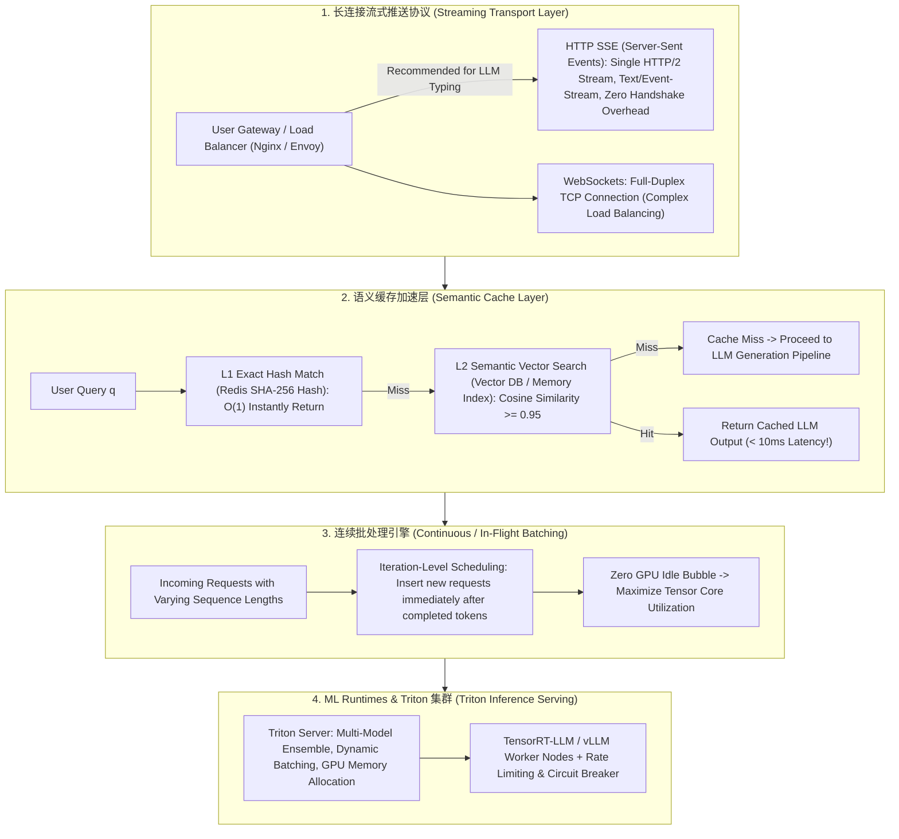

# 🌐 高并发 AI 系统设计全景：SSE 流式打字机推送、语义缓存 (Semantic Cache) 与 ML Runtimes

> **核心摘要**：传统的 Web 系统处理的是毫秒级响应的轻量 HTTP 请求，而 AI 大模型服务单次生成可能长达数秒乃至数分钟。**高并发 AI 系统设计**必须解决流式长连接推送、GPU 计算资源的高效批处理、语义缓存加速以及突发流量下的熔断限流。本指南系统解构 HTTP SSE 打字机长连接、Semantic Cache 两级缓存、vLLM Continuous Batching 连续批处理以及 Triton Inference Server 生产集群部署。

---

## 💡 交互式 Mermaid 架构流程图



---

## 💡 经典面试追问与考点速查

* **考点 1**：对比 HTTP SSE (Server-Sent Events)、WebSocket 与 gRPC 在 AI 打字机流式输出场景下的架构优缺点？为什么 SSE 是 ChatGPT 的首选？
  * *标准回答*：
    * **HTTP SSE (Server-Sent Events)**：基于标准 HTTP/1.1 与 HTTP/2 的单向长连接 (`Content-Type: text/event-stream`)。**优点**：轻量级，原生天然穿透所有防火墙和 Nginx 反向代理，客户端无需引入复杂 SDK (`EventSource` 原生支持)，断线自动重连；**缺点**：仅支持服务端到客户端单向推送；
    * **WebSocket**：双向全重协议。适合游戏或实时双向语音，但对于 LLM “单向文本打字机” 而言握手繁重，且对 Envoy / Nginx 的负载均衡配置复杂度高；
    * **gRPC Streaming**：适合内部微服务之间 (Service-to-Service) 的高性能低延迟传输。前端浏览器直接交互首选 **SSE**！
> 💡 **直观理解**：SSE 像"单向广播电台"——服务器开一条 HTTP 长连接持续播音，浏览器自带收音机（原生 `EventSource`）；WebSocket 是"双向对讲机"；gRPC 是"内部电话专线"。LLM 打字机只需要服务器→浏览器单向播报，用最轻的 SSE 正好，没必要为用不上的双向能力付出握手与代理配置的代价。
>
> 🎤 **面试速答**："结论：ChatGPT 式打字机输出首选 HTTP SSE。原理：SSE 是 HTTP/1.1 或 HTTP/2 上的单向长连接（text/event-stream），复用标准 Web 基础设施，天然穿透防火墙与 Nginx/Envoy，浏览器 EventSource 原生支持、断线自动重连。例子：一次 SSE 连接没有额外握手，而 WebSocket 要 TCP 升级握手 + 粘性会话，双向能力在纯下行流场景里完全浪费。"

* **考点 2**：详细解构语义缓存 (Semantic Cache) 的两级查找流程：精确 Hash 匹配与向量相似度阈值判定？如何解决缓存过污染与时效性失效问题？
  * *标准回答*：
    * **L1 精确匹配 (Exact Match)**：对 Normalize 后的 Query 文本计算 SHA-256 哈希，在 Redis 哈希表中查找。命中时间 $< 1\text{ms}$；
    * **L2 语义向量匹配 (Semantic Vector Match)**：若 L1 未命中，生成 Query Embedding，去向量库中检索 Nearest Neighbor。当余弦相似度 $S_{\text{cosine}} \ge \tau$（通常 $\tau = 0.95$）时判定命中，直接返回缓存回答，将耗时从 3000ms 压缩至 10ms！
    * **防污染与失效机制**：对包含时间敏感词（如“今天”、“最新股票”）的 Query 禁用语义缓存；设置 TTL（如 24 小时自动过期）防止陈旧答复沉淀。
> 💡 **直观理解**：两级缓存就像图书馆：先翻借阅卡（精确哈希，O(1) 秒查），查不到再让检索员比对手抄本（向量相似度）。0.95 阈值的意思是"换两个同义词也算同一个问题"，L1 管完全相同的请求，L2 管"差不多"的请求，两关都过才放行去调 LLM。
>
> 🎤 **面试速答**："结论：语义缓存能把回答延迟从 ~3000ms 压到 <10ms，命中判断用余弦相似度 ≥ 0.95。原理：L1 SHA-256 精确哈希命中直接返回；miss 后 L2 用 Query Embedding 做向量检索，相似度达标才算命中。例子：热门 FAQ 或相同 System Prompt 场景命中率常超 30%；每命中一次就省掉一整次 70B 模型前向——同时用 TTL=24h 和'时间敏感词禁用'防污染。"

* **考点 3**：剖析 Continuous Batching (连续/动态批处理) 相比传统 Static Batching 的核心区别？如何解决 Prompt 长度不同导致的 GPU 空等问题？
  * *标准回答*：
    * **Static Batching 缺点**：必须等待 Batch 中最长的那个请求生成完毕才能结束，短请求生成完后必须空等 (Padding 显存与计算浪费)；
    * **Continuous Batching (In-Flight Batching)**：以 **Iteration (单 Step 生成)** 为调度粒度。一旦 Batch 中某个 Request 输出了 `<EOS>` 标记退出，调度器在下一个 Step **立即将新的待处理 Request 插入该 Batch 空缺**。消除了 GPU 闲置气泡，吞吐量提升 200%~400%！
> 💡 **直观理解**：Static Batching 像"整班车一起发车、必须等最慢的乘客到站才收班"——短请求先到也只能空等，位置被 Padding 占死；Continuous Batching 像"地铁每站都能上人下客"，一个请求生成完立刻有新人补位，GPU 每一轮迭代都在满员运行。
>
> 🎤 **面试速答**："结论：Continuous Batching 让吞吐量提升 200%~400%。原理：调度粒度从'整个请求'细化到'单次迭代（一个 token）'，请求生成完立刻释放计算槽位给新请求，消除 padding 与空等。举个例子：64 个并发请求、生成长度 128~512 分布不一时，Static Batching 的 GPU 利用率可能不到 30%，vLLM/TensorRT-LLM 连续批处理可稳定拉到 80%+——这是推理服务吞吐的核心杠杆。"

* **考点 4**：如何使用 Triton Inference Server 搭建支持多模型 Pipeline 编排 (Ensemble Model) 与 GPU 动态负载均衡的高可用推理集群？
  * *标准回答*：
    * **Ensemble Scheduler**：Triton 支持将输入解析、Pre-processing (如 Tokenization)、Model Core Inference 与 Post-processing 编排为一条 Directed Acyclic Graph (DAG) Pipeline；
    * **Dynamic Batching & Multi-GPU 实例**：Triton 能够在后台线程将并发请求聚合成 Dynamic Batch，并在多卡之间根据 GPU Memory 和 Queue Backlog 自动做 Load Balancing。
> 💡 **直观理解**：Triton 像"食堂配餐流水线"：Ensemble 就是把洗菜（tokenize）、炒菜（模型推理）、装盘（post-process）编排成一条 DAG 流水线；Dynamic Batching 是前台把同一时间段下的单集中起来一次做，多卡负载均衡是哪个窗口排队短就多派单。
>
> 🎤 **面试速答**："结论：Triton 用 Ensemble Scheduler 把预处理→模型推理→后处理编排成 DAG Pipeline，并自动做 Dynamic Batching 与多 GPU 负载均衡。原理：后台线程把并发请求聚合成批，按 GPU 显存余量与队列积压分派。例子：生产上常用 Triton 编排 tokenizer → TensorRT-LLM/vLLM 引擎 → 输出校验，一个集群同时服务 3~5 个模型，单请求延迟抖动明显低于裸引擎部署。"

* **考点 5**：当系统遭受突发流量冲击 (如每秒 10,000 QPS) 时，AI Serving 层的降级、限流 (Leaky Bucket / Token Bucket) 与队列排队策略应该如何设计？
  * *Standard Answer*：
    * **入口限流 (Rate Limiting)**：在 API Gateway (Envoy/Kong) 使用 **Token Bucket (令牌桶) 算法** 限制客户端 QPS；
    * **排队与超时丢弃 (Priority Queue & TTL)**：将无法立即处理的请求送入 Redis / RabbitMQ 优先级队列。若请求在队列中排队时间超过客户端 timeout (如 10s)，直接在队列中丢弃，防止无效计算累积；
    * **优雅降级 (Degradation)**：极端情况下，自动将重型 Target Model (如 70B) 切换路由至轻量级 Quantized / Speculative 引擎或返回静态 Backup 提示。
> 💡 **直观理解**：突发流量下的四层防线像一场演唱会：令牌桶是"门口发门票"（每秒固定发 N 张），队列是"候场大厅"（超过的就等着），TTL 是"过号作废"（等太久直接弃号），降级是"临时改演精简版"（大模型换小模型）。每一层都在用最廉价的成本把压力挡在 GPU 之外。
>
> 🎤 **面试速答**："结论：10k QPS 突刺用四层防线：令牌桶限流 → 优先级队列 + TTL 丢弃 → 熔断 → 模型降级。原理：网关限流把并发压到 GPU 能消化的水位，队列缓冲毛刺，超时请求直接丢弃避免无效计算堆积，最后降级保底。举个例子：网关限 2000 QPS，超出的进 Redis 队列排队上限 10s，再超就丢弃；70B 主模型过载时自动切到 8B 量化引擎，保证核心链路 P99 不崩溃。"

---

## 📚 第一章：流式通信协议对比矩阵

| 协议 / 技术 | 传输方向 | 协议基础 | 负载均衡复杂度 | 客户端复杂度 | 适用场景 |
| :--- | :--- | :--- | :--- | :--- | :--- |
| **HTTP SSE** | 单向 (Server $	o$ Client)| HTTP/1.1 or HTTP/2 | **极低 (标准 HTTP)** | **极低 (Browser Native)**| **LLM 文本打字机推送 (ChatGPT 首选)**|
| **WebSocket** | 全双向 (Bi-directional) | TCP Upgrade | 高 (需要 Sticky Sessions)| 中等 | 实时双向语音 / 聊天室 / 游戏 |
| **gRPC Stream**| 双向 / 单向 | HTTP/2 (Protobuf) | 中等 (需要 Envoy gRPC) | 高 (需 Protobuf 编译) | 微服务间后端 RPC 高速通信 |

> **怎么读这张表**：重点对比"负载均衡复杂度"和"客户端复杂度"两列——SSE 两列都是最低，这就是它在 LLM 打字机场景胜出的关键：一个标准 HTTP 连接就能跑。注意"方向"列：WebSocket 的双向能力是靠 TCP 升级握手 + 粘性会话换来的，而打字机只需要服务器→客户端单向，所以复杂度高的双向协议在 AI 流式场景是过度设计。

---

## ⚡ 第二章：语义缓存相似度判定公式

**一句话直觉**：命中判断是一个"或"逻辑：要么精确哈希直接命中（同一句话），要么向量相似度足够高（差不多的一句话）——两步都 miss 才真正调用 LLM，把昂贵的 GPU 前向挡在最后一环。

$$\text{Hit} = \begin{cases} \text{True}, & \text{if } \text{ExactHash}(q) \in \text{Redis} \\ \text{True}, & \text{if } \max_{d \in \text{Cache}} \cos(E(q), E(d)) \ge 0.95 \\ \text{False}, & \text{otherwise} \end{cases}$$

> 💡 **直观理解**：这个分段函数就是缓存的两道闸门：第一道（精确哈希）是"原话照抄必中"，第二道（余弦 ≥ 0.95）是"换个说法也算中"。两道都放行后，LLM 才被调用——所以它本质上是把"是否调用大模型"的决策量化成一个可配置阈值的判定。
>
> 🎤 **面试速答**："结论：语义缓存命中 = 精确哈希命中 或 向量余弦相似度 ≥ 0.95。原理：L1 用 O(1) 哈希过滤完全相同的请求，L2 用 embedding 检索兜住近义改写，两级都 miss 才走 LLM。举个例子：阈值 0.95 时'帮我重置密码'和'我要改密码'大概率命中同一缓存，延迟从 3s 变 10ms；阈值调太高命中率骤降，调太低会返回驴唇不对马嘴的旧答案。"

---

## 🐍 第三章：Pure Numpy 手写 Semantic Cache 余弦阈值判定算子

```python
import numpy as np

class PureNumpySemanticCache:
    """ Pure Numpy 实现 Semantic Cache 余弦相似度阈值判定算子 """
    def __init__(self, threshold: float = 0.95):
        self.threshold = threshold
        self.cache_embeddings = []  # List of normalized vector embeddings
        self.cache_responses = []   # List of cached text responses
        
    def add(self, query_emb: np.ndarray, response: str):
        # L2 Normalization
        norm_emb = query_emb / np.linalg.norm(query_emb)
        self.cache_embeddings.append(norm_emb)
        self.cache_responses.append(response)
        
    def query(self, query_emb: np.ndarray) -> tuple:
        if not self.cache_embeddings:
            return False, None, 0.0
            
        norm_emb = query_emb / np.linalg.norm(query_emb)
        cache_matrix = np.array(self.cache_embeddings)  # shape (N, D)
        
        # 计算余弦相似度点积
        similarities = np.dot(cache_matrix, norm_emb)
        max_idx = int(np.argmax(similarities))
        max_sim = float(similarities[max_idx])
        
        if max_sim >= self.threshold:
            return True, self.cache_responses[max_idx], max_sim
        return False, None, max_sim

# ==================== 测试验证 ====================
if __name__ == "__main__":
    cache = PureNumpySemanticCache(threshold=0.95)
    
    # 存入历史 Query "How to reset my password?"
    vec_old = np.array([0.1, 0.8, 0.2, 0.5], dtype=np.float32)
    cache.add(vec_old, "To reset your password, click settings -> Security.")
    
    # 模拟新 Query "How do I reset my password?" (高度相似向量)
    vec_new = np.array([0.11, 0.79, 0.21, 0.49], dtype=np.float32)
    hit, resp, score = cache.query(vec_new)
    print("✅ 语义缓存查询结果 | Hit:", hit, "| Similarity Score:", round(score, 4), "| Response:", resp)
```

---

## 🚀 总结与工程最佳实践

1. **协议选型**：前端打字机输出一律采用 **HTTP SSE** 通信协议；
2. **高并发缓存**：部署 **Redis Hash + Vector DB** 组合的语义缓存，降低 GPU 压力；
3. **推理解算批处理**：推理引擎必须开启 **vLLM Continuous Batching** 连续批处理。