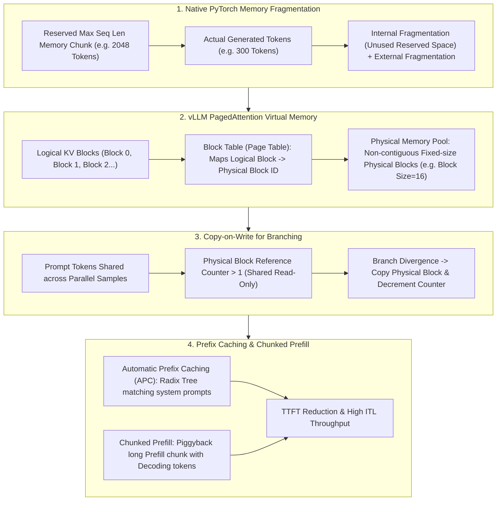

# 🌐 KV Cache Management: Exact Bounds Derivation, vLLM PagedAttention & Prefix Caching

> **Core Executive Summary**: Autoregressive LLM generation requires caching key-value states to eliminate $O(N^2)$ recomputation. However, **KV Cache** imposes immense GPU memory capacity and fragmentation bottlenecks. Contiguous memory allocation wastes 60%-80% of VRAM. Inspired by OS virtual memory, **vLLM PagedAttention** eliminates memory fragmentation. This guide derives exact memory bounds, page table mappings, Copy-on-Write, and Prefix Caching.

---

## 💡 Interactive Mermaid Architecture Flowchart



---

## 💡 Classic Interview Followups & Core Cheatsheet

* **Key Topic 1**: Derive KV Cache memory size for Llama-3-70B ($n_{\text{layers}}=80, n_{\text{kv\_heads}}=8, d_{\text{head}}=128$) at Batch Size=32, Seq Len=4096.
  * *Standard Answer*: $\text{Bytes}_{\text{KV}} = 2 \times 2 \times 80 \times 8 \times 128 \times 4096 \times 32 = 42,949,672,960 \text{ Bytes} \approx 40.00 \text{ GB}$. KV Cache consumes 40GB VRAM just for 32 active requests!
> 💡 **Intuition**: Memorize the two 2s: the first is "K and V, one copy each", the second is "FP16 = 2 bytes per element". The rest is a five-way product: layers x KV heads x head dim x sequence length x batch size. Analogy: every concurrent conversation carries a personal "chat history notebook" (KV); more concurrency and longer chats pile notebooks until they fill the room.
>
> 🎤 **Interview Answer**: "Bottom line: Llama-3-70B at batch=32, seq=4096 needs ~40GB of KV cache. Why: each token, each layer, each KV head stores 2 x 128 FP16 values, so Bytes = 2x2x n_layers x n_kv_heads x d_head x S x B. Example: 2x2x80x8x128x4096x32 ~ 42.9GB — half of an 80GB H100 eaten by cache alone, which is exactly why GQA (fewer KV heads) and PagedAttention (no fragmentation) are serving essentials."

* **Key Topic 2**: Why does native PyTorch cause 60%-80% KV Cache memory fragmentation? Analyze internal vs external fragmentation.
  * *Standard Answer*: Internal fragmentation occurs because pre-allocated contiguous arrays reserve max sequence length (e.g., 2048) while requests terminate early (e.g., 200 tokens). External fragmentation occurs as different request lifetimes leave small non-contiguous memory holes across VRAM.
> 💡 **Intuition**: Internal fragmentation = renting a whole building to use one floor — since generation length is unknowable, you reserve the max (2048). External fragmentation = the building gets chopped into tiny rooms — as requests start and finish at different times, a new big tenant finds no contiguous floor left and just stares at the holes.
>
> 🎤 **Interview Answer**: "Bottom line: native PyTorch pre-allocation wastes 60%-80% of KV cache VRAM. Why: reserving max_seq_len contiguous memory creates internal fragmentation (under-used space), while staggered request lifetimes create external fragmentation (no contiguous chunk available). Example: max_seq_len=2048 with only 200 generated tokens leaves 90% internal waste; vLLM's 16-token paging lifts memory utilization from ~30% to 96%+."

* **Key Topic 3**: Detail vLLM PagedAttention Block Table mapping and physical block allocation logic.
  * *Standard Answer*: Divides VRAM into a fixed-size Physical Memory Pool of blocks (e.g. 16 tokens/block). Logical request blocks map to arbitrary non-contiguous physical block IDs via a dynamic **Block Table**.
> 💡 **Intuition**: This is OS virtual memory, literally: logical blocks = process virtual address space, physical blocks = page frames, Block Table = page table. The memory pool is a warehouse of shelves — a "logically contiguous" book can be scattered across any free shelf, and the ledger (page table) tells you where each page lives. No physical contiguity required.
>
> 🎤 **Interview Answer**: "Bottom line: PagedAttention splits VRAM into fixed 16-token physical blocks and maps logical to physical via a Block Table — allocate on demand, zero fragmentation. Why: a request's logical block sequence maps to any free physical block; when a block fills up, grab a new one and update the table. Example: the naive approach reserves 2048-token contiguous space per request; paging allocates exactly what was generated, lifting utilization from ~30% to 96%+ — the foundation of vLLM's high-concurrency throughput."

* **Key Topic 4**: How does PagedAttention support Beam Search and Parallel Sampling using Copy-on-Write (CoW)?
  * *Standard Answer*: Parallel branches point to the same physical block with reference counter $> 1$. When a branch writes a new token, CoW clones only that 16-token physical block.
> 💡 **Intuition**: Branching generation is like a group of people reading the same page of the same book: they share the page first (reference count = how many readers remain), and only when someone wants to scribble a note does that person photocopy the page (CoW). The prefix is stored once; only post-divergence pages are privately owned.
>
> 🎤 **Interview Answer**: "Bottom line: Copy-on-Write lets Beam Search / Parallel Sampling share the prefix KV, saving 3-4x of duplicated memory. Why: branch block tables point to the same physical blocks with an incremented reference count; on write, only the modified 16-token block is cloned. Example: with beam=4 and a 512-token common prefix (32 blocks), all 4 branches share those 32 blocks and only diverge afterwards — without CoW you'd store 4 full copies of the prefix."

* **Key Topic 5**: Explain Chunked Prefill and Automatic Prefix Caching (APC) in reducing TTFT and improving token throughput.
  * *Standard Answer*: APC uses Radix Trees to cache system prompt KV states (90%+ TTFT reduction). Chunked Prefill slices long prefill tokens into chunks interleaved with decoding tokens to eliminate inter-token latency (ITL) spikes.
> 💡 **Intuition**: APC is "remembering the conversation background" — a repeated system prompt's KV is reused, never recomputed. Chunked Prefill is "breaking a huge truck into small packages that ride with the passenger buses" — a long prompt's prefill no longer blocks the whole road as one monolithic job, but threads in small chunks between decode requests so nobody starves.
>
> 🎤 **Interview Answer**: "Bottom line: APC caches common-prefix KV in a Radix Tree, cutting TTFT by 90%+; Chunked Prefill slices long prefills into ~512-token chunks batched with decode steps to remove ITL spikes. Why: requests sharing a prefix reuse cached KV instead of re-running prefill; chunking stops a long prefill from monopolizing the batch. Example: multi-turn chats that repeat a 2000-token system prompt drop first-token latency from ~2s to ~100ms when APC hits."

---

## 📚 Section 1: Memory Allocation Comparison Matrix

| Framework / Architecture | Physical Contiguity | VRAM Efficiency | Fragmentation | Parallel Branching | Representative |
| :--- | :--- | :--- | :--- | :--- | :--- |
| **Native PyTorch** | Mandatory Contiguous | Low (~20%-40%) | High (>60%) | Poor (Deep Copy) | HuggingFace Naive |
| **vLLM PagedAttention**| Non-contiguous (Paged)| **Highest (>96%)** | **Near 0** | **Native (CoW)** | **vLLM / SGLang** |
| **TensorRT-LLM** | Virtual Paging | Highest | Minimal | Supported | NVIDIA TensorRT-LLM |

> **How to read this table**: Compare the "VRAM Efficiency" and "Fragmentation" columns — the whole evolution from Native PyTorch to PagedAttention is dropping the "physically contiguous" obsession and trading a page table for utilization (30% -> 96%+). Also watch the "Parallel Branching" column: only paged designs support CoW natively; naive approaches need deep copies of whole KV spans. When asked "why can vLLM sustain such high concurrency", the answer lives in this table's efficiency column.

---

## ⚡ Section 2: KV Cache Byte Bounds Formula

**One-line intuition**: Two 2s and five multipliers: K and V each stored once, FP16 at 2 bytes per element, times layers x KV heads x head dim x sequence length x batch size — "how big is one chat-history notebook, and how many notebooks exist".

$$\text{Bytes}_{\text{KV}} = 2 \cdot 2 \cdot n_{\text{layers}} \cdot n_{\text{kv\_heads}} \cdot d_{\text{head}} \cdot S \cdot B$$

> 💡 **Intuition**: This formula is the foundation of all LLM serving capacity planning: compute the per-sequence KV cost, multiply by concurrency, and you get the VRAM budget. Note it grows linearly with sequence length and batch — so long context and high concurrency always hit the memory wall, which explains why GQA (fewer n_kv_heads) and quantization (2 bytes -> 1 byte) are serving standards.
>
> 🎤 **Interview Answer**: "Bottom line: KV cache bytes = 2x2x layers x KV heads x head dim x seq len x batch. Why: each token caches K and V copies of FP16 values per layer, and heads x head dim is the per-token dimension. Example: Llama-3-70B (80 layers, 8 KV heads, 128 dim) at batch=32, seq=4096 is 40GB — even if you forget the formula, remembering '2x2x80x8x128x4096x32' gets you to 40GB."

---

## 🐍 Section 3: Pure Numpy Handwritten PagedAttention Page Table Operator

```python
import numpy as np

class PureNumpyPagedAttentionPool:
    def __init__(self, num_physical_blocks: int = 10, block_size: int = 4):
        self.block_size = block_size
        self.k_pool = np.zeros((num_physical_blocks, block_size, 2, 8), dtype=np.float32)
        self.free_blocks = list(range(num_physical_blocks))
        
    def allocate(self) -> int:
        return self.free_blocks.pop(0)

if __name__ == "__main__":
    pool = PureNumpyPagedAttentionPool()
    blk = pool.allocate()
    print("✅ Allocated Physical Block ID:", blk)
```

---

## 🚀 Key Takeaways & Best Practices

1. **Inference Engine Standard**: Deploy LLM serving using **PagedAttention** (vLLM or TensorRT-LLM).
2. **Prefix Optimization**: Enable **Automatic Prefix Caching (APC)** for long system prompts.
3. **Capacity Sizing**: Pre-calculate KV Cache bounds to optimize GPU VRAM allocation.