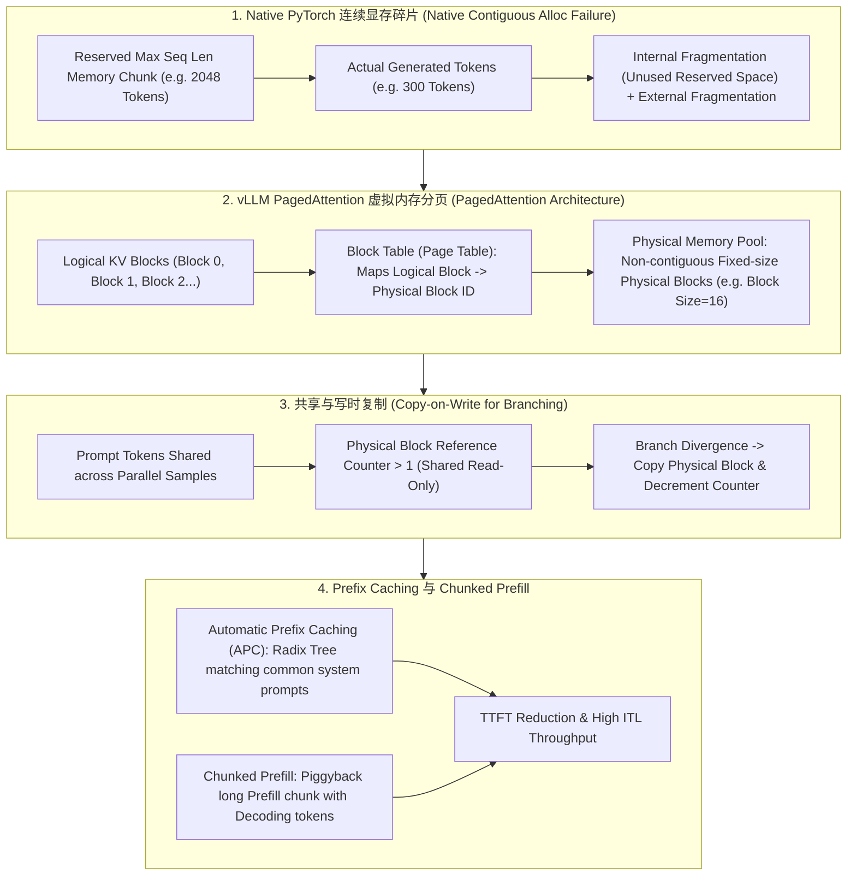

# 🌐 KV Cache 显存管理全景：内存碎片拟合推导、vLLM PagedAttention 虚拟内存与 Prefix Caching

> **核心摘要**：在 Transformer 自回归生成阶段，随着序列长度递增，重复计算历史 Key 和 Value 会带来巨额计算浪费。**KV Cache (键值缓存)** 通过空间换时间缓存历史 KV 张量，但带来了巨大的**显存容量与内存碎片瓶颈**。传统的连续显存预分配导致 60%~80% 的显存浪费。**vLLM PagedAttention** 借鉴操作系统虚拟内存分页技术，彻底解决了显存碎片化。本指南系统推导 KV Cache 容量公式、解构 PagedAttention 页表映射、写时复制与 Prefix Caching。

---

## 💡 交互式 Mermaid 架构流程图



---

## 💡 经典面试追问与考点速查

* **考点 1**：推导 Llama-3-70B ($n_{\text{layers}}=80, n_{\text{kv\_heads}}=8, d_{\text{head}}=128$) 在 Batch Size=32, Sequence Length=4096 时的 KV Cache 精确显存大小？
  * *标准回答*：
    * **通用 KV Cache 字节推导公式**（以 FP16 / BF16 为例，每 Element 占 2 Bytes）：
      $$\text{Bytes}_{\text{KV}} = 2 \times 2 \times n_{\text{layers}} \times n_{\text{kv\_heads}} \times d_{\text{head}} \times S \times B$$
    * **带入数值**：
      $$\text{Bytes}_{\text{KV}} = 2 \times 2 \times 80 \times 8 \times 128 \times 4096 \times 32$$
      $$\text{Bytes}_{\text{KV}} = 327,680 \times 131,072 = 42,949,672,960 \text{ Bytes} \approx 40.00 \text{ GB}!$$
    * **结论**：光是 32 个并发序列的 KV Cache 就占据了高达 **40GB 显存**！若不采用 GQA (Grouped-Query Attention) 与 PagedAttention，显存将迅速溢出 (OOM)。
> 💡 **直观理解**：公式里两个 2 的含义要背下来：第一个 2 是 K 和 V 各存一份，第二个 2 是 FP16 每个元素占 2 字节。剩下的就是"层数 × KV 头数 × 头维度 × 序列长 × 批大小"五连乘。类比：每个并发对话都要随身背一本"聊天记录本"（KV），并发越多、聊得越长，记录本堆满整间屋子。
>
> 🎤 **面试速答**："结论：Llama-3-70B 在 batch=32、seq_len=4096 时 KV cache 约 40GB。原理：每个 token、每层、每个 KV head 要存 2×128 个 FP16 数，所以 Bytes = 2×2×n_layers×n_kv_heads×d_head×S×B。举个例子：2×2×80×8×128×4096×32 ≈ 42.9GB——80GB 的 H100 一半被缓存吃掉，所以必须靠 GQA 砍 KV 头数、PagedAttention 砍碎片。"

* **考点 2**：原生 PyTorch 在处理长文本自回归生成时，为什么会导致高达 60%-80% 的显存浪费？剖析内部与外部碎片？
  * *标准回答*：
    * **内部碎片 (Internal Fragmentation)**：因为生成长度无法预知，系统不得不按最大可能长度 (如 `max_seq_len=2048`) 提前申请连续显存。若实际只生成了 200 个 Token，剩下的 1848 个 Token 空间的显存被闲置无法给他人使用；
    * **外部碎片 (External Fragmentation)**：由于不同 Request 启动与结束时间不同，频繁申请和释放不同尺寸的连续张量会导致显存被分割成大量不连续的小孔洞，无法满足新 Request 的连续大块显存请求。
> 💡 **直观理解**：内部碎片 = 租了一整栋楼只住一层——生成长度不可预知，只能按最大可能长度（2048）整栋租下；外部碎片 = 大楼被拆成一间间小房——请求交错启停，再来一个大租户发现整层楼都被小房间占满了，只能干瞪眼。
>
> 🎤 **面试速答**："结论：原生 PyTorch 预分配策略造成 60%~80% 的 KV 显存浪费。原理：按 max_seq_len 一次性预留连续内存产生内部碎片（用不满），请求交错启停产生外部碎片（拼不出连续大块）。举个例子：max_seq_len=2048 但实际只生成 200 token 时，内部碎片高达 90%；vLLM 改成 16-token 一页后，内存利用率从 ~30% 提到 96% 以上。"

* **考点 3**：详细解构 vLLM 中 PagedAttention 的 Block Table (页表) 映射流程与物理 Page 分配逻辑？
  * *标准回答*：
    * **物理块划分 (Physical Blocks)**：vLLM 在 GPU 显存中预先划出一块大内存池，切分为固定大小的 Block (例如每个 Block 包含 16 个 Token 的 KV 缓存)；
    * **逻辑块与页表 (Block Table)**：每个 Request 拥有自己的逻辑块序列 (Logical Block 0, 1, 2...)。通过维护一张 **Block Table**，将逻辑块映射到内存池中**任意非连续**的 Physical Block ID；
    * **解码过程**：生成新 Token 时，若当前 Physical Block 未满（未满 16 个），直接追加；若已满，则从 Physical Pool 申请一个新的 Block ID 并更新 Block Table。零显存浪费！
> 💡 **直观理解**：这就是操作系统虚拟内存的翻版：逻辑块 = 进程的虚拟地址空间，物理块 = 物理页框，Block Table = 页表。显存池像仓库货架，"逻辑上连续"的一本书可以散放在任意空货架上，靠台账（页表）一查就知道每页放哪——不再要求物理上整块连续。
>
> 🎤 **面试速答**："结论：PagedAttention 把显存切成固定大小（16 token）的物理块，用 Block Table 维护逻辑→物理映射，按需分配、零碎片。原理：每个请求的逻辑块序列映射到任意空闲物理块，写满一块就申请新块并更新页表。举个例子：传统方式要为每个请求预留 2048-token 的连续空间，分页后生成多少占多少，显存利用率从 30% 上下直接拉到 96%+——这也是 vLLM 高并发吞吐的根基。"

* **考点 4**：PagedAttention 如何通过 Copy-on-Write (写时复制) 机制高效支持 Beam Search 和 Parallel Sampling 多分支生成？
  * *Standard Answer*：在 Beam Search 或 Parallel Sampling 中，多个分支共享相同的 Prompt 前缀。PagedAttention 让所有分支的逻辑 Block Table 共同指向**同一个物理 Block**，并将该物理 Block 的引用计数 (Reference Count) 加 1。当某个分支生成新 Token 需要修改该 Block 时，触发 **Copy-on-Write (CoW)**，仅复制该 16-Token 的物理块，极大节省显存。
> 💡 **直观理解**：多分支生成就像一群人共读同一本书的同一页：先共享着读（引用计数 = 还有几个人在读这页），只有当某人要动笔写批注时才去复印那一页（CoW）。这样前缀只存一份，只有分歧之后的页各自持有。
>
> 🎤 **面试速答**："结论：Copy-on-Write 让 Beam Search / Parallel Sampling 共享前缀 KV，省掉 3~4 倍的重复显存。原理：分支的 Block Table 指向同一物理块并递增引用计数，需要写入时才复制被修改的那一个 16-token 块。举个例子：beam=4、公共前缀 512 token（32 个块）时，4 个分支共享这 32 个块，只有分歧后的块各自持有；不用 CoW 就得存 4 份完整前缀。"

* **考点 5**：Chunked Prefill (块状预填充) 与 Automatic Prefix Caching (APC) 如何降低首 Token 延迟 (TTFT) 并提升 Token 吞吐率 (ITL)？
  * *Standard Answer*：
    * **Automatic Prefix Caching (APC)**：利用 Radix Tree 对系统 Prompt 的 KV Cache 进行哈希缓存。后续命中相同 Prompt 的请求直接复用 KV Cache，将 **TTFT (Time to First Token) 降低 90%+**；
    * **Chunked Prefill**：长文本 Prefill 阶段计算量极大，会导致正在解码的请求停顿 (ITL 抖动)。将长 Prefill 切分为小 Chunk (如 512 tokens)，与 Decode 步交错 (Piggyback) 批处理，实现了高 throughput 与低抖动平衡。
> 💡 **直观理解**：APC 像"记住上次聊天的背景"——同一个 System Prompt 的 KV 直接复用，不必重算；Chunked Prefill 像"把大货车拆成小件跟客车混跑"——一个长 Prompt 的预填充不再是'堵死整条路'的大块任务，而是切成小块穿插在解码请求之间，谁都不会被饿死。
>
> 🎤 **面试速答**："结论：APC 用 Radix Tree 缓存公共前缀 KV，TTFT 可降 90%+；Chunked Prefill 把长 Prefill 切成 512-token 的块与 Decode 步同批交错，消除 ITL 抖动。原理：命中相同前缀的请求直接复用缓存 KV，不用重跑 prefill；分块后长 prefill 不再独占整批算力。举个例子：多轮对话每轮都带 2000-token 系统提示，命中 APC 后首 token 延迟从约 2s 降到 100ms 量级。"

---

## 📚 第一章：KV Cache 显存分配架构对比矩阵

| 架构 / 方案 | 内存连续性要求 | 内存利用率 | 碎片率 (Fragmentation) | 多分支共享支持 | 行业代表 |
| :--- | :--- | :--- | :--- | :--- | :--- |
| **Native PyTorch** | 必须物理连续 | 极低 (~20%-40%) | 极高 (>60% 内部+外部) | 困难 (需深拷贝) | HuggingFace naive |
| **vLLM PagedAttention**| 非连续 (固定 Block)| **极高 (>96%)** | **接近 0 (仅尾块余量)** | **原生支持 (CoW 引用计数)**| **vLLM / SGLang** |
| **TensorRT-LLM** | 虚拟页表 / 内存池| 极高 | 极低 | 支持 | NVIDIA TensorRT-LLM |
| **LMDeploy** | Block Allocator | 高 | 低 | 支持 | OpenMMLab LMDeploy |

> **怎么读这张表**：横向对比"内存利用率"和"碎片率"两列——从 Native PyTorch 到 PagedAttention 的演进核心，就是放弃"物理连续"这个执念，用页表换利用率（30% → 96%+）。再注意"多分支共享支持"列：只有分页式方案原生支持 CoW，传统方案要多分支只能深拷贝整段 KV。面试常问"为什么 vLLM 能开很高的并发"——答案就在这张表的利用率列。

---

## ⚡ 第二章：KV Cache 容量计算公式

**一句话直觉**：四个 2 和五个乘数：K/V 各一份、FP16 每元素 2 字节，再乘以层数、KV 头数、头维度、序列长、批大小——"每一份聊天记录有多大、有多少份"。

$$\text{Bytes}_{\text{KV}} = 2 \cdot 2 \cdot n_{\text{layers}} \cdot n_{\text{kv\_heads}} \cdot d_{\text{head}} \cdot S \cdot B$$

> 💡 **直观理解**：这个公式是所有 LLM 服务容量规划的地基：先按公式算出一个序列的 KV 开销，再乘并发数就知道显存预算。注意它随序列长度和 batch 线性增长——所以长上下文和大会话数必然撞上显存墙，这也解释了为什么 GQA（砍 n_kv_heads）和量化（把 2 字节变 1 字节）是推理标配。
>
> 🎤 **面试速答**："结论：KV cache 字节数 = 2×2×层数×KV头数×头维度×序列长×批大小。原理：每层每 token 要缓存 K 和 V 两份 FP16 值，头数乘以头维度就是单 token 的维度。举个例子：Llama-3-70B（80 层、8 KV 头、128 维）在 batch=32、seq=4096 时是 40GB——记不住公式时记住'2×2×80×8×128×4096×32'这串数也能算出 40GB。"

---

## 🐍 第三章：Pure Numpy 手写 PagedAttention 页表映射与 KV 读写算子

```python
import numpy as np

class PureNumpyPagedAttentionPool:
    """ Pure Numpy 实现 vLLM PagedAttention 物理块内存池与逻辑页表映射算子 """
    def __init__(self, num_physical_blocks: int, block_size: int, num_heads: int, head_dim: int):
        self.block_size = block_size  # 每个 Physical Block 容纳的 Token 数 (如 16)
        self.num_heads = num_heads
        self.head_dim = head_dim
        
        # 物理显存池 (Physical Pool): shape (Num_Blocks, Block_Size, Num_Heads, Head_Dim)
        self.k_pool = np.zeros((num_physical_blocks, block_size, num_heads, head_dim), dtype=np.float32)
        self.v_pool = np.zeros((num_physical_blocks, block_size, num_heads, head_dim), dtype=np.float32)
        
        # 空闲块队列与引用计数
        self.free_blocks = list(range(num_physical_blocks))
        self.ref_counts = {i: 0 for i in range(num_physical_blocks)}
        
    def allocate_block(self) -> int:
        if not self.free_blocks:
            raise MemoryError("Out of GPU Memory Physical Blocks!")
        block_id = self.free_blocks.pop(0)
        self.ref_counts[block_id] = 1
        return block_id

    def write_kv(self, block_table: list, token_idx: int, k_val: np.ndarray, v_val: np.ndarray):
        """
        根据逻辑 token_idx 查页表写入 KV Cache
        """
        logical_block_idx = token_idx // self.block_size
        block_offset = token_idx % self.block_size
        
        physical_block_id = block_table[logical_block_idx]
        self.k_pool[physical_block_id, block_offset] = k_val
        self.v_pool[physical_block_id, block_offset] = v_val

# ==================== 测试验证 ====================
if __name__ == "__main__":
    pool = PureNumpyPagedAttentionPool(num_physical_blocks=10, block_size=4, num_heads=2, head_dim=8)
    
    # 模拟分配 2 个物理块给 Request 1
    block_table_req1 = [pool.allocate_block(), pool.allocate_block()]
    
    # 写入 Token 5 (处于 Logical Block 1, offset 1)
    mock_k = np.ones((2, 8), dtype=np.float32) * 3.14
    mock_v = np.ones((2, 8), dtype=np.float32) * 2.71
    pool.write_kv(block_table_req1, token_idx=5, k_val=mock_k, v_val=mock_v)
    
    phys_id = block_table_req1[1]
    print("✅ PagedAttention 物理块 1 Offset 1 写入成功！矩阵均值:", np.mean(pool.k_pool[phys_id, 1]))
```

---

## 🚀 总结与工程最佳实践

1. **推理解算标配**：生产环境部署大模型务必采用基于 **PagedAttention** 的引擎（如 **vLLM** 或 **TensorRT-LLM**）；
2. **长文本 Prefix 优化**：开启 **Automatic Prefix Caching** 可大幅提升长 Prompt 与多轮对话的响应速度；
3. **显存预算估算**：部署前使用公式提前规划并发 Batch Size 下的 KV Cache 显存配额。