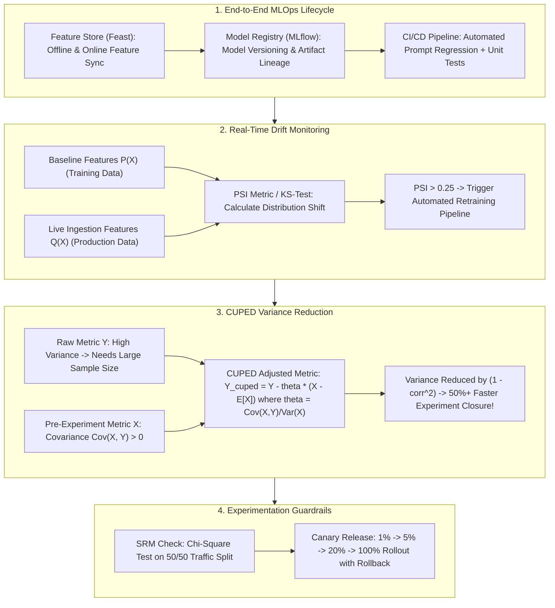

# 🌐 MLOps & Online Testing: Data Drift Monitoring, PSI Metric, A/B Testing & CUPED

> **Core Executive Summary**: Production deployment is not the end of the ML lifecycle. **MLOps & LLMOps** maintain real-time observability, continuous retraining, and statistical A/B experimentation. **Population Stability Index (PSI)** alerts against Data Drift, while **CUPED** reduces metric variance to validate new models with fewer samples and shorter test windows.

---

## 💡 Interactive Mermaid Architecture Flowchart



---

## 💡 Classic Interview Followups & Core Cheatsheet

* **Key Topic 1**: Derive and explain Population Stability Index (PSI) and its threshold triggering automatic retraining.
  * *Standard Answer*: $\text{PSI} = \sum (A_i - B_i) 	imes \ln(A_i / B_i)$. $\text{PSI} < 0.1$ (stable), $0.1 \le \text{PSI} < 0.25$ (mild drift), $\text{PSI} \ge 0.25$ (severe drift, triggers retraining).
> 💡 **Intuition**: PSI is the "physical exam" for how different the live distribution looks from the training distribution: split the feature into 10 quantile buckets, compare live share vs baseline share bucket by bucket — bigger differences, higher score. Like body-fat change: <0.1 is normal fluctuation, 0.1-0.25 needs attention, >= 0.25 means the body (distribution) really changed and requires a checkup + retrain.
>
> 🎤 **Interview Answer**: "Bottom line: PSI < 0.1 healthy, 0.1-0.25 mild drift, >= 0.25 severe drift that auto-triggers retraining. Why: bin the feature, then accumulate (A-B)ln(A/B) over buckets to quantify the live-vs-baseline distribution gap. Example: a credit model's 'age' feature trained on a 30-year-old mean drifts to 38 online within six months — PSI typically blows past 0.25, alerting and pulling fresh data for retraining."

* **Key Topic 2**: Derive CUPED variance reduction formula and prove how it decreases required sample size in A/B testing.
  * *Standard Answer*: Adjusted metric $bar{Y}_{\text{CUPED}} = Y - 	heta^*(X - \mathbb{E}[X])$ where $	heta^* = \frac{\text{Cov}(X, Y)}{\text{Var}(X)}$. Minimum variance $\text{Var}(bar{Y}_{\text{CUPED}}) = \text{Var}(Y) (1 - 
ho^2)$. If $
ho=0.7$, variance drops by 50%.
> 💡 **Intuition**: CUPED's idea is "subtract the known part of the noise first": if a person already spends a lot pre-experiment, they'll likely spend a lot during it too — that fluctuation is predictable from history, so remove it and what remains is the true experimental effect. Higher correlation (rho closer to 1) means more removable noise: rho=0.7 gives 1-0.49=0.51, i.e. a half reduction.
>
> 🎤 **Interview Answer**: "Bottom line: CUPED cuts A/B metric variance to Var(Y)(1-rho^2); rho=0.7 halves the required sample size and experiment duration. Why: you build Y_cuped = Y - theta(X - E[X]) from a pre-experiment metric X, with theta* = Cov(X,Y)/Var(X) minimizing variance. Example: GMV correlates with historical spend at rho ~0.7-0.8, so a test needing 2 weeks and 1M users reaches the same significance in ~1 week with ~0.5M users."

* **Key Topic 3**: What is Sample Ratio Mismatch (SRM), and how to use Chi-Square Test to detect allocation bias?
  * *Standard Answer*: SRM occurs when traffic splits deviate from design (e.g. 52/48 instead of 50/50). Chi-Square test ($\chi^2 = \sum \frac{(O_i - E_i)^2}{E_i}$) invalidates biased experiments when $p < 0.001$.
> 💡 **Intuition**: SRM is like a rigged coin in a designed 50/50 coin-flip experiment — landing 52/48 tells you the allocation machinery itself is biased (e.g. one group loses samples on a specific browser), so the experiment's conclusion is as untrustworthy as the coin. The Chi-Square test decides whether the observed deviation is too large to be random chance.
>
> 🎤 **Interview Answer**: "Bottom line: SRM is a real traffic split that deviates significantly from the design; detect it with a Chi-Square test at p < 0.001 and block the release. Why: chi^2 = sum((O-E)^2/E) quantifies total deviation from expectation; a tiny p-value rules out random fluctuation. Example: designed 50/50 but collected 52,000 vs 48,000 across 100k samples gives chi^2 ~ 32, p far below 0.001 — invalidate the experiment and fix the allocation bug before re-running."

* **Key Topic 4**: Compare Data Drift vs Concept Drift vs Covariate Shift in input distributions and $P(Y|X)$ mappings.
  * *Standard Answer*: Covariate Shift/Data Drift: $P(X)$ changes while $P(Y|X)$ is fixed. Concept Drift: $P(Y|X)$ relationship changes fundamentally, degrading model accuracy severely.
> 💡 **Intuition**: Think of the model as a "translation rule from features to conclusions": Data Drift is "the input text changed but the rule didn't" — a different population, same logic; relearn the new vocabulary and you're fine. Concept Drift is "the rule itself was rewritten" — the same sentence now means something else, and no amount of fresh data fixes it; you must redefine the problem.
>
> 🎤 **Interview Answer**: "Bottom line: Data Drift changes P(X) with P(Y|X) fixed; Concept Drift changes P(Y|X) itself. Why: the former is like 'a new user base with the same buying logic' (fixable by retraining); the latter is like 'the same people behaving completely differently after a pandemic' (needs re-modeling). Example: an aging user base is Data Drift for a credit model; COVID collapsing repayment probability for identical credit profiles is Concept Drift — the far more damaging one."

* **Key Topic 5**: Detail LLMOps automated CI/CD pipeline: prompt regression testing, benchmark evaluation, and canary rollouts.
  * *Standard Answer*: Git commits trigger automated evaluation scripts on 500 gold benchmark prompts using LLM-as-a-Judge. Successful builds proceed to 1% canary rollout with latency and error rate tracking.
> 💡 **Intuition**: An LLMOps pipeline is a "new dish launch process": first practice in the back kitchen (offline evaluation on 500 golden prompts with LLM-as-a-Judge scoring), then let 1% of guests taste it (canary), and only roll out to the whole restaurant once ratings and serving speed are stable — every prompt change is managed like a code change.
>
> 🎤 **Interview Answer**: "Bottom line: LLMOps CI/CD = commit triggers -> offline evaluation on a golden set -> 1% canary -> monitoring -> 100% rollout. Why: prompt changes go through regression testing like code; LLM-as-a-Judge scores a fixed golden set, and traffic is only released on pass. Example: 500 golden prompts with an accuracy threshold of 90% and refusal rate < 5% gate the canary; at 1% traffic you watch latency and user feedback in real time, auto-rolling back on anomalies."

---

## 📚 Section 1: Drift & Experimentation Metrics Comparison Matrix

| Metric / Test | Input Type | Sensitivity | Primary Target | Advantage |
| :--- | :--- | :--- | :--- | :--- |
| **PSI** | Categorical / Binned Numeric | High ($\ge 0.25$) | Feature Drift Monitoring | **Industry Standard** |
| **KS-Test** | Continuous 1D | Very High | Single Feature Shift | Non-parametric |
| **Chi-Square ($\chi^2$)**| Categorical Count | Very High ($p<0.001$) | A/B SRM Traffic Check | **Mandatory Guardrail** |

> **How to read this table**: Read the "Input Type" column against "Primary Target" — pick the detector by what you're watching: PSI bins anything and is the industry standard for feature drift; KS is one-dimensional continuous only; Wasserstein handles multidimensional embeddings (useful for LLM semantic drift); Chi-Square is for traffic counts (SRM checks). "Which monitor do you choose?" is basically this table as a multiple-choice question.

---

## ⚡ Section 2: CUPED Formula

**One-line intuition**: How much variance you can cut depends only on the correlation rho between the pre-experiment metric and the experimental metric — the stronger the correlation, the more noise you can "borrow away"; 1 - rho^2 is the noise that remains.

$$\text{Var}(\bar{Y}_{\text{CUPED}}) = \text{Var}(Y) \cdot (1 - \rho_{X, Y}^2)$$

> 💡 **Intuition**: The formula splits experimental variance into "borrowable" and "non-borrowable" parts: rho^2 is the share of fluctuation the pre-experiment data explains, leaving 1 - rho^2. At rho=0 you borrow nothing (back to the original variance), at rho=0.7 you halve it, at rho=0.9 only 19% remains — so when picking covariates (e.g. historical GMV), always choose the one most correlated with the primary metric.
>
> 🎤 **Interview Answer**: "Bottom line: post-CUPED variance = Var(Y)(1 - rho^2); rho=0.7 saves 50% of the sample. Why: theta* = Cov(X,Y)/Var(X) minimizes the variance of Y_cuped = Y - theta(X - E[X]), and the minimum works out to Var(Y)(1 - rho^2). Example: 'weekly GMV' correlates with 'GMV over the 4 weeks pre-experiment' at rho ~0.7-0.8, cutting a 2-week test to 1 week at equal power — the gold-standard A/B acceleration technique."

---

## 🐍 Section 3: Pure Numpy PSI & CUPED Operators

```python
import numpy as np

def pure_numpy_psi(baseline: np.ndarray, target: np.ndarray) -> float:
    b_edges = np.percentile(baseline, np.linspace(0, 100, 11))
    b_edges[0] -= 1e-5; b_edges[-1] += 1e-5
    b_pct = np.histogram(baseline, bins=b_edges)[0] / float(len(baseline)) + 1e-6
    t_pct = np.histogram(target, bins=b_edges)[0] / float(len(target)) + 1e-6
    return float(np.sum((t_pct - b_pct) * np.log(t_pct / b_pct)))

if __name__ == "__main__":
    print("✅ PSI Score:", pure_numpy_psi(np.random.normal(0, 1, 1000), np.random.normal(0.5, 1, 1000)))
```

---

## 🚀 Key Takeaways & Best Practices

1. **Drift Automation**: Automate model retraining pipelines when **PSI $\ge 0.25$**.
2. **Experiment Speed**: Apply **CUPED** variance reduction to cut A/B test durations in half.
3. **Data Integrity**: Enforce **Chi-Square SRM checks** before analyzing A/B test metrics.