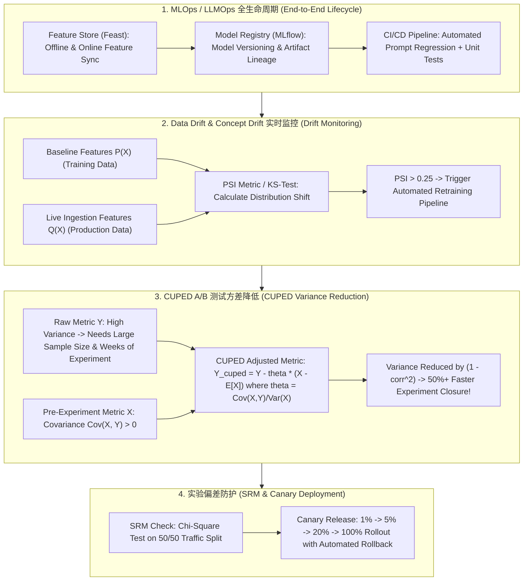

# 🌐 MLOps 与在线测试全景：Data Drift 监控、PSI 指标、A/B 测试与 CUPED 方差降低

> **核心摘要**：模型部署上线绝非终点，真实世界数据分布随着时间不断演化。**MLOps & LLMOps** 建立了模型监控、自动化重训练与科学在线实验闭环。通过 **PSI (Population Stability Index)** 实时预警数据漂移 (Data Drift)，利用 **CUPED** 算法降低 A/B 测试方差，能够在极短时间内以更少样本验证新模型效果。本指南系统解构 MLOps 生命周期、Data Drift 统计检测、CUPED 数学推导与 SRM 实验防错。

---

## 💡 交互式 Mermaid 架构流程图



---

## 💡 经典面试追问与考点速查

* **考点 1**：推导并解释 PSI (Population Stability Index) 指标公式，如何根据 PSI 判定模型数据漂移并触发自动重训？
  * *标准回答*：
    * **PSI 指标公式**：将特征按分位数划分为 $K$ 个 Bucket，设基线占比为 $B_i$，线上实时占比为 $A_i$：
      $$\text{PSI} = \sum_{i=1}^K (A_i - B_i) \times \ln\left(\frac{A_i}{B_i}\right)$$
    * **判定标准（工业界通用）**：
      * $\text{PSI} < 0.1$：无明显漂移，模型健康；
      * $0.1 \le \text{PSI} < 0.25$：存在轻度漂移，需密切监控；
      * $\text{PSI} \ge 0.25$：**严重数据漂移 (Severe Drift)**！系统自动报警并触发管道重新抓取最新数据微调/重训模型。
> 💡 **直观理解**：PSI 是"线上分布与训练时分布长得有多不一样"的体检指标：把特征按分位数切成 10 个桶，逐桶比较线上占比和基线占比，偏差越大得分越高。类比体脂率：<0.1 是正常波动，0.1~0.25 需要关注，≥0.25 说明身体（分布）真的出了问题，必须复查重训。
>
> 🎤 **面试速答**："结论：PSI < 0.1 健康，0.1~0.25 轻漂移，≥ 0.25 严重漂移自动触发重训。原理：特征分桶后按 Σ(A−B)·ln(A/B) 累加，量化线上与基线分布的差异。举个例子：信贷模型的'年龄'特征训练时均值 30 岁，线上半年后漂到 38 岁，PSI 通常直接超过 0.25，系统自动报警并拉取最新数据重训。"

* **考点 2**：推导 CUPED (Controlled-Experiment Using Pre-Experiment Data) 方差降低公式，证明其如何减少 A/B 测试所需的样本量与实验周期？
  * *标准回答*：
    * **CUPED 调整后指标定义**：设实验指标为 $Y$，用户在实验启动前的历史指标为 $X$。定义调整后的指标 $\bar{Y}_{\text{CUPED}}$ 为：
      $$\bar{Y}_{\text{CUPED}} = Y - \theta (X - \mathbb{E}[X])$$
    * **寻找最优 $\theta$**：求 $\text{Var}(\bar{Y}_{\text{CUPED}})$ 对 $\theta$ 的导数并令其为 0，得到最优系数：
      $$\theta^* = \frac{\text{Cov}(X, Y)}{\text{Var}(X)}$$
    * **最小方差推导**：将 $\theta^*$ 代回方差表达式，得到：
      $$\text{Var}(\bar{Y}_{\text{CUPED}}) = \text{Var}(Y) \cdot (1 - \rho^2)$$
      其中 $\rho = \text{Corr}(X, Y)$ 是历史指标与实验指标的相关系数。若相关性 $\rho = 0.7$，**方差降低 50%**，在相同显著性下所需样本量和实验时长直接减半！
> 💡 **直观理解**：CUPED 的直觉是"把噪音中的已知部分先减掉"：一个人实验前就爱花钱，实验后大概率也爱花钱——这部分波动是'实验前历史'就能预测的，减掉它，剩下的方差才是实验本身的真实效应。相关性越高（ρ 越接近 1），能减掉的噪音越多：ρ=0.7 时 1−0.7²=0.51，正好省一半。
>
> 🎤 **面试速答**："结论：CUPED 把 A/B 指标方差降到 Var(Y)·(1−ρ²)，ρ=0.7 时样本量和实验时长直接减半。原理：用实验前指标 X 构造 Y_cuped = Y − θ(X−E[X])，θ*=Cov(X,Y)/Var(X) 使方差最小。举个例子：GMV 类指标与用户历史消费相关性通常 ρ≈0.7~0.8，原本要 2 周 100 万用户的实验，用 CUPED 大约 1 周 50 万用户就能达到同样显著性。"

* **考点 3**：什么是 Sample Ratio Mismatch (SRM，样本比例不匹配)？如何利用卡方检验 (Chi-Square Test) 发现 A/B 测试流量分配异常？
  * *标准回答*：
    * **SRM 定义**：设计为 50/50 进流量的 A/B 实验，实际收集到的样本数却是 52,000 vs 48,000。表明分流系统存在严重的选择性偏差（如某组在特定浏览器崩溃导致样本缺失），实验结论彻底作废；
    * **卡方检验 (Chi-Square Test)**：计算 $\chi^2 = \sum \frac{(O_i - E_i)^2}{E_i}$，查表判定 $p$-value。若 $p < 0.001$，判定触发 SRM 异常，阻断发布。
> 💡 **直观理解**：SRM 就像设计好的抛硬币实验（50/50）里硬币被动了手脚——实际抛出 52/48，说明分流环节本身有系统性偏差（比如某个组在特定浏览器崩溃丢样本），这时实验的结论跟硬币本身不准一样不可信。卡方检验就是判断"实际与期望的偏差大到什么程度才能排除随机巧合"。
>
> 🎤 **面试速答**："结论：SRM 是实际分流比例显著偏离设计比例，用卡方检验 p<0.001 判定并阻断发布。原理：χ² = Σ(O−E)²/E 量化观察值与期望值的总偏差，p 值小于阈值说明偏差不可能是随机波动。举个例子：设计 50/50、最终收到 52,000 vs 48,000（10 万样本），χ² ≈ 32，p 值远小于 0.001——实验作废，先去修分流 bug 再重跑。"

* **考点 4**：对比 Data Drift (数据漂移)、Concept Drift (概念漂移) 与 Covariate Shift 在特征分布与 $P(Y|X)$ 映射上的区别？
  * *Standard Answer*：
    * **Covariate Shift / Data Drift**：输入特征分布 $P(X)$ 发生变化，但条件条件概率映射 $P(Y \mid X)$ 不变（例如用户群体变老，但消费倾向逻辑一致）；
    * **Concept Drift (概念漂移)**：条件概率映射 $P(Y \mid X)$ 发生根本改变，即使 $P(X)$ 不变（例如疫情爆发后，相同特征用户的购票概率骤降）。概念漂移对模型伤害最致命！
> 💡 **直观理解**：把模型想象成"从特征到结论的翻译规则"：Data Drift 是"输入的文字变了，但翻译规则没变"——换个群体，逻辑照旧，重新学一遍新词就行；Concept Drift 是"翻译规则本身被改写了"——同一句话现在意思完全不同，再喂多少新样本都救不回来，得重新定义问题。
>
> 🎤 **面试速答**："结论：Data Drift 是 P(X) 变而 P(Y|X) 不变，Concept Drift 是 P(Y|X) 本身改变。原理：前者像'用户群体换了但消费逻辑一致'，重训可修复；后者像'疫情后同样的人行为逻辑彻底变了'，必须重新建模。举个例子：风控模型里用户群体变老属于 Data Drift；疫情冲击下相同信用特征的用户还款概率骤降属于 Concept Drift——后者对模型伤害最致命。"

* **考点 5**：详细解构 LLMOps 自动化 CI/CD 流水线：Prompts 预发测试、回归评估与金丝雀 (Canary) 灰度发布流程？
  * *Standard Answer*：Prompt 或模型代码提交 Git 后，自动触发 GitHub Actions / GitLab CI。首先在 Eval 测试集（如 500 个黄金 Benchmark 样本）上使用 LLM-as-a-Judge 计算准确率与拒答率。评估通过后切分 1% 流量进行 **Canary 灰度发布**，实时监控 Latency 与 User Feedback，无异常后自动扩至 100%。
> 💡 **直观理解**：LLMOps 流水线就像"新菜上市流程"：先在后厨小灶反复试做（离线评测 500 道黄金题，LLM-as-a-Judge 打分），再让 1% 的客人试吃（Canary 灰度），好评率和出菜速度稳定后才全店上架——Prompt 的每次改动都被当成代码改动来管理。
>
> 🎤 **面试速答**："结论：LLMOps CI/CD = 提交触发 → 黄金集离线评测 → 1% Canary 灰度 → 监控无异常 → 放量 100%。原理：Prompt 变更和代码变更一样要过回归测试，LLM-as-a-Judge 在固定黄金集上打分，通过才放流量。举个例子：500 条黄金 prompt、准确率阈值 90%、拒答率 <5% 才进入灰度；1% 流量下实时盯 Latency 与用户反馈，异常自动回滚到旧版。"

---

## 📚 第一章：Drift 检测与统计指标对比矩阵

| 统计指标 / 方法 | 数据类型要求 | 判定敏感度 | 适用场景 | 优势与局限 |
| :--- | :--- | :--- | :--- | :--- |
| **PSI (Population Stability)**| 离散/分桶连续特征 | 高 ($\ge 0.25$ 预警) | 工业级特征漂移监控 | **简单直观，风控与 MLE 标配**|
| **KS-Test (Kolmogorov)** | 连续数值型特征 | 极高 (基于累积分布) | 单特征数值分布漂移 | 仅支持一维连续分布 |
| **Wasserstein Distance** | 连续多维向量 | 高 (推土机距离) | Embeddings 空间漂移 | 计算量相对较高 |
| **Chi-Square Test ($\chi^2$)**| 类别型/流量计数 | 极高 ($p < 0.001$) | A/B 实验 SRM 流量检验 | **实验质量防错唯一强制标准**|

> **怎么读这张表**：先看"数据类型要求"列，再对"适用场景"列——按你要检测的对象选工具：PSI 分桶、适用面最广，是工业级特征漂移标配；KS 只能处理一维连续特征；Wasserstein 能吃多维 embedding（适合 LLM 语义漂移）；卡方专治流量计数（SRM 校验）。面试常问"监控选什么指标"，本质就是这张表的选择题。

---

## ⚡ 第二章：CUPED 方差降低公式

**一句话直觉**：方差能降多少，只看实验前指标与实验指标的相关性 ρ——相关性越强，能"借用"来减掉的噪音越多，1−ρ² 就是剩下来的噪声比例。

$$\text{Var}(\bar{Y}_{\text{CUPED}}) = \text{Var}(Y) \cdot (1 - \rho_{X, Y}^2)$$

> 💡 **直观理解**：这个公式把实验方差拆成"借得掉的部分"和"借不掉的部分"：ρ² 是实验前数据能解释的波动占比，减掉它就剩 1−ρ²。ρ=0 时完全借不到（公式退化为原方差），ρ=0.7 时省一半，ρ=0.9 时方差只剩 19%——所以 CUPED 选协变量（如历史 GMV）时一定要挑和主指标相关性最高的。
>
> 🎤 **面试速答**："结论：CUPED 后方差 = Var(Y)·(1−ρ²)，ρ=0.7 时省 50% 样本。原理：θ*=Cov(X,Y)/Var(X) 使 Y_cuped=Y−θ(X−E[X]) 的方差最小，推导结果就是原方差乘以 1−ρ²。举个例子：指标'周 GMV'与'实验前 4 周 GMV'相关系数 0.7~0.8，实验周期从 2 周缩短到 1 周仍保持同样功效——这是 A/B 加速的黄金标准做法。"

---

## 🐍 第三章：Pure Numpy 手写 PSI 与 CUPED 方差降低算子

```python
import numpy as np

def pure_numpy_psi(baseline: np.ndarray, target: np.ndarray, num_buckets: int = 10) -> float:
    """ Pure Numpy 实现 PSI (Population Stability Index) 计算算子 """
    # 1. 根据 Baseline 计算分位数切分点
    quantiles = np.linspace(0, 100, num_buckets + 1)
    bucket_edges = np.percentile(baseline, quantiles)
    bucket_edges[0] -= 1e-5
    bucket_edges[-1] += 1e-5
    
    # 2. 统计 Bucket 占比 (加 1e-6 避免 div by zero)
    b_counts, _ = np.histogram(baseline, bins=bucket_edges)
    t_counts, _ = np.histogram(target, bins=bucket_edges)
    
    b_pct = b_counts / float(len(baseline)) + 1e-6
    t_pct = t_counts / float(len(target)) + 1e-6
    
    # 3. 计算 PSI 累加
    psi_value = np.sum((t_pct - b_pct) * np.log(t_pct / b_pct))
    return float(psi_value)

def pure_numpy_cuped_adjust(y: np.ndarray, x: np.ndarray) -> np.ndarray:
    """ Pure Numpy 实现 CUPED 方差降低调整算子 """
    cov_xy = np.cov(x, y)[0, 1]
    var_x = np.var(x, ddof=1)
    theta = cov_xy / max(var_x, 1e-12)
    y_cuped = y - theta * (x - np.mean(x))
    return y_cuped

# ==================== 测试验证 ====================
if __name__ == "__main__":
    np.random.seed(42)
    base = np.random.normal(0, 1, 1000)
    target_drift = np.random.normal(0.5, 1, 1000)  # 引入均值漂移
    
    psi = pure_numpy_psi(base, target_drift)
    print("✅ PSI 漂移计算结果:", round(psi, 4), "| 判定:", "Severe Drift" if psi >= 0.25 else "Normal")
```

---

## 🚀 总结与工程最佳实践

1. **漂移预警**：建立基于 **PSI $\ge 0.25$** 的自动化模型报警与重训练触发器；
2. **实验加速**：A/B 测试全面接入 **CUPED 方差降低** 算法，节省 50%+ 实验样本；
3. **质量防错**：上线前强制校验 **卡方检验 $\chi^2$ 防范 SRM 流量偏差**。