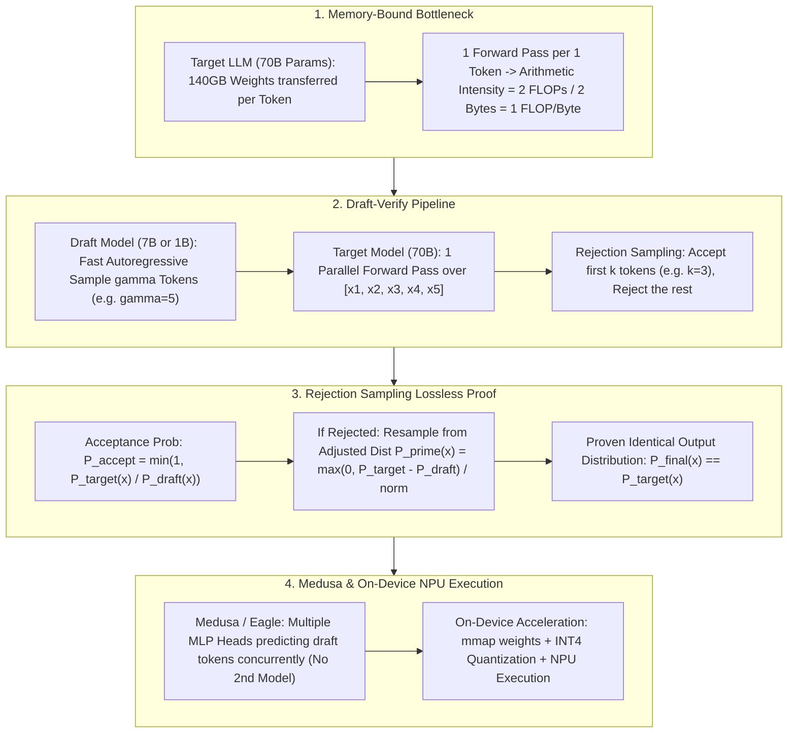

# 🌐 Speculative Decoding: Draft Model Sampling, Rejection Sampling & On-Device Acceleration

> **Core Executive Summary**: Autoregressive decoding generates tokens sequentially. Transferring gigabytes of model weights from GPU HBM for a single token yields an arithmetic intensity of just $O(1)$ FLOPs/Byte (Memory-Bound). **Speculative Decoding** uses a lightweight Draft Model to generate candidate tokens, verified by the Target Model in 1 parallel forward pass. **Rejection Sampling** ensures mathematically zero loss in output probability distribution while boosting speed by 2x-3x.

---

## 💡 Interactive Mermaid Architecture Flowchart



---

## 💡 Classic Interview Followups & Core Cheatsheet

* **Key Topic 1**: Why is LLM decoding memory-bound, and how does Speculative Decoding convert it to compute-bound?
  * *Standard Answer*: Decoding requires transferring 140GB VRAM (70B FP16) to generate 1 token ($approx 140G$ FLOPs), yielding 1 FLOP/Byte arithmetic intensity (<5% GPU utilization). Verifying $\gamma+1$ tokens in 1 forward pass converts vector-matrix ops into matrix-matrix ops ($(\gamma+1) \times D$), shifting execution to compute-bound.
> 💡 **Intuition**: Decoding streams all 140GB of weights from HBM onto the chip to compute just 1 token — an arithmetic intensity of 1 FLOP/Byte, like driving a 40-ton truck to deliver one parcel. Speculative decoding makes that same 140GB "shipping cost" verify gamma+1=6 tokens at once, multiplying intensity by ~6 — the truck finally runs full, which is exactly what turning Memory-Bound into Compute-Bound means.
>
> 🎤 **Interview Answer**: "Bottom line: decoding is classically memory-bound — 70B weights (140GB) are loaded per step to produce 1 token, under 1% compute utilization; speculative decoding verifies gamma+1 tokens in one forward pass, turning vector-by-matrix into matrix-by-matrix and multiplying arithmetic intensity. Example: on an H100 with gamma=5 and 80% acceptance you get ~4 tokens per step, i.e. 2-3x throughput for the same bandwidth cost — one of the highest-ROI serving optimizations."

* **Key Topic 2**: Derive and prove the modified Rejection Sampling formula guaranteeing mathematical zero-loss.
  * *Standard Answer*: Acceptance probability $P_{\text{accept}}(x) = \min(1, P_{\text{target}}(x) / P_{\text{draft}}(x))$. On rejection, resample from $P'(x) = \frac{\max(0, P_{\text{target}}(x) - P_{\text{draft}}(x))}{\sum \max(0, P_{\text{target}} - P_{\text{draft}})}$. The total probability matches $P_{\text{target}}(x)$ identically.
> 💡 **Intuition**: This is "intern drafts, boss approves": when the draft is more conservative than the target (P_draft >= P_target) accept outright; when it is overconfident, accept at the P_t/P_d ratio; rejections are rewritten by the boss sampling from the "difference distribution". Whichever path is taken, every final document is the boss's handwriting — so the output distribution is exactly the target's.
>
> 🎤 **Interview Answer**: "Bottom line: modified rejection sampling keeps the output distribution 100% identical to direct target sampling. Why: acceptance probability P_accept = min(1, P_t/P_d); on rejection, resample from P' proportional to max(0, P_t - P_d); summing both paths gives exactly P_target. Example: draft gives 'the' 0.5 while target gives 0.3 — accept with probability 0.6, otherwise resample from the difference distribution; either way the final distribution is exactly the target model's."

* **Key Topic 3**: Compare Speculative Decoding (Draft Model) vs Medusa/Eagle (Multi-head prediction without draft models).
  * *Standard Answer*: Speculative Decoding requires hosting a separate small model (7B draft + 70B target). Medusa/Eagle attach lightweight MLP prediction heads to the target LLM itself, requiring zero second-model memory overhead.
> 💡 **Intuition**: The dual-model scheme is "hiring an assistant for the boss" — the assistant occupies a desk (extra VRAM for the draft model) and may speak a different dialect (tokenizer mismatch). Medusa/Eagle is "giving the boss extra hands" — the main model grows a few heads that predict the next steps in parallel, without taking any extra desk space.
>
> 🎤 **Interview Answer**: "Bottom line: speculative decoding hosts a separate small draft model (e.g. 8B guarding a 70B, roughly 10-16GB extra VRAM), while Medusa/Eagle attach MLP heads to the target's top layers (~2% extra parameters) with zero second-model memory. Why: multiple heads predict tokens 1..k in parallel and Tree-Attention verifies the whole branch tree in one forward pass. Example: Eagle's feature-level heads deliver 2.5-3.5x measured speedups — the current SOTA speculation scheme."

* **Key Topic 4**: What happens if Draft Model acceptance rate drops below 40%? What is the expected speedup formula?
  * *Standard Answer*: Expected generated tokens per step $\mathbb{E}[\text{Tokens}] = \frac{1 - \alpha^{\gamma+1}}{1 - \alpha}$. Even when $\alpha \to 0$, expected tokens $\ge 1$, guaranteeing no catastrophic slowdown.
> 💡 **Intuition**: Expected output is a geometric sum 1 + alpha + alpha^2 + ... + alpha^gamma: the first token always materializes (guaranteed), the second needs probability alpha, the third alpha^2, and so on. Higher acceptance means more free tokens; as alpha approaches 0 you still keep the guaranteed 1 — so the worst case is just one extra lightweight draft forward, never slower than plain autoregression.
>
> 🎤 **Interview Answer**: "Bottom line: expected tokens per step E[Tokens] = sum_{i=0}^{gamma} alpha^i = (1 - alpha^{gamma+1})/(1 - alpha); acceptance rate alpha drives the gain. Why: the i-th candidate is accepted with probability alpha^i, a geometric sum. Example: gamma=5, alpha=0.8 gives E ~ 3.36 tokens (about 3x); alpha=0.3 gives E ~ 1.42 — still positive but small, and never degrading; below alpha=0.4, consider a better draft model or switching to Medusa."

* **Key Topic 5**: How do INT4 quantization, mmap, and NPU acceleration break mobile memory bandwidth limits in On-Device AI?
  * *Standard Answer*: INT4 fits 7B models under 3.5GB unified memory. Zero-copy `mmap()` streams weights on demand. NPU acceleration offloads dense matrix compute from mobile CPUs.
> 💡 **Intuition**: Three tricks, three jobs: INT4 quantization compresses weights to a quarter of the volume (7B from 14GB to 3.5GB, fitting phone/laptop unified memory); mmap is "reading a dictionary page by page on demand" instead of memorizing the whole book; the NPU is a "power-sipping dedicated calculator" that runs matrix math fast and cheap.
>
> 🎤 **Interview Answer**: "Bottom line: on-device deployment = INT4/FP4 quantization + mmap zero-copy + NPU execution. Why: quantization cuts bandwidth needs to a quarter, mmap streams weight pages from disk for second-level startup, and the NPU runs dense matrix ops at low power. Example: on a 16GB unified-memory MacBook, an INT4 7B model weighs 3.5GB; with mmap, cold start takes 1-2 seconds, and Apple Neural Engine generation is far faster and an order of magnitude more energy-efficient than pure CPU execution."

---

## 📚 Section 1: Speculative Decoding Comparison Matrix

| Architecture | Draft Mechanism | VRAM Overhead | Verification | Speedup Ratio | Primary Use Case |
| :--- | :--- | :--- | :--- | :--- | :--- |
| **Vanilla Speculative**| Separate Draft LLM | Medium | Rejection Sampling | 1.8x - 2.5x | Server Cluster (8B + 70B) |
| **Medusa** | Multiple MLP Heads | **Minimal (~2%)** | Tree-Attention | 2.0x - 3.0x | High-concurrency serving |
| **Eagle** | Feature-level Heads | Minimal | Feature Tree | **2.5x - 3.5x** | **SOTA Speculation** |

> **How to read this table**: Compare the "VRAM Overhead" and "Speedup Ratio" columns: Medusa/Eagle buy 2.0-3.5x with ~2% extra parameters, while the dual-draft scheme stores a whole extra small model (medium overhead) for simpler implementation. Also watch the "Verification" column — rejection sampling is mathematically lossless; Tree-Attention verifies multiple branches in parallel. "Which one in production?" is a cost-vs-speedup trade-off read straight from these two columns.

---

## ⚡ Section 2: Rejection Acceptance Formula

**One-line intuition**: Acceptance = min(1, target probability / draft probability): accept outright when the draft is more conservative than the target, discount proportionally when it overpromises — this is the "calibration valve" that keeps the final distribution lossless.

$$P_{\text{accept}}(x) = \min\left(1, \frac{P_{\text{target}}(x)}{P_{\text{draft}}(x)}\right)$$

> 💡 **Intuition**: This formula is a calibration rule: if the draft says 'the' has 0.5 and the target only 0.3, the draft overestimated — accept at 0.3/0.5 = 0.6 to stay fair; if the draft says 0.2 and the target 0.4, the draft underestimated — accept 100% and keep the difference for compensation sampling. Every accept/reject step corrects bias, so the accumulated distribution matches exactly.
>
> 🎤 **Interview Answer**: "Bottom line: acceptance probability = min(1, P_t/P_d), paired with compensation sampling from P' proportional to max(0, P_t - P_d) on rejection, guarantees the output distribution is identical to direct target sampling. Why: the accept path contributes P_d(x)*min(1,P_t/P_d) and the reject path samples from P'; the two sum to exactly P_t(x). Example: P_d('the')=0.5, P_t('the')=0.3 gives a 60% accept rate; on rejection resample from the difference distribution — the merged result is 100% the target's native distribution."

---

## 🐍 Section 3: Pure Numpy Handwritten Rejection Sampling Operator

```python
import numpy as np

def pure_numpy_speculative_rejection_sampling(p_target: np.ndarray, p_draft: np.ndarray, draft_token_idx: int) -> tuple:
    p_acc = min(1.0, p_target[draft_token_idx] / max(p_draft[draft_token_idx], 1e-12))
    if np.random.uniform(0.0, 1.0) <= p_acc:
        return True, draft_token_idx
    p_prime = np.maximum(0.0, p_target - p_draft)
    p_prime /= np.sum(p_prime)
    return False, np.random.choice(len(p_target), p=p_prime)

if __name__ == "__main__":
    p_trg = np.array([0.1, 0.6, 0.3])
    p_dft = np.array([0.1, 0.4, 0.5])
    print("✅ Rejection Sampling Result:", pure_numpy_speculative_rejection_sampling(p_trg, p_dft, 1))
```

---

## 🚀 Key Takeaways & Best Practices

1. **Serving Architecture**: Adopt **Eagle / Medusa** multi-head speculation to eliminate dual-model VRAM overhead.
2. **Distribution Alignment**: Use **Rejection Sampling** for zero quality degradation.
3. **On-Device Deployment**: Combine **INT4 quantization and mmap** for mobile hardware execution.