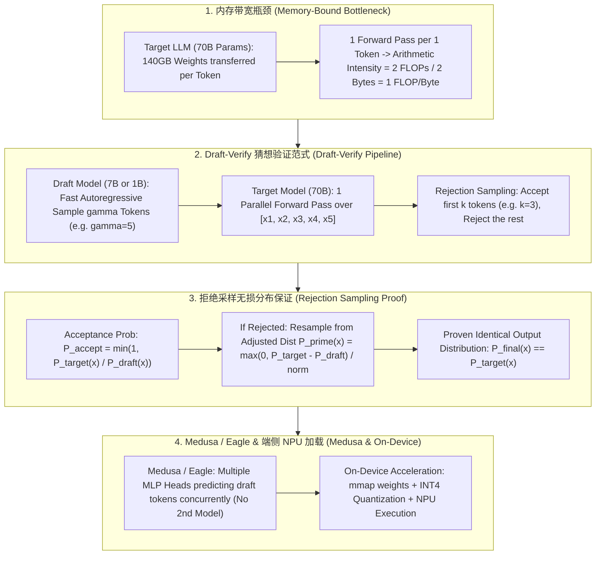

# 🌐 猜想解码 (Speculative Decoding) 全景：Draft Model 小模型草稿、拒绝采样证明与端侧加速

> **核心摘要**：大语言模型在生成阶段逐 Token 自回归预测，每次前向传播都要将数十吉字节的模型权重从 HBM 加载到 GPU 芯片上，算术强度仅为 $O(1)$ FLOPs/Byte（内存带宽极度受限）。**Speculative Decoding (猜想解码)** 引入一个极其轻量的 Draft Model 快速猜测多个候选 Token，再由 Target Model 在一次前向传播中并行校验。通过**拒绝采样 (Rejection Sampling)**，在保证输出概率分布 100% 严格无损的前提下，将推理提速 2x~3x！本指南系统解构 Draft-Verify 流程、数学无损证明、Medusa 无 Draft 方案以及端侧 NPU 加载优化。

---

## 💡 交互式 Mermaid 架构流程图



---

## 💡 经典面试追问与考点速查

* **考点 1**：剖析为什么大模型在 Decoding 阶段是典型的 Memory-Bound (内存带宽受限)，而 Speculative Decoding 能将其提升为 Compute-Bound？
  * *Standard Answer*：
    * **Memory-Bound 根源**：在 Decoding 阶段，Batch Size=1 时，每次前向传播必须把全部模型参数（如 70B FP16 = 140GB）从 HBM 载入 Tensor Core，仅为了生成 1 个 Token（计算量 $approx 2 \times 70B = 140G$ FLOPs）。算术强度等于 1 FLOP/Byte，GPU 算力利用率不足 5%；
    * **Compute-Bound 转变**：Speculative Decoding 一次性让 Target Model 验证 $\gamma+1$ 个 Token。在矩阵乘法中将向量-矩阵乘法 ($1 \times D$) 转换为了矩阵-矩阵乘法 ($(\gamma+1) \times D$)，大大提升了算术强度，充分发挥了 Tensor Core 的并行算力！
> 💡 **直观理解**：解码每步要把 140GB 权重从 HBM 搬上芯片，却只算 1 个 token——算术强度只有 1 FLOP/Byte，好比开 40 吨大卡车送 1 件快递。投机解码让这趟 140GB 的"运输费"一次验证 γ+1=6 个 token，算术强度直接×6，卡车终于装满了，这就是从 Memory-Bound 变成 Compute-Bound 的本质。
>
> 🎤 **面试速答**："结论：解码是典型的 Memory-Bound——70B 权重 140GB 搬一次只算 1 个 token，算力利用率不足 1%；投机解码一次验证 γ+1 个 token，把向量×矩阵变成矩阵×矩阵，算术强度成倍提升。举个例子：H100 上 γ=5、接受率 80%，期望每步产出约 4 个 token，同样的带宽成本产出翻 2~3 倍——这是推理加速性价比最高的手段之一。"

* **考点 2**：严密推导并证明 Speculative Decoding 中改进版 Rejection Sampling 的拒绝概率 $P_{\text{accept}}$ 与补偿分布 $P'$，证明其无损性？
  * *Standard Answer*：
    * **接受概率 (Acceptance Probability)**：对于 Draft Model 采样的 Token $x$，接受概率定义为：
      $$P_{\text{accept}}(x) = \min\left(1, \frac{P_{\text{target}}(x)}{P_{\text{draft}}(x)}\right)$$
    * **被拒绝时的补偿采样分布 (Resampling Distribution)**：若 $x$ 被拒绝，则不再从 $P_{\text{target}}$ 盲目重新采样，而是从调整分布 $P'(x)$ 中采样：
      $$P'(x) = \frac{\max(0, P_{\text{target}}(x) - P_{\text{draft}}(x))}{\sum_{y} \max(0, P_{\text{target}}(y) - P_{\text{draft}}(y))}$$
    * **无损全概率公式证明**：最终采样到 $x$ 的概率为接受概率 + 拒绝后补偿概率：
      $$P_{\text{final}}(x) = P_{\text{draft}}(x) \cdot P_{\text{accept}}(x) + \left(1 - \sum_y P_{\text{draft}}(y) P_{\text{accept}}(y)\right) \cdot P'(x) \equiv P_{\text{target}}(x)$$
      **推导结果与直接使用 Target Model 采样 100% 严格一致！**
> 💡 **直观理解**：这套机制像"实习生先草拟、总监再审核"：draft 猜得比 target 更保守（P_draft ≥ P_target）就照单全收；猜得太自信就按 P_target/P_draft 比例打折接受；被否的由总监按"两者差异分布"亲自重写。无论走哪条路，最终每一份文档都出自总监的手笔——所以分布分毫不差。
>
> 🎤 **面试速答**："结论：改进版拒绝采样保证输出分布与 target 模型直接采样 100% 一致。原理：接受概率 P_accept = min(1, P_t/P_d)，被拒后从补偿分布 P' ∝ max(0, P_t−P_d) 采样，两种路径合并后的全概率恰好等于 P_target。举个例子：draft 给 'the' 打 0.5、target 只给 0.3，接受率 0.6；不接受就从差值分布重采——无论怎么走，最终分布都严格等于 target 的分布。"

* **考点 3**：对比 Speculative Decoding (Draft Model) 与 Medusa / Eagle (无 Draft 小模型，多头并行 Prediction) 的架构差异与显存开销？
  * *Standard Answer*：
    * **Speculative Decoding (双模型)**：需要维护一个独立的小 Draft Model (如 Llama-3-8B 守护 Llama-3-70B)。需要额外的显存装载 Draft Model，且存在两个 Tokenizer 词表不一致风险；
    * **Medusa / Eagle (单模型多头)**：无需独立 Draft Model！直接在主模型的 Top 层挂载多个轻量级 MLP 头（Medusa Heads），每个头并行预测后续第 $1, 2, \dots, k$ 个 Token。结合 Tree-Attention 一次性并行验证多条分支树，显存开销极小且架构优雅。
> 💡 **直观理解**：双模型方案像"给老板配一个助理"——助理要占工位（额外显存装 draft 模型），还有可能和老板说不同方言（tokenizer 词表不一致）；Medusa/Eagle 像"给老板多装几只手"——主模型自己多长几个头，同时预判后面几步，不占任何额外工位。
>
> 🎤 **面试速答**："结论：Speculative Decoding 需要额外加载一个小 draft 模型（如 8B 守护 70B，多占约 10~16GB 显存），Medusa/Eagle 在主模型顶层挂 MLP 头（额外参数仅 ~2%），零第二模型显存。原理：多个头并行预测第 1,2,…,k 个 token，Tree-Attention 一次前向验证整棵分支树。举个例子：Eagle 用 feature-level 头做 draft，实测提速 2.5~3.5x，是目前 SOTA 的投机解码方案。"

* **考点 4**：当 Draft Model 猜想准确率偏低 (如 < 40%) 时，Speculative Decoding 是否会导致推理速度变慢？加速比的期望公式是什么？
  * *Standard Answer*：
    * **加速比期望公式**：设 Draft 采样长度为 $\gamma$，平均接受率为 $\alpha$。每个 Speculative 步期望生成的 Token 数为：
      $$\mathbb{E}[\text{Tokens}] = \frac{1 - \alpha^{\gamma+1}}{1 - \alpha}$$
    * **性能下限防护**：若接受率 $\alpha$ 极低（如 $\alpha \to 0$），期望生成 Token 数依然为 1（因为即使第 1 个 Token 就被拒绝，系统也会从 $P'$ 采样出 1 个有效 Token）。因此在最坏情况下，耗时仅增加一次轻量级 Draft Model 运行时间，**绝对不会发生严重性能劣化**。
> 💡 **直观理解**：期望产出 = 等比数列 1 + α + α² + … + α^γ 求和：第 1 个 token 一定产出（保底），第 2 个要 α 概率，第 3 个要 α² 概率……接受率越高，白赚的越多；α→0 时只剩下保底的 1，但绝不会是 0——所以最坏情况也只是多跑一次轻量 draft 前向，不会比纯自回归更慢。
>
> 🎤 **面试速答**："结论：每步期望产出 E[Tokens] = Σ_{i=0}^{γ} α^i = (1−α^{γ+1})/(1−α)，接受率 α 决定收益。原理：第 i 个候选 token 被接受的概率是 α^i，等比数列求和。举个例子：γ=5、α=0.8 时 E≈3.36 个 token（提速 ~3x）；α 跌到 0.3 时 E≈1.42，收益很小但不会劣化——α<0.4 就该考虑提高 draft 质量或改用 Medusa 了。"

* **考点 5**：端侧 AI 推理 (On-Device LLM) 中，如何结合 INT4/FP4 量化、内存映射 (mmap) 与 NPU 硬件加速突破移动端带宽瓶颈？
  * *Standard Answer*：
    * **INT4/FP4 显存拟合**：将 7B 模型权重压缩至 3.5GB 内存以内，拟合手机/PC 统一内存 (Unified Memory) 限制；
    * **mmap 零拷贝加载**：利用 Linux/macOS `mmap()` 机制将模型权重直接映射到虚拟内存，无需一次性加载进 DRAM，实现秒级启动；
    * **NPU / Apple Neural Engine (ANE)**：将 Dense Matrix Ops 调度至低功耗 NPU 执行，CPU 专注逻辑控制，达成高能效比生成。
> 💡 **直观理解**：端侧三件套各管一件事：INT4 量化把权重"压缩成四分之一体积"（7B 从 14GB 变 3.5GB，塞进手机/笔记本的统一内存）；mmap 是"按需翻页读字典"——用到哪页读哪页，不用整本背进内存；NPU 是"省电的专用计算器"，跑矩阵又快又省电。
>
> 🎤 **面试速答**："结论：端侧部署 = INT4/FP4 量化 + mmap 零拷贝 + NPU 执行。原理：量化把带宽需求砍到 1/4，mmap 让权重按页从磁盘流式加载实现秒级启动，NPU 低功耗跑密集矩阵运算。举个例子：16GB 统一内存的 MacBook 上，INT4 的 7B 模型权重 3.5GB，mmap 冷启动 1~2 秒，配合 Apple Neural Engine 生成速度远超 CPU 纯跑，能效比高一个数量级。"

---

## 📚 第一章：猜想解码范式对比矩阵

| 架构 / 方案 | Draft 产生机制 | 额外显存开销 | 验证机制 | 提速比 (Speedup) | 适用场景 |
| :--- | :--- | :--- | :--- | :--- | :--- |
| **Vanilla Speculative**| 独立小 Draft Model | 中等 (需存小模型) | 拒绝采样 (Rejection) | 1.8x - 2.5x | 服务端集群 (8B + 70B) |
| **Medusa** | 主模型挂载多 MLP 头 | **极低 (~2% 额外参数)**| Tree-Attention 验证 | 2.0x - 3.0x | 高并发推理服务 |
| **Eagle** | 挂载 Feature-Level 头| 极低 | Feature Tree 验证 | **2.5x - 3.5x** | **SOTA 猜想加速范式** |
| **On-Device Speculative**| Quantized Draft Model | 低 | INT4 硬件验证 | 2.0x | 移动端 / Mac 统一内存 |

> **怎么读这张表**：横向对比"额外显存开销"和"提速比"两列：Medusa/Eagle 用 ~2% 的额外参数换来 2.0~3.5x，双 draft 模型方案要多存一个小模型（中等开销）但实现简单；再看"验证机制"列——拒绝采样保证数学无损，Tree-Attention 是并行验证多条分支。面试常问"生产选哪种"，答案就在'开销 vs 提速'两列的性价比里。

---

## ⚡ 第二章：拒绝采样接受概率公式

**一句话直觉**：接受概率 = min(1, 大模型概率 ÷ 草稿模型概率)：草稿猜得比大模型更保守就全收，猜得过于自信就按比例打折——这是保证最终分布无损的"校准阀"。

$$P_{\text{accept}}(x) = \min\left(1, \frac{P_{\text{target}}(x)}{P_{\text{draft}}(x)}\right)$$

> 💡 **直观理解**：这个公式的本质是一个"校准规则"：draft 认为 'the' 有 0.5 的概率、target 只给 0.3，说明 draft 高估了，按 0.3/0.5=0.6 的概率接受才公平；若 draft 给 0.2、target 给 0.4，说明 draft 低估了，那就 100% 接受并额外保留差值概率给补偿采样。每一次接受/拒绝都在修正偏差，累计起来分布就分毫不差。
>
> 🎤 **面试速答**："结论：接受概率 = min(1, P_t/P_d)，配合拒绝后的补偿采样 P'∝max(0,P_t−P_d)，保证输出分布与 target 直接采样严格一致。原理：接受路径贡献 P_d(x)·min(1,P_t/P_d)，拒绝路径从 P' 补偿，两路之和恒等于 P_t(x)。举个例子：P_d('the')=0.5、P_t('the')=0.3 时接受率 60%；被拒则从差值分布重采——两种结果合并后就是 100% 的大模型原生分布。"

---

## 🐍 第三章：Pure Numpy 手写 Speculative Decoding 拒绝采样算子

```python
import numpy as np

def pure_numpy_speculative_rejection_sampling(p_target: np.ndarray, p_draft: np.ndarray, draft_token_idx: int) -> tuple:
    """
    Pure Numpy 实现 Speculative Decoding 数学无损拒绝采样算子
    p_target: Target Model 输出的概率分布 vector (Vocab_Size,)
    p_draft:  Draft Model  输出的概率分布 vector (Vocab_Size,)
    draft_token_idx: Draft Model 采样的 Token 索引 ID
    """
    prob_target_x = p_target[draft_token_idx]
    prob_draft_x = p_draft[draft_token_idx]
    
    # 1. 计算接受概率 P_accept = min(1, P_target(x) / P_draft(x))
    p_accept = min(1.0, prob_target_x / max(prob_draft_x, 1e-12))
    
    # 2. 均匀分布采样决定 Accept 或 Reject
    u = np.random.uniform(0.0, 1.0)
    
    if u <= p_accept:
        # 接受 Draft Token！
        return True, draft_token_idx
    else:
        # 拒绝！从调整分布 P' 中重新采样补偿 Token
        p_prime = np.maximum(0.0, p_target - p_draft)
        p_prime_norm = p_prime / np.sum(p_prime)
        resampled_token_idx = np.random.choice(len(p_target), p=p_prime_norm)
        return False, resampled_token_idx

# ==================== 测试验证 ====================
if __name__ == "__main__":
    vocab_size = 5
    p_trg = np.array([0.1, 0.6, 0.1, 0.1, 0.1])
    p_dft = np.array([0.1, 0.4, 0.3, 0.1, 0.1])
    
    # 假设 Draft 采样了 Index 1 (目标概率更高，很大概率被接受)
    accepted, final_token = pure_numpy_speculative_rejection_sampling(p_trg, p_dft, draft_token_idx=1)
    print("✅ 拒绝采样验证 - Token 1 结果 | Accepted:", accepted, "| Final Token:", final_token)
```

---

## 🚀 总结与工程最佳实践

1. **架构首选**：在大模型推理集群中，优先采用 **Eagle / Medusa** 单模型多头猜想范式；
2. **数学无损**：严格使用 **Rejection Sampling 补偿公式**，确保输出质量无衰减；
3. **端侧部署**：结合 **INT4 量化与 mmap 零拷贝**，充分压榨移动端统一内存与 NPU 算力。