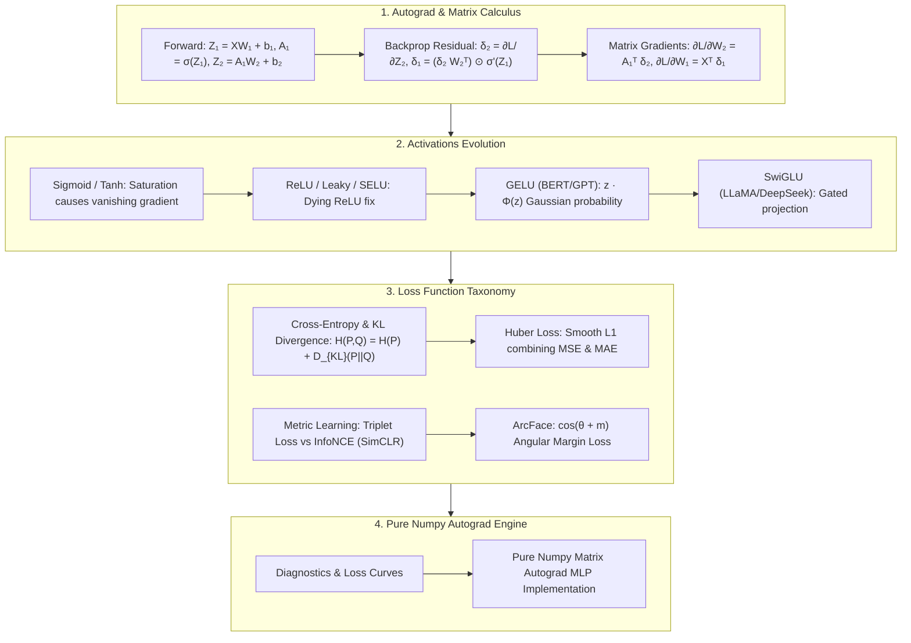

# Deep Learning Foundations: Activations Evolution (GELU/SwiGLU), Loss Function Taxonomy (CE/KL/Huber/InfoNCE/ArcFace) & Autograd Backprop Guide

> **Summary**: Non-linear activation functions, loss functions, and backpropagation form the mathematical pillars of deep learning. This exhaustive guide covers Autograd matrix calculus, activation evolution (Sigmoid -> Tanh -> ReLU -> GELU -> SwiGLU), complete loss function taxonomy (CE-KL equivalence, Huber, InfoNCE, Triplet, ArcFace), and pure Numpy autograd implementations with rich SEO explanatory prose.

---

## 🧭 Knowledge Map & Architecture Graph



---

## 💡 High-Frequency Interview Questions & Key Concepts

* **Key Concept 1**: Cross-Entropy, MLE, and KL Divergence equivalence.
  * *Standard Response*: $D_{\text{KL}}(P \parallel Q) = -H(P) + H(P, Q)$. Since true distribution entropy $H(P)$ is constant with respect to model parameters $\theta$, minimizing Cross-Entropy $H(P, Q)$ is strictly equivalent to minimizing KL Divergence $D_{\text{KL}}(P \parallel Q)$ and maximizing Likelihood.
* **Key Concept 2**: Huber Loss formulation.
  * *Standard Response*: $L_\delta(e) = \frac{1}{2}e^2$ for $|e| \le \delta$, and $\delta(|e| - \frac{1}{2}\delta)$ for $|e| > \delta$. Combines MSE smoothness at origin with MAE outlier robustness.
* **Key Concept 3**: InfoNCE vs Triplet Loss.
  * *Standard Response*: InfoNCE contrastive loss $\mathcal{L} = -\log \frac{\exp(\text{sim}(z_i, z_j)/\tau)}{\sum \exp(\text{sim}(z_i, z_k)/\tau)}$ computes multi-class cross-entropy over $K$ samples. Temperature $\tau$ scales hardness penalty of negative samples.

> 💡 **Intuition**: Three "filters" run through this whole topic. Activation functions are the network's non-linearity switches — Sigmoid's max derivative is 0.25, so 10 layers of it multiply gradients by $0.25^{10} \approx 10^{-6}$ (vanishing gradient); ReLU passes the positive half untouched but can kill neurons; GELU/SwiGLU add smoothness and gating, which is why Transformers use them. Loss functions answer "how surprised should the model be": CE = constant entropy + KL divergence, so minimizing CE, KL, and MLE are all the same optimization. Backprop just routes error layer by layer with matrix multiplies.
>
> 🎤 **Quick Answer**: "Sigmoid → ReLU → GELU/SwiGLU is an arms race against vanishing gradients. CE, MLE, and KL are the same objective because $D_{KL}(P\|Q) = -H(P) + H(P,Q)$ and $H(P)$ is a constant. Example: predicting the true class at 0.5 gives CE $-\log 0.5 \approx 0.693$; at 0.99 it drops to ~0.01 — that's the whole story of 'confidence pays'."

---

## 📚 Chapter 1: Softmax + Cross-Entropy Matrix Gradient

Plain-language reading: the Softmax + CE combo collapses to the elegant residual $\hat{Y} - Y$ — "the network adjusts in proportion to how wrong it was." Each weight gradient is then "upstream activations transposed × downstream residual" ($A_1^T \delta_2$), and residuals flow back as $\delta_1 = (\delta_2 W_2^T) \odot \sigma'(Z_1)$.

$$\frac{\partial \mathcal{L}}{\partial Z_2} = \frac{1}{B} (\hat{Y} - Y)$$
$$\frac{\partial \mathcal{L}}{\partial W_2} = A_1^T \delta_2, \quad \delta_1 = (\delta_2 W_2^T) \odot \sigma'(Z_1)$$

> 💡 **Intuition**: Backprop is "bookkeeping the blame": the output residual $\delta$ is the master account, each layer computes its own gradient as $A^T \delta$, and $\odot \sigma'(Z)$ is the activation function's local "gate" telling how much of the error passes through it.
>
> 🎤 **Quick Answer**: "Three recursive formulas: $\delta_2 = (\hat{Y}-Y)/B$, $\delta_1 = (\delta_2 W_2^T)\odot\sigma'(Z_1)$, $dW_1 = X^T\delta_1$. Example: batch 8, prediction 0.8, label 1 → residual contribution $(0.8-1)/8 = -0.025$, nudging the probability up."

---

## 📚 Chapter 2: Pure Numpy Autograd Engine

Plain-language reading: the full implementation (see the zh version for the complete 20-line engine) lands Chapter 1's formulas one by one — `dz2 = (a2 - y_onehot)/batch_size`, `dW2 = a1.T @ dz2`, `dz1 = da1 * gelu'(z1)`, `dW1 = X.T @ dz1` — plus He initialization `randn * sqrt(2/n_in)` so forward variance never shrinks.

```python
import numpy as np

class PureNumpyAutogradMLP:
    def __init__(self, input_dim: int, hidden_dim: int, output_dim: int):
        pass
```

> 💡 **Intuition**: Forward pass stores intermediate activations; backward pass walks "residual → weight gradient" in reverse. The whole engine is four lines once you trust the math.
>
> 🎤 **Quick Answer**: "Memorize: weight gradient = upstream activation transpose × downstream residual; residual = upstream residual × weight transpose, element-wise times the activation derivative. Sanity check: print `dW1` norms after a few steps — zeros or NaN mean the gradient stream broke."