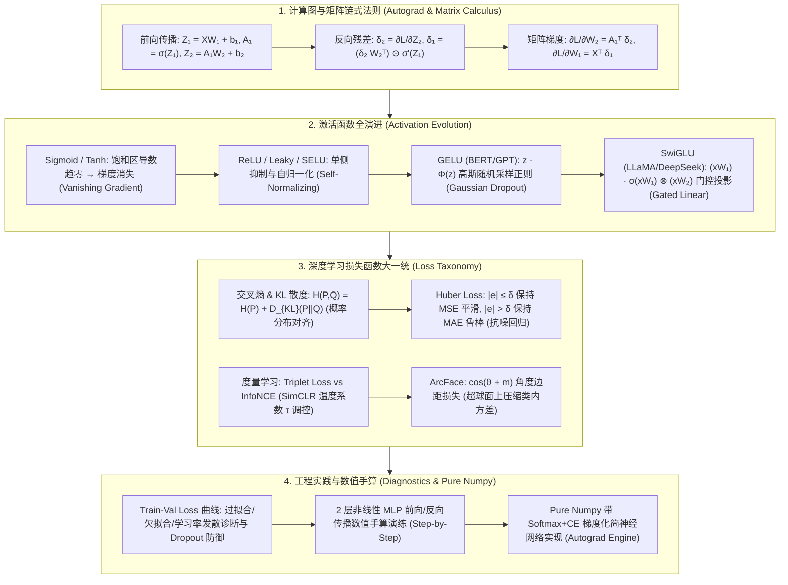

# 深度学习基础全景：激活函数族全演进(GELU/SwiGLU)、损失函数大一统 (CE/KL/Huber/InfoNCE/ArcFace) 与计算图反向传播极客指南

> **核心摘要**：非线性激活函数、损失函数与计算图反向传播共同构成了现代神经网络训练的三大数理基石。激活函数为网络注入非线性表征能力，使得多层神经元能够逼近任意复杂的连续函数（通用近似定理）；损失函数定义了优化目标的几何曲面与物理约束；而基于自动微分 (Autograd) 的计算图与反向传播算法则是高效率求解参数梯度的发动机。本指南系统剖析系统剖析从矩阵链式求导、8 大激活函数演进（Sigmoid $\to$ Tanh $\to$ ReLU $\to$ Leaky/SELU $\to$ GELU $\to$ SwiGLU）、损失函数大一统体系（CE、KL 散度、Huber 鲁棒回归、InfoNCE/Triplet 对比学习、ArcFace 角度边距），到 Loss 诊断与 Pure Numpy 引擎实现。本指南撰写了充实的文字说明与长尾搜索引擎优化 (SEO) 关键词，兼顾理论严密性与工程落地。

---

## 🧭 知识体系全景流程图 (Knowledge Map & Architecture Graph)



---

## 💡 经典面试追问与考点速查

* **考点 1**：请推导交叉熵损失 (Cross-Entropy)、极大似然估计 (MLE) 与 KL 散度 (Kullback-Leibler Divergence) 的数学等价性。
  * *标准回答*：设真实数据分布为 $P(x)$，模型预测概率分布为 $Q_\theta(x)$。KL 散度定义为 $D_{\text{KL}}(P \parallel Q_\theta) = \sum P(x) \log \frac{P(x)}{Q_\theta(x)} = \sum P(x) \log P(x) - \sum P(x) \log Q_\theta(x) = -H(P) + H(P, Q_\theta)$。由于真实数据分布的信息熵 $H(P)$ 是与模型参数 $\theta$ 完全无关的常数，因此**最小化交叉熵 $H(P, Q_\theta)$ 完全等价于最小化 KL 散度 $D_{\text{KL}}(P \parallel Q_\theta)$**！同时，在经验分布下，负对数似然 $\text{NLL} = -\sum \log Q_\theta(x_i)$ 正好是交叉熵的经验采样估计，三者在最优化视角下严格等价。
* **考点 2**：为什么回归任务中 Huber Loss (Smooth L1 Loss) 优于传统的 MSE 和 MAE？
  * *标准回答*：MSE ($L_2$ 损失) 对离群点 (Outliers) 极度敏感，因为残差平方 $e^2$ 会呈二次方放大极罕见异常值的梯度，将整体预测曲线拉偏；MAE ($L_1$ 损失) 虽然对异常值鲁棒，但在零点 $e=0$ 处不可导且梯度恒为 $\pm 1$，导致在局部最小值附近容易产生剧烈震荡而难以精细收敛。**Huber Loss** 结合了二者的优点，当残差绝对值较小（$|e| \le \delta$）时采用 MSE 保证零点附近的连续可导与平滑收敛；当残差较大（$|e| > \delta$）时转换为线性 MAE，将异常值的梯度上限截断为常数 $\delta$，展现出极强的抗噪鲁棒性。
* **考点 3**：对比学习中 Triplet Loss 与 InfoNCE Loss 的本质区别是什么？温度系数 $\tau$ 起到了什么物理作用？
  * *Standard Response*：**Triplet Loss** 仅在单一三元组 $(a, p, n)$ 间建立相对距离约束：$\mathcal{L} = \max(0, \|a - p\|^2 - \|a - n\|^2 + m)$，存在负样本采矿 (Hard Negative Mining) 依赖度高、收敛缓慢问题；**InfoNCE Loss (SimCLR)** 将对比约束扩展为多分类交叉熵形式，在单个 Mini-batch 内将 1 个正样本与 $K-1$ 个负样本放在全局统一评估：
    $$\mathcal{L} = - \log \frac{\exp(\text{sim}(z_i, z_j) / \tau)}{\sum_{k=1}^K \exp(\text{sim}(z_i, z_k) / \tau)}$$
    温度系数 $\tau$ 调节了模型对困难负样本的惩罚强度。较小的值 $\tau \to 0$ 会急剧放大高相似度负样本的梯度权重，强制模型特征分布在单位超球面上尽可能均匀散开 (Uniformity)。

---

## 📚 第一章：激活函数族数理全景演进 (Sigmoid $\to$ SwiGLU)

### 1.1 激活函数的必要性与物理意义
如果神经网络中不引入非线性激活函数，无论堆叠多少层线性全连接层 $W_l x + b_l$，整体复合映射仍然只是一个简单的单层线性变换 $W_{\text{eff}} x + b_{\text{eff}}$。激活函数的引入破坏了矩阵相乘的线性表达，使得多层感知机 (MLP) 具备了拟合任意复杂决策边界能力。

> 💡 **直观理解**：激活函数就是给网络"注入非线性"的开关。没有它，无论堆多少层线性层都等价于一层——就像几把直尺首尾相接还是直尺，永远弯不成曲线；只有引入非线性，多层才能拟合任意形状的决策边界（通用近似定理）。
>
> 🎤 **面试速答**："结论：激活函数是神经网络非线性的唯一来源，没有它深层网络退化成单层线性变换。原理：多个线性变换复合仍是线性变换，激活函数引入分段/光滑的非线性弯曲。举个例子：只含 ReLU 的两层网络就能表示凸多边形决策区域，而无激活的 100 层网络输出仍是 $W_{\text{eff}} x + b_{\text{eff}}$ 的形式。"

### 1.2 8 大激活函数公式、导数与演进脉络

下面按"曲线形状 → 导数行为 → 对训练的影响"三步来读每一个函数。演进主线只有一条：每引入一个新函数都是为了修补前一个的缺陷（饱和 → 单侧死亡 → 死区漏梯度 → 门控增强表达）。

1. **Sigmoid 激活函数**：
   $$\sigma(z) = \frac{1}{1 + e^{-z}}, \quad \sigma'(z) = \sigma(z)(1 - \sigma(z)) \le 0.25$$
   *详细分析*：Sigmoid 输出限制在 $(0, 1)$ 空间，非常适合表达概率。但其最大导数值在 $z=0$ 时仅为 $0.25$。在深层网络反向传播中，连乘因子 $(0.25)^L$ 会导致深层梯度呈现指数级衰减，引发致命的**梯度消失 (Vanishing Gradient)** 现象；此外 Sigmoid 输出均值大于零（Non-zero Centered），会导致后一级权重的更新出现“同正同负”的锯齿状震荡（Zigzagging）。
2. **Tanh 双曲正切函数**：
   $$\tanh(z) = \frac{e^z - e^{-z}}{e^z + e^{-z}}, \quad \tanh'(z) = 1 - \tanh^2(z) \le 1$$
   *详细分析*：Tanh 将输出映射至 $(-1, 1)$，成功解决了 Zero-centered 问题，使收敛速度快于 Sigmoid。但在 $|z| > 2$ 的饱和区，其导数依然逼近于零，未彻底根治梯度消失。
3. **ReLU (Rectified Linear Unit)**：
   $$f(z) = \max(0, z), \quad f'(z) = \begin{cases} 1, & z > 0 \\ 0, & z < 0 \end{cases}$$
   *详细分析*：ReLU 是深度学习发展史上的重大突破。它在正半轴 $z > 0$ 的导数恒为 $1$，彻底解决了正区的梯度消失问题，且无指数开销，计算极快。然而，ReLU 存在 **Dying ReLU（死亡神经元）** 缺陷：若某一学习率过大或输入了大负数，神经元在负半轴的梯度将恒为 $0$，该神经元的参数将永久锁定无法更新。
4. **Leaky ReLU / PReLU**：
   $$f(z) = \max(\alpha z, z), \quad f'(z) = \begin{cases} 1, & z > 0 \\ \alpha, & z < 0 \end{cases}$$
   *详细分析*：Leaky ReLU 在负半轴赋予微小的固定斜率 $\alpha = 0.01$（PReLU 中 $\alpha$ 为可学习参数），使得负半轴依然保留微小梯度，有效激活了“死亡”的神经元。
5. **SELU (Scaled Exponential Linear Unit)**：
   自归一化神经网络 (SNN) 激活函数，通过严格设定的常数 $\lambda \approx 1.0507, \alpha \approx 1.6733$，使网络在隐层传递过程中自动将特征均值保持在 0、方差保持在 1，无需 Batch Normalization。
6. **GELU (Gaussian Error Linear Unit)**：
   $$f(z) = z \cdot \Phi(z) = z \cdot P(X \le z), \quad X \sim \mathcal{N}(0, 1)$$
   *详细分析*：GELU 将 Dropout 的随机丢弃思想与激活函数相结合。输入 $z$ 越小，被归零的概率越高；输入越大，被保留的概率越高。GELU 具备处处连续光滑的曲线与小幅负值下凹区间，是 Transformer 架构（BERT、GPT-3、Vision Transformer）的标配。
7. **Swish / SiLU**：
   $$f(z) = z \cdot \sigma(\beta z)$$
   Google 提出的非单调平滑激活函数，当 $\beta=1$ 时即为 SiLU。具备无上界、有下界、平滑且非单调的优良数学性质。
8. **SwiGLU (现代大语言模型标配)**：
   结合 Swish 激活函数与门控线性单元 (GLU)：
   $$\text{SwiGLU}(x) = \left( x W_1 + b_1 \right) \cdot \sigma\left(\beta (x W_1 + b_1)\right) \otimes \left( x W_2 + b_2 \right)$$
   *详细分析*：在 LLaMA 1/2/3、PaLM、DeepSeek-V3 / R1 等顶级大模型中，SwiGLU 替代了传统 Transformer FFN 层的 ReLU/GELU。它利用分支投影的门控自适应机制调制信息流，表达能力显著提升。

> 💡 **直观理解**：把激活函数想象成"信号门卫"。Sigmoid 是总把信号压在 0~1 之间、输入一偏大就"饱和关门"的门卫——反向传播每过一道门梯度最多乘 0.25，10 层连乘就是 $0.25^{10} \approx 10^{-6}$，信号彻底死掉；ReLU 则是"正数放行、负数拦下"的闸机，正半轴导数恒为 1，梯度过闸不衰减，但被拦下的神经元可能永远"熄火"（Dying ReLU）；GELU 是"概率放行"的软闸机，输入越大放行概率越高；SwiGLU 干脆给 FFN 装了两道闸，一道控制"放多少"、一道提供"内容"。
>
> 🎤 **面试速答**："结论：激活函数演进主线是'消灭梯度消失、保留非线性'。原理：Sigmoid 导数最大 0.25，深层连乘指数衰减；ReLU 正区导数恒 1 但负区会导致神经元死亡；GELU/SwiGLU 兼顾光滑、非零负区与门控表达，成为 Transformer 标配。举个例子：4 层 Sigmoid 网络最坏梯度缩到 $0.25^4 \approx 3.9\times10^{-3}$，换 ReLU 后正区梯度完全不再衰减；LLaMA-7B 的 FFN 用 SwiGLU 而非 GELU，门控分支能按 token 内容动态调节信息流。"

---

## 📚 第二章：深度学习损失函数大一统 (Loss Function Taxonomy)

### 2.1 分类与概率分布对齐损失

大白话理解：交叉熵在算"模型对真实标签的惊讶程度"——真实类别被赋予的概率越低，损失越大。它天然等价于最大似然：最大化预测真实类的概率，就是最小化 $-\log \hat{y}_{\text{true}}$。

* **Categorical Cross-Entropy (多分类交叉熵)**：
  $$\mathcal{L}_{CE} = - \sum_{c=1}^C y_c \log \hat{y}_c$$
* **Kullback-Leibler Divergence (KL 散度)**：
  测量模型预测分布 $Q$ 相比于真实分布 $P$ 的相对熵：
  $$D_{\text{KL}}(P \parallel Q) = \sum_{x} P(x) \log \frac{P(x)}{Q(x)} = \sum P(x) \log P(x) - \sum P(x) \log Q(x) = -H(P) + H(P, Q)$$
  *结论*：由于真实标签分布固定的信息熵 $H(P)$ 是与模型权重无关的常数，在最优化梯度求解中，最小化交叉熵与最小化 KL 散度在数理上完全等价！
* **Focal Loss (难易样本不平衡损失)**：
  $$\mathcal{L}_{FL} = - \alpha_t (1 - p_t)^\gamma \log(p_t)$$
  通过调制因子 $(1 - p_t)^\gamma$ 自动降低易分类样本（$p_t \to 1$）的 Loss 权重，将梯度集中于高难度边缘样本。

> 💡 **直观理解**：CE 是在惩罚"该有信心的类别没信心"。KL 散度是"两个分布之间的信息差"：恒等式 $D_{\text{KL}}(P \parallel Q) = -H(P) + H(P, Q)$ 表明真实分布的熵 $H(P)$ 是常数，所以训练时"最小化 KL"与"最小化 CE"完全是一回事——这就是面试最爱问的 CE ≈ MLE ≈ KL 三者等价的由来。Focal Loss 则像老师只盯着"不及格的学生"：$p_t$ 接近 1 的简单样本被 $(1-p_t)^\gamma$ 压权，让难样本主导梯度。
>
> 🎤 **面试速答**："结论：分类损失的核心是交叉熵，它与 MLE、KL 散度在最优化视角下严格等价。原理：CE = 真实分布熵（对参数为常数）+ KL 散度，常数项求导为 0，所以三者的极小值点完全重合。举个例子：10 分类样本，真实类预测概率 0.5 时 CE = $-\log 0.5 \approx 0.693$；预测 0.99 时 CE ≈ 0.010；Focal Loss 在 $\gamma=2$ 时把 $p_t=0.9$ 的简单样本权重压到 $(0.1)^2 = 0.01$。"

---

### 2.2 回归损失函数：MAE vs MSE vs Huber Loss

怎么读这张表：面试高频结论藏在"抗离群值鲁棒性"与"零点可导性"两列的组合里——MSE 可导但不鲁棒，MAE 鲁棒但零点不可导，Huber 是唯一同时拿两列优点的。

| 损失函数名称 | 数学表达 $\mathcal{L}(y, \hat{y})$ | 导数/梯度表现 | 抗离群值鲁棒性 | 零点可导性 |
| :--- | :--- | :--- | :--- | :--- |
| **MAE (L1 Loss)** | $|y - \hat{y}|$ | 恒为 $\pm 1$ | **强** | 否（$e=0$ 处突变） |
| **MSE (L2 Loss)** | $\frac{1}{2}(y - \hat{y})^2$ | $y - \hat{y}$（与误差成正比） | 弱（二次方放大异常值） | **是** |
| **Huber Loss (Smooth L1)** | $|e| \le \delta \implies \frac{1}{2} e^2$; $|e| > \delta \implies \delta |e| - \frac{1}{2}\delta^2$ | 小误差处线性增长，大误差截断为 $\delta$ | **强** | **是**（处处连续可导） |

> 💡 **直观理解**：三种回归损失像三种"罚分方式"。MSE 罚平方：离群点误差 10 会被罚 100、梯度放大 10 倍，把整条拟合线拽偏；MAE 罚绝对值：所有误差罚分一样，但零点处导数突变、远离零点梯度恒为 ±1，导致局部最小值附近震荡；Huber 是"小误差用 MSE、大误差用 MAE"的分段方案，以 $\delta$ 为界——相当于给离群点的梯度封顶。
>
> 🎤 **面试速答**："结论：Huber Loss 兼顾 MSE 的平滑收敛与 MAE 的离群鲁棒性。原理：误差小于 $\delta$ 时保持二次可导平滑收敛，大于 $\delta$ 时退化为线性，梯度上限被截断为常数 $\delta$。举个例子：真实值 5、预测 105，误差 $e=100$；设 $\delta=1$，MSE 的梯度为 100 而 Huber 的梯度恒为 1，训练不会被一个坏样本带飞——目标检测的 Smooth L1 就是 $\delta=1$ 的 Huber，R-CNN 系列全部使用它。"

---

### 2.3 对比学习与表征度量损失 (Metric Learning)

度量学习的目标不是"分类正确"，而是"特征距离符合语义"：同类特征拉近、异类特征推远。下面三种损失是从"三元组"到"全批次对比"再到"角度空间"的三级进化。

1. **Triplet Loss (三元组损失)**：
   在 Anchor $a$、Positive $p$、Negative $n$ 特征空间中：
   $$\mathcal{L}_{TL} = \max\left(0, \|z_a - z_p\|^2 - \|z_a - z_n\|^2 + m\right)$$
2. **InfoNCE Loss (SimCLR / CLIP 对比损失)**：
   $$\mathcal{L}_{\text{InfoNCE}} = - \log \frac{\exp(\text{sim}(z_i, z_j) / \tau)}{\sum_{k=1}^K \exp(\text{sim}(z_i, z_k) / \tau)}$$
3. **ArcFace (Additive Angular Margin Loss - 角度边距损失)**：
   在归一化超球面上将特征向量与权重向量夹角增加边距 $m$：
   $$\mathcal{L}_{\text{ArcFace}} = - \log \frac{e^{s \cdot \cos(\theta_{y_i} + m)}}{e^{s \cdot \cos(\theta_{y_i} + m)} + \sum_{j \neq y_i} e^{s \cdot \cos \theta_j}}$$
   大幅增强人脸识别与向量检索中的类内紧密性与类间可分性！

> 💡 **直观理解**：Triplet Loss 像"一对一的三角约束"：anchor 到正样本的距离必须比到负样本近一个边距 $m$，否则受罚；InfoNCE 像"全班考试排名"：在 batch 内把 1 个正样本放进 $K-1$ 个负样本中做多分类，用温度 $\tau$ 控制"多看重难负样本"；ArcFace 把比较从欧氏距离搬到单位超球面的角度上，直接给目标类角度加边距 $m$，让人脸特征"类内更紧、类间更散"。
>
> 🎤 **面试速答**："结论：三者的区别是约束范围——Triplet 只看一个三元组，InfoNCE 看整个 batch，ArcFace 看角度空间。原理：InfoNCE 是带温度 $\tau$ 的 Softmax 多分类，负样本越难（与 anchor 越相似）被惩罚越重；$\tau$ 越小分布越尖锐、对难负样本越敏感。举个例子：batch=64 时 InfoNCE 每个 anchor 有 63 个负样本参与对比，Triplet 只贡献 1 个；ArcFace 在 $m=0.5$（约 28.6°）时把同类角度的余量要求额外提高这么多，人脸识别 SOTA 都靠它。"

---

## 📚 第三章：多层神经网络矩阵形式反向传播严密推导

考虑包含 Batch Size $B$、输入维度 $D$、隐层维度 $H$、输出类别数 $K$ 的 2 层 MLP：
* 输入矩阵 $X \in \mathbb{R}^{B \times D}$；权重 $W_1 \in \mathbb{R}^{D \times H}, b_1 \in \mathbb{R}^{1 \times H}$；$W_2 \in \mathbb{R}^{H \times K}, b_2 \in \mathbb{R}^{1 \times K}$。
* 隐层前向：$Z_1 = X W_1 + b_1 \in \mathbb{R}^{B \times H}$；激活：$A_1 = \text{GELU}(Z_1)$。
* 输出前向：$Z_2 = A_1 W_2 + b_2 \in \mathbb{R}^{B \times K}$；预测概率：$\hat{Y} = \text{Softmax}(Z_2)$。

利用第二章推出的 Softmax + Cross-Entropy 极简残差求导结论：
$$\delta_2 = \frac{\partial \mathcal{L}}{\partial Z_2} = \frac{1}{B} (\hat{Y} - Y) \in \mathbb{R}^{B \times K}$$

基于雅可比矩阵向量积与链式法则，推导各层权重参数梯度：
1. **输出层权重梯度 $\frac{\partial \mathcal{L}}{\partial W_2}$**：
   $$\frac{\partial \mathcal{L}}{\partial W_2} = A_1^T \delta_2 \in \mathbb{R}^{H \times K}, \quad \frac{\partial \mathcal{L}}{\partial b_2} = \sum_{i=1}^B \delta_{2, i} \in \mathbb{R}^{1 \times K}$$
2. **隐层反向残差 $\delta_1$**：
   $$\delta_1 = \frac{\partial \mathcal{L}}{\partial Z_1} = (\delta_2 W_2^T) \odot \text{GELU}'(Z_1) \in \mathbb{R}^{B \times H}$$
3. **隐藏层权重梯度 $\frac{\partial \mathcal{L}}{\partial W_1}$**：
   $$\frac{\partial \mathcal{L}}{\partial W_1} = X^T \delta_1 \in \mathbb{R}^{D \times H}, \quad \frac{\partial \mathcal{L}}{\partial b_1} = \sum_{i=1}^B \delta_{1, i} \in \mathbb{R}^{1 \times H}$$

> 💡 **直观理解**：反向传播就是"按链式法则把损失分摊给每一层"：输出层的误差残差 $\delta$ 像"要修改的总账"，沿网络一层层回传，每层用自己上游的激活转置（$A_1^T$、$X^T$）乘以下游残差，算出该层权重梯度。两个最优雅的结论：Softmax+CE 组合的残差恰好是 $\hat{Y} - Y$（"错多少就改多少"）；梯度回传只需要矩阵乘法与逐元素乘激活导数，这正是 PyTorch 中 `tensor.backward()` 在做的事。
>
> 🎤 **面试速答**："结论：2 层 MLP 的梯度由三层递推给出：$\delta_2 = (\hat{Y}-Y)/B$、$\delta_1 = (\delta_2 W_2^T) \odot \sigma'(Z_1)$、$\partial L/\partial W_1 = X^T \delta_1$。原理：链式法则 + 雅可比转置回传，$\odot$ 是激活函数导数的逐元素作用。举个例子：batch=8 时某样本预测 $\hat{Y}=0.8$ 而标签 $Y=1$，它对 $\delta_2$ 的贡献是 $(0.8-1)/8 = -0.025$，网络收到'概率偏低、要往上调'的修正信号。"

---

## 📚 第四章：Pure Numpy 实现带 Softmax+CE 矩阵化 Autograd MLP 引擎

大白话看代码：这个 Pure Numpy MLP 把第三章的矩阵公式一行行落地。关键四行是 `dz2 = (a2 - y_onehot) / batch_size`（Softmax+CE 极简残差）、`dW2 = a1.T @ dz2`、`dz1 = da1 * gelu'(z1)`、`dW1 = X.T @ dz1`——顺序严格对应第三章的推导，背住这四条公式就能手撕任意网络的反向传播。

```python
import numpy as np

class PureNumpyAutogradMLP:
    def __init__(self, input_dim: int, hidden_dim: int, output_dim: int):
        # 使用 He (Kaiming) 初始化防止正向传播方差爆炸
        self.W1 = np.random.randn(input_dim, hidden_dim) * np.sqrt(2.0 / input_dim)
        self.b1 = np.zeros((1, hidden_dim))
        self.W2 = np.random.randn(hidden_dim, output_dim) * np.sqrt(2.0 / hidden_dim)
        self.b2 = np.zeros((1, output_dim))
        
    def _gelu(self, z: np.ndarray) -> np.ndarray:
        # GELU 高斯误差线性单元近似公式
        return 0.5 * z * (1.0 + np.tanh(np.sqrt(2.0 / np.pi) * (z + 0.044715 * z**3)))
        
    def _gelu_derivative(self, z: np.ndarray) -> np.ndarray:
        # GELU 导数严密推导实现
        tanh_out = np.tanh(np.sqrt(2.0 / np.pi) * (z + 0.044715 * z**3))
        sech2 = 1.0 - tanh_out**2
        return 0.5 * (1.0 + tanh_out) + 0.5 * z * sech2 * np.sqrt(2.0 / np.pi) * (1.0 + 3 * 0.044715 * z**2)
        
    def _softmax(self, z: np.ndarray) -> np.ndarray:
        # 数值稳定的 Softmax (减去最大值防上溢)
        exp_z = np.exp(z - np.max(z, axis=1, keepdims=True))
        return exp_z / np.sum(exp_z, axis=1, keepdims=True)

    def forward(self, X: np.ndarray) -> tuple:
        z1 = X @ self.W1 + self.b1
        a1 = self._gelu(z1)
        z2 = a1 @ self.W2 + self.b2
        a2 = self._softmax(z2)
        return z1, a1, z2, a2

    def train_step(self, X: np.ndarray, y_onehot: np.ndarray, lr: float = 0.01) -> float:
        z1, a1, z2, a2 = self.forward(X)
        batch_size = X.shape[0]
        
        # 计算 Categorical Cross-Entropy 损失
        loss = -np.sum(y_onehot * np.log(a2 + 1e-12)) / batch_size
        
        # 1. 输出层残差与梯度 (利用 Softmax+CE 极简残差式)
        dz2 = (a2 - y_onehot) / batch_size
        dW2 = a1.T @ dz2
        db2 = np.sum(dz2, axis=0, keepdims=True)
        
        # 2. 隐层残差与梯度
        da1 = dz2 @ self.W2.T
        dz1 = da1 * self._gelu_derivative(z1)
        dW1 = X.T @ dz1
        db1 = np.sum(dz1, axis=0, keepdims=True)
        
        # 3. 随机梯度下降 (SGD) 参数更新
        self.W2 -= lr * dW2
        self.b2 -= lr * db2
        self.W1 -= lr * dW1
        self.b1 -= lr * db1
        return float(loss)
```

> 💡 **直观理解**：这 20 行代码浓缩了自动微分的全部核心：前向保存中间激活 $a_1$，反向按"残差 → 权重梯度"的顺序倒推，更新公式就是最朴素的 $W \leftarrow W - \eta \nabla L$。值得注意 `He (Kaiming) 初始化`——`np.random.randn(...) * np.sqrt(2.0 / input_dim)` 保证前向传播每层方差不缩水，这正是 Kaiming 初始化的核心思想（详见"优化器与初始化"主题）。
>
> 🎤 **面试速答**："结论：手写反向传播只需记住残差流 $\delta$ 和两条梯度公式：权重梯度 $dW = A^T \delta$，残差 $\delta_l = (\delta_{l+1} W_{l+1}^T) \odot \sigma'(Z_l)$。原理：权重梯度 = 上游激活转置 × 下游残差；残差回传 = 上游残差 × 权重转置再逐元素乘激活导数。举个例子：训练几轮后打印 `dW1` 的范数，若恒为 0 或 NaN，说明梯度流断了或爆了——这是调试流程的第一步。"

---

## 📚 第五章：总结与选型路线图

1. **激活函数选型**：大模型/Transformer 优先使用 SwiGLU 或 GELU；传统 CV / MLP 使用 Leaky ReLU；输出层单标签使用 Softmax，多标签使用 Sigmoid；
2. **损失函数搭档**：分类任务搭档 Softmax + Cross-Entropy，利用 $\hat{Y} - Y$ 极简残差提升训练收敛效率与数值稳定性；带噪音回归选择 Huber Loss；向量检索与对比学习使用 InfoNCE 或 ArcFace；
3. **梯度优化与 SEO 总结**：掌握底层自动微分 (Autograd) 矩阵梯度推导与物理含义，是开发高效自定义 PyTorch C++ / CUDA 算子与深度调优模型的必经之路。