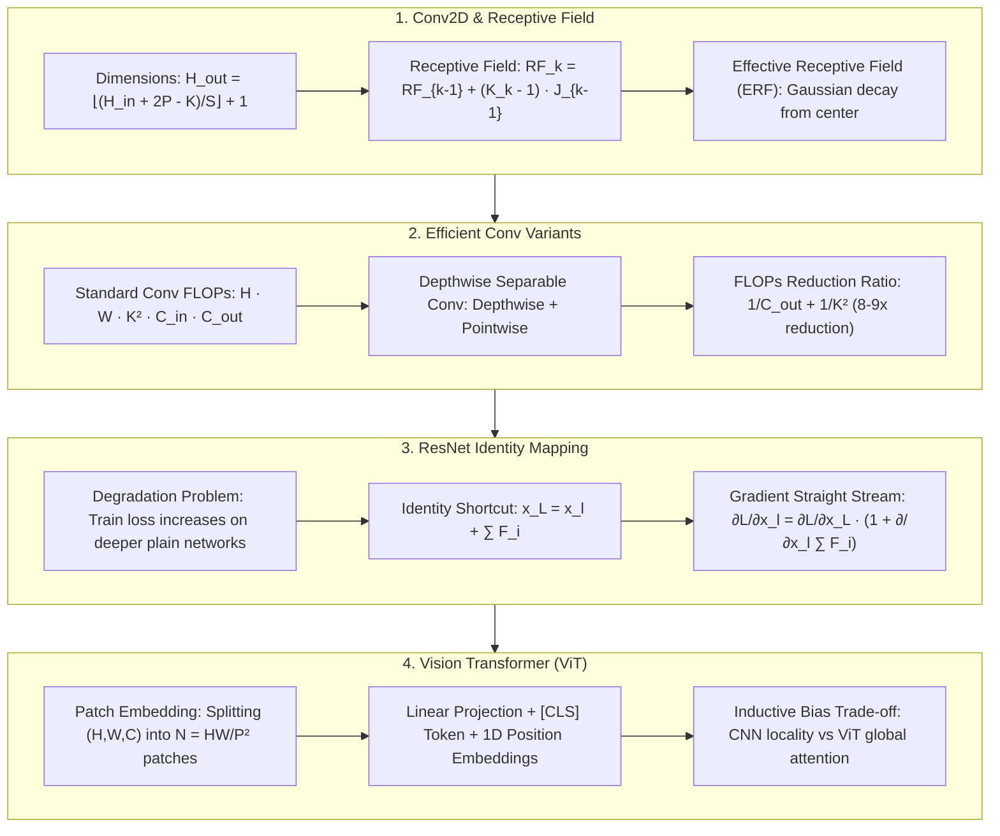

# Vision Architectures Evolution: 2D Conv, Receptive Field Calculus, Depthwise Separable Conv, ResNet Identity Mapping & Vision Transformer (ViT) Guide

> **Summary**: Computer vision architectures evolved from handcrafted local inductive biases (CNNs) to data-driven global self-attention (ViT). This 100% exhaustive guide covers 2D Conv dimensions, Receptive Field (RF/ERF) calculus, Depthwise Separable Conv FLOPs reduction, ResNet Identity Mapping gradient proofs, ViT Patch Embeddings, and CNN vs ViT Inductive Bias trade-offs with rich SEO explanatory text and Pure Numpy implementations.

---

## 🧭 Knowledge Map & Architecture Graph



> 💡 **Intuition**: The whole vision story is a trade-off between "handcrafted priors" and "data-learned patterns". Receptive field: $RF_k = RF_{k-1} + (K_k-1)J_{k-1}$ — stride is the "magnifier" that makes deep-layer pixels see huge input areas; the Effective RF is actually Gaussian-shaped from the center. Depthwise separable conv is "separate the space mixing from the channel mixing" — 3×3 costs ~1/9 of a standard conv. ResNet's identity shortcut is a gradient highway: the constant 1 in $\partial L/\partial x_l = \partial L/\partial x_L(1 + \partial\sum F/\partial x_l)$ can never vanish. ViT chops the image into patches and lets global attention find the correlations CNN hard-codes.
>
> 🎤 **Quick Answer**: "Three 3×3 convs (stride 1) give RF 7 with 27 params vs 49 for one 7×7. Depthwise separable 3×3 with $C_{out}=256$: FLOPs ratio $1/256 + 1/9 \approx 0.11$, an ~9× saving. ResNet-152 trains to 1200 layers while a 56-layer plain net degrades (train error 22.5% > 20-layer's 8.8%). ViT needs JFT-300M-scale pretraining to beat ResNet-BiT, then hits 88.55% top-1."

---

## 📚 Chapter 1: Pure Numpy Vision Engine

Plain-language reading (full implementations in the zh version): `conv2d_forward` is "double for-loop convolution" — slide a window, element-wise multiply, sum; `vit_patch_embedding` does one `reshape + transpose` to cut the image into patches, then projects with `W_proj` to get tokens.

```python
import numpy as np

class PureNumpyVisionEngine:
    @staticmethod
    def conv2d_forward(x: np.ndarray, w: np.ndarray, b: np.ndarray, stride: int = 1, padding: int = 0) -> np.ndarray:
        pass
    @staticmethod
    def vit_patch_embedding(x: np.ndarray, patch_size: int, embed_dim: int, W_proj: np.ndarray) -> np.ndarray:
        pass
```

> 💡 **Intuition**: Conv = sliding window + inner product; patch embedding = reshape into patches + linear projection. The `transpose(0, 2, 4, 3, 5, 1)` in the real implementation is the whole magic of turning an image into a token sequence.
>
> 🎤 **Quick Answer**: "224×224×3, patch 16 → $N = 14^2 = 196$ patches, each flattened to $16\times16\times3 = 768$ dims, projected to $D$; with [CLS] that's 197 tokens. Example: $D=768$, the projection matrix is $768\times768$ — ViT-B/16's patch embedding layer."