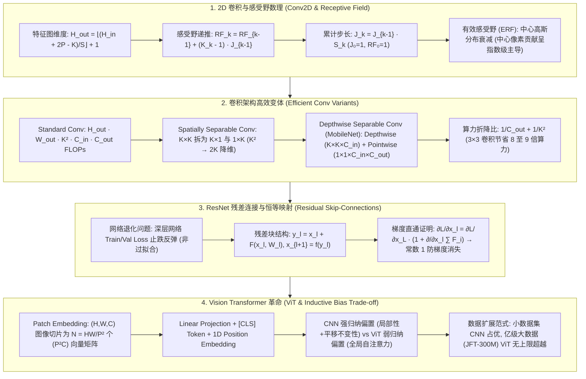

# 视觉架构演进全景：2D 卷积、感受野迭代计算、Depthwise 深度可分离卷积、ResNet 恒等残差映射与 Vision Transformer (ViT) 极客指南

> **核心摘要**：从传统的 2D 卷积神经网络 (CNN) 到打破模态壁垒的 Vision Transformer (ViT)，计算机视觉架构经历了从“人工设计局部归纳偏置”到“数据驱动全局自注意力”的伟大范式转移。本指南系统剖析系统剖析 2D 卷积维度与感受野 (Receptive Field, RF) 通用递推公式、深度可分离卷积 (Depthwise Separable Conv) 算力折降推导、ResNet 解决网络退化 (Degradation Problem) 的恒等残差映射 (Identity Mapping) 梯度直通证明、Vision Transformer (ViT) Patch Embedding 与 `[CLS]`Token 机制，以及 CNN 局部平移不变性与 ViT 全局自注意力在归纳偏置 (Inductive Bias) 上的本质权衡。全篇配备丰富的 SEO 说明性段落与 Pure Numpy 视觉算子引擎。

---

## 🧭 知识体系全景流程图 (Knowledge Map & Architecture Graph)



---

## 💡 经典面试追问与考点速查

* **考点 1**：详细推导第 $k$ 层神经网络感受野 (Receptive Field, RF) 的通用递推公式。为什么实际有效感受野 (ERF) 远小于理论感受野？
  * *标准回答*：设 $RF_{k-1}$ 为第 $k-1$ 层的感受野，$K_k$ 为第 $k$ 层的卷积核尺寸，$S_k$ 为第 $k$ 层的步长 (Stride)。定义截至第 $k-1$ 层的累计跳跃步长 (Cumulative Stride) 为 $J_{k-1} = \prod_{i=1}^{k-1} S_i$（初始 $J_0 = 1, RF_0 = 1$）。则第 $k$ 层的感受野递推公式为：
    $$RF_k = RF_{k-1} + (K_k - 1) \cdot J_{k-1}$$
    **有效感受野 (Effective Receptive Field, ERF) 理论**：理论感受野假设区域内每个像素对输出的贡献相同；然而根据反向传播链式法则，偏导数 $\frac{\partial y}{\partial x_{i,j}}$ 在感受野中心的像素上经过了最多路径的重叠累加，而在边缘像素上路径极少。中央定理证明 ERF 在二维空间呈**高斯分布**（Gaussian Distribution）衰减，只有中心标准差范围内的像素对输出产生实质影响。
* **考点 2**：深度可分离卷积 (Depthwise Separable Convolution) 相比传统 3x3 卷积降低了多少计算量？请给出严密比值推导。
  * *标准回答*：设输入特征图尺寸为 $H \times W \times C_{\text{in}}$，输出通道数为 $C_{\text{out}}$，卷积核尺寸为 $K \times K$。
    1. **标准卷积 FLOPs**：$\text{FLOPs}_{\text{std}} = H \times W \times K^2 \times C_{\text{in}} \times C_{\text{out}}$；
    2. **深度可分离卷积 FLOPs**：分为两步：
       * Depthwise 逐通道卷积：每一个通道独立使用一个 $K \times K$ 卷积核，$\text{FLOPs}_{\text{dw}} = H \times W \times K^2 \times C_{\text{in}}$；
       * Pointwise 逐点卷积：使用 $1 \times 1$ 卷积进行跨通道融合，$\text{FLOPs}_{\text{pw}} = H \times W \times 1^2 \times C_{\text{in}} \times C_{\text{out}}$；
       * 总计算量：$\text{FLOPs}_{\text{ds}} = H \times W \times C_{\text{in}} \left( K^2 + C_{\text{out}} \right)$；
    3. **计算量折降比值**：
       $$\text{Ratio} = \frac{\text{FLOPs}_{\text{ds}}}{\text{FLOPs}_{\text{std}}} = \frac{H W C_{\text{in}} (K^2 + C_{\text{out}})}{H W K^2 C_{\text{in}} C_{\text{out}}} = \frac{K^2 + C_{\text{out}}}{K^2 C_{\text{out}}} = \frac{1}{C_{\text{out}}} + \frac{1}{K^2}$$
    当使用最常见的 $K=3$ 卷积核且输出通道数 $C_{\text{out}} \gg 9$ 时，比值约为 $\frac{1}{9} \approx 0.111$！即**深度可分离卷积将计算量与参数量暴降了 8 至 9 倍**（仅需原有的 11% 算力）！
* **考点 3**：网络退化问题 (Degradation Problem) 的本质是什么？ResNet 恒等残差映射 (Identity Mapping) 是如何从数学上证明解决梯度消失的？
  * *标准回答*：**退化问题**指随着网络层数不断加深，模型的训练集 Loss (Train Loss) 和测试集 Loss 均出现止跌反弹并急速恶化。这并非过拟合（因为 Train Loss 变大），而是由于深层非线性映射极难学习到恒等变换 $f(x)=x$。**ResNet 恒等映射证明**：设残差块表达式为 $x_{l+1} = x_l + \mathcal{F}(x_l, W_l)$。递归展开到深层 $L$：
    $$x_L = x_l + \sum_{i=l}^{L-1} \mathcal{F}(x_i, W_i)$$
    在反向传播计算损失 $\mathcal{L}$ 对浅层特征 $x_l$ 的偏导数时：
    $$\frac{\partial \mathcal{L}}{\partial x_l} = \frac{\partial \mathcal{L}}{\partial x_L} \frac{\partial x_L}{\partial x_l} = \frac{\partial \mathcal{L}}{\partial x_L} \left( 1 + \frac{\partial}{\partial x_l} \sum_{i=l}^{L-1} \mathcal{F}(x_i, W_i) \right)$$
    括号内的常数项 $1$ 确保了深层梯度 $\frac{\partial \mathcal{L}}{\partial x_L}$ 可以无衰减地**直接直通 (Shortcut Stream)** 传输回任意浅层 $x_l$！即使中间的残差导数偏导 $\frac{\partial \mathcal{F}}{\partial x_l} \to 0$，梯度也不会归零，彻底消除了梯度消失！
* **考点 4**：对比 CNN 的归纳偏置 (Inductive Bias) 与 Vision Transformer (ViT) 的全局自注意力机制，为什么 ViT 在大数据集上扩展上限更高？
  * *标准回答*：**CNN 拥有强归纳偏置**：包含了“局部性 (Locality)”与“平移不变性 (Translation Invariance)”，预先假设邻近像素相关性强且相同特征在不同位置具有一致性。这使得 CNN 在小样本数据集上收敛极快、泛化好；但强先验也限制了其对远距离全局语义联系的建模上限。**ViT 具备极弱的归纳偏置**：打破了图像二维网格结构，将图像切片展开为序列向量。在 Layer 1 就通过全局 Self-Attention 让任意两个 Patch 进行相互交互。在小数据集上由于缺乏先验容易过拟合；但在海量数据集 (JFT-300M / ImageNet-22K) 的预训练下，ViT 能从数据中自动学习到比人工先验更强大的通用视觉表征，展现出极高的容量与 Scaling Law 扩展上限。

---

## 📚 第一章：2D 卷积与感受野 (Receptive Field) 递推数理

### 1.1 2D 卷积前向传播维度计算
大白话理解：这个公式在算"卷积核在输入图上能完整滑多少步"。分子 $H_{\text{in}} + 2P - K$ 是"减去核大小后剩余可滑动的像素数"（padding 相当于给图先补一圈再滑），除以步长 $S$ 是"每步走多远"，最后 +1 是因为起点也算一次滑动。
对于输入尺寸为 $H_{\text{in}} \times W_{\text{in}}$、填充为 $P$、步长为 $S$、卷积核大小为 $K$ 的特征图，输出尺寸为：
$$H_{\text{out}} = \left\lfloor \frac{H_{\text{in}} + 2P - K}{S} \right\rfloor + 1$$

> 💡 **直观理解**：卷积核像"手电筒光斑"，以步长 $S$ 在图上扫过，每照亮一片区域就输出一个数。要维持尺寸不变，就靠 padding 补一圈（"same 卷积"），$S=1, K=3, P=1$ 时输出尺寸正好等于输入；$S=2$ 则是"跳着扫"，每层尺寸减半，这就是下采样。
>
> 🎤 **面试速答**："结论：输出尺寸由输入、核大小、padding、stride 四者决定。原理：可滑动步数为 $(H_{in} + 2P - K)/S$ 向下取整，加 1 为起点。举个例子：输入 32×32、$K=3, P=1, S=1$ 输出仍是 32×32；$S=2$ 时输出 16×16——5 次 stride-2 卷积就能把 512×512 压到 16×16。"

### 1.2 感受野 (Receptive Field) 递推求解法则
感受野定义为特征图上某个像素点在输入图像上所映射的区域大小。计算遵循自底向上的迭代推导：
* 第 0 层（输入图像）：$RF_0 = 1, J_0 = 1$；
* 第 $k$ 层累计步长：$J_k = J_{k-1} \cdot S_k$；
* 第 $k$ 层感受野：$RF_k = RF_{k-1} + (K_k - 1) \cdot J_{k-1}$。

> 💡 **直观理解**：感受野递推公式的物理解释：第 $k$ 层新增的"视角" = 该层核大小减 1，乘以"前面所有层步长的乘积"（因为前面的下采样把输入图像'按比例放大'到当前层）。所以 3×3 卷积堆叠 4 层（步长全 1）感受野是 $1 + 2\times4 = 9$；一旦中途有 stride=2，后面每层感受野立刻翻倍跳涨。有效感受野（ERF）则是另一个真相：中心像素被最多路径反复累加、边缘像素路径稀少，所以实际贡献呈高斯衰减——理论 100 的 RF，真正有效往往只有中心 20~30%。
>
> 🎤 **面试速答**："结论：感受野递推 $RF_k = RF_{k-1} + (K_k - 1)\cdot J_{k-1}$，其中 $J$ 是累计步长；ERF 呈中心高斯衰减，远小于理论值。原理：前面层的 stride 决定当前层一个像素对应输入上多大跨度，所以步长是感受野的'放大器'。举个例子：3 个 3×3 堆叠（无 stride）RF=7，等于一个 7×7 卷积但参数量只有 $3\times9=27 < 49$；ImageNet 上的 VGG 系列就是靠小核堆叠获得大感受野。"

---

## 📚 第二章：高效卷积变体全景 (Depthwise Separable & Dilated Conv)

### 2.1 深度可分离卷积 (Depthwise Separable Convolution) 拆解

大白话理解：标准卷积 = "每个输出通道都要看所有输入通道的所有位置"，耦合得又慢又重。深度可分离卷积把这件事拆成两步：先每个通道各自做一次空间卷积（Depthwise，只认"形状"不跨通道），再用 1×1 卷积跨通道融合（Pointwise，只认"通道组合"）。数学上计算量从 $K^2 C_{in} C_{out}$ 降到 $K^2 C_{in} + C_{in} C_{out}$。

1. **Depthwise Convolution (逐通道空间卷积)**：
   * 输入 $X \in \mathbb{R}^{H \times W \times C_{\text{in}}}$，使用 $C_{\text{in}}$ 个尺寸为 $K \times K \times 1$ 的单通道卷积核；
   * 仅在空间维度 $(H, W)$ 进行感知，完全不改变通道维度。输出为 $H \times W \times C_{\text{in}}$。
2. **Pointwise Convolution (逐点通道融合卷积)**：
   * 使用 $C_{\text{out}}$ 个尺寸为 $1 \times 1 \times C_{\text{in}}$ 的卷积核；
   * 在通道维度上进行线性组合与投影，输出最终张量 $H \times W \times C_{\text{out}}$。

> 💡 **直观理解**：计算量比值 $\frac{1}{C_{out}} + \frac{1}{K^2}$ 的直觉：标准卷积要对 $C_{in}$ 个输入通道各做一次 $K^2$ 卷积再混合成 $C_{out}$ 个输出；拆分后 Depthwise 只做 $K^2 C_{in}$ 次乘法，Pointwise 只做 $C_{in} C_{out}$ 次乘法。当输出通道很大（$C_{out} \gg 9$）时，成本主要由 $1/K^2$ 项主导，3×3 卷积省约 8~9 倍。
>
> 🎤 **面试速答**："结论：3×3 深度可分离卷积把计算量压到标准卷积的约 1/9。原理：标准卷积 FLOPs 正比于 $K^2 C_{in} C_{out}$，拆分后正比于 $K^2 C_{in} + C_{in} C_{out}$，比值 $\frac{1}{C_{out}}+\frac{1}{K^2}$。举个例子：MobileNet 第一层 3×3、$C_{out}=256$，比值 $\approx 1/256 + 1/9 \approx 0.114$，即节省约 8.8 倍算力——这是手机端 CNN 能跑得动的关键。"

---

### 2.2 膨胀/空洞卷积 (Dilated Convolution)
在不增加参数量与下采样（如 Pooling）降低分辨率的前提下扩大感受野。在卷积核元素之间插入空洞率 $d - 1$ 个零：
$$K' = K + (K - 1)(d - 1)$$
当 $K=3, d=2$ 时，有效卷积核尺寸扩大至 $K' = 3 + 2 \times 1 = 5$，感受野急剧扩大。被广泛应用于图像语义分割 (DeepLab) 与语音合成 (WaveNet)。

> 💡 **直观理解**：空洞卷积是"给卷积核塞空格子"：参数和计算量不变，但每个格子的间距拉大，3×3 的核按间距 2 放下去覆盖了 5×5 的区域。相当于"花 3×3 的钱，买 5×5（或更大）的视野"，且不需要池化降分辨率——分割任务既要大感受野又要保留细节分辨率，所以 DeepLab 爱用它。
>
> 🎤 **面试速答**："结论：空洞卷积用不变参数量扩大感受野。原理：有效核大小 $K' = K + (K-1)(d-1)$，采样点之间隔 $d-1$ 个位置。举个例子：3×3 核、$d=2$ 时 $K'=5$，感受野从 3 变 5 而参数量仍是 9；DeepLab 用 $d=6,12,18$ 的金字塔并行抓多尺度上下文。"

---

## 📚 第三章：ResNet 恒等残差映射与梯度直通证明

### 3.1 残差块 (Residual Block) 与 Bottleneck 结构

```text
  普通前向连接 (Plain Network)               ResNet 残差连接 (Identity Shortcut)
       x                                            x
       │                                            ├───┐ (Identity Shortcut Straight Stream)
     [Weight]                                     [Weight]
       │                                            │
     [ReLU]                                       [ReLU]
       │                                            │
     [Weight]                                     [Weight]
       │                                            │
       ▼                                            ▼
    f(x)                                        F(x) + x  <── 元素级相加 (Element-wise Addition)
```

对于深层 ResNet-50 / 101 / 152，采用 **Bottleneck 瓶颈结构**：$1 \times 1 \text{ Conv (降维)} \to 3 \times 3 \text{ Conv} \to 1 \times 1 \text{ Conv (升维)}$，在大幅降低 FLOPs 计算开销的同时保证特征表达。

> 💡 **直观理解**：残差连接就是"给梯度修了一条高速公路"：普通网络梯度必须穿过重重非线性层才能回传（像走小路，越走越没力）；ResNet 的恒等捷径让 $x$ 原样加到输出上，反向传播时梯度沿这条"短路"直通回浅层，公式里的常数 1 就是那条免费的高速路。退化问题的本质是"深层网络学不会恒等映射 $f(x)=x$"——残差网络把这摊责任外包给了捷径：学不好就学 0，输出仍保底等于输入。
>
> 🎤 **面试速答**："结论：ResNet 通过恒等捷径让梯度 $\partial L/\partial x_l = \partial L/\partial x_L \cdot (1 + \partial(\sum F)/\partial x_l)$ 里恒有一个常数 1 直通，消除梯度消失；退化问题是指深层网络 Train Loss 也变差，与过拟合无关。原理：$x_L = x_l + \sum F_i$，对 $x_l$ 求导必然出现 1。举个例子：56 层 plain 网络 Train Error 22.5% 反而高于 20 层的 8.8%，而 ResNet-152 能训到 1200 层不出梯度问题；Bottleneck 用 1×1 先降维到 1/4 再升维，FLOPs 大降。"

### 4.1 Patch Embedding 矩阵切片与序列化过程

大白话理解：ViT 把图像当成"一句话"来读：先把图像切成 $N$ 个小块（Patch），每个块展平成向量、线性投影成 $D$ 维 token，再像 BERT 一样在前面拼一个 `[CLS]` 分类令牌，最后加上位置编码告诉模型"每个 token 在图像里的位置"。图像从 $H \times W \times C$ 变成序列 $N \times D$，剩下的就完全是 Transformer 的活了。

对于输入图像 $X \in \mathbb{R}^{H \times W \times C}$，设定 Patch 尺寸为 $P \times P$（如 $P=16$）：
1. **图像切片**：将图像划分为 $N = \frac{H W}{P^2}$ 个不重叠的二维图像块；
2. **展平与线性投影**：每个 Patch 展平为长度为 $P^2 C$ 的向量 $x_p^i$，乘以可学习线性投影矩阵 $E \in \mathbb{R}^{(P^2 C) \times D}$ 映射为 $D$ 维 Embedding 向量；
3. **插入 `[CLS]` Token 与位置编码 (Position Embedding)**：
   类似于 BERT，在序列开头拼接一个可学习的分类向量 $x_{\text{class}} \in \mathbb{R}^{1 \times D}$，并叠加 1D 可学习位置编码 $E_{\text{pos}} \in \mathbb{R}^{(N+1) \times D}$：
   $$z_0 = \left[ x_{\text{class}}; x_p^1 E; x_p^2 E; \dots; x_p^N E \right] + E_{\text{pos}} \in \mathbb{R}^{(N+1) \times D}$$
4. **Transformer Encoder**：输送入标准多头自注意力 (MSA) 与 MLP 块中进行全局上下文交互。

> 💡 **直观理解**：CNN 与 ViT 的分水岭是"先验 vs 数据"：CNN 天生假设"邻近像素强相关、特征平移不变"（归纳偏置强），小数据上赢在起跑线，但注意力范围永远被核大小限制；ViT 第一层就让任意两个 patch 直接交互（全局注意力），小数据上因为"什么先验都没有"极易过拟合，但喂到 JFT-300M 这种规模后，从数据里学到的表征上限远超人工先验——这是 Scaling Law 的视觉版。
>
> 🎤 **面试速答**："结论：CNN 强归纳偏置（局部性+平移不变性）小数据占优，ViT 弱归纳偏置大数据上限更高。原理：CNN 用权重共享的局部卷积把先验焊死在结构里；ViT 用全局自注意力自主发现相关性，代价是样本效率低。举个例子：ImageNet-1K 上 ViT 预训练精度输给 ResNet-BiT；但 JFT-300M 预训练后 ViT-L 达到 88.55% 反超；224×224、patch=16 时序列长度 $N = 14\times14 = 196$ 个 token，加上 [CLS] 共 197。"

---

## 📚 第五章：Pure Numpy 实现视觉算子引擎 (Conv2D, Depthwise, ViT Patch)

大白话看代码：`conv2d_forward` 就是"双重 for 循环版的卷积"——在输出图上逐像素抠出输入窗口、与卷积核逐元素相乘再求和（数乘累加），padding 用 `np.pad` 补零；`vit_patch_embedding` 用一次 `reshape + transpose` 把图像切成 patch，再乘投影矩阵 `W_proj` 得到 token 序列，与 4.1 的公式一一对应。

```python
import numpy as np

class PureNumpyVisionEngine:
    @staticmethod
    def conv2d_forward(x: np.ndarray, w: np.ndarray, b: np.ndarray, stride: int = 1, padding: int = 0) -> np.ndarray:
        """标准 2D 卷积前向传播实现"""
        N, C_in, H_in, W_in = x.shape
        C_out, _, K_h, K_w = w.shape
        
        # 填充 Padding
        x_pad = np.pad(x, ((0,0), (0,0), (padding, padding), (padding, padding)), mode='constant')
        H_out = (H_in + 2 * padding - K_h) // stride + 1
        W_out = (W_in + 2 * padding - K_w) // stride + 1
        
        out = np.zeros((N, C_out, H_out, W_out))
        for i in range(H_out):
            for j in range(W_out):
                h_start, w_start = i * stride, j * stride
                x_slice = x_pad[:, :, h_start:h_start+K_h, w_start:w_start+K_w]
                # 沿 (C_in, K_h, K_w) 广播点乘求和
                for c in range(C_out):
                    out[:, c, i, j] = np.sum(x_slice * w[c, :, :, :], axis=(1, 2, 3)) + b[c]
        return out

    @staticmethod
    def vit_patch_embedding(x: np.ndarray, patch_size: int, embed_dim: int, W_proj: np.ndarray) -> np.ndarray:
        """ViT Patch Embedding 将 (N, C, H, W) 转化为 (N, Num_Patches, Embed_Dim)"""
        N, C, H, W = x.shape
        assert H % patch_size == 0 and W % patch_size == 0
        num_patches = (H // patch_size) * (W // patch_size)
        patch_dim = patch_size * patch_size * C
        
        # 切片提取并展平
        patches = x.reshape(N, C, H // patch_size, patch_size, W // patch_size, patch_size)
        patches = patches.transpose(0, 2, 4, 3, 5, 1).reshape(N, num_patches, patch_dim)
        
        # 线性投影至 embed_dim
        embeddings = patches @ W_proj # W_proj 形状为 (patch_dim, embed_dim)
        return embeddings
```

> 💡 **直观理解**：卷积实现的本质就是"滑动窗口 + 内积"，写出来比 PyTorch 的 im2col 慢得多，但逻辑完全等价；ViT 的 patch 切分靠 `transpose(0, 2, 4, 3, 5, 1)` 这种维度重排一次性完成——理解这个 reshape 顺序，就理解了 patch embedding 的全部秘密。
>
> 🎤 **面试速答**："结论：卷积 = 窗口切片 × 核内积；patch embedding = reshape 切块 + 线性投影。原理：`(N,C,H,W)` 先 reshape 成 `(N, C, H/P, P, W/P, P)` 再转置展平，得到 `(N, HW/P², P²C)`，最后 `@ W_proj` 到 D 维。举个例子：224×224×3、P=16、D=768 时，patch 数 $N=(224/16)^2=196$，投影矩阵形状为 $(16\times16\times3, 768)=(768, 768)$。"

---

## 📚 第六章：总结与选型路线图

1. **边缘与轻量级设备**：选择基于 Depthwise Separable Conv 的 MobileNet 架构；
2. **通用中等规模视觉任务**：首选 ResNet-50 / ConvNeXt，具备极佳的收敛稳定性与局部特征拟合；
3. **超大规模与多模态大模型**：首选 Vision Transformer (ViT) / Swin Transformer，通过海量预训练突破表达上限。