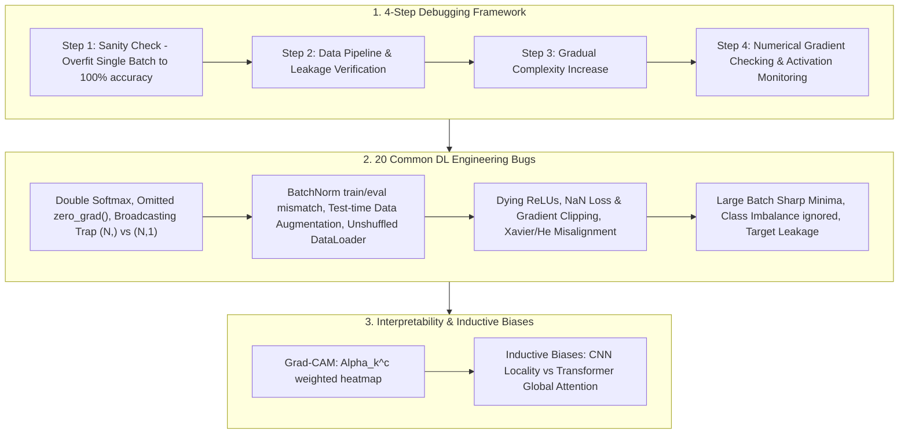

# Deep Learning Debugging & Competition Engineering Taxonomy: 4-Step Debugging Framework, Single Batch Overfitting, Gradient Check & Grad-CAM Guide

> **Summary**: Debugging deep learning models is notoriously challenging because bad code often runs without crashing while silently degrading performance. This 100% exhaustive guide covers the 4-step debugging framework (Sanity Check, Overfit Single Batch, Gradient Checking), a checklist of 20 common DL engineering bugs, Grad-CAM interpretability heatmaps, Knowledge Distillation, and architecture Inductive Biases with Pure Numpy debugging implementations.

---

## 🧭 Knowledge Map & Architecture Graph



> 💡 **Intuition**: Debugging = "falsify the code first, suspect the data second". The single-batch overfit test is a full physical exam of the training pipeline: a correct model must memorize 32 samples to 100% accuracy in ~100 steps — if it can't, the bug is in gradients/loss/shapes, not data volume. Most silent bugs fall into four buckets: forward/backward mismatch (Double Softmax), state leakage (forgot `zero_grad()`, BN train/eval), numerical pathology (unnormalized inputs, NaN), and evaluation distortion (accuracy on 99:1 data).
>
> 🎤 **Quick Answer**: "Loss stuck? Overfit a single batch of 16 with all regularization off — 100% acc proves the code is right and the problem is data/model capacity. PyTorch's defaults are the usual trap: gradients accumulate, CE already contains LogSoftmax, and `(N,1) - (N,)` silently broadcasts to an `(N,N)` loss. Example: adding Softmax before `nn.CrossEntropyLoss` squeezes gradients by ~$10^3$."

---

## 📚 Chapter 1: Pure Numpy Debugging Engine

Plain-language reading (full implementations in the zh version): `numerical_gradient_check` perturbs each parameter by ±ε and recomputes the loss to estimate the derivative by centered differences; `grad_cam_weights` averages gradients over space to get per-channel importance α_k, then weights the feature map and applies ReLU to keep only positive contributions.

```python
import numpy as np

class PureNumpyDLDebuggingEngine:
    @staticmethod
    def numerical_gradient_check(f, x: np.ndarray, eps: float = 1e-5) -> float:
        pass
    @staticmethod
    def grad_cam_weights(feature_map: np.ndarray, grads: np.ndarray) -> np.ndarray:
        pass
```

> 💡 **Intuition**: Gradient checking is "verify the formula by brute force": analytic gradients can hide derivation bugs, centered differences $(f(\theta+h) - f(\theta-h))/2h$ measure the real slope with $O(h^2)$ truncation error. Grad-CAM says "gradient is attribution": channels whose gradients toward class c are large are the ones lighting up the heatmap.
>
> 🎤 **Quick Answer**: "Relative error $<10^{-7}$ means the gradient is correct; $>10^{-2}$ means a serious bug. With $h=10^{-5}$, expect $10^{-7}$–$10^{-9}$. Example: on a 7×7 feature map, $Z=49$ spatial points are averaged to get one weight per channel."