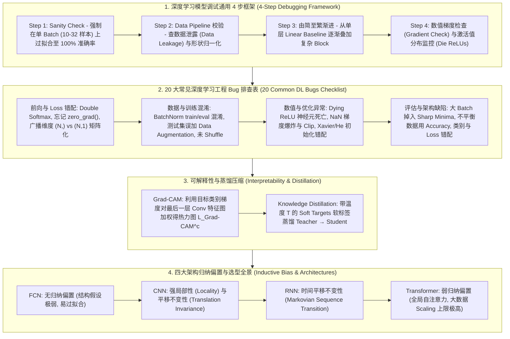

# 深度学习调试与竞赛工程全景：4 步调试框架、单 Batch 过拟合验证、数值梯度检查、20大常见工程Bug、Grad-CAM 可解释性与架构归纳偏置选型指南

> **核心摘要**：深度学习算法在工程落地与 Kaggle/KDD 竞赛中面临的最大挑战，往往不是网络结构的设计，而是漫长而痛苦的“模型调试 (Model Debugging)”过程。深度学习模型的隐蔽性极高——代码即使存在严重的逻辑 Bug（如 Data Leakage、Double Softmax、忘记清空梯度、隐式广播维度灾难），模型依然可能产生不报错的运行结果，但性能会严重劣化。本指南系统剖析深度学习 4 步调试框架（Sanity Check、单 Batch 强制过拟合、由简至繁渐进复杂度、数值梯度检查）、20 大常见工程 Bug 排查表、Grad-CAM (Gradient-weighted Class Activation Mapping) 可解释性显热图机制、Teacher-Student 知识蒸馏 (Knowledge Distillation)，以及四大基础神经网络架构在归纳偏置 (Inductive Bias) 上的本质权衡与 Pure Numpy 调试引擎实现。全篇配备丰富的 SEO 说明性段落与工程排坑实践。

---

## 🧭 知识体系全景流程图 (Knowledge Map & Architecture Graph)



---

## 💡 经典面试追问与考点速查

* **考点 1**：当一个深度学习模型 Loss 彻底无法下降 (Underfitting) 时，如何通过“单 Batch 过拟合验证 (Overfit Single Batch)”方法快速定位是代码 Bug 还是数据问题？
  * *标准回答*：**Overfit Single Batch** 是深度学习调试中最强大、最第一优先级的基准测试 (Sanity Check)。操作步骤为：截取包含 10 至 32 个样本的单个 Mini-batch 数据，关闭所有 Regularization (如 Dropout、Weight Decay、Data Augmentation)，保持超参数不变在改 Mini-batch 上训练 50 至 100 个 Epoch。
    * **期望现象**：一个正确的模型代码必须能够迅速在单个 Batch 上达到 **100% 训练准确率 (Training Accuracy = 1.0) 且 Train Loss 趋近于 0**！
    * **诊断结论**：若单个 Batch 无法过拟合，必定存在严重的代码级 Bug（如 Loss 函数计算错误、标签 One-hot 编码维度错位、反向传播未正常计算）；若单 Batch 能 100% 过拟合，但在全量数据集上无法收敛，则说明模型容量不足、学习率不匹配或数据清洗存在严重问题。
* **考点 2**：详细推导数值梯度检查 (Numerical Gradient Checking) 的双边有限差分公式，并说明容忍误差 $\epsilon$ 取 $10^{-7}$ 的原因。
  * *标准回答*：为了验证自定义 PyTorch / C++ CUDA 算子的解析梯度 (Analytical Gradient $\frac{\partial \mathcal{L}}{\partial \theta}$) 是否正确，利用双边有限差分法 (Centered Finite Difference) 计算数值梯度 (Numerical Gradient)：
    $$g_{\text{num}}(\theta_i) = \frac{\mathcal{L}(\theta_1, \dots, \theta_i + h, \dots, \theta_n) - \mathcal{L}(\theta_1, \dots, \theta_i - h, \dots, \theta_n)}{2h}$$
    通过二阶泰勒展开，双边有限差分的截断误差为 $O(h^2)$（比单边差分的 $O(h)$ 精确得多）。通常取扰动步长 $h = 10^{-5}$。比较解析梯度 $g_{\text{ana}}$ 与数值梯度 $g_{\text{num}}$ 的**相对误差 (Relative Error)**：
    $$\text{Relative Error} = \frac{\|g_{\text{ana}} - g_{\text{num}}\|_2}{\|g_{\text{ana}}\|_2 + \|g_{\text{num}}\|_2}$$
    * 若 Relative Error $< 10^{-7}$：说明梯度算子实现彻底正确；
    * 若 Relative Error $> 10^{-2}$：说明梯度推导存在严重错误！
* **考点 3**：为什么在 PyTorch 中使用 `nn.CrossEntropyLoss()` 时，若在模型输出层显式加了 `Softmax` 激活函数会导致梯度严重削弱？
  * *标准回答*：PyTorch 的 `nn.CrossEntropyLoss()` 在内部已经高度集成并优化了 **`LogSoftmax` + `NLLLoss`** 的算子。若在模型网络定义 `forward()` 的最后一层显式写了 `x = F.softmax(x, dim=1)`，再传入 `nn.CrossEntropyLoss(x, target)`，就导致数据经历了**双重 Softmax 操作 (Double Softmax)**！原本经 Softmax 后的输出概率值在 $(0, 1)$ 之间，第二次 LogSoftmax 会使得输入值极度挤压，反向传播时导数趋于零（Squeezed Gradients），引发极难收敛的“伪梯度消失”！
* **考点 4**：推导 Grad-CAM (Gradient-weighted Class Activation Mapping) 通道权重 $\alpha_k^c$ 的计算公式，它与 CAM 有何本质区别？
  * *标准回答*：**CAM** 要求模型必须在卷积层后强制紧跟 Global Average Pooling (GAP) 层，限制了网络结构自由度。**Grad-CAM** 突破了此限制，利用目标类别 $c$ 的未归一化得分 (Logit) $y^c$ 对最后一个卷积层特征图 $A^k$ 的梯度积分作为权重：
    $$\alpha_k^c = \frac{1}{Z} \sum_{i=1}^U \sum_{j=1}^V \frac{\partial y^c}{\partial A_{i,j}^k}$$
    其中 $Z = U \times V$ 为特征图的空间像素个数。权重 $\alpha_k^c$捕获了第 $k$ 个特征图对预测类别 $c$ 的重要程度。加权求和并经过 **ReLU** 激活（仅保留对该类别有积极正面贡献的特征），生成粗粒度热力图：
    $$L_{\text{Grad-CAM}}^c = \text{ReLU}\left( \sum_k \alpha_k^c A^k \right)$$
* **考点 5**：对比 FCN、CNN、RNN 与 Transformer 的归纳偏置 (Inductive Bias)，为什么 Transformer 极其依赖超大规模预训练数据？
  * *标准回答*：**归纳偏置 (Inductive Bias)** 是指学习算法对未见数据做出的先验假设：
    * **CNN**：具有强烈的**局部性 (Locality)** 与**平移不变性 (Translation Invariance)** 先验（默认相邻像素强相关，相同模式在不同位置含义一致），因此在小数据集上极不易过拟合；
    * **RNN**：具有**时间序列平移不变性 (Temporal Invariance)** 先验（马尔可夫链继承）；
    * **Transformer**：**归纳偏置极弱**！全图任意两个 Token 之间均可进行全局 Self-Attention 交互，模型没有预先假设局部相关性。这种弱假设赋予了 Transformer 几乎无限的表达上限，但代价是模型在小数据集上极易过拟合，**必须依赖海量预训练数据 (如 JFT-300M, CommonCrawl) 才能自适应学习出数据底层的先验结构**！

---

## 📚 第一章：深度学习模型调试通用 4 步框架

### 1.1 4 步调试流图与 Checkpoint
1. **Sanity Check (单 Batch 强制过拟合)**：取 10-32 样本，关闭所有正则化，训练 50 步需达到 Train Acc = 1.0；
2. **Data & Pipeline Verification (数据泄露核查)**：检查训练集与验证集是否有重叠、标准化统计量 (Mean/Std) 是否在验证集上泄漏；
3. **Gradual Complexity Increase (从极简 Baseline 推进)**：先训练 1 层 Linear / Logistic，再替换为简版 CNN/ResNet；
4. **Gradient & Activation Monitoring (梯度与激活值分布)**：打印各层激活值均值与标准差，防止 Dying ReLU（整层激活输出全为 0）。

> 💡 **直观理解**：这 4 步的本质是"先证伪代码，再怀疑数据"：单 Batch 过拟合是给整个训练链路做的"体检"——如果连 32 个样本都拟合不了，说明梯度/损失/形状里有 Bug，与数据量无关；过拟合通过但全量数据不收敛，才轮到怀疑数据分布、学习率、模型容量。
>
> 🎤 **面试速答**："结论：Loss 不降先做单 Batch 过拟合验证，能过拟合是代码问题，不能过拟合是数据/容量问题。原理：正确的代码必然能记住任意 32 个样本；100% 过拟合排除了梯度、Loss、形状三类 Bug。举个例子：取 batch=16、关掉 Dropout 与 weight decay、lr 保持 1e-3 训 50~100 步，Train Acc 必须到 1.0；若卡在 60%，优先检查 `loss.backward()` 前是否 `zero_grad()`、标签是否 one-hot 错位。"

---

## 📚 第二章：20 大常见深度学习工程 Bug 排查表 (20 DL Engineering Bugs Checklist)

怎么读这张表：面试与排错最常抽到的四类高发坑集中在第 1（Double Softmax）、2（忘 zero_grad）、3（BN train/eval 混淆）、4（广播陷阱）行——它们的共同特点是"不报错但性能悄悄劣化"，背住"现象 → 根因 → 修复"三列即可现场作答；第 8 行大 Batch 掉 Sharp Minima 是分布式训练面试的必问点。

| 序号 | 常见 Bug 现象与坑点 | 产生数理根因与隐蔽性 | 标准工程修复方案 |
| :---: | :--- | :--- | :--- |
| **1** | **Double Softmax 梯度削弱** | PyTorch `nn.CrossEntropyLoss()` 内部已包含 LogSoftmax，若输出层显式加 Softmax 会导致二次挤压与伪梯度消失 | 移除模型最后一层的 Softmax 激活函数，直接输出 Raw Logits |
| **2** | **忘记 `optimizer.zero_grad()`** | PyTorch 默认在 `loss.backward()` 时累加梯度。若未清零，各 step 梯度相加导致更新步长发散爆炸 | 在每一次 `loss.backward()` 计算前，必须显式调用 `optimizer.zero_grad()` |
| **3** | **BatchNorm 训练/评估模式混淆** | 验证/推理前忘记调用 `model.eval()`，导致模型继续更新 EMA Running Mean/Var 并使用 Batch 统计量 | 在执行 Validation / Inference 循环前，强制调用 `model.eval()`；训练前调用 `model.train()` |
| **4** | **隐式广播导致维度灾难 (Broadcasting Trap)** | 预测值 Shape 为 `(N, 1)`，Target 为 `(N,)`。减法 `y_pred - target` 会触发广播生成 `(N, N)` 矩阵算 Loss | 显式对 Target 或 Prediction 使用 `target.unsqueeze(1)` 或 `y_pred.squeeze()` 统一维度 |
| **5** | **数据泄露 (Data Leakage)** | 在全量数据集（含 Test/Val）上整体计算 `StandardScaler` 的 Mean/Std，导致验证集分布提前泄露 | 仅在 Training Split 上执行 `scaler.fit()`，测试/验证集只执行 `scaler.transform()` |
| **6** | **Dying ReLUs (ReLU 神经元批量死亡)** | 过大的 Learning Rate 或负数 Bias 初始化导致神经元输入恒小于 0，梯度的 0 乘积使参数永久无法更新 | 降低 Learning Rate，改用 Kaiming 初始化，或使用 Leaky ReLU / GELU 激活函数 |
| **7** | **测试集误加数据增强 (Data Augmentation)** | 在 Validation/Testing 阶段启用了 Random Crop / Flip 等随机增强，造成评估指标出现不合理的随机抖动 | 确保 Validation/Test DataLoader 仅使用确定性转换 (如 `Resize` + `ToTensor` + `Normalize`) |
| **8** | **超大 Batch Size 掉入 Sharp Minima** | 使用过大 Batch Size 而未等比例放缩学习率，导致梯度估计噪音过小，模型收敛于极陡峭极小值 | 按线性放缩规则 $\text{LR} \propto \text{Batch Size}$，或在前几千步启用 Learning Rate Warmup |
| **9** | **DataLoader 未开启 `shuffle=True`** | 训练集 DataLoader 默认 `shuffle=False`，使得 Batch 按照类别顺序输入，梯度的方向产生严重偏差 | 确保训练集 DataLoader 设置 `shuffle=True`；验证/测试集保持 `shuffle=False` |
| **10** | **输入特征末做归一化 (Unnormalized Input)** | 图像像素未除以 255，或表格特征未标准化。高差值量级差异导致 Loss 条件数极差，梯度方向曲折慢速 | 在数据预处理首步增加标准 Z-Score 规范化 $x' = (x - \mu) / \sigma$ 或 MinMax 缩放 |
| **11** | **NaN 损失与梯度爆炸 (Gradient Exploding)** | 深层网络或 RNN 缺乏梯度截断，梯度在连乘中超出浮点数上限变为 `Inf` / `NaN` | 使用 `torch.nn.utils.clip_grad_norm_(model.parameters(), max_norm=1.0)` 进行梯度裁剪 |
| **12** | **全零初始化 (All-Zero Init) 对称性困境** | 权重全设为 0 导致同一层所有神经元输出完全相同，反向传播计算的梯度也完全一致，无法打破对称 | 根据激活函数类型使用 Xavier Normal (Tanh) 或 Kaiming Normal (ReLU) 随机初始化 |
| **13** | **混淆 One-Hot 与 Sparse 分类损失** | 传入整数类别索引却调用 `categorical_crossentropy`，引发类型报错或非预期概率交叉熵 | 整数标签匹配 `sparse_categorical_crossentropy`；One-hot 向量匹配 `categorical_crossentropy` |
| **14** | **忽略类别严重不平衡 (Class Imbalance Ignore)** | 在 99:1 的高度不平衡数据集上直接计算 Accuracy 准确率，模型即使全预测负例也有 99% 假高分 | 评估改用 AUC-ROC / PR-AUC，损失函数改用 Focal Loss、Weighted Cross Entropy 或 SMOTE 重采样 |
| **15** | **多损失项量级不匹配 (Multi-Loss Misalignment)** | 主损失 $L_1 = 100$ 与辅助损失 $L_2 = 0.01$ 直接相加，导致小损失梯度完全被吞没覆盖 | 增加标量权重 $\mathcal{L} = \alpha L_1 + \beta L_2$，使各 Loss 在同一数量级，或采用 GradNorm 动态平衡 |
| **16** | **学习率衰减 (LR Decay) 速度过快** | Cosine / Step LR 衰减策略设置过于激进，在模型尚未接近收敛高原前就把学习率降到了 0 | 延后 LR Decay 的起始 Epoch，增加 Warmup 步数，或使用 ReduceLROnPlateau 动态调整 |
| **17** | **未冻结 Pretrained Backbone 导致破坏** | 微调迁移学习时直接全网以大学习率训练，预训练权重在第一个 Epoch 即被随机初始化的 Head 破坏 | 初始阶段先冻结 Backbone 仅训练 Head，待 Head 收敛后再解冻整网使用微弱学习率 (1e-5) 微调 |
| **18** | **CPU / GPU 张量跨设备混淆 (Device Mismatch)** | 在计算 Loss 或拼接 Tensor 时，部分张量在 CPU 上而部分在 CUDA GPU 上，触发 `RuntimeError` | 使用 `device = torch.device("cuda" if torch.cuda.is_available() else "cpu")` 统一 `.to(device)` |
| **19** | **未来特征泄露 (Target Leakage via Future Features)** | 在时序预测中将事后产生的特征（如用户退货时间戳）混入预测输入中，上线后模型效果崩溃 | 严格按照时间戳建立严格的时间切片防御（As-of Date），清洗未来数据泄露 |
| **20** | **数据漂移与语义偏移 (Covariate & Concept Shift)** | 生产线上线后输入分布 $p(x)$ 或条件分布 $p(y\|x)$ 发生偏移，模型出现未报警的渐进式性能下滑 | 建立线上 Data Drift 监控机制（Population Stability Index, PSI），定期触发自动化重训流水线 |

> 💡 **直观理解**：20 个 Bug 可归为四类病根：**前后向不匹配**（Double Softmax、one-hot 错位——模型"以为"在学 A 其实在学 B）、**状态泄漏**（忘 zero_grad、BN train/eval、验证集标准化——训练和推理用的统计量不是同一套）、**数值病态**（未归一化、NaN、梯度爆炸——损失曲面条件数极差）、**评估失真**（类别不平衡用 Accuracy、测试集加增强——指标算出来的分数不代表真实能力）。记住这个分类，20 条只需背 4 个根因。
>
> 🎤 **面试速答**："结论：大多数'不报错但训练差'的问题都落在三类：梯度状态、归一化统计量、标签/损失错配。原理：PyTorch 默认梯度累加、BN 默认用 batch 统计量、CE 默认内部做 LogSoftmax——框架的默认行为与你的直觉不一致就会埋雷。举个例子：`(N,1)` 减 `(N,)` 会广播成 `(N,N)` 矩阵，loss 悄悄放大 N 倍而不报错；`nn.CrossEntropyLoss` 前手动加 Softmax 后梯度缩到原来的约 $1/10^3$ 量级。"

---

## 📚 第三章：Pure Numpy 实现调试与可解释性算子引擎

大白话看代码：`numerical_gradient_check` 在逐参数执行"左右各捅一下"——把第 $i$ 个参数分别加/减 $\epsilon$ 重算损失，用差分近似导数，再与解析梯度对比；`grad_cam_weights` 先把梯度沿空间平均得到每个通道的"重要度" $\alpha_k$，再对特征图加权求和并用 ReLU 滤掉负贡献——这就是"哪里让模型最坚定地认为这是猫"的热力图。

```python
import numpy as np

class PureNumpyDLDebuggingEngine:
    @staticmethod
    def numerical_gradient_check(f, x: np.ndarray, eps: float = 1e-5) -> float:
        """双边有限差分数值梯度检查 (Numerical Gradient Checking)"""
        grad_num = np.zeros_like(x)
        it = np.nditer(x, flags=['multi_index'], op_flags=['readwrite'])
        
        # 计算解析导数 f(x)
        fx = f(x)
        
        while not it.finished:
            idx = it.multi_index
            old_val = x[idx]
            
            # f(x + eps)
            x[idx] = old_val + eps
            pos = f(x)
            
            # f(x - eps)
            x[idx] = old_val - eps
            neg = f(x)
            
            # 恢复原值
            x[idx] = old_val
            
            # 双边差分: (f(x+eps) - f(x-eps)) / (2*eps)
            grad_num[idx] = (pos - neg) / (2.0 * eps)
            it.iternext()
            
        return grad_num
    @staticmethod
    def grad_cam_weights(feature_map: np.ndarray, grads: np.ndarray) -> np.ndarray:
        """Grad-CAM 通道权重 α_k^c 计算与热力图合成 (ReLU 激活)"""
        # feature_map 维度 (C, H, W), grads 维度 (C, H, W)
        # 1. 对空间维度 (H, W) 求全局平均得到通道重要度 alpha_k
        alpha_k = np.mean(grads, axis=(1, 2), keepdims=True)  # (C, 1, 1)
        
        # 2. 特征图线性加权组合
        cam = np.sum(alpha_k * feature_map, axis=0)  # (H, W)
        
        # 3. 应用 ReLU 过滤负正面贡献
        cam = np.maximum(0, cam)
        
        # 归一化到 [0, 1]
        if np.max(cam) > 0:
            cam = cam / np.max(cam)
        return cam
```

> 💡 **直观理解**：数值梯度检查是"用定义验证实现"——解析梯度是公式推导出来的，可能有推导错误；数值差分直接拿损失函数当黑盒"实测"导数，两条路对得上才说明实现正确。Grad-CAM 的思路则是"梯度就是归因"：某个通道对类别 $c$ 的 logit 贡献越大（梯度大），该通道的特征图在热力图中越亮。
>
> 🎤 **面试速答**："结论：梯度检查用双边差分 $g_{num}=(f(\theta+h)-f(\theta-h))/2h$ 验证解析梯度，相对误差 < $10^{-7}$ 为正确。原理：双边差分截断误差 $O(h^2)$，比单边 $O(h)$ 高一阶；相对误差按范数归一化避免量级误导。举个例子：$h=10^{-5}$ 时典型相对误差 $10^{-7} \sim 10^{-9}$；若 $>10^{-2}$ 基本是推导错误；Grad-CAM 对 7×7 特征图求 $\alpha_k^c$ 时，$Z=49$ 个空间点做平均。"

---

## 📚 第四章：总结与选型路线图

1. **新项目开工准则**：第一天务必先完成 **Overfit Single Batch** 验证，确认 Pipeline 无 Bug 后再扩展数据集与复杂网络；
2. **模型可解释性**：上线前使用 **Grad-CAM** 可视化模型注意区域，防止模型学到背景水印等假相关特征 (Spurious Correlation)；
3. **架构选型与数据规模**：数据量 $<10$ 万选 **CNN / ResNet**（强归纳偏置防过拟合）；数据量 $>1000$ 万必选 **ViT / Transformer**（弱归纳偏置 Scaling 上限更高）。