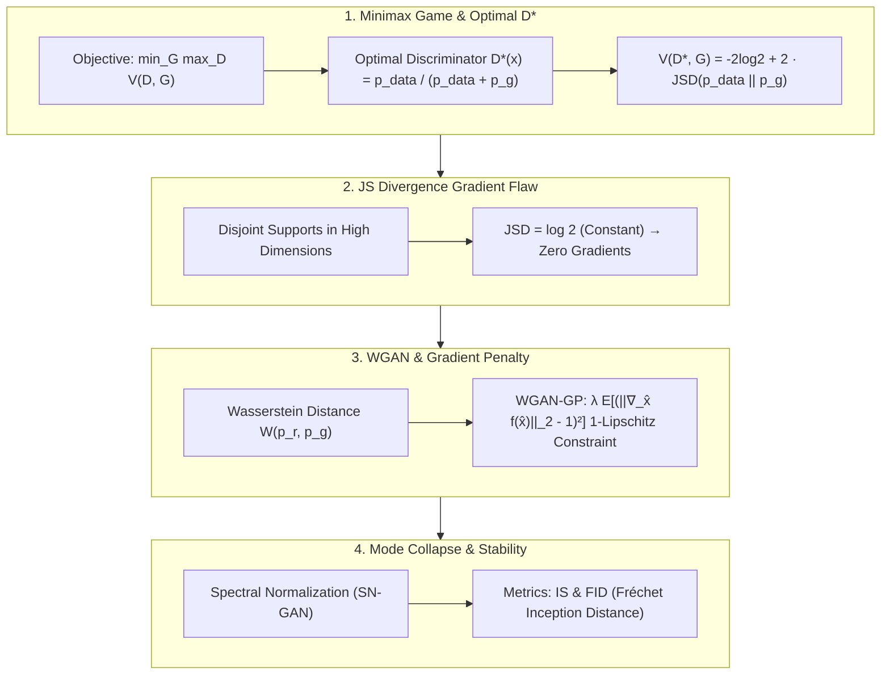

# Generative Adversarial Networks (GAN) Taxonomy: Minimax Game, JS Divergence Flaw, WGAN Earth Mover Distance & WGAN-GP Guide

> **Summary**: Generative Adversarial Networks (GANs) frame generative modeling as a two-player zero-sum game between a Generator and Discriminator. This 100% exhaustive guide covers Minimax game formulation, optimal discriminator D*(x) proof, JS divergence vanishing gradient flaws, WGAN Earth Mover distance derivations, WGAN-GP Gradient Penalty, Spectral Normalization, and Pure Numpy implementations with rich SEO explanatory text.

---

## 🧭 Knowledge Map & Architecture Graph



> 💡 **Intuition**: GAN training is a counterfeit-money game: the discriminator learns to be a good judge, the generator learns to forge. With the optimal judge $D^*(x) = p_{data}/(p_{data}+p_g)$, the objective becomes $-2\log 2 + 2\cdot JSD$ — and in high dimensions the real and generated images live on non-overlapping manifolds, so JSD is a constant $\log 2$ with zero gradient: the generator gets no signal at all. Wasserstein distance fixes this by measuring "earth-mover cost" — it stays smooth and linear ($W = \theta$) even for disjoint distributions — and WGAN-GP enforces the required 1-Lipschitz critic via the penalty $\lambda\mathbb{E}[(\|\nabla_{\hat x} f\|_2 - 1)^2]$ instead of fragile weight clipping.
>
> 🎤 **Quick Answer**: "KL diverges to $+\infty$ and JS is stuck at $\log 2$ (zero gradient) for two point-masses at 0 and $\theta$, while $W = \theta$ grows linearly — that's why WGAN trains. Mode collapse = the generator only draws digit '1'; mitigation: WGAN-GP, spectral normalization, Unrolled GAN. FID (not eyes) is the metric: lower is better."

---

## 📚 Chapter 1: Pure Numpy GAN Engine

Plain-language reading (full implementations in the zh version): `minimax_loss` translates the original GAN objective — the discriminator is penalized for both missing real images and accepting fakes; `wgan_gp_critic_loss` computes the Wasserstein estimate (mean fake score − mean real score) plus the gradient penalty that pulls $\|\nabla_{\hat x} f\|_2$ toward 1 on interpolated points $\hat x = \epsilon x + (1-\epsilon)G(z)$.

```python
import numpy as np

class PureNumpyGANEngine:
    @staticmethod
    def wgan_gp_critic_loss(f_real: np.ndarray, f_fake: np.ndarray, grad_hat: np.ndarray, lambda_gp: float = 10.0) -> float:
        pass
```

> 💡 **Intuition**: The critic is a "scoring judge" without the final Sigmoid: it outputs an unconstrained score, and the score gap between real and fake approximates the Wasserstein distance — as long as the score function stays 1-Lipschitz.
>
> 🎤 **Quick Answer**: "WGAN loss = $\mathbb{E}[f_{fake}] - \mathbb{E}[f_{real}] + \lambda\,GP$ with $\lambda=10$ default; the GP term is computed on random interpolations between real and fake samples so the Lipschitz constraint holds everywhere, not just at the samples."