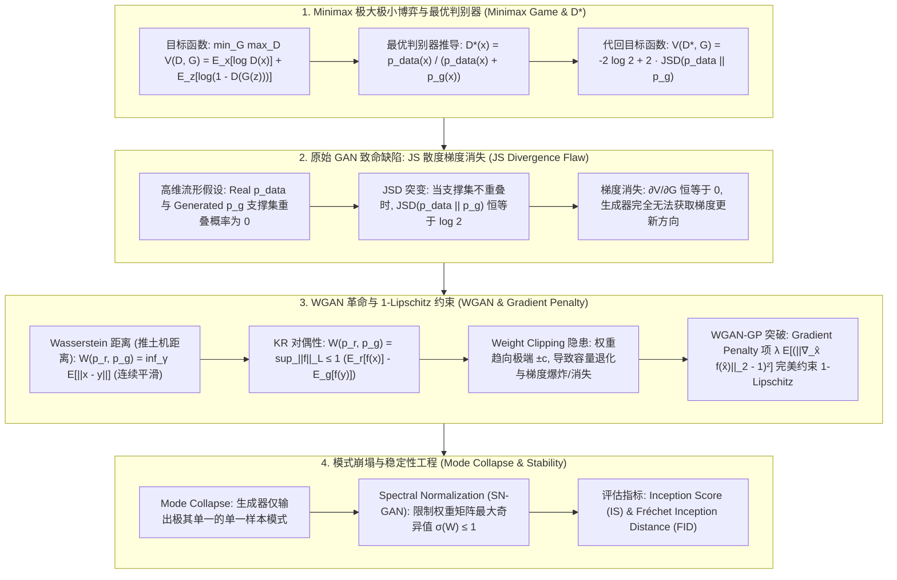

# 生成对抗网络 (GAN) 全景：Minimax 博弈、JS 散度缺陷、WGAN Wasserstein 距离推导、WGAN-GP 梯度惩罚与 Mode Collapse 极客指南

> **核心摘要**：生成对抗网络 (Generative Adversarial Networks, GAN) 是深度学习领域最具震撼力的隐式生成模型 (Implicit Generative Models) 之一。通过生成器 (Generator) 与判别器 (Discriminator) 之间的双人零和博弈 (Two-Player Zero-Sum Game)，GAN 能够学习极其复杂的高维数据分布。然而，原始 GAN 面临着训练极度不稳定的致命难题。本指南系统剖析 Minimax 目标函数、最优判别器 $D^*(x)$ 数学推导、JS 散度在高维流形不重叠时引发梯度消失的物理成因、WGAN 引入 Wasserstein 距离（推土机距离）及 Kantorovich-Rubinstein 对偶性的证明、WGAN-GP 梯度惩罚 (Gradient Penalty) 与谱归一化 (Spectral Normalization)，以及模式崩塌 (Mode Collapse) 的数理防御机制。全篇配备丰富的 SEO 说明性段落与 Pure Numpy GAN 算子引擎。

---

## 🧭 知识体系全景流程图 (Knowledge Map & Architecture Graph)



---

## 💡 经典面试追问与考点速查

* **考点 1**：详细推导 GAN 原始 Minimax 目标函数在固定生成器 $G$ 时，最优判别器 $D^*(x)$ 的闭式解表达式。
  * *标准回答*：GAN 的 Minimax 目标函数定义为：
    $$V(D, G) = \mathbb{E}_{x \sim p_{\text{data}}(x)}[\log D(x)] + \mathbb{E}_{z \sim p_z(z)}[\log (1 - D(G(z)))] = \int_{x} \left[ p_{\text{data}}(x) \log D(x) + p_g(x) \log(1 - D(x)) \right] dx$$
    由于积分项内部各点 $x$ 相互独立，为了使 $V(D, G)$ 极大化，只需极大化对于每一个 $x$ 的标量函数 $f(y) = a \log(y) + b \log(1 - y)$（其中 $a = p_{\text{data}}(x), b = p_g(x), y = D(x)$）。求一阶导数并令其归零：
    $$f'(y) = \frac{a}{y} - \frac{b}{1 - y} = 0 \implies a(1 - y) = b y \implies y = \frac{a}{a + b}$$
    代回变量名，导出最优判别器 **$D^*(x)$ 的闭式解**：
    $$D^*(x) = \frac{p_{\text{data}}(x)}{p_{\text{data}}(x) + p_g(x)}$$
    当生成分布与真实分布完全重合（$p_g(x) = p_{\text{data}}(x)$）时，$D^*(x) = \frac{1}{2}$，代表判别器彻底无法区分真假样本，博弈达到纳什均衡 (Nash Equilibrium)！
* **考点 2**：证明将 $D^*(x)$ 代回目标函数后推出的 $2 \cdot \text{JSD}(p_{\text{data}} \parallel p_g) - 2 \log 2$，并解释为什么高维空间下 JS 散度会导致生成器梯度消失？
  * *标准回答*：将 $D^*(x) = \frac{p_{\text{data}}}{p_{\text{data}} + p_g}$ 代回 $V(D^*, G)$：
    $$V(D^*, G) = \int_{x} \left[ p_{\text{data}}(x) \log \frac{p_{\text{data}}(x)}{p_{\text{data}}(x) + p_g(x)} + p_g(x) \log \frac{p_g(x)}{p_{\text{data}}(x) + p_g(x)} \right] dx$$
    结合 KL 散度与 JS 散度定义：$\text{JSD}(P \parallel Q) = \frac{1}{2} \text{KLD}\left(P \parallel \frac{P+Q}{2}\right) + \frac{1}{2} \text{KLD}\left(Q \parallel \frac{P+Q}{2}\right)$。展开整理得：
    $$V(D^*, G) = -2 \log 2 + 2 \cdot \text{JSD}(p_{\text{data}} \parallel p_g)$$
    **梯度消失的致命原因**：在高维真实图像空间中，真实分布 $p_{\text{data}}$ 与生成分布 $p_g$ 通常处于低维流形上，**两者重叠支撑集的概率几乎为 0**！当两分布没有交集时，它们的 JS 散度恒等于常数 $\text{JSD}(p_{\text{data}} \parallel p_g) \equiv \log 2$。此时 $V(D^*, G) \equiv 0$，其对生成器参数的梯度 $\nabla_G V \equiv 0$，导致生成器完全接收不到更新梯度！
* **考点 3**：对比 KL 散度、JS 散度与 Wasserstein 距离 (Earth Mover Distance)，为什么 Wasserstein 距离在分布完全不重叠时依然具备连续可导性？
  * *标准回答*：考虑一维简单分布：$P_1$ 为 $x=0$ 上的单点分布，$P_2$ 为 $x=\theta$ 上的单点分布（$\theta > 0$）：
    * **KL 散度**：$\text{KLD}(P_1 \parallel P_2) = +\infty$（当 $\theta \neq 0$ 时）；
    * **JS 散度**：$\text{JSD}(P_1 \parallel P_2) = \log 2$（当 $\theta \neq 0$ 时恒为常数，导数为 0）；
    * **Wasserstein 距离**：$W(P_1, P_2) = |\theta|$。
    Wasserstein 距离代表将分布 $P_1$ 搬运移动重塑为 $P_2$ 所需的最小“功”（质量 $\times$ 搬运距离）。**即使两个分布完全没有交集，Wasserstein 距离依然能够线性度量它们之间的物理几何距离 $|	heta|$**，保持极其平滑的连续可导性，为生成器提供稳定有力的梯度指引！
* **考点 4**：WGAN 原始论文中的 Weight Clipping 存在什么严重隐患？WGAN-GP 是如何通过 Gradient Penalty 完美保障 1-Lipschitz 约束的？
  * *标准回答*：WGAN 依靠 Kantorovich-Rubinstein 对偶性要求判别器（Critic）函数 $f_w$ 必须满足 **1-Lipschitz 连续约束**（即梯度模长 $\|\nabla_x f_w(x)\| \le 1$）。WGAN 初始采用 **Weight Clipping**（将权重简单强制截断到 $[-c, c]$），带来两大隐患：
    1. **容量退化与参数极端化**：权重会迅速全部堆积在两个极值点 $-c$ 与 $+c$ 上，导致判别器丧失拟合复杂高维分布的能力；
    2. **梯度爆炸与梯度消失风险**：若截断阈值 $c$ 稍大或稍小，梯度会沿深层指数级放大或衰减。
    **WGAN-GP (Gradient Penalty)** 提出了软约束惩罚项：直接在 Loss 中对插值点 $\hat{x} = \epsilon x + (1-\epsilon) y$ 的梯度模长是否偏离 $1$ 进行二阶惩罚：
    $$\mathcal{L}_{GP} = \mathbb{E}_{\hat{x} \sim p_{\hat{x}}} \left[ \left( \| \nabla_{\hat{x}} f_w(\hat{x}) \|_2 - 1 \right)^2 \right]$$
    这种方式在全空间平滑逼近 1-Lipschitz 约束，完美解决了 Weight Clipping 的参数极化问题！
* **考点 5**：解释 GAN 训练中的模式崩塌 (Mode Collapse) 现象，并列举 3 种现代防范工程手段。
  * *标准回答*：**Mode Collapse** 是指生成器发现生成某种特定样式（如 MNIST 中的数字“1”）能够极易欺骗判别器，于是生成器放弃学习整个数据分布的多样性，只不断重复输出这种单一或极少数模式的样本。**防范手段**：
    1. **WGAN-GP / 谱归一化 (Spectral Normalization)**：通过严格约束 Critic 的 1-Lipschitz 连续性，防止判别器梯度陡峭崩塌；
    2. **Unrolled GAN**：在更新 Generator 时，向前预演 (Unroll) $k$ 步 Discriminator 的更新，使生成器能够预判判别器的反制策略；
    3. **Minibatch Discrimination**：允许判别器在单个 Batch 内比较样本之间的相似度，若发现生成样本高度雷同则判定为假。

---

## 📚 第一章：Minimax 零和博弈与最优化判别器数理推导

### 1.1 原始 GAN 博弈前向表达
大白话理解：这是一个"造假钞者 vs 验钞员"的零和博弈。生成器 $G$ 从随机噪声 $z$ 造出假图；判别器 $D$ 输出"这张图是真的吗"的概率。判别器想最大化 $V$（认出真图给高分、识破假图给低分），生成器想最小化 $V$（骗过判别器）——$D$ 骗不骗得过去，就看 $D(G(z))$ 是否接近 1。
生成器 $G(z)$ 将标准正态分布随机噪声 $z \sim p_z$ 映射为伪造图像 $G(z)$；判别器 $D(x)$ 输出输入样本 $x$ 来自真实分布 $p_{\text{data}}$ 的标量概率 $D(x) \in [0, 1]$：
$$\min_G \max_D V(D, G) = \mathbb{E}_{x \sim p_{\text{data}}(x)}[\log D(x)] + \mathbb{E}_{z \sim p_z(z)}[\log (1 - D(G(z)))]$$

> 💡 **直观理解**：$D^*(x) = \frac{p_{\text{data}}(x)}{p_{\text{data}}(x) + p_g(x)}$ 的直觉：判别器的最优策略就是"按概率比站队"——样本来自真分布的可能性占比越高，越判为真。当真假分布完全重合时，$D^* \equiv 0.5$，判别器等于抛硬币，此时达到纳什均衡，说明生成器已经完美以假乱真。
>
> 🎤 **面试速答**："结论：固定 G 时最优判别器是似然比 $D^*(x) = p_{data}/(p_{data}+p_g)$。原理：对每个 x 最大化 $f(y)=a\log y + b\log(1-y)$，一阶条件得 $y=a/(a+b)$。举个例子：某像素点真实分布密度 0.6、生成分布密度 0.4 时，最优判别器输出 0.6；当两分布完全重合时输出 0.5，博弈达到纳什均衡，训练目标达成。"

---

## 📚 第二章：WGAN Wasserstein 距离与 WGAN-GP 梯度惩罚

---

## 📚 第二章：WGAN Wasserstein 距离与 WGAN-GP 梯度惩罚

### 2.1 WGAN 损失函数与 1-Lipschitz 约束
大白话理解：WGAN 把判别器从"概率裁判"换成"打分裁判"（Critic）：去掉末尾 Sigmoid，不再输出概率，而是直接输出一个"真实度分数" $f_w(x)$。目标是让真图分数尽量高、假图分数尽量低，两者分数之差恰好就是 Wasserstein 距离（推土机距离）的估计量。前提是 $f_w$ 必须"1-Lipschitz"——即梯度模长不超过 1，防止打分器为了拉开分数而变得陡峭无比。
取消判别器最后一层的 Sigmoid（称为 Critic $f_w(x) \in \mathbb{R}$）：
$$\max_{w \in \mathcal{W}} \mathbb{E}_{x \sim p_r}[f_w(x)] - \mathbb{E}_{z \sim p_z}[f_w(G(z))]$$
$$\min_G -\mathbb{E}_{z \sim p_z}[f_w(G(z))]$$

> 💡 **直观理解**：去掉 Sigmoid 是关键一步：概率输出会被压缩在 (0,1) 且容易饱和，而"打分"没有上下界，真图假图分差越大，Wasserstein 距离的估计越准确。但打分自由会带来滥用——Critic 只要把真图分打无穷大就能"获胜"，所以必须用 1-Lipschitz 约束（梯度模长 ≤ 1）给分数"限速"。
>
> 🎤 **面试速答**："结论：WGAN 用无界的 Critic 打分替代概率输出，最大化'真图均分 - 假图均分'来逼近 Wasserstein 距离。原理：KR 对偶定理把推土机距离写成带 1-Lipschitz 约束的函数差值上确界。例子：若不加约束，Critic 会把真图分数推到 $+\infty$ 让损失退化；加了约束后分数变化率受限于梯度范数 1。"

### 2.2 WGAN-GP 惩罚项完整损失公式
大白话理解：WGAN-GP 把"1-Lipschitz 约束"从硬性裁剪（Weight Clipping）换成软性罚款：在真图与假图的连线上随机取插值点 $\hat{x}$，检查该点的梯度模长——偏离 1 就按 $( \| \nabla f \| - 1)^2$ 罚钱。这样既约束了 Lipschitz 条件，又不会像裁剪那样把权重逼到 ±c 两极。
$$\mathcal{L}_D = \mathbb{E}_{z \sim p_z}[f_w(G(z))] - \mathbb{E}_{x \sim p_r}[f_w(x)] + \lambda \mathbb{E}_{\hat{x}} \left[ \left( \| \nabla_{\hat{x}} f_w(\hat{x}) \|_2 - 1 \right)^2 \right]$$
其中随机插值点 $\hat{x} = \epsilon x + (1 - \epsilon) G(z)$，$\epsilon \sim U(0, 1)$。

> 💡 **直观理解**：为什么 Wasserstein 距离拯救了 GAN？KL/JS 散度只关心两个分布"重合区域的差异"，一旦高维流形不重叠就变成常数、梯度为零（裁判直接摆烂）；Wasserstein 距离则像"推土机运费"——不管两堆土有没有重叠，搬过去的最小功总是可量化的，$\theta$ 离得越远运费越高、梯度越清晰。1-Lipschitz 约束就是规定"推土机每走一步的运费不能超过距离"。
>
> 🎤 **面试速答**："结论：WGAN 用推土机距离替换 JS 散度，两分布不重叠时梯度依然非零、平滑可导；WGAN-GP 用梯度惩罚 $(||\nabla_{\hat x} f||_2 - 1)^2$ 替代 Weight Clipping 实现 1-Lipschitz。原理：KR 对偶把 Wasserstein 距离写成 '真图平均分 - 假图平均分' 的最大值，约束 Critic 梯度模长 ≤ 1。举个例子：一维上两个点分布 $\delta_0$ 与 $\delta_\theta$，KL 发散为 $+\infty$、JS 恒为 $\log 2$（梯度 0），而 $W=\theta$ 随距离线性增长——所以 WGAN 梯度永远不为 0。"

---

## 📚 第三章：Pure Numpy 实现 GAN 算子与 WGAN-GP 梯度惩罚引擎

---

## 📚 第三章：Pure Numpy 实现 GAN 算子与 WGAN-GP 梯度惩罚引擎

大白话看代码：`minimax_loss` 把 1.1 的目标函数直接翻译成 numpy——`d_loss` 同时惩罚"认错真图"和"没识破假图"，`g_loss` 只惩罚"没骗过判别器"；`wgan_gp_critic_loss` 对应 2.2 的完整损失：前三行算 Wasserstein 距离（假图平均分减真图平均分），后三行对每批样本的梯度模长偏离 1 的部分求和罚款。

```python
import numpy as np

class PureNumpyGANEngine:
    @staticmethod
    def minimax_loss(d_real_logits: np.ndarray, d_fake_logits: np.ndarray) -> tuple:
        """原始 GAN Minimax 交叉熵损失 (加 Sigmoid 保护)"""
        d_real_prob = 1.0 / (1.0 + np.exp(-d_real_logits))
        d_fake_prob = 1.0 / (1.0 + np.exp(-d_fake_logits))
        
        eps = 1e-8
        d_loss = -np.mean(np.log(d_real_prob + eps) + np.log(1.0 - d_fake_prob + eps))
        g_loss = -np.mean(np.log(d_fake_prob + eps))
        return d_loss, g_loss
    @staticmethod
    def wgan_gp_critic_loss(f_real: np.ndarray, f_fake: np.ndarray, 
                             grad_hat: np.ndarray, lambda_gp: float = 10.0) -> float:
        """WGAN-GP Critic 损失函数 (含 Gradient Penalty 梯度惩罚)"""
        # 1. 基础 Wasserstein 距离: E[f(x_fake)] - E[f(x_real)]
        wasserstein_loss = np.mean(f_fake) - np.mean(f_real)
        
        # 2. 计算梯度模长 ||∇_x̂ f(x̂)||_2
        # grad_hat 维度为 (Batch_Size, Dim)
        grad_norms = np.sqrt(np.sum(grad_hat ** 2, axis=1) + 1e-8)
        
        # 3. 1-Lipschitz 惩罚项 ((norm - 1)^2)
        gradient_penalty = lambda_gp * np.mean((grad_norms - 1.0) ** 2)
        
        return wasserstein_loss + gradient_penalty
```

> 💡 **直观理解**：GAN 训练失败的三种典型"死法"都能从公式看出端倪：判别器太强（梯度消失/失衡，生成器学不到东西）、判别器太弱（模式崩塌，生成器找到骗分的"捷径模式"只输出单一样本）、震荡不收敛（博弈双方互相把对方带偏）。WGAN-GP 的梯度惩罚、谱归一化（限制权重矩阵最大奇异值 ≤ 1）都是给这场博弈"立规矩"，让任何一方都不能瞬间碾压对方。
>
> 🎤 **面试速答**："结论：模式崩塌是生成器只输出少数几种样本，规避手段是 WGAN-GP、谱归一化、Unrolled GAN、Minibatch Discrimination。原理：判别器太好骗时，生成器没有动力覆盖全部数据模式，会收敛到最容易骗过判别器的单一模式；限制判别器容量（1-Lipschitz）可缓解。举个例子：MNIST 训练崩塌时生成器只画数字 1，FID 从 20 涨到 100+；用 FID（特征空间两个高斯分布的距离）替代肉眼判断，越低越好。"

---

## 📚 第四章：总结与选型路线图

1. **经典图像生成首选**：**WGAN-GP** 或带有 **Spectral Normalization (SN-GAN)** 的架构，彻底告别模式崩塌与梯度消失；
2. **评估指标**：使用 **FID (Fréchet Inception Distance)** 度量生成图像与真实图像在特征空间高斯分布的距离（FID 越低越好），避免单凭视觉主观评价；
3. **演进方向**：在现代超高分辨率与可控生成任务中，逐渐由 **Diffusion Models (扩散模型)** 继承并超越，但在实时极速单步推理生成中 GAN 依然具备不可替代的效率优势。