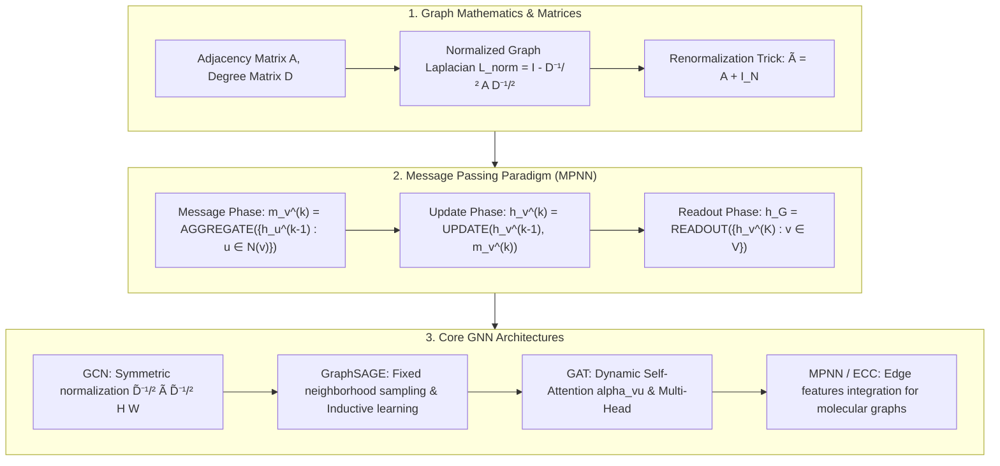

# Graph Neural Networks (GNN) Taxonomy: Graph Laplacian, Message Passing (MPNN), GCN, GraphSAGE, GAT & Edge Feature Guide

> **Summary**: Representation learning on non-Euclidean graph-structured data is fundamental to modern recommender systems and molecular modeling. This 100% exhaustive guide covers graph matrices (Adjacency A, Degree D, Normalized Laplacian L_norm), Neural Message Passing (MPNN), GCN spectral convolution, GraphSAGE inductive sampling, GAT multi-head attention, and Pure Numpy GNN implementations with rich SEO explanatory text.

---

## 🧭 Knowledge Map & Architecture Graph



> 💡 **Intuition**: A GNN layer is one "neighborhood meeting": each node sends a message, neighbors aggregate them, and the node updates itself from "old state + summary". $K$ layers = a node hears from $K$-hop neighbors — the graph version of receptive field. The four architectures differ only in the aggregator: GCN uses fixed degree-weighted averaging (needs the whole graph, transductive), GraphSAGE samples a fixed number of neighbors (constant compute, inductive — works on Pinterest-scale graphs), GAT learns dynamic attention weights (most expressive, slowest). Stacking too many layers (>4–6) makes every node converge to the same vector — over-smoothing — because normalized Laplacian powers squash everything into the principal eigenspace.
>
> 🎤 **Quick Answer**: "GCN's symmetric normalization $\tilde D^{-1/2}\tilde A \tilde D^{-1/2}$ weights an edge $1/\sqrt{\tilde D_{vv}\tilde D_{uu}}$ — a 100-degree node and a 2-degree node get weight ~0.071, avoiding degree explosion. GraphSAGE with $S_1=25, S_2=10$ keeps per-node cost constant ~250. GAT: hidden layers concatenate M heads, output layer averages. Cora: 2-layer GCN hits 81.5% node accuracy."

---

## 📚 Chapter 1: Pure Numpy GNN Engine

Plain-language reading (full implementations in the zh version): `gcn_layer_forward` is three lines — `A + np.eye(N)` adds self-loops, `1/sqrt(D_diag)` builds $\tilde D^{-1/2}$, sandwiching gives the symmetric normalization, then `ReLU(A_norm @ H @ W)` is one full GCN layer; `gat_layer_forward` splits attention scoring into a "sender score + receiver score" broadcast sum, masks non-neighbors to $-\infty$, and softmaxes.

```python
import numpy as np

class PureNumpyGNNEngine:
    @staticmethod
    def gcn_layer_forward(A: np.ndarray, H: np.ndarray, W: np.ndarray) -> np.ndarray:
        pass
    @staticmethod
    def graphsage_mean_forward(A: np.ndarray, H: np.ndarray, W: np.ndarray) -> np.ndarray:
        pass
    @staticmethod
    def gat_layer_forward(A: np.ndarray, H: np.ndarray, W: np.ndarray, a_vec: np.ndarray) -> np.ndarray:
        pass
```

> 💡 **Intuition**: All three share one skeleton — "neighbor matrix × features": GCN's `A_norm @ H` is static, GraphSAGE's `A_mean @ H` averages, GAT's `Alpha @ H_prime` is a dynamically learned attention matrix. Understand that one equation and the three architectures differ only in where the matrix comes from.
>
> 🎤 **Quick Answer**: "GNN forward = normalized adjacency × features × weights. The Renormalization Trick ($\tilde A = A + I$) both preserves the node's own features and bounds the spectral radius — that's why GCN works where plain $A$ diverges after a few layers."