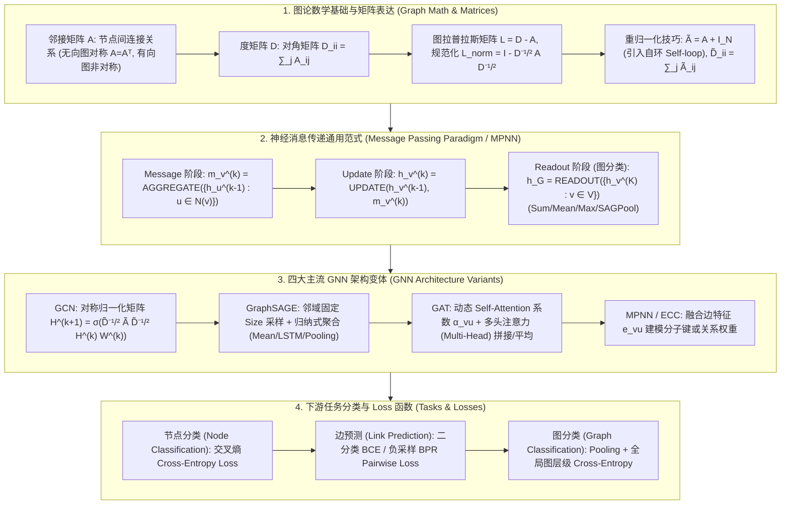

# 图神经网络 (GNN) 全景：邻接矩阵、图拉普拉斯矩阵、消息传递机制 (MPNN)、GCN、GraphSAGE、GAT 与边特征建模极客指南

> **核心摘要**：非欧几里得空间 (Non-Euclidean Space) 图结构数据的表征学习是现代社交网络分析、分子药物研发与推荐系统的核心基石。从图论矩阵的严密数理基础（邻接矩阵、度矩阵与规范化图拉普拉斯矩阵）、通用神经消息传递范式 (Message Passing Neural Network, MPNN)，到四大主流 GNN 架构（GCN 谱域卷积、GraphSAGE 采样聚合、GAT 图注意力网络、Edge-GNN 边特征建模）。本指南系统剖析 GCN 重归一化技巧 (Renormalization Trick) 数理推导、GraphSAGE 解决超大图节点采样与归纳泛化 (Inductive Learning) 的机制、GAT 动态权重计算与多头注意力聚合，以及 Over-smoothing (过平滑) 现象的产生机制与 Pure Numpy GNN 算子引擎。全篇配备丰富的 SEO 说明性段落与工程实践。

---

## 🧭 知识体系全景流程图 (Knowledge Map & Architecture Graph)



---

## 💡 经典面试追问与考点速查

* **考点 1**：推导 GCN 的对称归一化邻接矩阵公式，并解释为什么需要加入自环 (Self-loop) 构成重归一化技巧 (Renormalization Trick)。
  * *标准回答*：在一阶切比雪夫多项式逼近图傅里叶变换时，图卷积计算展开为 $\mathbf{H}^{(k+1)} = \sigma\left( \mathbf{D}^{-1/2} \mathbf{A} \mathbf{D}^{-1/2} \mathbf{H}^{(k)} \mathbf{W}^{(k)} \right)$。然而直接使用 $\mathbf{A}$ 会存在两个严重缺陷：
    1. **丢失节点自身信息**：邻接矩阵 $\mathbf{A}$ 的对角元素全为 0，导致聚合消息时节点 $v$ 只能接收邻居 $u \in \mathcal{N}(v)$ 的特征，丢失了节点自身在上一层的隐藏状态 $h_v^{(k)}$；
    2. **谱半径过大引发梯度爆炸/消失**：$\mathbf{D}^{-1/2} \mathbf{A} \mathbf{D}^{-1/2}$ 的最大特征值约等于 1，多层叠加后会导致数值不稳定。
    **重归一化技巧 (Renormalization Trick)** 提出为邻接矩阵强制加上单位矩阵加入自环：$\mathbf{\tilde{A}} = \mathbf{A} + \mathbf{I}_N$。对应的自环度矩阵为 $\mathbf{\tilde{D}}_{ii} = \sum_j \tilde{A}_{ij}$。导出的最终 GCN 层传递矩阵为：
    $$\mathbf{H}^{(k+1)} = \sigma\left( \mathbf{\tilde{D}}^{-1/2} \mathbf{\tilde{A}} \mathbf{\tilde{D}}^{-1/2} \mathbf{H}^{(k)} \mathbf{W}^{(k)} \right)$$
    其中每个节点对 $(v, u)$ 的归一化权重为 $\frac{1}{\sqrt{\tilde{D}_{vv} \tilde{D}_{uu}}}$，极大地稳定了深层图神经网络的训练。
* **考点 2**：对比 GCN 的直推式学习 (Transductive Learning) 与 GraphSAGE 的归纳式学习 (Inductive Learning)，GraphSAGE 是如何解决超大图（如 Pinterest / OGB）训练的？
  * *标准回答*：GCN 属于**直推式学习 (Transductive)**，在计算 $\mathbf{\tilde{D}}^{-1/2} \mathbf{\tilde{A}} \mathbf{\tilde{D}}^{-1/2}$ 时要求全图结构在训练前必须一次性输入内存中。当全图包含数亿节点时（如 Pinterest 社交图），全图邻接矩阵无法一次性加载至 GPU VRAM，且无法泛化到训练时未见过的全新图节点 (Unseen Nodes)。
    **GraphSAGE (Sample and Aggregate)** 提出了**归纳式学习 (Inductive)** 范式，通过两大核心创新解决超大图问题：
    1. **邻域采样 (Uniform Neighborhood Sampling)**：在 $k$ 层聚合时，不聚合节点 $v$ 的全量邻居，而是随机均匀采样固定数量 $S_k$ 个邻居（如 $S_1=25, S_2=10$），将计算复杂度从指数增长控制为常数 $O(\prod S_k)$；
    2. **局部聚合函数参数化**：定义通用的聚合算子（Mean / LSTM / Pooling），只学习映射参数 $W$，使得训练好的模型能够直接应用于推理期新加入的节点或完全全新的子图！
* **考点 3**：详细写出 GAT 中节点对 $(v, u)$ 注意力系数 $\alpha_{vu}$ 的计算表达式，并说明多头注意力 (Multi-Head Attention) 在隐藏层与输出层拼接/平均的区别。
  * *标准回答*：在 GAT (Graph Attention Network) 中，邻居节点 $u \in \mathcal{N}(v)$ 对中心节点 $v$ 的贡献权重不是由度数固定的静态值，而是通过共享参数 $a \in \mathbb{R}^{2F'}$ 与 $W \in \mathbb{R}^{F' \times F}$ 动态计算的。原始注意力得分 $e_{vu}$ 为：
    $$e_{vu} = \text{LeakyReLU}\left( \mathbf{a}^T [\mathbf{W} h_v \parallel \mathbf{W} h_u] \right)$$
    经 Softmax 归一化后得到最终注意力系数：
    $$\alpha_{vu} = \frac{\exp\left( \text{LeakyReLU}\left( \mathbf{a}^T [\mathbf{W} h_v \parallel \mathbf{W} h_u] \right) \right)}{\sum_{k \in \mathcal{N}(v)} \exp\left( \text{LeakyReLU}\left( \mathbf{a}^T [\mathbf{W} h_v \parallel \mathbf{W} h_k] \right) \right)}$$
    为了稳定注意力过程，引入 $M$ 个独立的**多头注意力 (Multi-Head Attention)**：
    * **隐藏层 (Hidden Layers)**：采用**向量拼接 (Concatenation)**：$h_v^{(k)} = \parallel_{m=1}^M \sigma\left( \sum_{u \in \mathcal{N}(v)} \alpha_{vu}^m \mathbf{W}^m h_u^{(k-1)} \right)$；
    * **最终输出层 (Output Layer)**：采用**算术平均 (Averaging)**：$h_v^{(K)} = \sigma\left( \frac{1}{M} \sum_{m=1}^M \sum_{u \in \mathcal{N}(v)} \alpha_{vu}^m \mathbf{W}^m h_u^{(K-1)} \right)$。
* **考点 4**：解释过平滑 (Over-smoothing) 现象的数理成因与解决方案。
  * *标准回答*：**Over-smoothing** 是指当 GNN 层数加深（如超过 4 至 6 层）时，由于消息传递不断的平均化聚合，全图中所有节点的隐藏表示 $h_v^{(k)}$ 趋于收敛到完全相同的常数向量，导致节点间失去可区分度，下游分类性能急剧崩溃。数学本质是规范化图拉普拉斯算子作用多次后收敛至图的主特征向量空间。**解决方案**包括：接入残差连接 (ResGCN / Initial Residual in GCNII)、Jumping Knowledge Networks (JK-Net 保存每一层表示)、DropEdge (随机丢弃图中的边) 以及 PairNorm。

---

## 📚 第一章：图论数学基础与图拉普拉斯矩阵

### 1.1 3 大基础图矩阵数学表达
大白话理解：图本身没有"天然的张量表示"，这三张矩阵就是把图"翻译"成数学能算的形式：邻接矩阵 $A$ 记录"谁和谁相连"，度矩阵 $D$ 记录"每个人有几个朋友"，拉普拉斯矩阵 $L = D - A$ 则像"散度算子"——衡量图上的信号在节点间流动时的平滑程度（所有特征向量构成图的"频谱"）。
对于包含 $V$ 个节点与 $E$ 条边的图 $G = (V, E)$：
1. **邻接矩阵 $\mathbf{A} \in \mathbb{R}^{|V| \times |V|}$**：若节点 $i$ 与 $j$ 相连则 $A_{ij} = 1$，否则 $A_{ij} = 0$；
2. **度矩阵 $\mathbf{D} \in \mathbb{R}^{|V| \times |V|}$**：对角矩阵，对角元素 $D_{ii} = \sum_{j=1}^{|V|} A_{ij}$ 表示节点 $i$ 的邻居总数；
3. **未规范化图拉普拉斯矩阵 $\mathbf{L}$ 与对称规范化拉普拉斯矩阵 $\mathbf{L}_{norm}$**：
   $$\mathbf{L} = \mathbf{D} - \mathbf{A}$$
   $$\mathbf{L}_{norm} = \mathbf{D}^{-1/2} \mathbf{L} \mathbf{D}^{-1/2} = \mathbf{I}_N - \mathbf{D}^{-1/2} \mathbf{A} \mathbf{D}^{-1/2}$$

> 💡 **直观理解**：对称归一化 $\mathbf{D}^{-1/2} \mathbf{A} \mathbf{D}^{-1/2}$ 的直觉：每个邻居的贡献被"两端度数的平方根"同时缩放——度数高的中心节点（社交达人大 V）不要被自己庞大的邻居数淹没，度数低的节点信息也不要被稀释。$D^{-1}A$（左归一化）只缩发送端，$D^{-1/2}AD^{-1/2}$（对称归一化）两边都缩，等价于"每个节点分出去的权重总和为 1"，数值更稳定。
>
> 🎤 **面试速答**："结论：GCN 用对称归一化 $\tilde D^{-1/2}\tilde A \tilde D^{-1/2}$ 做邻居加权平均，权重 $\frac{1}{\sqrt{\tilde D_{vv}\tilde D_{uu}}}$。原理：既避免度数大的节点聚合值爆炸，又保留节点自身信息（加自环 $\tilde A = A + I$）。举个例子：一个 100 度节点和一个 2 度节点相邻，边的权重约为 $1/\sqrt{100\times2} \approx 0.071$；而 $D^{-1}A$ 会给 2 度节点 0.5 的权重，同样一条边在不同归一化下的语义完全不同。"

---

## 📚 第二章：神经消息传递通用范式 (MPNN)

### 2.1 MPNN 3 步算法表达式
大白话理解：GNN 一层的本质就是"开一次邻居大会"：每个节点（Message）向所有邻居发消息，邻居把收来的消息**聚合（Aggregate）**成一张汇总单，节点再把"自己的旧状态 + 汇总单"**更新（Update）**成新状态。堆 $K$ 层就是开了 $K$ 次会——第 $k$ 层的节点能听到 $k$ 跳之外的消息，这就是感受野的图版本。
在第 $k$ 层消息传递中：
1. **消息生成与聚合 (Message & Aggregate)**：
   $$m_v^{(k)} = \text{AGGREGATE}^{(k)}\left( \left\{ M_k(h_v^{(k-1)}, h_u^{(k-1)}, e_{vu}) : u \in \mathcal{N}(v) \right\} \right)$$
2. **节点状态更新 (Update)**：
   $$h_v^{(k)} = \text{UPDATE}^{(k)}\left( h_v^{(k-1)}, m_v^{(k)} \right)$$
3. **图层级表征读出 (Readout - 仅针对 Graph-level 任务)**：
   $$h_G = \text{READOUT}\left( \left\{ h_v^{(K)} : v \in V \right\} \right)$$

> 💡 **直观理解**：MPNN 是个"插槽模板"：四个主流架构的区别只在 Aggregate 怎么选——GCN 用固定权重平均（度数定权），GraphSAGE 先随机采样固定数量邻居再聚合（为了省显存、支持归纳学习），GAT 用注意力动态定权（每个邻居的权重按相关性算出来）。Update 和 Readout 是通用的。
>
> 🎤 **面试速答**："结论：MPNN = 每层三阶段：Message（邻居发消息）、Aggregate（聚合）、Update（更新自身），图任务再加 Readout 汇总整图。原理：$K$ 层网络让节点看见 $K$ 跳邻居，等价于图上的感受野。举个例子：聚合方式 Sum 能感知邻居数量（适合计数任务）、Mean 对度数鲁棒（适合平均特征）、Max 捕获最显著信号（适合边缘检测）；超过 4~6 层所有节点表征趋于相同（过平滑），因为拉普拉斯算子的反复作用把信号压进主特征向量。"

---

## 📚 第三章：四大主流 GNN 架构数理对比

### 3.1 4 大 GNN 聚合更新规则对比表

怎么读这张表：核心对比点在第一列到第三列的联动——"聚合是否固定权重"（GCN 固定 vs GAT 动态）决定了模型表达力，"是否采样邻居"（GraphSAGE）决定了能否扩展到数亿节点的大图，"是否用到边特征"（MPNN/ECC）决定了能否建模分子键这类关系信息。

| 架构 | 邻域聚合方式 (Aggregate) | 节点更新公式 (Update) | 特征与场景 |
| :--- | :--- | :--- | :--- |
| **GCN** | 对称加权平均 $\sum \frac{1}{\sqrt{\tilde{D}_{vv}\tilde{D}_{uu}}} h_u$ | $\sigma(\mathbf{\tilde{D}}^{-1/2} \mathbf{\tilde{A}} \mathbf{\tilde{D}}^{-1/2} \mathbf{H} \mathbf{W})$ | 谱域切比雪夫逼近，静态小图直推式 |
| **GraphSAGE** | 均匀采样固定 $S_k$ 个邻居，经 Mean/LSTM/Pooling 聚合 | $\sigma\left(\mathbf{W} \cdot [h_v \parallel h_{\mathcal{N}(v)}]\right)$ | 归纳式学习，支持海量超大图 |
| **GAT** | 动态 Softmax Multi-Head Attention $\sum \alpha_{vu} \mathbf{W} h_u$ | 多头拼接 $\parallel \sigma(\dots)$ / 平均 | 动态异质关系建模，无需先验度数 |
| **MPNN / ECC** | 结合边特征 $e_{vu}$ 生成消息 $M(h_v, h_u, e_{vu})$ | GRU / MLP 结合旧状态更新 | 分子结构 (QM9) 与化学键建模 |

> 💡 **直观理解**：GCN vs GraphSAGE vs GAT 可以类比三种"团队信息同步方式"：GCN 是"按职级固定权重发言"（快但死板）；GraphSAGE 是"每轮只随机请固定几位同事发言"（省时间、新人随时可加入）；GAT 是"按议题相关度动态决定谁多发言"（灵活但慢）。三者的共同点是都需要"自身信息 + 邻居信息"的融合。
>
> 🎤 **面试速答**："结论：GCN 固定权重平均、直推式；GraphSAGE 采样邻居、归纳式；GAT 注意力动态加权。原理：GAT 的注意力系数 $\alpha_{vu}$ 由共享参数 $\mathbf{a}$ 对 $[Wh_v \parallel Wh_u]$ 打分再 Softmax；多头在隐藏层拼接、输出层平均。举个例子：GraphSAGE 采样 $S_1=25, S_2=10$ 时每节点计算量恒定 $\approx 25\times10$，与全图规模无关，所以 Pinterest 20 亿节点图也能训；GAT 隐藏层用 8 头拼接把维度乘 8，输出层 1 头平均保持维度不变。"

---

## 📚 第四章：Pure Numpy 实现 GNN 算子引擎 (GCN, GraphSAGE, GAT)

大白话看代码：`gcn_layer_forward` 三行实现重归一化——`A + np.eye(N)` 加自环、`1.0/np.sqrt(D_tilde_diag)` 构造 $\tilde D^{-1/2}$、再两边夹乘得到对称归一化邻接矩阵，最后 `ReLU(A_norm @ H @ W)` 就是完整的一层 GCN；`gat_layer_forward` 把注意力打分拆成"发送端分数 + 接收端分数"两个向量相加，再对非邻居掩膜为 $-\infty$ 后 Softmax。

```python
import numpy as np

class PureNumpyGNNEngine:
    @staticmethod
    def gcn_layer_forward(A: np.ndarray, H: np.ndarray, W: np.ndarray) -> np.ndarray:
        """GCN 重归一化图卷积层前向传播 (含自环与对称归一化)"""
        N = A.shape[0]
        A_tilde = A + np.eye(N)  # 加入自环 Self-loop
        D_tilde_diag = np.sum(A_tilde, axis=1)
        
        # 计算 D_tilde^(-1/2)
        D_tilde_inv_sqrt = np.diag(1.0 / np.sqrt(D_tilde_diag))
        
        # 对称归一化邻接矩阵 A_norm = D^(-1/2) * A_tilde * D^(-1/2)
        A_norm = D_tilde_inv_sqrt @ A_tilde @ D_tilde_inv_sqrt
        
        # 图卷积: H_next = ReLU(A_norm * H * W)
        return np.maximum(0, A_norm @ H @ W)
    @staticmethod
    def graphsage_mean_forward(A: np.ndarray, H: np.ndarray, W: np.ndarray) -> np.ndarray:
        """GraphSAGE Mean Aggregator 极简实现"""
        N = A.shape[0]
        D_diag = np.sum(A, axis=1)
        D_diag[D_diag == 0] = 1.0  # 防止孤立节点除以 0
        
        # 邻居平均聚合
        A_mean = np.diag(1.0 / D_diag) @ A
        H_neigh = A_mean @ H
        
        # 拼接自身特征与邻居特征
        H_concat = np.hstack((H, H_neigh))
        return np.maximum(0, H_concat @ W)
    @staticmethod
    def gat_layer_forward(A: np.ndarray, H: np.ndarray, W: np.ndarray, a_vec: np.ndarray) -> np.ndarray:
        """GAT 单头图注意力层前向传播"""
        N = A.shape[0]
        H_prime = H @ W  # (N, F')
        
        # 计算注意力分值 e_ij
        # a_vec 维度为 (2F', 1)
        a_1 = a_vec[:H_prime.shape[1], :]  # (F', 1)
        a_2 = a_vec[H_prime.shape[1]:, :]  # (F', 1)
        
        scores_1 = H_prime @ a_1  # (N, 1)
        scores_2 = H_prime @ a_2  # (N, 1)
        E = scores_1 + scores_2.T  # 广播相加得到 (N, N) 节点对注意力特征
        
        # LeakyReLU 激活
        E_alpha = np.where(E > 0, E, 0.2 * E)
        
        # 仅保留相邻节点的注意力分值（非邻居遮蔽为 -1e9）
        mask = (A + np.eye(N)) > 0
        E_masked = np.where(mask, E_alpha, -1e9)
        
        # Softmax 归一化注意力系数
        exp_E = np.exp(E_masked - np.max(E_masked, axis=1, keepdims=True))
        Alpha = exp_E / np.sum(exp_E, axis=1, keepdims=True)
        
        return np.maximum(0, Alpha @ H_prime)
```

> 💡 **直观理解**：三个实现的共同骨架都是"邻居矩阵 × 特征"：GCN 的 `A_norm @ H` 是静态矩阵乘法，GraphSAGE 的 `A_mean @ H` 是均值聚合，GAT 的 `Alpha @ H_prime` 则是动态算出的注意力矩阵——理解"聚合 = 邻居矩阵 × 特征"这一个等式，三种架构就只剩矩阵怎么来的区别了。
>
> 🎤 **面试速答**："结论：GNN 前向 = 归一化邻接矩阵 × 特征 × 权重，三种架构只在归一化/聚合矩阵的生成方式上不同。原理：GCN 静态对称归一化、GraphSAGE 采样均值归一化、GAT 用可学习注意力打分后 Softmax 动态生成。举个例子：Cora 数据集 2708 节点、每节点 1433 维特征，GCN 2 层即可达 81.5% 节点分类精度；若把图拉普拉斯当'低通滤波器'理解，GCN 每层都在做一次平滑——这正是过平滑（层数多到所有节点一样）的来源。"

---

## 📚 第五章：总结与选型路线图

1. **小型静态全图/学术数据集 (Cora, Citeseer)**：选择 **GCN**，公式简洁且计算高效；
2. **海量超大工业图 (推荐系统、社交网络)**：选择 **GraphSAGE**，利用邻域采样与归纳式学习实现 GPU VRAM 可控的高并发训练；
3. **复杂的异质关系与边权重不确定场景**：选择 **GAT**，借助动态注意力分配不同邻居的关联重要度；
4. **深层网络训练防崩溃**：层数超过 4 层时务必加入 Residual Connection、PairNorm 或 DropEdge，防止 Over-smoothing 导致特征收敛坍塌。