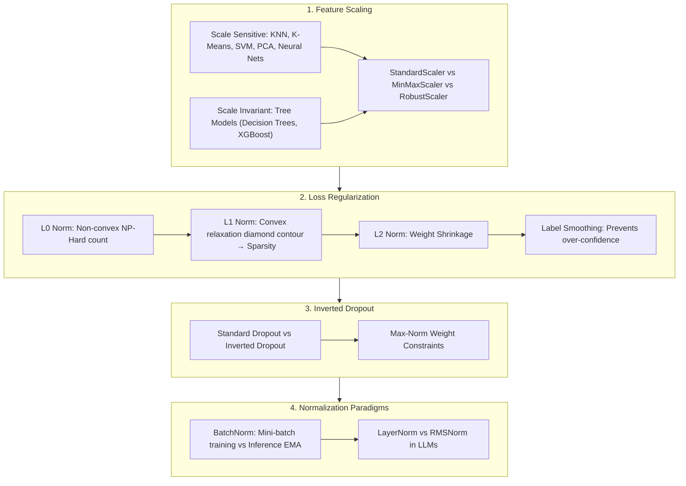

# Normalization & Regularization Taxonomy: BatchNorm, LayerNorm, RMSNorm, L0/L1/L2 Weight Decay & Inverted Dropout Guide

> **Summary**: Normalization and Regularization stabilize training dynamics and prevent overfitting. This 100% exhaustive guide covers feature scaling (Standardization, MinMax, RobustScaler), L0/L1/L2 convex relaxation geometry, Label Smoothing, Max-Norm constraints, Inverted Dropout mechanisms, and 5 Normalization paradigms (BatchNorm, LayerNorm, InstanceNorm, GroupNorm, RMSNorm) with rich SEO explanatory text and Pure Numpy implementations.

---

## 🧭 Knowledge Map & Architecture Graph



> 💡 **Intuition**: Normalization = "where do you compute mean/variance?". BatchNorm aggregates across samples (CV-friendly, but batch < 8 makes statistics noisy and inference must switch to EMA — forgetting `model.eval()` is a classic bug); LayerNorm aggregates within each sample (batch-independent — that's why Transformers use it); RMSNorm = LayerNorm minus mean-centering (LLaMA/DeepSeek use it; the mean is empirically unnecessary, saving ~7–10% per layer). Regularization is geometry: L1's diamond constraint hits coordinate axes (sparse, feature selection), L2's circle shrinks weights uniformly but never to zero. Inverted Dropout moves the $(1-p)$ compensation into training (divide by $1-p$), so inference is zero-overhead.
>
> 🎤 **Quick Answer**: "BN output is NOT always standard normal — γ, β are learnable and can undo the normalization; its real job is smoothing the loss surface. Example: ε=0.1, K=10 label smoothing turns 1.0 into 0.91 + 0.01 per class. Batch 2 + BN = noisy stats → use GroupNorm. L1 pushes $w=0.01$ by a constant step, L2 by $\lambda w$ — only L1 reaches exactly zero."

---

## 📚 Chapter 1: Pure Numpy Normalization Engine

Plain-language reading (full implementations in the zh version): all three norms share the template "(x − mean)/std × γ + β"; they differ only in the statistics axis — BN uses `axis=(0,2,3)`, LN uses `axis=-1`, RMSNorm skips the mean and scales by `sqrt(mean(x²))`. The training branch also updates `running_mean` via EMA — that's the inference-time statistic.

```python
import numpy as np

class PureNumpyNormEngine:
    @staticmethod
    def batch_norm_forward(x: np.ndarray, gamma: np.ndarray, beta: np.ndarray, running_mean: np.ndarray, running_var: np.ndarray, is_training: bool = True):
        pass
```

> 💡 **Intuition**: BN is a two-mode machine: train on batch statistics (and update EMA), inference on frozen EMA. The `is_training` flag is exactly the `model.train()`/`model.eval()` distinction interviewers love.
>
> 🎤 **Quick Answer**: "BN inference uses EMA statistics (momentum 0.9) so single-sample predictions are deterministic; training uses batch stats — mixing the two (forgetting `model.eval()`) silently degrades results. RMSNorm's saving is literally one fewer `mean` reduction per layer."