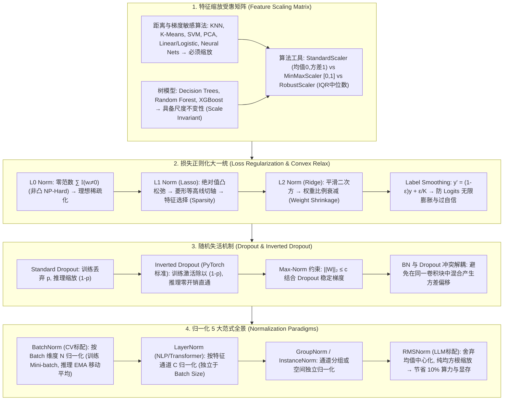

# 归一化与正则化全景：BatchNorm、LayerNorm、RMSNorm、L0/L1/L2 权重衰减与 Inverted Dropout 极客指南

> **核心摘要**：在深度神经网络的训练过程中，**归一化 (Normalization)** 与 **正则化 (Regularization)** 是平滑 Loss 优化曲面、消除内部协变量偏移 (Internal Covariate Shift, ICS) 以及防御过拟合 (Overfitting) 的两大核心工程武器。本指南系统剖析系统剖析特征缩放受惠算法矩阵 (Standardization, MinMax, RobustScaler)、$L_0/L_1/L_2$ 凸松弛约束的数理差异、Label Smoothing 标签平滑、Inverted Dropout 机制与 Max-Norm 约束、归一化 5 大范式（BatchNorm, LayerNorm, InstanceNorm, GroupNorm 与 LLaMA / DeepSeek 标配的 RMSNorm），以及解答 BatchNorm 是否强制标准正态分布等经典误区。全篇配备丰富的 SEO 说明性段落与 Pure Numpy 手写归一化算子。

---

## 🧭 知识体系全景流程图 (Knowledge Map & Architecture Graph)



---

## 💡 经典面试追问与考点速查

* **考点 1**：从几何凸松弛 (Convex Relaxation) 视角，证明为什么 $L_1$ 正则化是 $L_0$ 正则化的最佳凸近似？它如何诱导权重稀疏？
  * *标准回答*：$L_0$ 范数定义为非零权重的个数 $\sum \mathbb{I}(w_i \neq 0)$，直接最小化 $L_0$ 是一个非凸的 NP-Hard 组合优化问题。$L_1$ 范数 $\sum |w_i|$ 是 $L_0$ 范数在超立方体上的**最佳凸包近似 (Tightest Convex Relaxation)**。从**几何等高线**视角看，在 2 维参数空间 $(w_1, w_2)$ 中，$L_1$ 正则化的约束域是一个正方形菱形 $|w_1| + |w_2| \le C$，其极值顶点位于坐标轴上；而目标损失 $\mathcal{L}_0$ 的等高线通常为椭圆。当椭圆与菱形首次相切时，相切点极大概率发生在菱形的顶点（即某维参数 $w_i = 0$），从而切断无关特征；而 $L_2$ 正则化的约束域是一个平滑的圆 $w_1^2 + w_2^2 \le C$，切点可以出现在圆周上的任意位置，倾向于将所有权重等比例拉向零（均分权重）但绝不正好为零。从**梯度 updates** 视角，$L_1$ 的梯度更新项为 $-\eta \lambda \text{sgn}(w)$（常数衰减），即使权重接近零也会以恒定速率拉至绝对零；而 $L_2$ 的更新项为 $-\eta \lambda w$（比例衰减），随着权重接近零，衰减速度无限放缓。
* **考点 2**：答疑解惑：BatchNorm 经过 $\gamma$ 与 $\beta$ 变换后的输出是否仍然服从标准正态分布 $\mathcal{N}(0, 1)$？其核心物理作用是什么？
  * *标准回答*：**误区澄清：绝非总是服从标准正态分布！** BatchNorm 第一步标准化 $\hat{x} = \frac{x - \mu_B}{\sqrt{\sigma_B^2 + \epsilon}}$ 确实将激活值拉回了均值为 0、方差为 1 的标准正态分布；但在第二步中引入了可学习的仿射缩放与平移参数 $y = \gamma \hat{x} + \beta$。如果网络认为原始未归一化的分布更有利于表达，可以通过反向传播自动将 $\gamma$ 学习为原始标准差 $\sigma$，将 $\beta$ 学习为原始均值 $\mu$，从而完全恢复原始分布。因此，**BatchNorm 的真正作用不是强制网络输出标准正态分布，而是通过赋予网络可控的尺度调整能力，消除上层参数变动带来的内部协变量偏移 (ICS)，并平滑 Loss 优化曲面的海森矩阵 (Hessian Matrix)**。
* **考点 3**：详细推导 BatchNorm 在训练阶段 (Training) 与推理阶段 (Inference) 的行为差异。为什么小 Batch Size 下 BatchNorm 会失效？
  * *标准回答*：在**训练阶段**，BatchNorm 计算当前 Mini-batch 的均值 $\mu_B = \frac{1}{m} \sum x_i$ 和方差 $\sigma_B^2 = \frac{1}{m} \sum (x_i - \mu_B)^2$，对激活值进行标准化 $\hat{x}_i = \frac{x_i - \mu_B}{\sqrt{\sigma_B^2 + \epsilon}}$ 并通过可学习参数变换 $y_i = \gamma \hat{x}_i + \beta$。同时，在训练过程中维护全局指数移动平均 (**EMA, Exponential Moving Average**) 统计量：$\mu_{\text{run}} = (1 - \alpha) \mu_{\text{run}} + \alpha \mu_B$。在**推理阶段**，为了保证单个样本预测的确定性（不受其他测试样本影响），直接使用固定好的全局 $\mu_{\text{run}}$ 和 $\sigma_{\text{run}}^2$。当 Batch Size 极小（如 $m < 8$）时，Mini-batch 计算出的 $\mu_B$ 和 $\sigma_B^2$ 产生极大的随机采样噪声，无法代表真实分布，导致网络训练剧烈震荡崩溃。
* **考点 4**：对比 LayerNorm 与 RMSNorm 的归一化维度。为什么大语言模型 (LLaMA/DeepSeek) 普遍弃用 LayerNorm 转向 RMSNorm？
  * *标准回答*：LayerNorm 在特征维度 $d$ 上计算均值 $\mu = \frac{1}{d} \sum x_j$ 和方差 $\sigma^2 = \frac{1}{d} \sum (x_j - \mu)^2$，进行减均值与除以标准差的平移缩放：$\hat{x}_i = \frac{x_i - \mu}{\sqrt{\sigma^2 + \epsilon}} \gamma_i + \beta_i$。研究表明，LayerNorm 带来训练稳定性的核心来源于**尺度不变性 (Scaling Invariance)**，而均值中心化 (Mean Centering) 偏移 $\mu$ 的作用微乎其微。**RMSNorm (Root Mean Square Normalization)** 舍弃了减均值操作，仅除以均方根根值：
    $$\hat{x}_i = \frac{x_i}{\text{RMS}(x)} \gamma_i, \quad \text{RMS}(x) = \sqrt{\frac{1}{d} \sum_{j=1}^d x_j^2 + \epsilon}$$
    RMSNorm 减少了 1 次完整的向量均值规约计算与减法开销，在保持训练收敛稳定性的同时，节省了 7% 至 10% 的显存带宽与 GPU 计算延迟！

---

## 📚 第一章：特征缩放与受惠模型矩阵 (Feature Scaling)

### 1.1 哪些模型必须进行特征缩放？哪些模型天生免疫？

在机器学习预处理中，特征缩放的适用性由模型的底层数理假设决定：

1. **必须进行特征缩放的模型 (Scale-Sensitive Algorithms)**：
   * **基于欧氏距离/相似度的算法**：KNN、K-Means 聚类、SVM（支持向量机，间隔由距离决定）、PCA（主成分分析，方差主导）；
   * **基于梯度下降优化的算法**：线性回归 (Linear Regression)、逻辑回归 (Logistic Regression)、神经网络 (MLP/CNN/Transformer)。不缩放会导致损失等高线呈现长窄椭圆，SGD 在陡峭方向震荡难收敛。
2. **天生具备尺度不变性的模型 (Scale-Invariant Algorithms)**：
   * **树模型 (Tree-based Models)**：决策树 (Decision Tree)、随机森林 (Random Forest)、GBDT、XGBoost、LightGBM。因为树模型分裂节点仅依据特征值的**单调排序次序 (Order / Rank)**，对特征做单调线性变换（如乘以 1000 或加 100）完全不改变最佳切分点的位置！

> 💡 **直观理解**：判断一个模型要不要缩放，就看它的"尺子"是什么：靠距离/梯度/方差做决策的算法（KNN、SVM、PCA、神经网络）用绝对数值当尺子，特征量级不同就相当于"厘米和米混着量"；靠排序分裂的树模型只用相对大小当尺子，所以天然免疫。
>
> 🎤 **面试速答**："结论：基于距离/梯度/方差的算法必须缩放，树模型不需要。原理：缩放改变损失曲面的条件数——不缩放时等高线是长窄椭圆，梯度下降在陡峭方向反复震荡；树模型只依赖特征序关系，单调变换不改变分裂点。举个例子：房价预测中'面积'量级是 10² 而'房龄'是 10⁰，差两个数量级，不标准化时 SGD 更新在面积维度被放大 $10^4$ 倍；标准化后两维收敛速度一致。"

---

### 1.2 3 大传统特征缩放数学对比

选择口诀：无离群点用 StandardScaler（保留分布形状），严格要 [0,1] 区间用 MinMaxScaler（受离群点摆布），有重离群点用 RobustScaler（用中位数和 IQR，对异常值免疫）。

1. **Standardization (Z-Score 标准化)**：
   $$z = \frac{x - \mu}{\sigma}$$
   *特点*：将数据转化为均值为 0、标准差为 1 的正态分布空间。保留了原始数据的离群点分布，是 PCA、SVM、逻辑回归与神经网络的标准预处理。
2. **Min-Max Normalization (最小-最大归一化)**：
   $$x' = \frac{x - x_{\min}}{x_{\max} - x_{\min}} \in [0, 1]$$
   *特点*：将数据严格压缩至 $[0, 1]$ 闭区间。*缺点*：极度易受异常值影响（若存在一个极大的偏离点 $x_{\max}$，其余正常数据会被挤压在近零区域）。
3. **RobustScaler (抗噪稳健缩放)**：
   $$x' = \frac{x - Q_2(x)}{Q_3(x) - Q_1(x)}$$
   *特点*：使用中位数 $Q_2$ (50% 分位数) 和四分位距 $\text{IQR} = Q_3 - Q_1$ 进行缩放，对数据集中含有大量异常离群点具有极强的免疫能力。

> 💡 **直观理解**：三种缩放的区别在于"用哪个统计量当基准"：StandardScaler 用均值/标准差——离群点会拉动均值、夸大标准差，把正常数据挤扁；MinMaxScaler 用最大/最小值——一个极端值就把整个区间都压到 0.1 以内；RobustScaler 用中位数/IQR——离群点最多只影响 25% 分位点一侧，另一侧不受牵连，所以最抗噪。
>
> 🎤 **面试速答**："结论：StandardScaler 保分布形状、MinMaxScaler 定区间、RobustScaler 抗离群点。原理：均值/最大值的统计量对极端值不稳健，中位数和 IQR 是分位数统计量天然抗扰。举个例子：数据 1000 个点大多在 [0,1]，混入一个 1000 的离群点后 MinMax 把正常数据压到 [0, 0.001]，StandardScaler 把均值拉高到 1、方差放大，只有 RobustScaler 基本不动。"

---

## 📚 第二章：损失正则化与防过拟合 ($L_0, L_1, L_2$, Label Smoothing)

### 2.1 $L_0, L_1$ 与 $L_2$ 正则化数理对比表

怎么读这张表：面试考点集中在"几何约束域形状"这一列——L1 是菱形、L2 是圆，这个形状差异决定了 L1 稀疏而 L2 平滑衰减；同时看"梯度更新公式"列：L1 的更新项是常数 $\text{sgn}(w)$（拉到底），L2 是比例 $\lambda w$（越近越慢）。

| 正则化类型 | 附加损失项 $\Omega(W)$ | 梯度更新公式 $W_{t+1}$ | 几何约束域形状 | 核心工程物理效应 |
| :--- | :--- | :--- | :--- | :--- |
| **$L_0$ Norm** | $\sum \mathbb{I}(w_i \neq 0)$ | 不可导 (NP-Hard 组合优化) | 离散轴坐标点 | 理想稀疏化，但无法求导 |
| **$L_1$ (Lasso)** | $\lambda \sum \|w_i\|$ | $W_t - \eta \nabla \mathcal{L}_0 - \eta \lambda \text{sgn}(W_t)$ | 2D 正方形菱形 (Corners at axes) | 产生**稀疏权重 (Sparsity)**，实现特征选择 |
| **$L_2$ (Ridge / Weight Decay)** | $\frac{\lambda}{2} \sum w_i^2$ | $(1 - \eta \lambda) W_t - \eta \nabla \mathcal{L}_0$ | 2D 平滑圆 (Circle) | **权重衰减 (Weight Shrinkage)**，防止单一特征独大 |

> 💡 **直观理解**：几何视角：正则化 = 在权重空间画一个"禁区"（菱形/圆），要求最优解落在禁区边界内。椭圆等高线第一次碰到菱形时大概率碰在**顶点**上——顶点恰好在坐标轴上，于是某维权重正好为 0（稀疏、特征选择）；碰到圆则切点可以在任意方向，权重被"均匀压缩"但不会清零。梯度视角：L1 的 $\text{sgn}(w)$ 每步都推 1 个单位，能把权重推过零点；L2 的 $\lambda w$ 推力随权重变小而变小，永远推不到 0。
>
> 🎤 **面试速答**："结论：L1 产生稀疏解（特征选择），L2 只做均匀收缩（权重衰减）。原理：L1 约束域是菱形、极值点在坐标轴上，且梯度更新项 $\text{sgn}(w)$ 为常数推力；L2 约束域是圆、梯度项 $\lambda w$ 比例衰减。举个例子：权重 $w=0.01$ 时，L1 每步仍推固定 0.01，L2 只推 $0.01\lambda$——所以 L1 能清零而 L2 不能；Lasso 在高维稀疏场景（如基因 2 万维特征）能自动筛出有效基因。"

---

### 2.2 Label Smoothing (标签平滑) 机制
在标准分类任务中，One-Hot 标签（如 $[0, 1, 0]$）强制 Softmax 输出极端的概率值 $1.0$。为了达到这一目标，未归一化的 Logits $z_i$ 必须趋近于 $+\infty$，这会导致模型过度自信 (Over-confidence) 并严重过拟合。

**Label Smoothing 数学表达**：设定平滑因子 $\epsilon \in (0, 1)$，将 One-Hot 硬目标平滑化为软目标：
$$y_k^{\text{smooth}} = (1 - \epsilon) y_k + \frac{\epsilon}{K}$$
例如 $\epsilon=0.1, K=10$ 时，原硬标签 $1.0$ 被转换为 $0.91$，其余 9 个负类标签分配为 $0.01$。这有效限制了 Logits 的极端增长，显著提升了模型的泛化能力与概率校准质量。

> 💡 **直观理解**：One-Hot 标签在"逼" Softmax 输出极端值：要输出概率 1.0，logit 必须趋于 $+\infty$，模型被迫无限放大自信，边界样本一点噪声就翻车。Label Smoothing 相当于给标签"掺水"：把 1.0 换成 0.91 + 均匀撒给其他类 0.01，让模型不必追求"绝对自信"，学到的决策边界更松、泛化更好。
>
> 🎤 **面试速答**："结论：Label Smoothing 把硬标签软化，抑制过度自信、改善校准。原理：真实类概率从 1.0 降为 $1-\epsilon+\epsilon/K$，其余类各分 $\epsilon/K$，logit 不再需要趋于无穷。举个例子：$\epsilon=0.1, K=10$ 时真实类标签 0.91、其余 0.01；ImageNet 上用 $\epsilon=0.1$ 的标签平滑普遍带来 0.5% 左右的精度提升，现代大模型微调也标配。"

---

## 📚 第三章：随机失活机制与工程避坑 (Standard vs Inverted Dropout)

### 3.1 倒置 Dropout (Inverted Dropout) 极客推导
大白话理解：Dropout 的核心矛盾是"训练时随机关灯，推理时全亮"——期望激活值会差 $(1-p)$ 倍，必须找个地方补回来。Standard Dropout 在推理时乘 $(1-p)$ 补偿（部署端多干活）；Inverted Dropout 改为训练时除以 $(1-p)$ 补偿（训练端多干活），推理时什么都不用做，部署零开销。
传统的 **Standard Dropout** 在训练阶段按概率 $p$ 随机归零神经元，但在推理评估阶段，为了保持期望激活值一致，必须手动将所有神经元权重乘以 $(1 - p)$。这在推理部署阶段引入了额外的开销与工程复杂度。

现代深度学习框架（PyTorch / TensorFlow）普遍采用 **Inverted Dropout**：将期望缩放重置到**训练阶段**完成！

**训练阶段 (Training)**：
$$m_j \sim \text{Bernoulli}(1 - p), \quad \tilde{a}_j = \frac{m_j \odot a_j}{1 - p}$$
因为 $\mathbb{E}[m_j] = 1 - p$，所以在训练阶段 $\mathbb{E}[\tilde{a}_j] = \frac{(1-p) a_j}{1-p} = a_j$。

**推理阶段 (Inference)**：
$$a_{\text{test}} = a$$
直接无缝前向传播，无需做任何缩放修改！

> 💡 **直观理解**：Dropout 的机理是"投票制"：训练时每轮随机让一部分神经元"请假"，迫使网络不依赖任何单点、学到冗余分布式的特征；推理时全员上岗投票，效果是几百个弱模型的集成。Inverted Dropout 只是把 $(1-p)$ 的补偿从"推理时乘"挪到"训练时除"，数学期望完全一致，但部署代码更干净——所以 PyTorch/TensorFlow 默认它。
>
> 🎤 **面试速答**："结论：Inverted Dropout 训练时除以 $(1-p)$、推理零开销，与 Standard Dropout 期望一致。原理：$\mathbb{E}[m_j]=1-p$，所以训练期 $\mathbb{E}[\tilde a_j] = a_j$，与推理期期望对齐。举个例子：$p=0.5$ 时训练激活翻倍（除以 0.5），推理不缩放；PyTorch `nn.Dropout(0.5)` 在 `model.train()` 与 `model.eval()` 之间切换，eval 时自动直通——这也是为什么 eval 忘切模式（Bug #3）会让结果随机抖动。"

### 3.2 Dropout 与 Max-Norm 权重约束组合策略
在训练极深的神经网络时，通常将 Dropout 与 **Max-Norm 权重约束**（如限制权重向量的 $L_2$ 范数 $\|W\|_2 \le c$）结合使用。如果随机丢弃导致剩余活跃神经元的梯度更新幅度过大，Max-Norm 会强制将超出的权重拉回半径为 $c$ 的超球面上，有效防止梯度爆炸。

> 💡 **直观理解**：Dropout 放大了个别神经元的梯度（活着的神经元要扛下所有人的活），Max-Norm 就是配套的"安全绳"：每步更新后把权重拉回半径 $c$ 的球内，防止少数激活神经元把权重冲到失控。二者是"破坏性正则化 + 兜底约束"的经典组合，训练 RNN 的原始论文里就这么干。
>
> 🎤 **面试速答**："结论：Max-Norm 约束 $\|W\|_2 \le c$ 防止 Dropout 后个别神经元梯度过大导致权重爆炸。原理：每步更新后把超出半径的权重向量投影回球面。举个例子：$c=3$ 时权重范数超过 3 就被拉回 3，与 Dropout $p=0.5$ 搭配可稳定深层网络训练。"

---

## 📚 第四章：归一化 5 大范式 (BatchNorm, LayerNorm, RMSNorm)

### 4.1 5 大归一化范式空间张量切片对比矩阵

大白话理解：归一化 = 把激活值的均值/方差拉回稳定区间。五种范式的区别只有一句话：**在哪个维度上统计均值和方差**——BatchNorm 跨样本（batch 内同通道一起算），LayerNorm 跨特征（每个样本自己的所有特征算），InstanceNorm 跨空间（单样本单通道），GroupNorm 折中（通道分组），RMSNorm 再砍掉均值中心化。维度选择决定了它的适用场景和坑。
对于输入特征张量 $X \in \mathbb{R}^{N \times C \times H \times W}$（$N$: Batch Size, $C$: Channels, $H, W$: Spatial dimensions）：

1. **BatchNorm (BN)**：沿 $(N, H, W)$ 维度进行归一化。为每个 Channel $C$ 独立计算均值与方差（适合 CV 卷积网络）；
2. **LayerNorm (LN)**：沿 $(C, H, W)$ 维度进行归一化。对每个样本 $N$ 独立计算均值与方差（适合 NLP / Transformer 序列数据）；
3. **InstanceNorm (IN)**：沿 $(H, W)$ 维度进行归一化。对每个样本的每个 Channel 独立计算（适合图像风格转换 Style Transfer）；
4. **GroupNorm (GN)**：将 Channels $C$ 分为 $G$ 个 Group，沿 $(C/G, H, W)$ 归一化。克服了小 Batch 下 BN 失效的缺点；
5. **RMSNorm (Root Mean Square Norm)**：在 LayerNorm 的维度上，取消均值中心化，纯按均方根进行缩放。

> 💡 **直观理解**：BatchNorm 与 LayerNorm 的核心分歧是"统计量共享对象"：BN 在 batch 里共享（CV 卷积天然 batch 大，且同通道的统计量有物理意义），LN 在单样本内共享（NLP 序列长度可变、batch 里每个样本的长度不同，统计量只能来自自身）。BN 训练/推理两套统计量（batch 统计 vs EMA 全局统计）是它的最大坑：batch 太小（<8）时噪声剧烈，且推理时用 EMA 会让单样本预测确定；LN 没有这个问题，所以 Transformer 全用 LN。RMSNorm 砍掉减均值：实验证明 LayerNorm 的稳定性主要来自尺度不变性而不是中心化，省一次均值规约，大模型每层省 7~10% 算力。
>
> 🎤 **面试速答**："结论：BN 跨样本归一化、训练用 batch 统计推理用 EMA；LN 跨特征归一化、与 batch 无关；RMSNorm = LN 去均值中心化。原理：统计维度决定了依赖关系——BN 依赖 batch 内其他样本，batch 小时统计噪声大；LN/RMSNorm 每个样本独立。举个例子：batch=2 训 ResNet 时 BN 每步统计量只有 2 个样本，训练剧烈震荡，换 GroupNorm(G=32) 稳定；LLaMA-7B 全部 32 层用 RMSNorm，相比 LayerNorm 每层少一次均值规约，整个前向推理省约 10% 的核函数开销；BN 的 $\gamma,\beta$ 可被学习回去，所以它不强制标准正态——这是高频误区。"

---

## 📚 第五章：Pure Numpy 实现 3 大归一化算子 (BN, LN, RMSNorm)

大白话看代码：三个实现对应同一模板"（x - 均值）/ 标准差 × γ + β"，区别只在统计维度的括号里：BN 用 `axis=(0,2,3)`（跨 batch 与空间）、LN 用 `axis=-1`（跨特征）、RMSNorm 连均值都不减只算 `sqrt(mean(x²))`。注意 BN 训练分支里那句 `running_mean[...] = momentum * running_mean + (1-momentum) * mean`——这就是推理阶段用的 EMA 统计量。

```python
import numpy as np

class PureNumpyNormEngine:
    @staticmethod
    def batch_norm_forward(x: np.ndarray, gamma: np.ndarray, beta: np.ndarray, 
                           running_mean: np.ndarray, running_var: np.ndarray, 
                           is_training: bool = True, momentum: float = 0.9, eps: float = 1e-5) -> tuple:
        """BatchNorm 2D 实现 (N, C, H, W)"""
        N, C, H, W = x.shape
        if is_training:
            # 按 (N, H, W) 维度求通道 C 的均值与方差
            mean = np.mean(x, axis=(0, 2, 3), keepdims=True)
            var = np.var(x, axis=(0, 2, 3), keepdims=True)
            
            # 更新移动平均 EMA
            running_mean[...] = momentum * running_mean + (1 - momentum) * mean.squeeze()
            running_var[...] = momentum * running_var + (1 - momentum) * var.squeeze()
        else:
            mean = running_mean.reshape(1, C, 1, 1)
            var = running_var.reshape(1, C, 1, 1)
            
        x_hat = (x - mean) / np.sqrt(var + eps)
        out = gamma.reshape(1, C, 1, 1) * x_hat + beta.reshape(1, C, 1, 1)
        return out, x_hat

    @staticmethod
    def layer_norm_forward(x: np.ndarray, gamma: np.ndarray, beta: np.ndarray, eps: float = 1e-5) -> np.ndarray:
        """LayerNorm 1D/2D 实现 (N, D) 或 (N, L, D)"""
        # 在最后一个特征维度 D 上求均值与方差
        mean = np.mean(x, axis=-1, keepdims=True)
        var = np.var(x, axis=-1, keepdims=True)
        x_hat = (x - mean) / np.sqrt(var + eps)
        return gamma * x_hat + beta
    @staticmethod
    def rms_norm_forward(x: np.ndarray, gamma: np.ndarray, eps: float = 1e-5) -> np.ndarray:
        """RMSNorm 实现 (大语言模型 LLaMA 标配)"""
        # 舍弃均值计算，仅计算均方根 RMS
        rms = np.sqrt(np.mean(x**2, axis=-1, keepdims=True) + eps)
        x_hat = x / rms
        return gamma * x_hat
```

> 💡 **直观理解**：代码里 BN 的 `is_training` 分支正是面试最爱问的"训练/推理行为差异"：训练走 batch 统计 + 更新 EMA，推理走固定 EMA——同一份代码两个分支，忘记 `model.eval()` 就会把两种统计量混用。RMSNorm 的 `rms` 一行就是它省算力的全部秘密：少了一个 `mean` 的规约。
>
> 🎤 **面试速答**："结论：BN 训练用 batch 均值方差并滑动更新 EMA，推理用 EMA；LN/RMSNorm 无需 EMA。原理：推理时必须让单样本输出确定，不能用 batch 统计；EMA 用动量 0.9 平滑累积全局统计量。举个例子：momentum=0.9 时每个 batch 的统计量只贡献 10% 权重，100 个 batch 后近似全局分布；若训练时忘了 `model.train()`，BN 用 EMA 更新会断掉导致 loss 不降——这是 Bug #3 的代码级解释。"

---

## 📚 第六章：总结与选型路线图

1. **特征缩放**：无离群点选 Standardization；有极重异常值选 RobustScaler；树模型无需缩放；
2. **正则化**：需剔除无用特征选 $L_1$；防止过拟合通用选择 $L_2$ Weight Decay；结合 Label Smoothing 与 Max-Norm 约束防止过自信与梯度发散；
3. **归一化**：大模型与 NLP 首选 **RMSNorm** / LayerNorm；CV 大 Batch 选择 BatchNorm；CV 小 Batch 选择 GroupNorm。