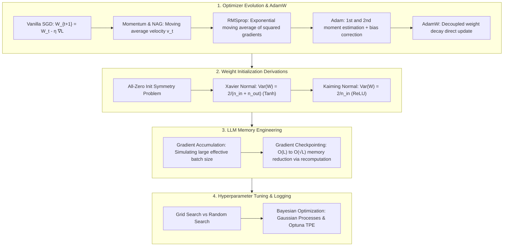

# Optimizers & Training Engineering Taxonomy: SGD, Momentum, AdamW Decoupled Weight Decay, Xavier/Kaiming Initialization & Gradient Checkpointing Guide

> **Summary**: Optimizers and training engineering bridge the gap between network architecture design and physical GPU memory limits. This 100% exhaustive guide covers adaptive optimizer evolution (SGD, Momentum, RMSprop, Adam, AdamW), weight initialization variance proofs (Xavier, Kaiming), LLM memory optimization (Gradient Accumulation, Gradient Checkpointing), and Bayesian hyperparameter tuning with rich SEO explanatory text and Pure Numpy implementations.

---

## 🧭 Knowledge Map & Architecture Graph



> 💡 **Intuition**: Optimizer history is "patching SGD": Momentum adds inertia to smooth zig-zags, RMSprop scales per-dimension learning rates, Adam combines both plus bias correction, and AdamW fixes Adam's broken weight decay. The decay bug: in Adam the L2 gradient $\lambda W$ gets divided by $\sqrt{v_t}$, so large-gradient parameters are under-regularized and small ones over-regularized — AdamW applies decay directly to the weights instead. Initialization keeps forward/backward variance constant: Xavier uses $2/(n_{in}+n_{out})$ for Tanh; ReLU halves the signal variance, so Kaiming doubles the coefficient to $2/n_{in}$. Gradient Checkpointing trades ~20–30% compute to cut activation memory from $O(L)$ to $O(\sqrt{L})$.
>
> 🎤 **Quick Answer**: "Adam: parameter with gradient std 10 gets its decay divided by ~10, one with 0.01 by ~0.1 — regularization skewed 100×; AdamW restores uniform $\eta\lambda$ shrinkage (LLaMA/GPT default). ReLU net with Xavier: activation variance shrinks as $0.5^L$ — at 50 layers that's $10^{-15}$. Checkpointing a 32-layer model: store $\sqrt{32}\approx 6$ checkpoints instead of 32 activation copies."

---

## 📚 Chapter 1: Pure Numpy Optimizer Engine

Plain-language reading (full implementation in the zh version): `adamw_step` follows the formula in four lines — update moments → bias-correct with `1 - beta**t` → apply decoupled decay directly to `w` → adaptive update. `xavier_init`/`kaiming_init` differ by a single line: denominator `n_in + n_out` vs `n_in`.

```python
import numpy as np

class PureNumpyOptimizerEngine:
    @staticmethod
    def adamw_step(w: np.ndarray, dw: np.ndarray, m: np.ndarray, v: np.ndarray, t: int) -> tuple:
        pass
```

> 💡 **Intuition**: Bias correction exists because $m_t$ starts at 0: at step 1, $m_1 = 0.1 g_1$, dividing by $(1 - 0.9^1) = 0.1$ recovers $g_1$ exactly. Without it, Adam's first steps are pathologically small.
>
> 🎤 **Quick Answer**: "With $\beta_1 = 0.9$, the correction factor is 0.1 at step 1, ~0.65 at step 10, ~1 at step 100 — it only matters early in training. Kaiming vs Xavier at $n_{in}=1024$: std 0.044 vs 0.031 — small difference in numbers, exponential difference over 50 layers."