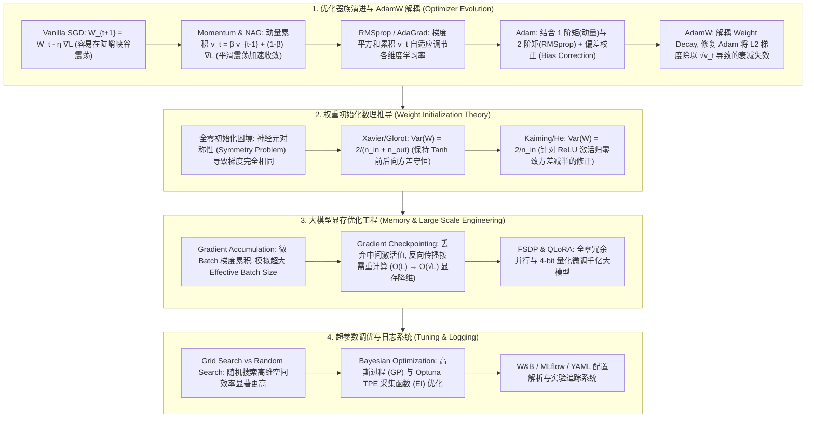

# 优化器与训练工程全景：SGD、Momentum、AdamW 解耦权重衰减、Xavier/Kaiming 初始化推导、梯度累积与重计算 (Checkpointing) 极客指南

> **核心摘要**：优化器与训练工程是连接神经网络结构设计与显存硬件物理限制的坚实桥梁。从自适应学习率优化器的演进（SGD $\to$ Momentum $\to$ RMSprop $\to$ Adam $\to$ AdamW）、打破对称性迷局的权重初始化数理推导（Xavier/Glorot 方差守恒与 Kaiming/He 修正），到单卡训练千亿大模型的显存降维武器（梯度累积 Gradient Accumulation 与梯度重计算 Gradient Checkpointing），再到基于贝叶斯优化的自动化超参数搜索（Optuna TPE）。本指南系统剖析 AdamW 解决传统 Adam 权重衰减缩放失效的数理机制、Xavier 与 Kaiming 初始化方差推导、Gradient Checkpointing 激活值显存降维原理，以及 Pure Numpy 优化器与初始化引擎实现。全篇配备丰富的 SEO 说明性段落与工程落地实践。

---

## 🧭 知识体系全景流程图 (Knowledge Map & Architecture Graph)



---

## 💡 经典面试追问与考点速查

* **考点 1**：为什么标准 Adam 中的 $L_2$ 正则化不等于 AdamW 的解耦权重衰减 (Decoupled Weight Decay)？请给出数学推导对比。
  * *标准回答*：在传统 SGD 中，在 Loss 中叠加 $L_2$ 正则化 $\frac{\lambda}{2} \|W\|^2$ 与在梯度更新时直接进行权重衰减 $W_{t+1} = (1 - \eta \lambda) W_t - \eta \nabla \mathcal{L}_0$ 是**完全等价的**。但在自适应学习率优化器 **Adam** 中，若在 Loss 中加 $L_2$，梯度变为 $g_t = \nabla \mathcal{L}_0 + \lambda W_t$。在 Adam 更新公式中，$g_t$ 会被除以二阶矩平方根 $\sqrt{v_t} + \epsilon$：
    $$W_{t+1} = W_t - \eta \frac{\hat{m}_t}{\sqrt{\hat{v}_t} + \epsilon} \quad \text{其中 } \hat{m}_t \propto (\nabla \mathcal{L}_0 + \lambda W_t)$$
    这意味着：**梯度极大的参数，其权重衰减项反而会被除以极大的 $\sqrt{v_t}$ 而被严重削弱**！导致梯度大的参数衰减不足，梯度小的参数过衰减。**AdamW** 提出了解耦权重衰减，将衰减项直接作用在更新步：
    $$W_{t+1} = (1 - \eta \lambda) W_t - \eta \frac{\hat{m}_t}{\sqrt{\hat{v}_t} + \epsilon}$$
    保证了权重衰减速率严格与自适应梯度的放缩无关，极大提升了 Transformer 与大语言模型训练的泛化性！
* **考点 2**：推导 Xavier/Glorot 初始化的方差守恒公式。为什么它适用于 Tanh / Sigmoid 而不适用于 ReLU？
  * *标准回答*：设某一层线性变换为 $y = \sum_{i=1}^{n_{\text{in}}} w_i x_i$（假设 $w_i, x_i$ 独立且均值为 0）。前向传播激活值的方差为：
    $$\text{Var}(y) = \sum_{i=1}^{n_{\text{in}}} \text{Var}(w_i x_i) = \sum_{i=1}^{n_{\text{in}}} \left( \mathbb{E}[w_i]^2 \text{Var}(x_i) + \mathbb{E}[x_i]^2 \text{Var}(w_i) + \text{Var}(w_i) \text{Var}(x_i) \right) = n_{\text{in}} \text{Var}(w) \text{Var}(x)$$
    为了防止前向传播激活值方差随层数加深爆炸或衰减，要求 $\text{Var}(y) = \text{Var}(x) \implies \text{Var}(w) = \frac{1}{n_{\text{in}}}$。同理，考虑反向传播梯度的方差守恒，要求 $\text{Var}(w) = \frac{1}{n_{\text{out}}}$。折中取调和平均，得到 **Xavier 均匀分布/正态分布方差**：
    $$\text{Var}(w) = \frac{2}{n_{\text{in}} + n_{\text{out}}}$$
    Xavier 的推导建立在激活函数在 0 附近近似线性且保持均值 0（如 Tanh, $\tanh'(0)=1$）的前提下。而 **ReLU** 将负半轴全部归零，导致通过 ReLU 后的激活值方差减半（$\text{Var}(\text{ReLU}(x)) = \frac{1}{2} \text{Var}(x)$），如果继续使用 Xavier，深层激活值的方差将以 $(\frac{1}{2})^L$ 指数级衰减归零！
* **考点 3**：Kaiming / He 初始化是如何针对 ReLU 的单侧抑制进行数学修正的？
  * *标准回答*：为了抵消 ReLU 激活函数将一半负信号归零带来的方差减半效应，He et al. 重新推导前向方差：$\text{Var}(y) = n_{\text{in}} \text{Var}(w) \left( \frac{1}{2} \text{Var}(x) \right) = \frac{1}{2} n_{\text{in}} \text{Var}(w) \text{Var}(x)$。为了满足前向方差守恒 $\text{Var}(y) = \text{Var}(x)$，解得 **Kaiming 正态初始化方差**：
    $$\text{Var}(w) = \frac{2}{n_{\text{in}}}$$
    对于带斜率 $\alpha$ 的 Leaky ReLU，方差修正为 $\text{Var}(w) = \frac{2}{(1 + \alpha^2) n_{\text{in}}}$。
* **考点 4**：解释 Gradient Checkpointing (梯度重计算) 如何以 20%-30% 的额外计算时间换取将激活值显存从 $\mathcal{O}(L)$ 降至 $\mathcal{O}(\sqrt{L})$ 的原理。
  * *标准回答*：在标准反向传播中，前向传播必须将全网络所有 $L$ 层的中间激活张量 (Activations) 全部保存在 GPU 显存 (VRAM) 中，以便反向传播计算偏导数 $\frac{\partial \mathcal{L}}{\partial A_l}$，显存开销与层数成线性关系 $\mathcal{O}(L)$。**Gradient Checkpointing** 将网络划分为 $k \approx \sqrt{L}$ 个 Block，前向传播时仅保存每个 Block 边界节点的 Checkpoint 激活值，丢弃 Block 内部的所有中间激活值（显存降至 $\mathcal{O}(\sqrt{L})$）。当反向传播推进到某个 Block 时，利用保存的边界 Checkpoint，**局部重新前向计算一遍 (Recomputation)** 该 Block 内部的激活值，算完局部梯度后立即释放。由于前向计算开销仅占总训练开销的约 1/3，重计算仅增加了约 20% 至 30% 的整体计算时间，却解封了数倍的大模型训练上下文长度！
* **考点 5**：为什么 Bergstra & Bengio 在理论上证明了随机搜索 (Random Search) 比网格搜索 (Grid Search) 在高维超参数调优中效率显著更高？
  * *标准回答*：在实际深度学习训练中，绝大多数超参数（如 Batch Size、正则化系数、层数等）对最终模型性能的**重要性贡献极不均衡**（通常只有 1 至 2 个关键超参数如学习率 Learning Rate 起主导作用）。在 2 维网格搜索 $5 \times 5 = 25$ 次实验中，对于最重要的关键超参数，实际上只尝试了 5 个不同的取值（其余 20 次在重复探索已测试过的取值）；而在 25 次随机搜索中，关键超参数探索了 **25 个完全不同的随机取值**！因此随机搜索在相同计算资源预算下，对有效维度的覆盖密度高出数倍。

---

## 📚 第一章：优化器族全景演进 (SGD $\to$ AdamW)

### 1.1 5 大优化器数学公式与更新规则

大白话理解：优化器演进史就是"给 SGD 打补丁"：SGD 只会沿当前梯度直走，在峡谷地形（一个方向陡、一个方向缓）里反复震荡；Momentum 加"惯性"（历史梯度加权平均）压住震荡；RMSprop 按"每个维度历史上有多陡"自动给每个参数配不同学习率；Adam = 惯性 + 自适应学习率 + 起步偏差校正；AdamW 再把权重衰减从"掺进梯度里"改成"直接乘在权重上"，修复了 Adam 里衰减被二阶矩稀释的毛病。

1. **SGD (Stochastic Gradient Descent)**：
   $$W_{t+1} = W_t - \eta \nabla \mathcal{L}(W_t)$$
2. **SGD with Momentum (动量法)**：
   $$v_t = \beta v_{t-1} + (1 - \beta) g_t, \quad W_{t+1} = W_t - \eta v_t$$
   利用一阶指数加权移动平均，平滑与历史方向不一致的梯度震荡。
3. **RMSprop**：
   $$s_t = \beta s_{t-1} + (1 - \beta) g_t^2, \quad W_{t+1} = W_t - \frac{\eta}{\sqrt{s_t} + \epsilon} g_t$$
   解决 AdaGrad 梯度平方和不断无休止累加导致学习率提前归零的问题。
4. **Adam (Adaptive Moment Estimation)**：
   * 1 阶动量：$m_t = \beta_1 m_{t-1} + (1 - \beta_1) g_t$； 2 阶动量：$v_t = \beta_2 v_{t-1} + (1 - \beta_2) g_t^2$；
   * 偏差校正 (Bias Correction)：$\hat{m}_t = \frac{m_t}{1 - \beta_1^t}, \quad \hat{v}_t = \frac{v_t}{1 - \beta_2^t}$；
   * 更新表达式：$W_{t+1} = W_t - \frac{\eta}{\sqrt{\hat{v}_t} + \epsilon} \hat{m}_t$。
5. **AdamW (Decoupled Weight Decay - 现代大模型标配)**：
   $$W_{t+1} = (1 - \eta \lambda) W_t - \frac{\eta}{\sqrt{\hat{v}_t} + \epsilon} \hat{m}_t$$

> 💡 **直观理解**：Adam 的核心是"每维自适应步长"：梯度又大又稳定的维度，$\sqrt{v_t}$ 大、步长自动变小；梯度小而稀疏的维度，步长自动放大——这就是为什么 Adam 在 Transformer/大模型上几乎不调参就能用。但"自适应步长"也是它的坑：把 L2 正则项 $\lambda W$ 混进梯度后，该项同样被 $\sqrt{v_t}$ 除——权重大的参数梯度大、衰减被稀释，权重小的衰减被放大，正则效果被扭曲。AdamW 把衰减直接乘在权重上，绕开二阶矩。
>
> 🎤 **面试速答**："结论：Adam 自适应当维步长但会扭曲 L2 衰减，AdamW 解耦衰减修复它。原理：L2 梯度被除以 $\sqrt{v_t}$ 后，大权重参数衰减不足；AdamW 改成 $W_{t+1} = (1-\eta\lambda)W_t - \eta \hat m_t/\sqrt{\hat v_t}$。举个例子：某参数梯度标准差 10、另一参数 0.01，Adam 中前者的衰减项被除以约 10 而后者被除以约 0.1，正则强度差 100 倍；AdamW 下两者都按 $\eta\lambda=0.01$ 等比收缩——GPT/LLaMA 预训练全部使用 AdamW。"

---

## 📚 第二章：权重初始化数理推导 (Xavier vs Kaiming)

### 2.1 全零初始化 (All-Zero Init) 的对称性灾难
若将深度网络的所有权重初始化为 0（$W=0$），在前向传播中，隐藏层所有神经元的输出均相同 $h_i = \sigma(0)$。在反向传播中，损失函数对所有权重的偏导数也完全相同 $\frac{\partial \mathcal{L}}{\partial w_i} = \frac{\partial \mathcal{L}}{\partial w_j}$。这导致深层网络退化为单个神经元，永远无法学习复杂的特征组合（Symmetry Breaking 破缺失效）。

> 💡 **直观理解**：全零初始化的病根是"对称性"：同一层的神经元起点一模一样，梯度公式对它们一视同仁，更新后还是一模一样——就像双胞胎从小到大吃同样的饭、做同样的事，永远长不成两个不同的人。随机初始化（哪怕一点点扰动）就是为了打破对称，让每个神经元走上不同的进化路线。
>
> 🎤 **面试速答**："结论：全零初始化使同层神经元完全对称、退化成单神经元，必须随机初始化。原理：所有权重梯度相同，更新量相同，对称永远无法打破。举个例子：隐藏层 512 个神经元全零初始化，512 个神经元永远是彼此的复制品，有效容量只有 1；而 Xavier 用 $\sqrt{2/(n_{in}+n_{out})}$ 的标准差随机扰动后，512 个神经元各自独立演化。"


### 2.2 2 大金标准初始化数学分布公式

怎么读这张表：核心是"适用激活函数"与"标准差"两列的对应关系——Xavier 的标准差分母是 $n_{in}+n_{out}$（前后向各让一步），Kaiming 的分母只有 $n_{in}$ 且系数 2（补偿 ReLU 砍掉一半信号）。面试一问"为什么 ReLU 不能用 Xavier"，答案就是 $2/n_{in}$ 里的那个 2。

| 初始化方法 | 适用激活函数 | 均匀分布区间 $U[-a, a]$ | 正态分布标准差 $\sigma$ |
| :--- | :--- | :--- | :--- |
| **Xavier / Glorot** | Tanh, Sigmoid, Linear | $a = \sqrt{\frac{6}{n_{\text{in}} + n_{\text{out}}}}$ | $\sigma = \sqrt{\frac{2}{n_{\text{in}} + n_{\text{out}}}}$ |
| **Kaiming / He** | ReLU, Leaky ReLU, GELU | $a = \sqrt{\frac{6}{n_{\text{in}}}}$ | $\sigma = \sqrt{\frac{2}{n_{\text{in}}}}$ |

> 💡 **直观理解**：初始化的目标是"前向传播每层激活值方差不变、反向传播每层梯度方差不变"——否则 100 层网络要么信号爆炸成 NaN、要么衰减成 0。推导的核心是方差传播公式 $\text{Var}(y) = n_{in}\text{Var}(w)\text{Var}(x)$：要求方差守恒就得到 $\text{Var}(w) = 1/n_{in}$（前向）与 $1/n_{out}$（反向），Xavier 取调和平均 $2/(n_{in}+n_{out})$。ReLU 把一半信号归零使方差减半，所以 Kaiming 把系数翻倍成 $2/n_{in}$。
>
> 🎤 **面试速答**："结论：Xavier 用于 Tanh/Sigmoid，Kaiming 用于 ReLU，标准差分别为 $\sqrt{2/(n_{in}+n_{out})}$ 与 $\sqrt{2/n_{in}}$。原理：保持前后向方差守恒；ReLU 的负半轴归零让激活方差减半，需放大初始化补偿。举个例子：$n_{in}=1024$ 时 Xavier 标准差 $\approx 0.031$，Kaiming $\approx 0.044$；若 ReLU 网络误用 Xavier，50 层后激活方差缩到 $0.5^{50} \approx 10^{-15}$，梯度彻底消失。"

---

## 📚 第三章：大模型训练工程 (Gradient Accumulation & Checkpointing)

### 3.1 梯度累积 (Gradient Accumulation)
在单卡显存受限（如无法容纳大 Batch Size $B=128$）时，将 Batch 拆分为 $K$ 个微 Batch (Micro-batch $B_{\text{micro}} = 16$)：
1. 连续进行 $K$ 次前向传播与反向传播，将梯度累加到 `parameter.grad` 属性中（注意不调用 `optimizer.zero_grad()`）；
2. 累加 $K$ 次后，对梯度除以 $K$ 进行平均：$g_{\text{avg}} = \frac{1}{K} \sum_{k=1}^K g_k$；
3. 执行一次 `optimizer.step()` 更新权重，随后调用 `optimizer.zero_grad()`。

> 💡 **直观理解**：梯度累积 = "用时间换 batch 大小"：显存装不下 128 的 batch，就拆成 8 个 16 的微 batch，前向反向各跑 8 次，梯度攒在 `parameter.grad` 里，最后除 8 再更新一次。数学上与直接跑 batch=128 的梯度近似等价（前提是不开 BN 这类依赖 batch 统计的层），但只花 1/8 的显存。
>
> 🎤 **面试速答**："结论：梯度累积用小显存模拟大 batch：K 次微 batch 梯度求平均后更新一次。原理：$g_{avg} = \frac{1}{K}\sum g_k$ 等价于大 batch 的期望梯度；关键是不要每次 `zero_grad()`。举个例子：目标 batch=128、显存只能跑 16，设 K=8 即可等效；注意梯度累积后学习率要按大 batch 的线性缩放规则调整——batch 扩大 8 倍时 lr 通常也乘 8，否则收敛变慢。"

### 3.2 梯度重计算 (Gradient Checkpointing) 显存降维原理
通过在模型前向图中设立 Checkpoint 节点，使显存从 $\mathcal{O}(L)$ 降至 $\mathcal{O}(\sqrt{L})$：

```text
  标准前向传播 (所有层激活值留在显存):
  [Input] ──> [A1] ──> [A2] ──> [A3] ──> [A4] ──> [A5] ──> [Loss]  (显存占用大 O(L))

  Gradient Checkpointing (仅留 Checkpoint 节点):
  [Input] ──> [A1*] ───────────> [A3*] ───────────> [A5*] ──> [Loss] (显存占用小 O(√L))
                 │                  │
                 └─> 重计算 A2       └─> 重计算 A4  (反向传播时局部按需即时计算)
```

> 💡 **直观理解**：反向传播需要前向的中间激活值来算梯度，标准做法是"前向时全存下来"——显存 O(L)；Checkpointing 只在每 $\sqrt{L}$ 层存一个"检查点"，其余激活丢弃，反传到哪个区间就现场重跑那段前向。显存从 O(L) 降到 O(√L) 是典型"空间换时间"：前向只占总开销约 1/3，重算只多花约 20~30% 时间。
>
> 🎤 **面试速答**："结论：Gradient Checkpointing 把激活显存从 O(L) 降到 O(√L)，代价是 20~30% 额外计算。原理：只存 $\sqrt{L}$ 个检查点，反传时按需重算区间前向。举个例子：32 层模型不重算需存 32 份激活，开 checkpoint 后只存 6 份（$\sqrt{32}\approx5.7$）；7B 模型激活显存从约 40GB 降到约 8GB，2×A100 80GB 就能训练——这是单卡训大模型（如 LLaMA 复现）的标准配置。"

---

## 📚 第四章：Pure Numpy 实现优化器与初始化算子引擎

大白话看代码：`xavier_init` 与 `kaiming_init` 只有一行区别——分母是 `n_in + n_out` 还是 `n_in`，这就是 2.2 表格的代码化；`adamw_step` 按公式四步走：更新一阶/二阶矩 → 偏差校正（`1 - beta**t` 修正起步时矩估计偏小的问题）→ 解耦衰减直接乘权重 → 自适应步长更新。

```python
import numpy as np

class PureNumpyOptimizerEngine:
    @staticmethod
    def xavier_init(shape: tuple) -> np.ndarray:
        """Xavier / Glorot 正态分布初始化"""
        n_in, n_out = shape[0], shape[1]
        std = np.sqrt(2.0 / (n_in + n_out))
        return np.random.randn(*shape) * std
    @staticmethod
    def kaiming_init(shape: tuple) -> np.ndarray:
        """Kaiming / He 正态分布初始化 (专为 ReLU 设计)"""
        n_in = shape[0]
        std = np.sqrt(2.0 / n_in)
        return np.random.randn(*shape) * std
    @staticmethod
    def adamw_step(w: np.ndarray, dw: np.ndarray, m: np.ndarray, v: np.ndarray, 
                   t: int, lr: float = 1e-3, beta1: float = 0.9, beta2: float = 0.999, 
                   eps: float = 1e-8, weight_decay: float = 0.01) -> tuple:
        """AdamW 解耦权重衰减更新算法"""
        # 1. 1阶矩与2阶矩更新
        m = beta1 * m + (1.0 - beta1) * dw
        v = beta2 * v + (1.0 - beta2) * (dw ** 2)
        
        # 2. 偏差校正 (Bias Correction)
        m_hat = m / (1.0 - beta1 ** t)
        v_hat = v / (1.0 - beta2 ** t)
        
        # 3. 解耦权重衰减 (Direct Weight Decay Step)
        w = (1.0 - lr * weight_decay) * w
        
        # 4. 自适应梯度更新
        w = w - lr * m_hat / (np.sqrt(v_hat) + eps)
        return w, m, v
```

> 💡 **直观理解**：注意 `adamw_step` 里偏差校正 `m_hat = m / (1 - beta1**t)` 的必要性：第 1 步时 $m_1 = 0.9\times0 + 0.1 g_1 = 0.1 g_1$，被严重低估，除以 $(1-0.9^1)=0.1$ 恰好还原成 $g_1$；这就是"偏差校正"存在的全部理由——没有它，Adam 前几十步会走得异常小。
>
> 🎤 **面试速答**："结论：Adam 前几步矩估计被低估，需偏差校正 $\hat m_t = m_t/(1-\beta_1^t)$。原理：$m_t$ 从 0 起步是加权平均的渐进收敛，除以 $(1-\beta^t)$ 还原无偏估计。举个例子：$\beta_1=0.9$ 时第 1 步校正因子 0.1、第 10 步约 0.65、第 100 步约 1——所以校正只影响训练早期；学习率 $\eta=1e-3$ 配合 AdamW 是 LLaMA/GPT 的默认配方，而 SGD 在同样任务上需要精调 lr 到 $10^{-2}\sim10^{-1}$。"

---

## 📚 第五章：总结与选型路线图

1. **优化器选型**：大语言模型/Transformer 必选 **AdamW**；传统 CV / 强化学习首选 SGD with Momentum；
2. **权重初始化**：ReLU / GELU 系列必选 **Kaiming Normal**；Tanh / Sigmoid 必选 **Xavier Normal**；严禁全零初始化；
3. **显存扩展工程**：单卡显存受限时优先开启 **Gradient Accumulation** 扩大 Batch；训练数十亿规模大模型时开启 **Gradient Checkpointing** 实现显存 $\mathcal{O}(\sqrt{L})$ 降维。