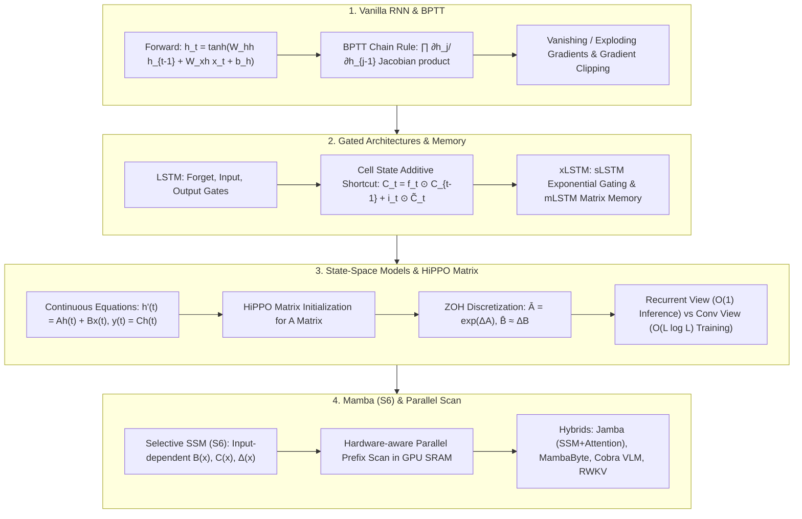

# Sequence Models Evolution: RNN BPTT, LSTM/GRU Gating, xLSTM Matrix Memory, HiPPO Matrix & Mamba Selective SSM (S6) Guide

> **Summary**: Processing variable-length sequences and capturing long-term dependencies is the core challenge of sequence modeling. This 100% exhaustive guide covers RNN BPTT derivations, LSTM/GRU gating, xLSTM matrix memory, HiPPO matrix initialization, continuous SSM ZOH discretization, Mamba S6 selective SSM, and hybrid models with rich SEO explanatory text and Pure Numpy implementations.

---

## 🧭 Knowledge Map & Architecture Graph



> 💡 **Intuition**: Sequence models are a three-generation saga of "how to keep long-range memory alive". Vanilla RNN overwrites its memory every step, so backprop multiplies ~T Jacobians: with $\lambda_{\max}(W_{hh}) = 0.9$ and a 50-step gap, gradients shrink to $0.9^{50} \approx 0.005$ — long dependencies die. LSTM adds a cell-state "conveyor belt" with additive updates ($C_t = f_t \odot C_{t-1} + i_t \odot \tilde C_t$): when the forget gate learns $f_t \approx 1$, gradients flow through the belt undamped. SSMs discretize a linear differential equation ($\bar A = e^{\Delta A}$) — inference is a constant-memory recurrence, training is a convolution (parallel, $O(L\log L)$); HiPPO initializes $A$ so S4 can track 1M-step memory, and Mamba makes $B, C, \Delta$ input-dependent so the model can choose what to remember (Δ → 0 skips noise, larger Δ writes key info).
>
> 🎤 **Quick Answer**: "RNN gap 50, $\lambda_{\max}=0.9$: gradient $0.9^{50} \approx 0.005$ — can't learn long references. LSTM with $f_t=1$: gradient ≈ 1, remembers 100+ words. Transformer at 100K context: KV cache = hundreds of MB; Mamba state = a 16–64-dim vector (KB). Jamba interleaves 1 Attention + 7 Mamba layers: 8× less KV cache, no OOM at 100K."

---

## 📚 Chapter 1: Pure Numpy Sequence Engine

Plain-language reading (full implementations in the zh version): `lstm_cell_forward` computes three sigmoid gates and a tanh candidate, then the additive update `C_t = f_t * C_prev + i_t * c_tilde` and `h_t = o_t * tanh(C_t)`; `s4_ssm_step` is the discrete recurrence $h_t = \bar A h_{t-1} + \bar B x_t$ in two lines.

```python
import numpy as np

class PureNumpySeqEngine:
    @staticmethod
    def lstm_cell_forward(x: np.ndarray, h_prev: np.ndarray, C_prev: np.ndarray, W_f: np.ndarray, W_i: np.ndarray, W_c: np.ndarray, W_o: np.ndarray) -> tuple:
        pass
    @staticmethod
    def s4_ssm_step(x_t: np.ndarray, h_prev: np.ndarray, A_bar: np.ndarray, B_bar: np.ndarray, C: np.ndarray) -> tuple:
        pass
```

> 💡 **Intuition**: Three generations in three lines of code: RNN rewrites all memory (gradients multiply), LSTM edits memory with gates (gradients add), SSM is a stable linear recurrence (must be carefully initialized or long memory decays immediately).
>
> 🎤 **Quick Answer**: "LSTM's $f_t \approx 1$ makes $\partial C_t/\partial C_{t-1} \approx 1$ — the additive path is the whole fix for vanishing gradients. SSM's $\bar A$ must come from HiPPO/ZOH discretization; a random $A$ forgets within a few steps."