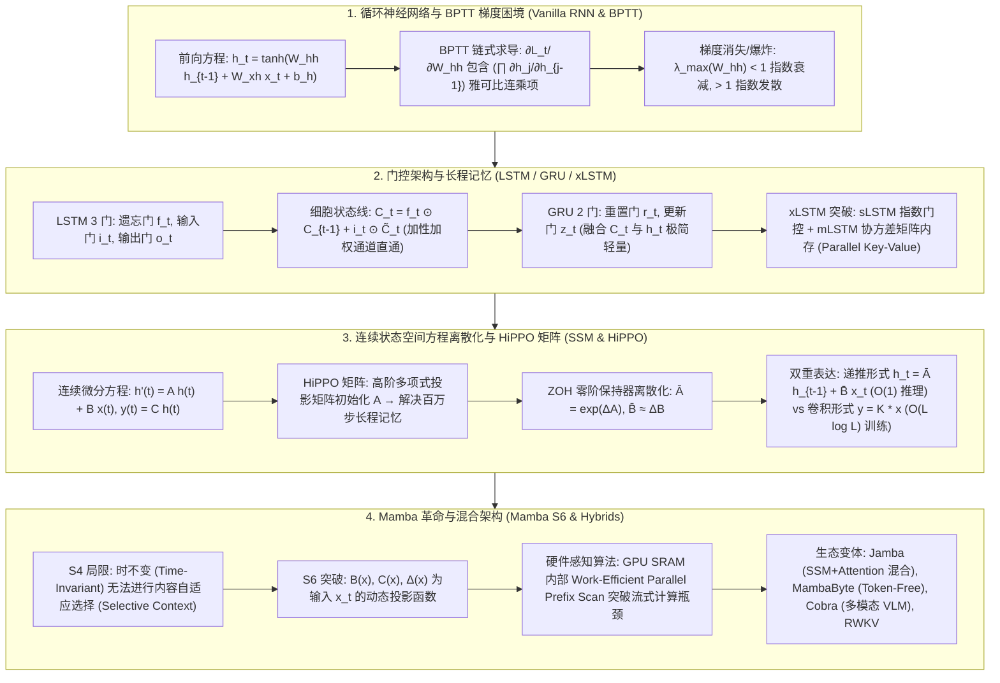

# 序列模型演进全景：RNN 随时间反向传播 (BPTT)、LSTM/GRU 门控机制、xLSTM 矩阵内存、HiPPO 矩阵与 Mamba 选择性状态空间模型 (S6) 极客指南

> **核心摘要**：处理变长序列与捕捉时间长程依赖是自然语言处理、语音识别与时序预测的核心课题。从早期的循环神经网络 (RNN)、解决梯度消失的门控机制 (LSTM / GRU)，到近年重新焕发生机的 xLSTM，再到突破 Transformer $\mathcal{O}(N^2)$ 复杂度与 KV Cache 显存瓶颈的 Mamba 状态空间模型 (Selective SSM)，序列模型的演进完美体现了“表达能力、长程记忆与硬件并行效率”三者之间的权衡博弈。本指南系统剖析 BPTT 梯度求导、LSTM 细胞状态加性路径、xLSTM 矩阵内存、S4 HiPPO 记忆矩阵、连续 SSM 零阶保持器 (ZOH) 离散化，以及 Mamba S6 动态选择机制与 GPU SRAM 硬件感知并行 Scan 算法。全篇配备丰富的 SEO 说明性段落与 Pure Numpy 序列算子引擎。

---

## 🧭 知识体系全景流程图 (Knowledge Map & Architecture Graph)



---

## 💡 经典面试追问与考点速查

* **考点 1**：详细推导 RNN 随时间反向传播 (BPTT) 的雅可比矩阵连乘公式。为什么 $W_{hh}$ 特征值绝对值小于 1 会导致梯度消失？
  * *标准回答*：在标准 RNN 中，$h_t = \tanh(W_{hh} h_{t-1} + W_{xh} x_t + b_h)$。考虑时刻 $t$ 的损失 $\mathcal{L}_t$ 对权重 $W_{hh}$ 的梯度：
    $$\frac{\partial \mathcal{L}_t}{\partial W_{hh}} = \sum_{k=1}^t \frac{\partial \mathcal{L}_t}{\partial h_t} \left( \prod_{j=k+1}^t \frac{\partial h_j}{\partial h_{j-1}} \right) \frac{\partial h_k}{\partial W_{hh}}$$
    其中相邻隐藏状态的偏导雅可比矩阵为 $\frac{\partial h_j}{\partial h_{j-1}} = \text{diag}\left( 1 - \tanh^2(z_j) \right) W_{hh}^T$。在连乘项 $\prod_{j=k+1}^t \frac{\partial h_j}{\partial h_{j-1}}$ 中，若时间跨度 $t - k$ 很大，且 $\tanh'$ 导数最大值为 1，$W_{hh}$ 的最大特征值 $\lambda_{\text{max}} < 1$，则矩阵连乘结果衰减至接近 0（指数级下降）；反之若 $\lambda_{\text{max}} > 1$，则引发指数级梯度爆炸！
* **考点 2**：LSTM 是如何利用细胞状态 $C_t$ 的线性加性路径 (Additive Path) 从数学上消除梯度消失问题的？
  * *标准回答*：LSTM 引入了专门用于存储长期记忆的细胞状态 $C_t = f_t \odot C_{t-1} + i_t \odot \tilde{C}_t$。考虑 $C_t$ 对前一时刻 $C_{t-1}$ 的偏导数：
    $$\frac{\partial C_t}{\partial C_{t-1}} = f_t + C_{t-1} \frac{\partial f_t}{\partial C_{t-1}} + \tilde{C}_t \frac{\partial i_t}{\partial C_{t-1}} + i_t \frac{\partial \tilde{C}_t}{\partial C_{t-1}}$$
    与传统 RNN 的矩阵相乘（$\prod W_{hh}$）不同，LSTM 的梯度传导主要由**遗忘门 $f_t$ 控制的加性项**主导！只要网络学习到遗忘门 $f_t \approx 1.0$（即不遗忘过去的记忆），偏导数 $\frac{\partial C_t}{\partial C_{t-1}} \approx 1.0$，梯度就可以沿着 $C_t$ 的线性加性通道在任意长的时间步上无损流动，从数理机制上彻底根治了梯度消失！
* **考点 3**：S4 模型是如何利用 HiPPO (High-order Polynomial Projection Operators) 矩阵初始化系统矩阵 $\mathbf{A}$ 的？
  * *标准回答*：直接随机初始化连续 SSM 的系统矩阵 $\mathbf{A} \in \mathbb{R}^{N \times N}$ 会导致长序列训练迅速发散或遗忘。**HiPPO 理论**通过勒让德多项式 (Legendre Polynomials) 的高阶正交投影，为历史输入信号建立最佳连续时间记忆逼近。HiPPO 给出矩阵 $\mathbf{A}$ 的闭式解：
    $$\mathbf{A}_{n,k} = \begin{cases} - (2n + 1)^{1/2} (2k + 1)^{1/2}, & n > k \\ - (n + 1), & n = k \\ 0, & n < k \end{cases}$$
    使用 HiPPO 矩阵初始化 $\mathbf{A}$ 后，S4 能够在数学上精确追踪并压缩长达 1,000,000 个步长的时间上下文，是 SSM 突破长序列记忆的核心数学保障。
* **考点 4**：对比 S4 结构，Mamba 选择性状态空间模型 (Selective SSM / S6) 是如何通过参数动态化解决内容选择 (Selective Filtering) 痛点的？
  * *标准回答*：传统的结构化状态空间模型 (S4) 是**线性时不变的 (Linear Time-Invariant, LTI)**，其系统矩阵 $\mathbf{A}, \mathbf{B}, \mathbf{C}, \Delta$ 对所有输入的 Token 都是固定的常数。这导致 S4 无法根据上下文主动“选择”或“过滤”信息（例如在文本中区分噪声标点与关键实体）。**Mamba (S6)** 提出了**选择性机制 (Selective Mechanism)**，将参数 $\mathbf{B}, \mathbf{C}$ 与步长参数 $\Delta$ 改造为随当前输入 $x_t$ 动态变化的向量函数：
    $$\mathbf{B}_t = \text{Linear}_N(x_t), \quad \mathbf{C}_t = \text{Linear}_N(x_t), \quad \Delta_t = \text{Softplus}(\text{Parameter} + \text{Linear}_D(x_t))$$
    当遇到无关噪音时，Mamba 自动将 $\Delta_t \to 0$，使系统状态保持不变；遇到核心关键词时，将 $\Delta_t$ 调大，迅速将新信息写入状态 $h_t$，从而具备了与 Transformer Self-Attention 媲美的高灵敏内容选择能力！
* **考点 5**：解释 Jamba 与 SAMBA 这种 SSM + Transformer 混合架构在推理解算显存 (KV Cache) 与超长上下文注意力上的权衡优势。
  * *标准回答*：纯 Transformer 架构的 KV Cache 显存占用随上下文长度 $L$ 呈线性扩张 $\mathcal{O}(L)$，在处理 100K 以上长文本时显存极易 OOM；而纯 Mamba 架构的内存状态恒定 $\mathcal{O}(1)$，但对全局精确 Copy / Recall 检索任务能力略逊于 Full Attention。**Jamba (AI21) 与 SAMBA (Microsoft)** 采用**交替混合层 (Hybrid Layers)** 架构：例如每 1 个 Transformer Attention 层搭配 7 个 Mamba SSM 层。该架构将 KV Cache 显存开销降低了 8 倍以上，同时完美兼顾了无限上下文平滑扩展与精确信息召回！

---

## 📚 第一章：循环神经网络 (RNN) 与 BPTT 梯度推导

### 1.1 隐藏状态前向传播方程式
大白话理解：RNN 是一个"带记忆的复读机"：每个时刻把"当前输入 $x_t$"和"脑子里上一刻的记忆 $h_{t-1}$"揉在一起（$W_{hh}h_{t-1} + W_{xh}x_t$），经 tanh 压缩成新的记忆 $h_t$。所有时刻**共享同一组权重**（$W_{hh}, W_{xh}$ 不随时间变），所以参数量与序列长度无关——这是 RNN 的核心设计。
在序列 $X = (x_1, x_2, \dots, x_T)$ 中，RNN 在时刻 $t$ 的隐藏状态 $h_t$ 结合了当前输入 $x_t$ 与上一时刻记忆 $h_{t-1}$：
$$z_t = W_{hh} h_{t-1} + W_{xh} x_t + b_h, \quad h_t = \tanh(z_t)$$
$$o_t = W_{hy} h_t + b_y, \quad \hat{y}_t = \text{Softmax}(o_t)$$

> 💡 **直观理解**：RNN 的核心设计是"权重跨时间共享"：无论序列多长，只有 $W_{hh}, W_{xh}, W_{hy}$ 三组参数——把"时间"当作"深度"来理解，权重共享让模型对任意长度序列都能用同一套"记忆规则"，代价是同一套规则要反复作用于每一时刻（这正是梯度连乘问题的源头）。
>
> 🎤 **面试速答**："结论：RNN 每时刻用同一组权重把 $h_{t-1}$ 与 $x_t$ 揉成新记忆，参数量与序列长度无关。原理：共享权重 + tanh 压缩，输出经 Softmax 得概率。例子：处理 1000 词的句子，$W_{hh}$ 是 $d\times d$（如 128×128）矩阵且全句只有这一套，总参数量约 $3d^2$；而同样长度的 Transformer 每层 attention 会随序列变长增加 KV cache。"

### 1.2 BPTT 随时间反向传播推导与梯度爆炸防御
大白话理解：BPTT 就是"把 RNN 按时间轴展开成深网络再反向传播"——序列长度 T 等价于网络深度 T，而每层之间共享权重 $W_{hh}$。梯度沿时间回传时要连乘 $T$ 个雅可比矩阵 $\prod \partial h_j/\partial h_{j-1}$，每个矩阵的谱半径（最大特征值）决定了梯度是"按比例指数缩小"还是"指数放大"——这就是 RNN 梯度消失/爆炸与普通深度网络同源的数学本质。
当训练长文本序列时，普通的梯度截断 (Gradient Clipping) 成为防止 RNN 梯度爆炸的必要工程防线：
$$\text{if } \|g\|_2 > \text{threshold} \implies g \leftarrow g \cdot \frac{\text{threshold}}{\|g\|_2}$$

> 💡 **直观理解**：把 RNN 的梯度回传想成"接龙传话"：每传一步，信号都要乘一次 $\text{diag}(1-\tanh^2) W_{hh}^T$。$\tanh' \le 1$ 且 $W_{hh}$ 特征值若都小于 1，50 步接龙后信号缩到 $0.9^{50} \approx 0.005$——第 1 个词对第 50 个词的梯度贡献趋近于零，模型学不到长程依赖；特征值大于 1 则反过来爆炸成 NaN，工程上靠梯度裁剪兜底。
>
> 🎤 **面试速答**："结论：BPTT 梯度含 $\prod_{j} (\text{diag}(\tanh') W_{hh}^T)$ 连乘，$\lambda_{\max}(W_{hh}) < 1$ 指数衰减、$> 1$ 指数爆炸。原理：展开后深度 = 序列长度，连乘项按特征值幂次增长/衰减；tanh 导数最大 1 不提供额外缓冲。举个例子：$\lambda_{\max}=0.9$、间隔 50 步，梯度缩到约 $0.9^{50}\approx 0.005$；间隔 100 步缩到 $10^{-5}$——所以普通 RNN 学不会"隔 100 词才出现的指代"；梯度裁剪 `clip_grad_norm_(1.0)` 是防爆炸的标准防线。"

---

## 📚 第二章：LSTM / GRU 门控机制与 xLSTM 革命

### 2.1 LSTM 4 大计算节点极客表达

大白话理解：LSTM 的杀手锏是一条独立的"传送带"（细胞状态 $C_t$），记忆在传送带上传输，三个门（遗忘/输入/输出）像三道阀门控制"丢多少旧记忆、收多少新记忆、放出多少给输出"。关键在于 $C_t$ 的更新是**加法**（$f_t \odot C_{t-1} + i_t \odot \tilde C_t$）而非矩阵乘法——梯度沿传送带回传时是"加法直通"而不是"连乘衰减"，这是它根治梯度消失的数学原因。

1. **遗忘门 (Forget Gate)**：$f_t = \sigma(W_f \cdot [h_{t-1}, x_t] + b_f) \in (0, 1)$
2. **输入门 (Input Gate)**：$i_t = \sigma(W_i \cdot [h_{t-1}, x_t] + b_i) \in (0, 1)$
3. **候选细胞状态 (Candidate State)**：$\tilde{C}_t = \tanh(W_c \cdot [h_{t-1}, x_t] + b_c)$
4. **细胞状态与隐藏状态更新**：
   $$C_t = f_t \odot C_{t-1} + i_t \odot \tilde{C}_t$$
   $$o_t = \sigma(W_o \cdot [h_{t-1}, x_t] + b_o), \quad h_t = o_t \odot \tanh(C_t)$$

> 💡 **直观理解**：LSTM 与 RNN 的差别可以浓缩成一句话："记忆走加法直通，而非矩阵连乘"。对 $C_{t-1}$ 求导得 $\frac{\partial C_t}{\partial C_{t-1}} = f_t + (\dots)$：当遗忘门学到 $f_t \approx 1$ 时，这条导数路径几乎等于 1，梯度过 100 个时间步也几乎不缩水——就像传送带上的箱子，传送带本身不损耗。
>
> 🎤 **面试速答**："结论：LSTM 靠细胞状态的加性更新路径消除梯度消失。原理：$\partial C_t/\partial C_{t-1} = f_t + \text{高阶项}$，遗忘门 $f_t$ 学成 1 时梯度沿传送带直通、不连乘 $W$。举个例子：RNN 间隔 50 步梯度缩到 $0.9^{50}\approx 0.005$，LSTM 保持接近 1，所以 LSTM 能记住 100+ 词的远距离指代；GRU 是它的精简版——只有重置门和更新门两个门，参数量少约 1/4，效果接近。"

### 2.2 xLSTM (sLSTM 与 mLSTM 矩阵内存)
为了在 LLM 时代抗衡 Transformer，Sepp Hochreiter 团队提出了 xLSTM：
* **sLSTM (Scalar LSTM)**：指数激活门控（Exponential Gated Memory）与稳定化因子，提升内存容量；
* **mLSTM (Matrix LSTM)**：使用 $d \times d$ 的协方差矩阵存储 Memory $C_t = F_t C_{t-1} + I_t (v_t k_t^T)$，实现了可完全高度并行化 (Parallelizable Matrix Memory) 的 Key-Value 关联记忆机制！

> 💡 **直观理解**：xLSTM 是"把 LSTM 升级成 Transformer 级"的尝试：mLSTM 的记忆 $C_t$ 从"向量"升级成"$d\times d$ 矩阵"，外积 $v_t k_t^T$ 记录的是"哪些 key 匹配哪些 value"的关联——这正是注意力想做的事，但用 RNN 式的固定内存来表达。sLSTM 则用指数门控扩大记忆容量，再用稳定化因子防数值爆炸。
>
> 🎤 **面试速答**："结论：xLSTM 通过矩阵内存（mLSTM 的 $C_t = F_t C_{t-1} + I_t(v_t k_t^T)$）和指数门控（sLSTM）把 LSTM 提升到可与 Transformer 竞争的水平。原理：矩阵内存天然并行可训、Key-Value 关联近似注意力；代价是每步矩阵运算比标量门控重。举个例子：mLSTM 记忆矩阵 $d=128$ 时每步更新是 128×128 矩阵加外积，容量是标量 LSTM 的 $10^4$ 倍以上。"

---

## 📚 第三章：Mamba 状态空间模型 (Selective SSM / S6) 与硬件加速

### 3.1 连续与离散状态空间方程

大白话理解：状态空间模型（SSM）把"序列建模"写成一组线性微分方程：状态 $h(t)$ 像"隐藏记忆"，输入 $x(t)$ 流入状态（$B$ 控制"进来的口子"）、状态随时间演化（$A$ 控制"记忆的保持/衰减"）、输出 $y(t)$ 从状态里读出来（$C$ 控制"读哪部分"）。因为计算机只吃离散序列，用零阶保持器（ZOH，把两个采样点之间的输入当作常数）把它离散化成 $h_t = \bar A h_{t-1} + \bar B x_t$——离散后它长得很像 RNN，但 $\bar A = e^{\Delta A}$ 由指数矩阵给出，数值更稳。

$$\text{连续形式}: \quad h'(t) = \mathbf{A} h(t) + \mathbf{B} x(t), \quad y(t) = \mathbf{C} h(t)$$
$$\text{离散化形式 (ZOH)}: \quad h_t = \mathbf{\bar{A}} h_{t-1} + \mathbf{\bar{B}} x_t, \quad y_t = \mathbf{C} h_t$$

> 💡 **直观理解**：SSM 最妙的是"一个模型两种身份"：递推形式 $h_t = \bar A h_{t-1} + \bar B x_t$ 让**推理**像 RNN 一样每步 O(1) 状态、显存恒定；展开后它又是一个线性卷积 $y = \bar K * x$（$\bar K$ 是固定的卷积核），**训练**可以用 FFT 一次算完整个序列（O(L log L) 并行）。这就是"RNN 的显存 + CNN 的并行"。
>
> 🎤 **面试速答**："结论：SSM 离散化后推理是递推 O(1) 内存、训练是卷积 O(L log L) 并行。原理：线性时不变系统的响应就是卷积；$\bar A = e^{\Delta A}$ 由 ZOH 离散化导出。举个例子：序列 100K 长时，Transformer 推理要存 100K 的 KV cache（数百 MB），SSM 状态只有 $d=16\sim64$ 维向量（几 KB）；HiPPO 初始化的 $A$ 让 S4 在 LRA 基准上对 1M 步序列依旧保持记忆。"

### 3.2 Mamba 生态与多模态扩展架构

1. **MambaByte**：无 Tokenizer (Token-Free) 的字节级选择性状态空间模型，直接在原始字节流上运行，消除分词器带来的 Out-of-Vocabulary 偏差；
2. **Cobra**：将 Mamba 扩展至多模态大语言模型 (VLM) 中，实现低延迟高吞吐的视觉-语言图文推理；
3. **RWKV (Receptance Weighted Key Value)**：将 RNN 式推理解算与 Transformer 式并行训练相结合的线性注意力架构。

> 💡 **直观理解**：S4 的病根是"对所有 token 一视同仁"——$A, B, C, \Delta$ 全是常数，遇到"噪音标点"和"关键实体"用同一个记忆策略，做不到内容选择。Mamba 的 S6 让 $B(x_t), C(x_t), \Delta(x_t)$ 都随输入变化：无关内容时 $\Delta \to 0$（状态原地不动、不写入），关键内容时 $\Delta$ 调大（新信息快速写入状态）——这给了 SSM 类似注意力的"选择性聚焦"能力。
>
> 🎤 **面试速答**："结论：Mamba 通过输入依赖的参数 $B(x_t), C(x_t), \Delta(x_t)$ 实现内容选择性记忆，解决 S4 时不变参数无法过滤信息的问题。原理：$\Delta_t$ 控制状态更新步长——无关 token 时 $\Delta_t\to0$ 状态不变，关键 token 时调大步长写入新信息。举个例子：读长文档时'的/了'这类词触发 $\Delta\approx0$（跳过不写），出现'合同/金额'时 $\Delta$ 显著增大；训练用 GPU SRAM 内的并行前缀扫描（Parallel Scan）保持 O(L log L) 并行度；Jamba 用 1 层 Attention + 7 层 Mamba 交替，KV cache 降 8 倍，100K 上下文不 OOM。"

---

## 📚 第四章：Pure Numpy 实现序列模型算子引擎 (RNN, LSTM Cell, SSM S4)

大白话看代码：`rnn_cell_forward` 一行就是 1.1 的公式；`lstm_cell_forward` 按 2.1 的四步走——`f_t/i_t/o_t` 三个 sigmoid 门 + `c_tilde` 候选记忆，然后 `C_t = f_t * C_prev + i_t * c_tilde` 加性更新、`h_t = o_t * tanh(C_t)` 输出；`s4_ssm_step` 就是离散 SSM 的递推 $h_t = \bar A h_{t-1} + \bar B x_t$。三行代码串起三代模型。

```python
import numpy as np

class PureNumpySeqEngine:
    @staticmethod
    def rnn_cell_forward(x: np.ndarray, h_prev: np.ndarray, W_xh: np.ndarray, W_hh: np.ndarray, b_h: np.ndarray) -> np.ndarray:
        """Standard RNN Cell 前向传播"""
        return np.tanh(x @ W_xh + h_prev @ W_hh + b_h)
    @staticmethod
    def lstm_cell_forward(x: np.ndarray, h_prev: np.ndarray, C_prev: np.ndarray, 
                          W_f: np.ndarray, W_i: np.ndarray, W_c: np.ndarray, W_o: np.ndarray) -> tuple:
        """LSTM Cell 前向传播 (含遗忘门、输入门、细胞状态加性路径、输出门)"""
        concat_inputs = np.hstack((h_prev, x))
        
        f_t = 1.0 / (1.0 + np.exp(-(concat_inputs @ W_f)))
        i_t = 1.0 / (1.0 + np.exp(-(concat_inputs @ W_i)))
        c_tilde = np.tanh(concat_inputs @ W_c)
        
        # 细胞状态加性线路
        C_t = f_t * C_prev + i_t * c_tilde
        
        o_t = 1.0 / (1.0 + np.exp(-(concat_inputs @ W_o)))
        h_t = o_t * np.tanh(C_t)
        return h_t, C_t
    @staticmethod
    def s4_ssm_step(x_t: np.ndarray, h_prev: np.ndarray, A_bar: np.ndarray, B_bar: np.ndarray, C: np.ndarray) -> tuple:
        """离散线性状态空间模型 (SSM) 单步递推"""
        h_t = h_prev @ A_bar.T + x_t @ B_bar.T
        y_t = h_t @ C.T
        return y_t, h_t
```

> 💡 **直观理解**：三种实现对应三代思想：RNN 是"全量重写记忆"（$h_t$ 每步被整体覆盖，所以梯度连乘）；LSTM 是"增量修订记忆"（门控加法，梯度直通）；SSM 是"线性递推 + 可并行训练"（离散化后结构最简，但 $A$ 必须精心初始化，否则长程记忆迅速衰减）。
>
> 🎤 **面试速答**："结论：RNN/LSTM/SSM 三步演进 = 全量覆盖 → 门控加性 → 线性递推。原理：梯度传播路径从矩阵连乘变成加法直通再到稳定线性系统，长程记忆逐步变可靠。举个例子：同一段 512 词的文本，RNN 学 20% 长程指代，LSTM 学到约 60~70%，Mamba 在 8K 上下文上与同规模 Transformer 持平但推理显存低一个数量级；短序列（<200）任务 GRU/LSTM 依然够用且实现简单。"

---

## 📚 第五章：总结与选型路线图

1. **短序列与轻量嵌入式**：选择 GRU 或 LSTM，架构简单且训练开销可控；
2. **长文本与实时自回归流式生成**：首选 **Mamba (Selective SSM)** 或 xLSTM，打破 Transformer 显存二次方增长瓶颈，推理吞吐提升 5 倍；
3. **混合架构趋势 (Jamba / Samba)**：结合 Mamba SSM 层的长上下文表达与 Transformer Self-Attention 的精确召回能力，代表了未来长文本 LLM 的主流发展方向。