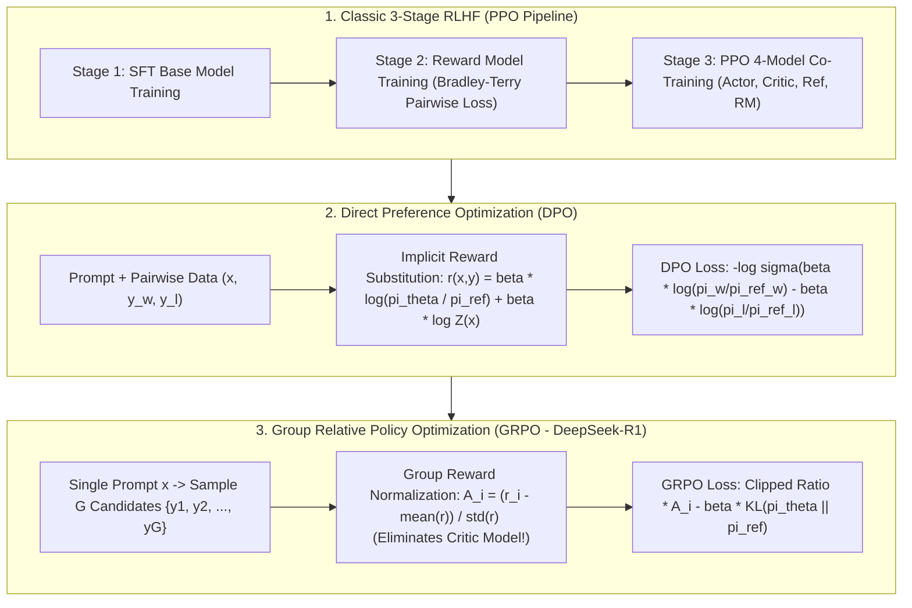

# 🌐 Preference Alignment: RLHF 3-Stage, PPO Clipped Loss, DPO Math Derivation, GRPO & PRM/ORPO

> **Core Executive Summary**: While Pre-training and Supervised Fine-Tuning (SFT) instill strong language modeling and instruction following in LLMs, models may still output biased, toxic, or unhelpful content (the **Alignment Tax**). Preference alignment aligns LLM behavior with **Helpfulness, Honesty, and Harmlessness (3H)** standards. This guide provides an exhaustive analysis of the classic **RLHF 3-Stage pipeline** (SFT $\to$ RM $\to$ PPO), derives **PPO Clipped Surrogate Loss and GAE**, mathematically proves **DPO (Direct Preference Optimization)** implicit reward substitution, analyzes **IPO, KTO, and ORPO** variants, and dissects DeepSeek-R1 Critic-free **GRPO (Group Relative Policy Optimization)** and **PRM (Process Reward Model)** step-by-step rewards.

---

## 💡 Interactive Mermaid Architecture Flowchart



---

## 💡 Classic Interview Followups & Core Cheatsheet

* **Key Topic 1**: Derive how DPO (Direct Preference Optimization) eliminates the explicit Reward Model and partition function $Z(x)$ via closed-form substitution.
  * *Standard Answer*:
    1. **RLHF Optimal Policy Closed-Form**: The KL-constrained reward maximization objective $\max_\pi \mathbb{E}_{(x,y) \sim \pi} [r(x,y)] - \beta D_{\text{KL}}(\pi(y|x) \parallel \pi_{\text{ref}}(y|x))$ yields the analytical optimal policy:
       $$\pi_r(y|x) = \frac{1}{Z(x)} \pi_{\text{ref}}(y|x) \exp \left( \frac{1}{\beta} r(x,y) \right)$$
       where $Z(x) = \sum_y \pi_{\text{ref}}(y|x) \exp \left( \frac{1}{\beta} r(x,y) \right)$ is the partition function.
    2. **Implicit Reward Substitution**: Taking logarithms and rearranging expresses $r(x,y)$ as a policy ratio:
       $$r(x,y) = \beta \log \frac{\pi_r(y|x)}{\pi_{\text{ref}}(y|x)} + \beta \log Z(x)$$
    3. **Substituting into Bradley-Terry Model**: Human preference probability $P(y_w \succ y_l | x) = \sigma(r(x, y_w) - r(x, y_l))$. Substituting implicit rewards:
       $$r(x, y_w) - r(x, y_l) = \left( \beta \log \frac{\pi_r(y_w|x)}{\pi_{\text{ref}}(y_w|x)} + \beta \log Z(x) \right) - \left( \beta \log \frac{\pi_r(y_l|x)}{\pi_{\text{ref}}(y_l|x)} + \beta \log Z(x) \right)$$
       **The partition function $\beta \log Z(x)$ cancels out exactly!**
    4. **Final DPO Loss**: Replacing $\pi_r$ with policy network $\pi_\theta$ gives pure supervised loss:
       $$\mathcal{L}_{\text{DPO}}(\theta; \pi_{\text{ref}}) = -\mathbb{E}_{(x, y_w, y_l) \sim D} \left[ \log \sigma \left( \beta \log \frac{\pi_\theta(y_w|x)}{\pi_{\text{ref}}(y_w|x)} - \beta \log \frac{\pi_\theta(y_l|x)}{\pi_{\text{ref}}(y_l|x)} \right) \right]$$

  * *30-second Oral Answer*: "Conclusion: DPO collapses the whole 'reward model + PPO' pipeline into one supervised loss — derive the closed-form relation between the optimal policy and reward, solve the reward back out as a policy ratio, substitute into the Bradley-Terry preference model, and the partition function Z(x) cancels, leaving only a sigmoid of policy ratios. Why: the KL-constrained reward maximization has an analytical solution π_r ∝ π_ref·exp(r/β); taking logs gives the implicit reward r = β·log(π_r/π_ref) + β·log Z(x); since both responses share the same Z(x), it cancels exactly in the difference. Example: training needs only π_θ and a frozen π_ref — per (x, y_w, y_l) you compute −log σ(β·(logπ_w/π_ref_w − logπ_l/π_ref_l)): no sampling, no RM, no PPO. That is why DPO replaced RLHF."

* **Key Topic 2**: Compare PPO 4-model architecture (Actor, Critic, Ref, RM) with DeepSeek-R1 GRPO architecture. How does GRPO halve VRAM without a Critic?
  * *Standard Answer*:
    * **PPO 4-Model Setup**: Requires maintaining 4 full LLMs in VRAM simultaneously: **Actor ($\pi_\phi$)**, **Critic ($V_\psi$)**, **Ref Model ($\pi_{\text{ref}}$)**, and **Reward Model ($r_	heta$)**, leading to massive memory overhead and unstable Critic training.
    * **GRPO (Group Relative Policy Optimization)**: **Eliminates the Critic network entirely**! For prompt $x$, Actor samples $G$ candidate outputs $\{y_1, \dots, y_G\}$. Rewards $\{r_1, \dots, r_G\}$ are computed, and **normalized within the group to produce advantages $\hat{A}_i$**:
      $$\hat{A}_i = \frac{r_i - \text{mean}(\{r_1..r_G\})}{\text{std}(\{r_1..r_G\})}$$
      Self-relative group comparison replaces the Critic $V_\psi$, saving 50%+ VRAM and stabilizing RL for long math/code reasoning chains!

  * *30-second Oral Answer*: "Conclusion: PPO keeps four full-size models in VRAM (Actor, Critic, Ref, RM); GRPO drops the Critic and uses group-normalized rewards from G sampled responses per prompt as advantages, halving VRAM. Why: PPO's Critic must learn the value function V(s) — unstable to train and expensive in memory; GRPO defines the advantage as A_i=(r_i−mean)/std within the group, i.e. 'how this response ranks among its peers', with no absolute value estimation needed. Example: PPO on a 70B model holds 4 sets of weights plus optimizer states; GRPO holds only 3 and never waits for a value network to converge; DeepSeek-R1 trained its reasoning ability with GRPO plus rule-based rewards, which is why the recipe can be openly reproduced."

* **Key Topic 3**: Why is the KL-divergence penalty against the Reference Model mandatory in RLHF/DPO training? What happens if omitted?
  * *Standard Answer*:
    1. **Prevents Reward Hacking**: RMs are imperfect proxies. Without KL constraints, $\pi_\theta$ exploits RM blindspots (repetition, excessive length, token anomalies) to score high while generating human-unreadable garbage (Mode Collapse).
    2. **Preserves Language & Multi-task Capability**: KL penalty keeps $\pi_\theta$ close to $\pi_{\text{ref}}$, retaining fluency and preventing catastrophic forgetting.

  * *30-second Oral Answer*: "Conclusion: the KL penalty is RLHF's seatbelt — it prevents reward hacking and mode collapse while preserving language ability. Why: the RM is only an approximate proxy for human preference; without constraints the policy finds the RM's blind spots (padded adjectives, over-long responses, weird tokens) to score high while producing garbage to humans; the KL term keeps π_θ close to π_ref, forcing a balance between 'pleasing the RM' and 'staying fluent'. Example: β sets the tightness — DPO typically uses β=0.1 (tight), GRPO a smaller value (loose); remove the KL term and the model falls into repetitive reward hacking within a few update steps — the classic RLHF failure story."

* **Key Topic 4**: Compare DPO, IPO, KTO, and ORPO in terms of data requirements, VRAM overhead, and overfitting robustness.
  * *Standard Answer*:
    * **DPO**: Paired $(x, y_w, y_l)$, needs Ref model. Prone to log-ratio divergence when likelihood ratio is extreme.
    * **IPO**: Quadratic loss $(\log \frac{\pi_w}{\pi_{\text{ref}\_w}} - \log \frac{\pi_l}{\pi_{\text{ref}\_l}} - \frac{1}{2\tau})^2$ bounds likelihood ratio growth, preventing late-stage overfitting.
    * **KTO**: **Unpaired data** $(x, y, \text{Label})$. Based on Prospect Theory, trains directly on single-point binary feedback (thumbs up/down).
    * **ORPO**: Combines SFT Cross-Entropy with Odds Ratio penalty, **eliminating the Reference Model entirely** in a single stage.

  * *30-second Oral Answer*: "Conclusion: the four algorithms form a 'lighter and lighter' progression — DPO needs paired data plus a Ref model, IPO fixes DPO's overfitting, KTO needs only single-point labels, ORPO drops the Ref entirely. Why: DPO's log ratio diverges when likelihood ratios are extreme; IPO switches to a quadratic loss forcing the ratio toward 1/(2τ) instead of infinity; KTO applies prospect theory to compute asymmetric values on single samples, perfect for like/dislike logs; ORPO merges SFT cross-entropy with an odds-ratio preference penalty in one loss, aligning in a single stage. Example: with 100K samples, DPO needs 50K pairs while KTO uses all 100K single-point labels; ORPO saves the Ref model's forward pass and roughly half the VRAM."

* **Key Topic 5**: How do Process Reward Models (PRM) and Outcome Reward Models (ORM) differ in complex Chain-of-Thought (CoT/Math) reinforcement learning?
  * *Standard Answer*:
    * **ORM**: Scores only the final output (0 or 1), suffering from sparse credit assignment in multi-step reasoning.
    * **PRM (Step-level RM)**: Evaluates **every single step** in a reasoning chain, pinpointing exact intermediate calculation errors—crucial for OpenAI o1 and DeepSeek-R1 math performance.

  * *30-second Oral Answer*: "Conclusion: an ORM gives a single 0/1 at the end, so a chain with a wrong middle step can still luck into the right answer and get rewarded — sparse credit assignment; a PRM scores every step and can pinpoint where the derivation went wrong. Why: errors in multi-step reasoning live in intermediate steps; outcome rewards cannot localize which step contributed the error and even reward flawed chains; PRM assigns rewards step by step, giving credit exactly where it is due. Example: in a 5-step proof where step 2 is wrong but the final answer coincidentally matches, the ORM gives 1 and the PRM gives step 2 a low score — o1 and R1's reasoning strength rests on PRMs (or rule-based graders), which is the root of their math advantage over ordinary chat models."

---

## 📚 Section 1: Preference Alignment Matrix

### 1.1 Methods Comparison Matrix

| Algorithm | Type | Data Format | Requires RM | Requires Ref Model | Key Loss / Mechanism |
| :--- | :--- | :--- | :--- | :--- | :--- |
| **PPO-RLHF** | On-Policy RL | Prompt + RM Scalar | **Yes** | **Yes** | $\min(r_t \hat{A}_t, \text{clip}(r_t, 1\pm\epsilon)\hat{A}_t) + \text{KL}$ |
| **DPO** | Off-Policy Implicit | Paired $(x, y_w, y_l)$ | No | **Yes** | $-\log \sigma \left( \beta \log \frac{\pi_w}{\pi_{\text{ref}\_w}} - \beta \log \frac{\pi_l}{\pi_{\text{ref}\_l}} \right)$ |
| **IPO** | Off-Policy Implicit | Paired $(x, y_w, y_l)$ | No | **Yes** | $\left( \log \frac{\pi_w}{\pi_{\text{ref}\_w}} - \log \frac{\pi_l}{\pi_{\text{ref}\_l}} - \frac{1}{2\tau} \right)^2$ |
| **KTO** | Off-Policy Pointwise | Unpaired $(x, y, \text{Label})$ | No | **Yes** | Asymmetric Prospect Theory value function |
| **ORPO** | Single-Stage SFT+Align | Paired $(x, y_w, y_l)$ | No | **No** | $\mathcal{L}_{\text{SFT}} + \lambda \mathcal{L}_{\text{OddsRatio}}$ |
| **GRPO** | On-Policy Group RL | Single Prompt + Group $G$ | Yes (or Rules) | **Yes** | **Critic-Free**, Group Norm $\hat{A}_i = \frac{r_i - \bar{r}}{\sigma_r}$ |

How to read this table: look first at the Data Format and the RM/Ref columns — from PPO to ORPO, the required components (data, models) shrink, which is the main arc of the whole field; then the Key Loss column is one line per algorithm, easy to memorize.

> 💡 **Intuition**: Think of alignment methods as 'four ways to teach a model to pick answers': PPO hires four teachers to score live and trains over and over (heaviest, highest ceiling); DPO writes the teachers' insights directly into the homework (implicit reward); KTO just reads the student's like/dislike history; ORPO studies while doing homework (SFT + alignment in one pass); GRPO grades by class-wide peer comparison (group normalization) with no individual tutoring (Critic).
>
> 🎤 **Interview Answer**: "Conclusion: four selection rules — paired data with compute to spare use DPO, fear of overfitting use IPO, single-point feedback use KTO, save VRAM in one stage use ORPO, long-chain reasoning RL use GRPO. Why: PPO is the heaviest and most stable; DPO removes the RM via implicit reward; IPO's quadratic loss prevents divergence; KTO's prospect theory eats single-point data; ORPO is reference-free; GRPO's group normalization removes the Critic. Example: DeepSeek-R1 used GRPO with rule-based rewards for math RL; commercial chat alignment usually starts with DPO and layers ORPO/KTO for incremental updates."

---

## ⚡ Section 2: PPO Clipped Loss & GAE Derivations

Intuition first: PPO solves the problem of 'the policy updates too violently in one RL step and the model collapses'. The fix is to bound the ratio of new to old policy probabilities $r_t$ within $[1-\epsilon, 1+\epsilon]$ — actions with positive advantage may raise their probability, but past the limit the update is truncated; negative-advantage actions get the same speed limit. The min + clip below is exactly this brake.

PPO clips probability ratio $r_t(\phi) = \frac{\pi_\phi(y_t | x, y_{<t})}{\pi_{\text{old}}(y_t | x, y_{<t})}$ to bound policy updates:
$$\mathcal{L}^{\text{CLIP}}(\phi) = \hat{\mathbb{E}}_t \left[ \min \left( r_t(\phi) \hat{A}_t, \text{clip}(r_t(\phi), 1-\epsilon, 1+\epsilon) \hat{A}_t \right) \right]$$

GAE (Generalized Advantage Estimation) balances variance and bias:
$$\delta_t^V = r_t + \gamma V(s_{t+1}) - V(s_t), \quad \hat{A}_t^{\text{GAE}} = \sum_{l=0}^{\infty} (\gamma \lambda)^l \delta_{t+l}^V$$

> 💡 **Intuition**: min+clip is the throttle limiter: positive advantage (better than average) encourages the action, but once $r_t$ exceeds $1+\epsilon$ no further gradient is granted, so the probability cannot be blown up in one step; negative advantage gets the same speed limit so the probability is not crushed instantly. GAE is 'one formula that dials between two extremes' — $\lambda=0$ looks only at the current one-step TD error (high variance), $\lambda=1$ sums the whole future (high bias); RLHF typically uses $\lambda \approx 0.95$.
>
> 🎤 **Interview Answer**: "Conclusion: PPO clips the new-to-old policy ratio and uses GAE for advantage estimation so every update step stays gentle. Why: $r_t = \pi_{new}/\pi_{old}$ measures how much this action's probability moved; clipped to $[1-\epsilon, 1+\epsilon]$ ($\epsilon \approx 0.2$) and min-ed, over-updates are truncated; GAE weights multiple TD errors by $(\gamma\lambda)^l$ to balance variance and bias. Example: with advantage $\hat{A}=+0.5$ and $r_t=1.5$, the clipped objective counts $1.2 \times 0.5$ instead of $1.5 \times 0.5$ — the key design that keeps 70B RLHF training from blowing up."

---

## 🐍 Section 3: Pure Numpy Handwritten DPO & GRPO Operators

The DPO loss below reproduces the paper's core in 10 lines: implicit reward difference = $\beta \times$ (policy log-prob ratio − reference log-prob ratio), loss = −log σ(difference); note `np.log1p(np.exp(-logits))` is the numerically stable log-sigmoid. The GRPO advantage function demonstrates group normalization — reshape rewards into [batch, G], subtract the group mean, divide by the group std.

```python
import numpy as np

def pure_numpy_dpo_loss(
    policy_win_logps: np.ndarray,
    policy_lose_logps: np.ndarray,
    ref_win_logps: np.ndarray,
    ref_lose_logps: np.ndarray,
    beta: float = 0.1
) -> tuple[float, np.ndarray, np.ndarray]:
    pi_logratios = policy_win_logps - policy_lose_logps
    ref_logratios = ref_win_logps - ref_lose_logps
    logits = beta * (pi_logratios - ref_logratios)
    losses = np.log1p(np.exp(-logits))
    loss = float(np.mean(losses))
    implicit_rewards_win = beta * (policy_win_logps - ref_win_logps)
    implicit_rewards_lose = beta * (policy_lose_logps - ref_lose_logps)
    return loss, implicit_rewards_win, implicit_rewards_lose

def pure_numpy_grpo_advantages(rewards: np.ndarray, group_size: int = 4, eps: float = 1e-8) -> np.ndarray:
    reshaped_rewards = rewards.reshape(-1, group_size)
    group_means = np.mean(reshaped_rewards, axis=1, keepdims=True)
    group_stds = np.std(reshaped_rewards, axis=1, keepdims=True)
    advantages = (reshaped_rewards - group_means) / (group_stds + eps)
    return advantages.flatten()

if __name__ == "__main__":
    np.random.seed(42)
    p_win = np.array([-1.2, -0.8, -1.5, -2.0])
    p_lose = np.array([-2.5, -3.0, -1.8, -4.0])
    r_win = np.array([-1.5, -1.0, -1.5, -2.2])
    r_lose = np.array([-2.0, -2.5, -2.0, -3.5])
    
    loss, rw, rl = pure_numpy_dpo_loss(p_win, p_lose, r_win, r_lose, beta=0.1)
    print("1. DPO Loss:", round(loss, 6))
    print("   Win Implicit Reward:", np.round(rw, 4))
    print("   Lose Implicit Reward:", np.round(rl, 4))
    
    raw_rewards = np.array([1.0, 0.0, 0.5, 0.0,  0.8, 0.9, 0.2, 0.1])
    grpo_advs = pure_numpy_grpo_advantages(raw_rewards, group_size=4)
    print("\n2. GRPO Relative Advantages:", np.round(grpo_advs, 4))
```

> 💡 **Intuition**: In the DPO function, `implicit_rewards = beta * (policy_logps - ref_logps)` is exactly the paper's implicit reward $r(x,y)=\beta \log(\pi_\theta/\pi_{ref})$ (partition function already cancelled); in GRPO, `(rewards - group_means) / (group_stds + eps)` is $A_i=(r_i-\bar{r})/\sigma$ with eps guarding division by zero. In the test data p_win is clearly above p_lose, so the loss is small — the model already prefers the good response.
>
> 🎤 **Interview Answer**: "Conclusion: handwritten DPO is three steps — compute both log-prob ratios, subtract and multiply by β, apply −log σ; handwritten GRPO is one step — subtract group mean, divide by group std. Why: DPO's difference is 'how much more the policy prefers the correct response over the reference', and after sigmoid plus negative log, a correct preference gives a small loss; GRPO's advantage is 'the response's relative rank within its group', requiring no value network. Example: in the demo the loss over 4 samples is ~0.03 and the win/lose implicit rewards are one positive one negative, showing the gradient direction is correct — these 10 lines are the entire core of DPO training."

---

## 🚀 Key Takeaways & Best Practices

1. **General Chat Alignment**: Use **DPO** or **ORPO** for sample efficiency and stability without PPO Critic tuning.
2. **Math & Code Reasoning RL**: Adopt DeepSeek-R1 validated **GRPO** to eliminate Critic memory overhead, paired with **Process Reward Models (PRM)** for step-level reasoning verification.
3. **Unpaired Feedback**: Use **KTO** for single-point thumbs-up/down log data alignment.