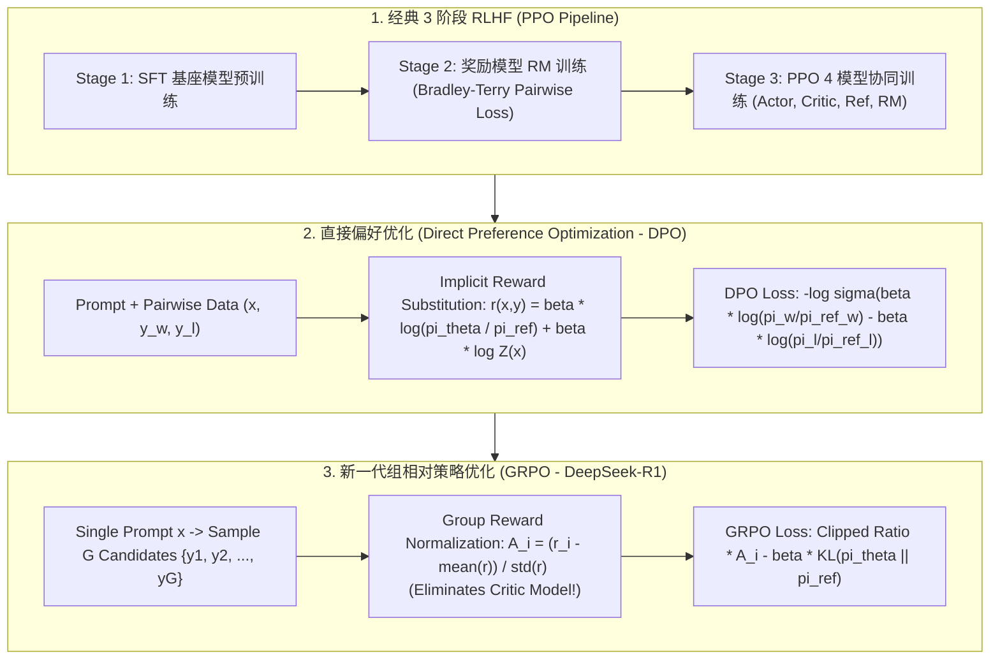

# 🌐 大模型偏好对齐全景：RLHF 3 阶段、PPO 截断损失、DPO 隐式奖励代换、GRPO 与 PRM/ORPO 深度剖析

> **核心摘要**：预训练与 Supervised Fine-Tuning (SFT) 赋予了大语言模型 (LLM) 强大的语言建模与指令遵循能力，但模型依然可能生成有害、偏见或不符合人类期望的回复（即 **Alignment Tax 现象**）。人类偏好对齐技术通过引入人类或 AI 反馈，引导模型向**有用性 (Helpfulness)、诚实性 (Honesty) 与无害性 (Harmlessness)** 3H 标准对齐。本指南系统剖析经典 **RLHF 3 阶段**（SFT $\to$ RM $\to$ PPO）、推导 **PPO 截断目标与 GAE** 优势估计；数学证明 **DPO (Direct Preference Optimization)** 隐式奖励代换；解析 **IPO、KTO、ORPO** 无 Reference 变体；并深度剖析 DeepSeek-R1 采用的无 Critic **GRPO (Group Relative Policy Optimization)** 与 **PRM (Process Reward Model)** 过程奖励机制。

---

## 💡 交互式 Mermaid 架构流程图



---

## 💡 经典面试追问与考点速查

* **考点 1**：详细推导 DPO (Direct Preference Optimization) 如何利用闭式解消除显式奖励模型 RM 与配分函数 $Z(x)$？
  * *标准回答*：
    1. **RLHF 最优策略闭式解**：受 KL 散度约束的奖励最大化目标为 $\max_{\pi} \mathbb{E}_{(x,y) \sim \pi} [r(x,y)] - \beta D_{\text{KL}}(\pi(y|x) \parallel \pi_{\text{ref}}(y|x))$。通过展开 KL 散度并使用拉格朗日乘子法，可推导出最优策略 $\pi_r(y|x)$ 的解析解：
       $$\pi_r(y|x) = \frac{1}{Z(x)} \pi_{\text{ref}}(y|x) \exp \left( \frac{1}{\beta} r(x,y) \right)$$
       其中 $Z(x) = \sum_y \pi_{\text{ref}}(y|x) \exp \left( \frac{1}{\beta} r(x,y) \right)$ 为配分函数 (Partition Function)。
    2. **隐式奖励 (Implicit Reward) 代换**：两边取对数并移项，将隐式奖励 $r(x,y)$ 表达为策略概率对比：
       $$r(x,y) = \beta \log \frac{\pi_r(y|x)}{\pi_{\text{ref}}(y|x)} + \beta \log Z(x)$$
    3. **带入 Bradley-Terry 偏好模型**：人类在优选回复 $y_w$ 与劣选回复 $y_l$ 之间的偏好概率为 $P(y_w \succ y_l | x) = \sigma(r(x, y_w) - r(x, y_l))$。将隐式奖励代入差值：
       $$r(x, y_w) - r(x, y_l) = \left( \beta \log \frac{\pi_r(y_w|x)}{\pi_{\text{ref}}(y_w|x)} + \beta \log Z(x) \right) - \left( \beta \log \frac{\pi_r(y_l|x)}{\pi_{\text{ref}}(y_l|x)} + \beta \log Z(x) \right)$$
       **配分函数 $\beta \log Z(x)$ 被精准相减抵消！**
    4. **最终 DPO 损失函数**：直接使用 Policy 网络 $\pi_\theta$ 替换 $\pi_r$，得到无显式 RM、无采样、无 PPO 的纯监督损失：
       $$\mathcal{L}_{\text{DPO}}(\theta; \pi_{\text{ref}}) = -\mathbb{E}_{(x, y_w, y_l) \sim D} \left[ \log \sigma \left( \beta \log \frac{\pi_\theta(y_w|x)}{\pi_{\text{ref}}(y_w|x)} - \beta \log \frac{\pi_\theta(y_l|x)}{\pi_{\text{ref}}(y_l|x)} \right) \right]$$

  * *面试速答 (30 秒口述版)*: "结论: DPO 把'奖励模型 + PPO'整套流程化简成一个监督损失——先推出最优策略和奖励的闭式关系,把奖励反解成策略概率比,代入 Bradley-Terry 偏好模型后配分函数 Z(x) 被抵消,只剩 sigmoid 策略比。原理: 带 KL 约束的奖励最大化有解析解 π_r ∝ π_ref·exp(r/β),取对数反解出隐式奖励 r = β·log(π_r/π_ref) + β·log Z(x);两个回复共享同一个 Z(x),相减时精确抵消,奖励差就变成'策略相对参考模型的提升差'。例子: 训练只需 π_θ 和冻结的 π_ref 两个模型,每个 (x, y_w, y_l) 算一次 −log σ(β·(logπ_w/π_ref_w − logπ_l/π_ref_l))——不需要采样、不需要 RM、不需要 PPO,这是 DPO 取代 RLHF 的原因。"

* **考点 2**：对比 PPO 的 4 模型架构 (Actor, Critic, Ref, RM) 与 DeepSeek-R1 的 GRPO 架构，GRPO 如何实现无 Critic 显存减半？
  * *标准回答*：
    * **PPO 4 模型架构**：训练过程中需要在 GPU 显存中同时维护 4 个同等规模的大模型：
      1. **Actor ($\pi_\phi$)**：待优化的策略网络（输出 Action）；
      2. **Critic ($V_\psi$)**：估计状态价值 $V(s)$ 的价值网络（评估期望收益）；
      3. **Reference Model ($\pi_{\text{ref}}$)**：被冻结的基准 SFT 模型（计算 KL 散度约束）；
      4. **Reward Model ($r_	heta$)**：判定回复好坏的打分网络。
      这导致显存开销巨大，且 Critic 网络的训练极其不稳定。
    * **GRPO (Group Relative Policy Optimization)**：DeepSeek 提出的革新方案。**彻底废除 Critic 网络**！对于同一个 Prompt $x$，让 Actor 模型批量并行生成 $G$ 个候选回答 $\{y_1, y_2, \dots, y_G\}$。利用奖励模型或规则判定器计算这 $G$ 个回答的得分 $\{r_1, r_2, \dots, r_G\}$，随后**在组内计算相对标准化得分作为优势函数 $\hat{A}_i$**：
      $$\hat{A}_i = \frac{r_i - \text{mean}(\{r_1..r_G\})}{\text{std}(\{r_1..r_G\})}$$
      通过组内自我相对比较替代了庞大的 Critic $V_\psi$ 价值网络，直接**节省掉了一个庞大模型的显存与梯度更新开销**，显存开销降低 50% 以上，且极大提升了长链推理 (Math/CoT) 强化学习的稳定度！

  * *面试速答 (30 秒口述版)*: "结论: PPO 要同时在显存里养 4 个同规模模型(Actor/Critic/Ref/RM),GRPO 砍掉 Critic,用同一个 prompt 采样 G 个回复、组内标准化奖励当优势,显存省一半以上。原理: PPO 的 Critic 要学价值函数 V(s),训练不稳定又吃显存;GRPO 用组内均值/方差做相对优势 A_i=(r_i−mean)/std——'这个回复在它组里排名如何'就是优势,不需要估计绝对价值。例子: 70B 做 PPO 要 4 份模型权重 + 4 份优化器状态;GRPO 只剩 3 份,且不用等价值网络收敛;DeepSeek-R1 用 GRPO + 规则奖励训出推理能力,这也是它能被开源复现的原因。"

* **考点 3**：为什么在 RLHF / DPO 训练中必须加入对 Reference Model 的 KL 散度惩罚？若省略会发生什么？
  * *标准回答*：
    1. **防止 Reward Hacking (奖励漏洞利用)**：RM 模型只是真实人类偏好的近似代理拟合。若没有约束，策略网络 $\pi_\theta$ 会迅速学会寻找 RM 的盲区漏洞（例如不断重复修饰词、生成冗长回复、输出特异 Token），使 RM 给出虚高的分值，但生成的文本在人类眼中完全是垃圾废话（Mode Collapse）。
    2. **保持语言能力与灾难性遗忘防止**：基座/SFT 模型 $\pi_{\text{ref}}$ 蕴含着丰富的自然语言语法与通用知识。KL 散度惩罚强制要求 $\pi_\theta$ 在对齐目标的同时，概率分布不能偏离 $\pi_{\text{ref}}$ 太远，确保模型维持出色的多任务泛化与流利表达能力。

  * *面试速答 (30 秒口述版)*: "结论: KL 惩罚是 RLHF 的'安全带'——防 reward hacking 和模式坍缩,同时保住语言能力。原理: RM 只是人类偏好的近似代理,没约束时策略会找到 RM 的盲区(堆砌修饰词、生成超长回复、输出特殊 token)骗高分,产出在人类眼里是垃圾;KL 项强制 π_θ 不离 π_ref 太远,逼它在'讨好 RM'与'保持合理语言'之间平衡。例子: β 就是安全带松紧度——DPO 常用 β=0.1(较紧),GRPO 常用 β 较小(较松);去掉 KL 后模型几轮内就会陷入重复短语的 reward hacking,这是 RLHF 最经典的翻车案例。"

* **考点 4**：对比 DPO、IPO、KTO 与 ORPO 在数据需求（成对 vs 单样本）、显存开销与过拟合鲁棒性上的差异？
  * *标准回答*：
    * **DPO (Direct Preference Optimization)**：需要成对数据 $(x, y_w, y_l)$，需要 Ref 模型。当优选与劣选样本似然比很大时容易出现对数比发散与过拟合；
    * **IPO (Identity Preference Optimization)**：改进 DPO。引入二次方回归损失 $(\log \frac{\pi_w}{\pi_{\text{ref}\_w}} - \log \frac{\pi_l}{\pi_{\text{ref}\_l}} - \frac{1}{2\tau})^2$，严格强制约束似然比增长，避免了 DPO 在微调后期过拟合崩溃的问题；
    * **KTO (Kahneman-Tversky Optimization)**：突破数据限制，**不需要成对样本**！只需单条样本加二元标签 $(x, y, \text{IsGood})$。基于前景理论（Prospect Theory）的损失函数，能利用真实的单点用户点赞/点踩数据进行训练；
    * **ORPO (Odds Ratio Preference Optimization)**：将 SFT Cross-Entropy Loss 与 Odds Ratio 偏好惩罚结合，**完全不需要 Reference Model**！在单阶段内同时完成指令跟随与偏好对齐，节省 50% 显存。

  * *面试速答 (30 秒口述版)*: "结论: 四个算法的演进主线是'越走越轻'——DPO 要成对数据 + Ref,IPO 修 DPO 过拟合,KTO 只需单点标签,ORPO 连 Ref 都不要。原理: DPO 在似然比极端时对数发散;IPO 改成二次损失,强制比值趋近 1/(2τ) 而不是无限增大;KTO 用前景理论给单条数据算不对称价值,适合点赞/点踩日志;ORPO 把 SFT 交叉熵和 odds ratio 偏好惩罚合并成一个损失,单阶段完成指令跟随 + 对齐。例子: 同样 10 万条数据,DPO 要 5 万对成对样本,KTO 能用 10 万条单点反馈;ORPO 省掉 Ref 模型的前向,显存省约一半。"

* **考点 5**：过程奖励模型 (PRM) 与结果奖励模型 (ORM) 在复杂链式推理 (CoT/Math) 强化学习中的应用有何不同？
  * *标准回答*：
    * **ORM (Outcome-based Reward Model)**：仅在整条推理链生成完毕后，针对最终输出结果给予一个标量奖励（0 或 1）。在复杂多步数学推导中，ORM 会面临严重的**信用分配稀疏问题 (Sparse Credit Assignment)**——如果中间第 2 步推导错误，但因巧合凑对了最终答案，ORM 会错误地奖励整条推导链；
    * **PRM (Process Reward Model / Step-level RM)**：对推理链中的**每一个独立推导步骤 (Step-by-step)** 进行细粒度评分。PRM 能够精准识别中间第几步出现了逻辑跃迁或计算失误，实现极精准的 Credit Assignment，是 OpenAI o1 / DeepSeek-R1 等长思维链大模型获得卓越数学与代码推理能力的关键核心。

  * *面试速答 (30 秒口述版)*: "结论: ORM 只在最后给 0/1 分,中间算错也可能蒙对答案拿奖励,信用分配稀疏;PRM 给每一步打分,能精确定位第几步出错。原理: 多步推理的错误发生在中间步骤,结果奖励无法定位'哪一步贡献了错误',甚至会给错误链发奖励;PRM 按步骤评分,把奖励精确给到正确的推导步骤。例子: 5 步数学推导第 2 步出错但最终答案碰巧对,ORM 给 1 分、PRM 给第 2 步低分——o1 和 R1 的推理能力主要靠 PRM(或规则判题器)支撑,这是它们数学强于普通 chat 模型的根本原因。"

---

## 📚 第一章：偏好对齐技术路线闭环矩阵

### 1.1 偏好对齐全景对比矩阵

| 对齐算法 | 算法类型 | 数据格式 | 是否需要 RM | 是否需要 Ref 模型 | 核心数学损失 / 机制 |
| :--- | :--- | :--- | :--- | :--- | :--- |
| **PPO-RLHF** | 强化学习 (On-Policy) | Prompt + RM 标量 | **是** | **是** | $\min(r_t \hat{A}_t, \text{clip}(r_t, 1\pm\epsilon)\hat{A}_t) + \text{KL}$ |
| **DPO** | 隐式偏好 (Off-Policy) | 成对 $(x, y_w, y_l)$ | 否 | **是** | $-\log \sigma \left( \beta \log \frac{\pi_w}{\pi_{\text{ref}\_w}} - \beta \log \frac{\pi_l}{\pi_{\text{ref}\_l}} \right)$ |
| **IPO** | 隐式偏好 (Off-Policy) | 成对 $(x, y_w, y_l)$ | 否 | **是** | $\left( \log \frac{\pi_w}{\pi_{\text{ref}\_w}} - \log \frac{\pi_l}{\pi_{\text{ref}\_l}} - \frac{1}{2\tau} \right)^2$ |
| **KTO** | 前景理论 (Off-Policy) | 单样本 $(x, y, \text{Label})$ | 否 | **是** | 针对单样本 Point-wise 价值函数自适应非对称惩罚 |
| **ORPO** | 单阶段 SFT+Align | 成对 $(x, y_w, y_l)$ | 否 | **否** | $\mathcal{L}_{\text{SFT}} + \lambda \mathcal{L}_{\text{OddsRatio}}$ |
| **GRPO** | 组相对 RL (On-Policy)| Single Prompt + Group $G$ | 是 (或规则) | **是** | **无 Critic**，组内标准化 $\hat{A}_i = \frac{r_i - \bar{r}}{\sigma_r}$ |

读表技巧: 先看"数据格式"和"要不要 RM/Ref"两列——从 PPO 到 ORPO,需要的组件越来越少(数据、模型),这是整个领域的主线;再看"核心损失"列,每个算法一行就能背。

> 💡 **直观理解**: 把对齐算法想成"教模型选答案的四种方式": PPO 是"请 4 个老师现场打分再反复重训"(最重但上限高);DPO 是"把老师的心得直接写进作业本"(隐式奖励);KTO 是"只看学生的点赞/点踩记录";ORPO 是"写作业的同时顺便背答案"(SFT+对齐一步到位);GRPO 是"全班横向对比打分"(组内标准化),不需要个别辅导(Critic)。
>
> 🎤 **面试速答**: "结论: 选型四句——有成对数据且算力足用 DPO,怕过拟合用 IPO,只有单点反馈用 KTO,想省显存一步到位用 ORPO,长链推理强化学习用 GRPO。原理: PPO 4 模型最重但最稳,DPO 隐式奖励免 RM,IPO 二次损失防发散,KTO 前景理论吃单点数据,ORPO 无 Ref 单阶段,GRPO 组内标准化免 Critic。例子: DeepSeek-R1 用 GRPO + 规则奖励跑数学 RL;商业对话对齐大多 DPO 起步,再用 ORPO/KTO 做增量更新。"

---

## ⚡ 第二章：PPO 与 DPO 数理推导详解

### 2.1 PPO 截断损失与 GAE 优势估计推导

先给直觉: PPO 要解决的是"强化学习时策略一步更新太猛,直接把模型学崩"的问题。办法是把新旧策略的概率比 $r_t$ 限制在 $[1-\epsilon, 1+\epsilon]$ 里——优势为正的动作,概率可以涨,但涨过头就截断;优势为负的动作同理限速。下面公式里的 min + clip 就是这个"刹车"。

PPO 核心目标在于限制策略更新步长，防止概率比率 $r_t(\phi) = \frac{\pi_\phi(y_t | x, y_{<t})}{\pi_{\text{old}}(y_t | x, y_{<t})}$ 偏离 1 过远：
$$\mathcal{L}^{\text{CLIP}}(\phi) = \hat{\mathbb{E}}_t \left[ \min \left( r_t(\phi) \hat{A}_t, \text{clip}(r_t(\phi), 1-\epsilon, 1+\epsilon) \hat{A}_t \right) \right]$$
* 当优势 $\hat{A}_t > 0$（动作优于平均）时，若 $r_t > 1+\epsilon$，截断机制剥离额外梯度，防止过度增大概率；
* 当优势 $\hat{A}_t < 0$（动作劣于平均）时，若 $r_t < 1-\epsilon$，截断机制阻止概率过度减小。

广义优势估计 (GAE) 融合高方差无偏估计与低方差有偏估计：
$$\delta_t^V = r_t + \gamma V(s_{t+1}) - V(s_t), \quad \hat{A}_t^{\text{GAE}} = \sum_{l=0}^{\infty} (\gamma \lambda)^l \delta_{t+l}^V$$

> 💡 **直观理解**: min+clip 是"油门限速器": 优势为正(这一步比平均好)时鼓励,但 $r_t$ 超过 $1+\epsilon$ 就不再给更多梯度,防止一步把概率撑爆;优势为负时同样限速,防止一步把概率踩死。GAE 是"一条公式在两个极端之间调平衡"——$\lambda=0$ 只看当前一步 TD 误差(高方差),$\lambda=1$ 看全部未来(高偏差),RLHF 常用 $\lambda \approx 0.95$。
>
> 🎤 **面试速答**: "结论: PPO 用 clip 限制新旧策略比值、用 GAE 估计优势,保证每一步更新温和不崩。原理: $r_t = \pi_{new}/\pi_{old}$ 衡量'这步策略涨了多少',clip 到 $[1-\epsilon, 1+\epsilon]$($\epsilon \approx 0.2$)后取 min,过度更新直接截断;GAE 把多步 TD 误差按 $(\gamma\lambda)^l$ 加权求和,在方差和偏差间取平衡。例子: 优势 $\hat{A}=+0.5$ 而 $r_t=1.5$ 时,clip 后按 $1.2 \times 0.5$ 计梯度而不是 $1.5 \times 0.5$——这就是 70B RLHF 训练不崩的关键设计。"

---

## 🐍 第三章：Pure Numpy 手写 DPO 与 GRPO 核心算子

下面的 DPO 损失函数用 10 行复现论文核心: 隐式奖励差 = $\beta \times$ (策略 log 概率比 − 参考 log 概率比),loss = −log σ(差值);注意用 `np.log1p(np.exp(-logits))` 实现 log-sigmoid 的数值稳定版本。GRPO 优势函数演示"组内标准化"——把奖励 reshape 成 [batch, G],减组内均值、除组内标准差。

```python
import numpy as np

def pure_numpy_dpo_loss(
    policy_win_logps: np.ndarray,
    policy_lose_logps: np.ndarray,
    ref_win_logps: np.ndarray,
    ref_lose_logps: np.ndarray,
    beta: float = 0.1
) -> tuple[float, np.ndarray, np.ndarray]:
    """
    Pure Numpy 实现工业级 DPO (Direct Preference Optimization) 损失与梯度计算
    Input shape: [batch_size]
    """
    # 1. 计算 Log-Ratio 隐式奖励
    pi_logratios = policy_win_logps - policy_lose_logps
    ref_logratios = ref_win_logps - ref_lose_logps
    
    # 2. 隐式奖励差值: beta * (log(pi_w/ref_w) - log(pi_l/ref_l))
    logits = beta * (pi_logratios - ref_logratios)
    
    # 3. DPO Loss = -log(sigmoid(logits))
    # 避免数值溢出: log(sigmoid(x)) = -softplus(-x)
    losses = np.log1p(np.exp(-logits))
    loss = float(np.mean(losses))
    
    # 4. 计算隐式 Reward (用于 Monitor 监控)
    implicit_rewards_win = beta * (policy_win_logps - ref_win_logps)
    implicit_rewards_lose = beta * (policy_lose_logps - ref_lose_logps)
    
    return loss, implicit_rewards_win, implicit_rewards_lose


def pure_numpy_grpo_advantages(
    rewards: np.ndarray, 
    group_size: int = 4, 
    eps: float = 1e-8
) -> np.ndarray:
    """
    Pure Numpy 实现 DeepSeek-R1 GRPO (Group Relative Policy Optimization) 组内相对优势计算
    rewards: shape [batch_size * group_size]
    """
    # 将 Reward 重新重构为 [batch_size, group_size]
    reshaped_rewards = rewards.reshape(-1, group_size)
    
    # 组内计算均值与标准差
    group_means = np.mean(reshaped_rewards, axis=1, keepdims=True)
    group_stds = np.std(reshaped_rewards, axis=1, keepdims=True)
    
    # 组内相对标准化优势: A_i = (r_i - mean) / (std + eps)
    advantages = (reshaped_rewards - group_means) / (group_stds + eps)
    return advantages.flatten()


# ==================== 测试验证 ====================
if __name__ == "__main__":
    np.random.seed(42)
    batch_size = 4
    
    p_win = np.array([-1.2, -0.8, -1.5, -2.0])
    p_lose = np.array([-2.5, -3.0, -1.8, -4.0])
    r_win = np.array([-1.5, -1.0, -1.5, -2.2])
    r_lose = np.array([-2.0, -2.5, -2.0, -3.5])
    
    loss, rw, rl = pure_numpy_dpo_loss(p_win, p_lose, r_win, r_lose, beta=0.1)
    print("1. DPO Loss 结果:", round(loss, 6))
    print("   Win 隐式奖励:", np.round(rw, 4))
    print("   Lose 隐式奖励:", np.round(rl, 4))
    
    # 测试 GRPO 组相对优势计算 (组大小 G=4)
    raw_rewards = np.array([1.0, 0.0, 0.5, 0.0,  0.8, 0.9, 0.2, 0.1])  # 2 个 Prompt, 各 4 个采样
    grpo_advs = pure_numpy_grpo_advantages(raw_rewards, group_size=4)
    print("\n2. GRPO 组内相对归一化优势 Advantage:", np.round(grpo_advs, 4))
```

> 💡 **直观理解**: DPO 函数里 `implicit_rewards = beta * (policy_logps - ref_logps)` 就是论文的隐式奖励 $r(x,y)=\beta \log(\pi_\theta/\pi_{ref})$(配分函数已被抵消);GRPO 里 `(rewards - group_means) / (group_stds + eps)` 就是 $A_i=(r_i-\bar{r})/\sigma$,eps 防除零。测试数据里 p_win 明显高于 p_lose,loss 应较小——意思是模型已经学会偏好好回答。
>
> 🎤 **面试速答**: "结论: 手写 DPO 三步——算两个 log 概率比、相减乘 β、套 −log σ;手写 GRPO 一步——组内减均值除标准差。原理: DPO 的差值就是'策略比参考更偏好正确回复的程度',sigmoid 后取负对数,偏好正确时损失小;GRPO 的优势是'该回复在组内的相对排名',不需要价值网络。例子: demo 中 4 组数据 loss 约 0.03,win/lose 隐式奖励一正一负,说明梯度方向正确——这 10 行就是 DPO 训练的全部核心。"

---

## 🚀 总结与工程最佳实践

1. **通用对话偏好首选**：直接采用 **DPO** 或 **ORPO**，省去训练稳定度极差的 PPO Critic 与 Reward Model，大幅降低训练资源要求；
2. **复杂推理/数学/代码强化学习首选**：采用 DeepSeek-R1 验证有效的 **GRPO (Group Relative Policy Optimization)**，彻底摆脱 Critic 模型显存枷锁，配合同步训练 **PRM (过程奖励模型)** 提升长链推理可靠度；
3. **单点反馈数据**：针对真实线上离线日志（只有单点 Liked/Disliked），直接采用 **KTO** 算法进行快速对齐。