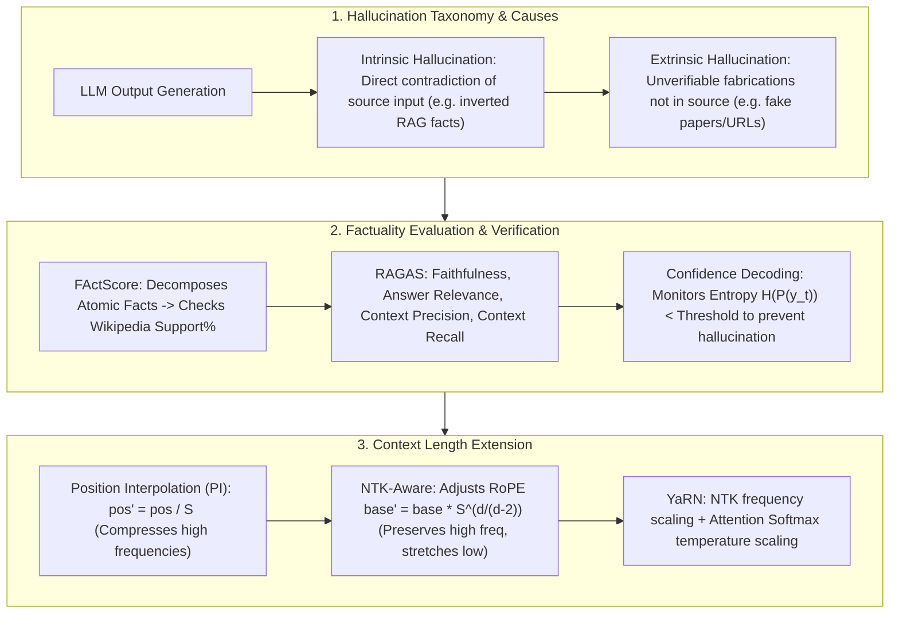

# 🌐 LLM Hallucination & Factuality: Taxonomies, FActScore, RAGAS, SAFE & Context Extension (PI/NTK/YaRN)

> **Core Executive Summary**: LLMs often generate plausible-sounding but unfactual or logically contradictory text, known as **Hallucination**. Hallucinations represent the single largest bottleneck deploying LLMs to high-stakes healthcare, legal, and financial domains. This guide dissects **Intrinsic** and **Extrinsic** hallucination taxonomies, root causes in pre-training, SFT, and RLHF; derives **FActScore** atomic fact decomposition, **RAGAS** 4-metric evaluation, and **SAFE** automated verification; analyzes **Confidence-Aware Decoding**; and mathematically derives **Position Interpolation (PI)**, **NTK-Aware**, and **YaRN** RoPE extensions along with **Needle In A Haystack (NIAH)** benchmarks.

---

## 💡 Interactive Mermaid Architecture Flowchart



---

## 💡 Classic Interview Followups & Core Cheatsheet

* **Key Topic 1**: Compare Intrinsic vs Extrinsic hallucinations and analyze root causes in pre-training noise and SFT sycophancy.
  * *Standard Answer*:
    1. **Intrinsic Hallucination**: Output directly contradicts source context (e.g., source says "Company A acquired B", output claims "B acquired A"). Caused by attention confusion.
    2. **Extrinsic Hallucination**: Output contains unverifiable fabrications not in source context (fake paper citations, non-existent URLs). Caused by parametric memory voids.
    3. **Root Causes**: Noise in pre-training data; SFT Sycophancy (over-adapting to user false premises); RLHF overconfidence (rewarding assertive formatting).

  * *30-second Oral Answer*: "Conclusion: intrinsic hallucination contradicts the input (RAG says 'A acquired B', the model says 'B acquired A'), extrinsic hallucination fabricates unverifiable content (fake papers/URLs); the causes span pre-training, SFT, and RLHF. Why: intrinsic hallucination often comes from attention confusion over long contexts; extrinsic from parametric memory gaps and over-generalization; pre-training corpora contain noise, SFT samples cater to the user's false premises (sycophancy), and RLHF reward models prefer confident, fluent answers while implicitly punishing 'I don't know'. Example: if the user asks 'why is the Earth flat?' and the SFT data is full of compliant samples, the model invents flat-Earth 'evidence'; in production most hallucinations are extrinsic (fabricated citations), which is why RAG with citation verification is standard."

* **Key Topic 2**: Derive how FActScore decomposes complex generated text into Atomic Facts and computes precision scores.
  * *Standard Answer*:
    1. Decomposes generation $Y$ into atomic statements $\mathcal{A} = \{a_1, \dots, a_m\}$ (single subject-predicate-object triples).
    2. Verifies each $a_i$ against Wikipedia corpus $C_i$: $V(a_i) = 1$ if supported, 0 otherwise.
    3. $\text{FActScore}(Y) = \frac{1}{m} \sum_{i=1}^m V(a_i)$.

  * *30-second Oral Answer*: "Conclusion: FActScore = supported facts / total atomic facts — decompose first, verify each fact individually. Why: split the long answer into atomic facts at the 'subject-predicate-object triple' level (one claim per sentence), retrieve a supporting passage for each from a reliable corpus like Wikipedia, and use NLI or an LLM to decide support; the score is the supported fraction. Example: an answer decomposes into 3 atomic facts, 2 supported by Wikipedia and 1 fabricated → FActScore = 2/3 ≈ 0.667; unlike BLEU-style overlap metrics, FActScore directly measures factual accuracy, making it the authoritative metric for biography and science-generation factuality."

* **Key Topic 3**: Derive the mathematical formulas for RoPE Position Interpolation (PI), NTK-Aware interpolation, and YaRN context extension.
  * *Standard Answer*:
    1. **PI**: Maps position $m \to m' = \frac{m}{S}$. Over-compresses high-frequency components, losing fine-grained positional accuracy.
    2. **NTK-Aware**: Scales RoPE base $\text{base}' = \text{base} \cdot S^{\frac{d}{d-2}}$. High-frequency channels receive small scaling while low-frequency channels scale significantly—extending context 2-4x without fine-tuning.
    3. **YaRN**: Combines NTK frequency scaling with Softmax temperature scaling $t = \sqrt{0.1 \log(S) + 1}$ to prevent Softmax entropy inflation in 128K+ sequences.

  * *30-second Oral Answer*: "Conclusion: the three RoPE extensions evolve 'from crude to fine' — PI divides all positions by S (crushing high-frequency info), NTK scales only low frequencies while preserving high ones (2-4x context without fine-tuning), YaRN adds attention temperature scaling against entropy inflation (128K-grade). Why: high-frequency RoPE dims rotate fast, and beyond the training range their rotation over-rotates and scores break; PI compresses positions and loses high-frequency phase; NTK scales base to base·S^(d/(d−2)) which is 'loosen low frequencies, keep high ones'; YaRN additionally tunes the softmax temperature by t=√(0.1·log S+1) so long-sequence attention does not get diluted. Example: trained at 4K, inferring at 32K (S=8), NTK works out of the box while PI needs 1-2K fine-tuning steps; YaRN plus a little long-context SFT is the production 128K recipe."

* **Key Topic 4**: How does Needle In A Haystack (NIAH) benchmarking evaluate attention degradation and deep retrieval across 128K-2M contexts?
  * *Standard Answer*: Inserts a single "needle" fact into a long "haystack" document at varying depths (0% to 100%). Generates a 2D retrieval accuracy heatmap to diagnose "Lost in the Middle" attention degradation.

  * *30-second Oral Answer*: "Conclusion: NIAH plants a single unrelated fact (the needle) at random depths inside a very long document (the haystack), asks the model to retrieve it, and plots a 'length × depth' retrieval-accuracy heatmap. Why: scanning depth 0%-100% and length 128K-2M cell by cell, each cell tests exact retrieval; all green means true long-context ability, while a large red band in the middle depths indicates 'lost in the middle' — attention amnesia over central content. Example: the needle is 'favorite food is sandwiches' inserted at 60% depth of a 100K document; ask 'what is the favorite food?' — many models pass at the head and tail but collapse at 40-60% depth, which is why long-context evaluation must use NIAH rather than perplexity alone."

* **Key Topic 5**: How are the 4 core metrics of RAGAS (Faithfulness, Answer Relevance, Context Precision, Context Recall) computed for enterprise RAG?
  * *Standard Answer*: Faithfulness checks support % of answer claims in context; Answer Relevance measures query alignment; Context Precision evaluates top-$k$ chunk ordering; Context Recall verifies coverage of ground-truth statements.

  * *30-second Oral Answer*: "Conclusion: RAGAS's four metrics watch four links of the chain — Faithfulness (answer loyal to context), Answer Relevance (on-topic), Context Precision (relevant chunks ranked early), Context Recall (ground truth covered by retrieval). Why: Faithfulness = context-supported claims / total claims, guarding intrinsic hallucination; Answer Relevance reverse-generates questions from the answer and measures similarity to the original; Precision rewards early placement of relevant chunks; Recall checks how many ground-truth claims the retrieved context covers. Example: with 5 retrieved chunks where only the 3rd is relevant, Precision is low but Recall can still be high; a rambling answer scores low on Relevance — only all four together localize which RAG component broke."

---

## 📚 Section 1: Evaluation & Context Extension Matrix

| Solution | Category | Principle | Pros | Target Scenario |
| :--- | :--- | :--- | :--- | :--- |
| **FActScore** | Factuality | Atomic fact decomposition $\frac{1}{m}\sum V(a_i)$ | Fine-grained precision | Biography & history factuality |
| **RAGAS** | RAG Eval | Faithfulness + Relevance + Precision/Recall | Complete pipeline audit | Enterprise RAG benchmarking |
| **SAFE** | Auto Verify | Google Search API verification | Real-time truth update | Automated fact checking |
| **PI** | Context Extension | Position scaling $m' = m / S$ | Simple implementation | 2-4x context fine-tuning |
| **NTK-Aware** | Context Extension | Scale RoPE base $\text{base}' = \text{base} \cdot S^{\frac{d}{d-2}}$ | **No fine-tuning needed** | 2-4x context extension |
| **YaRN** | Context Extension | NTK frequency + Softmax temperature scaling $t$ | **SOTA**! 128K context | Production 128K+ LLM deployment |

How to read this table: the upper half is the 'evaluation camp' (FActScore/RAGAS/SAFE), the lower half is the 'extension camp' (PI/NTK/YaRN); within the extension camp each row is one step of evolution — PI needs fine-tuning, NTK is fine-tuning-free, YaRN is the production SOTA.

> 💡 **Intuition**: The upper half answers 'how do we know the model is right', the lower half 'how do we make the model remember longer inputs'. In the evaluation camp, FActScore audits claim by claim, RAGAS is a full-pipeline health check, SAFE verifies against live search; in the extension camp, PI shortens the whole ruler, NTK stretches only the low-frequency segment, YaRN stretches the ruler and refocuses the lens.
>
> 🎤 **Interview Answer**: "Conclusion: pick evaluation by granularity — FActScore for fine-grained facts, RAGAS for enterprise RAG pipelines, SAFE for real-time verification; pick extension by cost — PI needs fine-tuning, NTK is 2-4x fine-tuning-free, YaRN is the 128K production standard. Why: FActScore verifies atomic facts one by one; RAGAS's four metrics cover both answer and retrieval; NTK scales only low frequencies; YaRN adds attention temperature scaling on top. Example: biography generation is benchmarked with FActScore, customer-service RAG with RAGAS monitoring; 4K→32K without fine-tuning choose NTK, 128K production choose YaRN plus light long-context SFT."

---

## ⚡ Section 2: NTK Frequency Scaling & FActScore Formulas

NTK-Aware inverse frequency for dimension $i$:
$$\theta_i' = \frac{1}{\left( \text{base} \cdot S^{\frac{d}{d-2}} \right)^{2i/d}}$$

> 💡 **Intuition**: The formula does one thing — enlarge base from 10000 to base·S^(d/(d−2)). The exponent 2i/d sits in the denominator: the smaller the dimension index i (higher frequency), the less enlarging base affects it; the larger i (lower frequency), the more it stretches — naturally 'high frequencies nearly untouched, low frequencies extended', preserving short-range precision while gaining long-range reach. That is why NTK needs no fine-tuning.
>
> 🎤 **Interview Answer**: "Conclusion: NTK extension = enlarge the RoPE base by base·S^(d/(d−2)), leaving high-frequency dims nearly unchanged and stretching low-frequency ones, extending context 2-4x without fine-tuning. Why: high-frequency dims encode short-range precision and low-frequency dims encode long range; PI's wholesale compression destroys high frequencies, NTK only moves low ones; the d/(d−2) exponent is a derived compensation factor. Example: with d=128, S=4 the new base is 10000×4^(128/126)≈10733, so high-frequency rotation speed barely changes and scores at position 8K stay sane — the standard fine-tuning-free trick for LLaMA/Qwen context extension."

---

## 🐍 Section 3: Pure Numpy Handwritten FActScore Evaluator & NTK RoPE Operator

Two operators below: `pure_numpy_ntk_rope_frequencies` computes the new base base·S^(d/(d−2)) and emits per-dimension inverse frequencies (taking every other dimension from 0); `pure_numpy_factscore_evaluator` averages the support boolean array straight into a FActScore. In the test, 3 atomic facts with 2 supported should score 0.6667.

```python
import numpy as np

def pure_numpy_ntk_rope_frequencies(d_model: int, orig_base: float = 10000.0, scale_factor: float = 4.0) -> np.ndarray:
    new_base = orig_base * (scale_factor ** (d_model / (d_model - 2.0)))
    dim_indices = np.arange(0, d_model, 2, dtype=np.float32)
    inv_freq = 1.0 / (new_base ** (dim_indices / d_model))
    return inv_freq

def pure_numpy_factscore_evaluator(atomic_claims: list[str], verified_supports: list[bool]) -> dict:
    total_claims = len(atomic_claims)
    if total_claims == 0:
        return {"factscore": 0.0, "total_claims": 0, "supported_claims": 0}
    supported_count = int(np.sum(verified_supports))
    factscore = supported_count / float(total_claims)
    return {"factscore": round(factscore, 4), "total_claims": total_claims, "supported_claims": supported_count}
if __name__ == "__main__":
    inv_freq_ntk = pure_numpy_ntk_rope_frequencies(d_model=128, orig_base=10000.0, scale_factor=4.0)
    print("✅ NTK-Aware RoPE Frequencies Calculated!")
    print("   Lowest frequency:", inv_freq_ntk[-1])
    
    claims = ["Einstein born in 1879.", "Theory of relativity.", "Nobel Literature."]
    supports = [True, True, False]
    res = pure_numpy_factscore_evaluator(claims, supports)
    print("✅ FActScore Result:", res)
```

> 💡 **Intuition**: In the NTK code, `np.arange(0, d_model, 2)` takes only even dims — RoPE rotates in 2D pairs, so only half the inverse frequencies are needed; the FActScore one-liner `supported_count / total_claims` is exactly $\frac{1}{m}\sum V(a_i)$. The test deliberately includes a false fact ('Nobel Literature'), dragging the score down to show that 'one fabrication costs 1/3'.
>
> 🎤 **Interview Answer**: "Conclusion: both operators are tiny — NTK frequencies = 1/(new_base^(2i/d)), FActScore = supported/total. Why: RoPE frequencies are computed on even-dimension pairs and the new base formula base·S^(d/(d−2)) is one expression; FActScore is a plain average, but the verification pipeline (retrieval + NLI) is the real work. Example: with d=128, S=4 the lowest frequency ≈ 1/10733^(126/128), slightly larger than the original, while the highest stays ≈1; 3 facts with 2 true and 1 false give FActScore=0.6667 — a fabricated biographical fact costs a third of the score."

---

## 🚀 Key Takeaways & Best Practices

1. **Context Extension Selection**: Standardize on **YaRN** or **NTK-Aware** for 128K+ sequences; always run **Needle In A Haystack (NIAH)** benchmarks.
2. **Enterprise RAG Audit**: Deploy **RAGAS (Faithfulness & Precision)** to continuously prevent intrinsic hallucinations.
3. **Confidence Control**: Monitor Token Entropy $H(P(y_t))$ to trigger search engine retrieval when model uncertainty spikes.