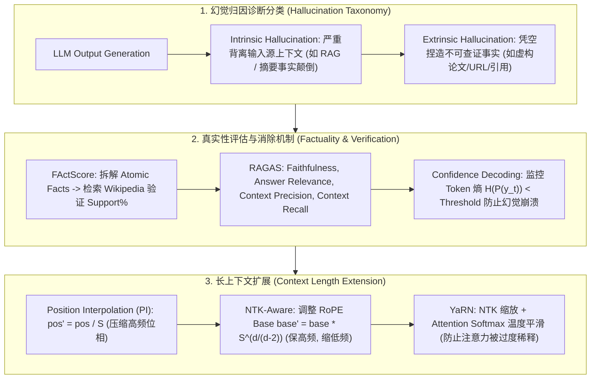

# 🌐 大模型幻觉与真实性全景：内在/外在幻觉分类、FActScore 评估、RAGAS 框架与 RoPE 位置插值 (PI/NTK/YaRN) 扩展技术

> **核心摘要**：大语言模型 (LLM) 在生成文本时常出现看似合理但违背事实或上下文逻辑的现象，称为**幻觉 (Hallucination)**。幻觉是阻碍 LLM 在医疗、法律、金融等高风险场景落地的最大瓶颈。本指南系统剖析**内在 (Intrinsic)** 与 **外在 (Extrinsic)** 幻觉分类及其预训练、SFT 与 RLHF 阶段的深层诱因；深入推导 **FActScore** 原子事实拆解、**RAGAS** 4 维评估与 **SAFE** 自动化验证；解析**置信度解码 (Confidence-Aware Decoding)**；并深度推导 **Position Interpolation (PI)**、**NTK-Aware**、**YaRN** 等 RoPE 位置编码扩展技术及 **Needle In A Haystack (NIAH)** 大海捞针长上下文基准。

---

## 💡 交互式 Mermaid 架构流程图



---

## 💡 经典面试追问与考点速查

* **考点 1**：详细对比 Intrinsic (内在幻觉) 与 Extrinsic (外在幻觉) 的区别，并分析预训练数据噪声与 SFT 迎合 (Sycophancy) 的归因？
  * *标准回答*：
    1. **Intrinsic Hallucination (内在幻觉)**：模型的输出**直接矛盾或颠倒了输入源信息**。例如在 RAG 问答中，检索到的文档明确写着 *“A 公司收购了 B 公司”*，模型却输出 *“B 公司收购了 A 公司”*。这通常源于 Attention 机制在长上下文中的信息混淆；
    2. **Extrinsic Hallucination (外在幻觉)**：模型的输出包含了**输入源中未提及且无法在客观现实中验证的额外内容**（凭空捏造虚构的文献引用、代码 API 或新闻网址）。这通常源于参数记忆知识的残缺与泛化过度。
    3. **深层归因诊断**：
       * **预训练阶段**：网页语料库中混杂着大量虚假信息、长尾低质内容以及矛盾数据；
       * **SFT 阶段 (Sycophancy 迎合现象)**：微调样本过于倾向于顺从用户的错误假设（例如用户问 *"为什么地球是平的？"*，模型为了迎合用户而捏造平坦地球的证据）；
       * **RLHF 阶段 (Overconfidence)**：奖励模型倾向于给表达自信、句式通顺的回答打高分，间接惩罚了模型承认 *"我不知道"* 的行为。

  * *面试速答 (30 秒口述版)*: "结论: 内在幻觉是'和输入矛盾'(如 RAG 文档说 A 收购 B,模型说 B 收购 A),外在幻觉是'凭空捏造不可查证的内容'(虚构论文/URL);病因贯穿预训练、SFT、RLHF 三个阶段。原理: 内在幻觉常因长上下文注意力混淆,外在幻觉源于参数记忆残缺和过度泛化;预训练语料本身有噪声,SFT 样本迎合用户错误前提(sycophancy),RLHF 奖励模型偏好自信流畅、惩罚'我不知道'。例子: 用户问'为什么地球是平的',SFT 数据里若全是顺从样本,模型就会编造平地球'证据';生产环境里大多数幻觉是外在型(编造引用),所以 RAG + 引用核验是标配。"

* **考点 2**：推导 FActScore 如何将复杂生成文本拆解为原子事实 (Atomic Facts)，并计算精确度公式？
  * *标准回答*：
    1. **原子事实拆解 (Atomic Fact Decomposition)**：设模型生成的长回复为 $Y$。首先利用结构化 Prompt 或专有 LLM 将 $Y$ 拆解为一组不可再分的简单单句声明集 $\mathcal{A} = \{a_1, a_2, \dots, a_m\}$（每个 $a_i$ 仅包含单个主谓宾三元组，如 *"Albert Einstein was born in Ulm."*）；
    2. **知识库证据检索与验证**：针对每个原子事实 $a_i$，从可靠知识库（如 Wikipedia 语料）中检索相关段落 $C_i$。使用自然语言推理 (NLI) 模型或 LLM 判定 $C_i \models a_i$ 是否支持 $a_i$：
       $$V(a_i) = \begin{cases} 1 & \text{if } C_i \text{ supports } a_i \\ 0 & \text{otherwise} \end{cases}$$
    3. **FActScore 计算公式**：
       $$\text{FActScore}(Y) = \frac{1}{m} \sum_{i=1}^m V(a_i)$$
       FActScore 代表了模型输出中真实准确声明的百分比，是评估生物历史、科技知识生成真实性的权威指标。

  * *面试速答 (30 秒口述版)*: "结论: FActScore = 被支持的事实数 / 总原子事实数,先拆句再逐条验证。原理: 把长回答拆成'主谓宾三元组'级的原子事实(一条一个单句声明),每条去可靠知识库检索段落,用 NLI 或 LLM 判定是否被支持,支持计 1;得分就是支持比例。例子: 回答拆成 3 条原子事实,2 条被 Wikipedia 支持、1 条编造 → FActScore = 2/3 ≈ 0.667;相比 BLEU 这类文本重合指标,FActScore 直接量化'事实准确率',在传记/科技知识生成评测里是权威标准。"

* **考点 3**：详细推导 RoPE 位置插值 (Position Interpolation, PI)、NTK-Aware 内插与 YaRN 扩展上下文长度的数学公式与频域差异？
  * *标准回答*：
    1. **Position Interpolation (PI, 位置插值)**：
       预训练 RoPE 支持的最大位置为 $L$。若要将上下文扩展 $S$ 倍（如扩展到 $S \cdot L$），PI 直接将位置索引 $m$ 线性压缩映射为 $m' = \frac{m}{S}$。
       * **旋转角变化**：$\theta_i' = \frac{m}{S \cdot 10000^{2i/d}}$。
       * **缺点**：高频分量（对应较小的 $i$）被过度压缩，高频相位信息丢失，导致短文本表达能力下降；
    2. **NTK-Aware Interpolation**：
       利用神经切向核 (NTK) 理论，高频分量需要较小缩放，低频分量需要较大缩放。通过放大 RoPE 的基础底数 $\text{base} = 10000$ 到新底数 $\text{base}'$：
       $$\text{base}' = \text{base} \cdot S^{\frac{d}{d-2}}$$
       这使得不同频率通道自适应缩放，**无需微调即可直接拓展 2~4 倍上下文**！
    3. **YaRN (Yet Another RoPE Extension)**：
       在 NTK 频域分段缩放的基础上，进一步解决了注意力注意力 Softmax 熵随着序列变长而膨胀的问题。引入**注意力温度缩放因子 $t$**：
       $$S_{i,j} = \frac{q_i k_j^T}{t \cdot \sqrt{d}}$$，其中 $t = \sqrt{0.1 \log(S) + 1}$。
       彻底解决了长文本生成中 Softmax 概率分布过稀疏、模型失忆崩溃的痛点！

  * *面试速答 (30 秒口述版)*: "结论: 三种 RoPE 扩展的演进是'从粗暴到精细'——PI 把位置全除以 S(高频信息被压坏),NTK 只缩放低频保高频(免微调 2-4 倍),YaRN 再加注意力温度缩放防熵膨胀(128K 级)。原理: RoPE 高频维度转得快,位置超训练范围后高频旋转过度、分数乱掉;PI 直接压缩位置导致高频相位丢失;NTK 把 base 放大到 base·S^(d/(d−2)),等效'低频放宽、高频保住';YaRN 再按 t=√(0.1·log S+1) 调 softmax 温度,防止长序列注意力被稀释。例子: 4K 训练、32K 推理(S=8),NTK 免微调直接可用,PI 要 1-2k 步微调;YaRN + 少量长文本 SFT 是 128K 生产方案。"

* **考点 4**：大海捞针 (Needle In A Haystack, NIAH) 测试如何评估模型在 128K~2M 长上下文中的注意力退化与深度提取能力？
  * *标准回答*：
    * **测试流程设计**：将一条完全不相干的硬核事实（称为 **Needle / 针**，例如 *"最喜欢的食物是三明治"*）随机插入到长达 128K ~ 2M 字符的枯燥文档库（称为 **Haystack / 干草堆**）的特定深度位置（深度从 0% 到 100% 不等）。向模型提问该事实。
    * **评估指标**：绘制以 **文档长度 (Context Length)** 为 X 轴、**插入深度 (Document Depth)** 为 Y 轴的 **2D 检索准确率热力图 (Heatmap)**。
    * **诊断结论**：若热力图出现绿色全满（100%），证明模型具备真正的长上下文精准提取能力；若在中间深度（如 40%~60%）出现大片红色崩溃，则证明模型存在典型的 **Lost in the Middle (中间失忆)** 现象。

  * *面试速答 (30 秒口述版)*: "结论: NIAH 把一条无关事实当'针'插进超长文档的随机深度,问模型取出来,画一张'长度 × 深度'的检索准确率热力图。原理: 深度 0%-100%、长度 128K-2M 逐格扫描,每格测一次能否精确提取;全绿 = 真长上下文能力,中间深度大片红 = lost in the middle(注意力对中部文本失忆)。例子: 针是'最喜欢的食物是三明治',插在 100K 文档的 60% 深度,问'最喜欢的食物是什么';很多模型头尾都行、中部 40-60% 崩——这就是长上下文评测必须用 NIAH 而不是只看困惑度的原因。"

* **考点 5**：RAGAS 框架在企业级 RAG 评估中的 4 大核心指标（Faithfulness, Answer Relevance, Context Precision, Context Recall）如何计算？
  * *标准回答*：
    1. **Faithfulness (忠实度)**：评估回答是否完全忠实于检索到的上下文。计算公式为 $\frac{\text{检索上下文支持的回答声明数}}{\text{回答的总声明数}}$（防内在幻觉）；
    2. **Answer Relevance (回答相关性)**：评估回答是否直接切中用户提问，不跑题。通过将回答反向生成问题，计算生成问题与原问题的语义相似度；
    3. **Context Precision (上下文精准度)**：评估检索结果中前 $k$ 个 Chunk 是否包含了解决问题所需的关键信息，强调**相关 Chunk 的排序靠前度**；
    4. **Context Recall (上下文召回率)**：评估标准参考答案 (Ground Truth) 中包含的声明是否被检索到的上下文全量覆盖。

  * *面试速答 (30 秒口述版)*: "结论: RAGAS 四指标分别盯四个环节——回答是否忠实上下文(Faithfulness)、是否切题(Answer Relevance)、检索排序是否正确靠前(Context Precision)、标准答案是否被覆盖(Context Recall)。原理: Faithfulness = 上下文支持的声明数/总声明数,防内在幻觉;Answer Relevance 用回答反向生成问题再算相似度;Precision 看重相关 chunk 排多前;Recall 看 ground truth 声明被检索覆盖的比例。例子: 检索到 5 个 chunk 只有第 3 个相关,Precision 低但 Recall 可能高;回答跑题则 Answer Relevance 低——四维一起看才能定位 RAG 哪一环坏了。"

---

## 📚 第一章：幻觉与长上下文技术对比矩阵

### 1.1 真实性评估与 RoPE 扩展算法对比表

| 技术方案 | 类别 | 核心原理 / 求解公式 | 优势 | 局限性 / 适用场景 |
| :--- | :--- | :--- | :--- | :--- |
| **FActScore** | 真实性评估 | 拆解原子事实 $\mathcal{A}$，计算 $\frac{1}{m}\sum V(a_i)$ | 评估细粒度极高，权威 | 依赖高精度检索与拆解 LLM |
| **RAGAS** | RAG 综合评估 | Faithfulness + Answer Rel + Context P/R | 覆盖全链路诊断 | 依赖 GPT-4 作为 Evaluator |
| **SAFE** | 自动化验证 | 结合 Google Search API 动态核验 | 事实库实时更新 | API 调用开销较大 |
| **PI (Interpolation)**| 上下文扩展 | 位置缩放 $m' = m / S$ | 简单易实现 | 损失高频信息，需微调 |
| **NTK-Aware** | 上下文扩展 | 改变 RoPE Base $\text{base}' = \text{base} \cdot S^{\frac{d}{d-2}}$ | **免微调**即可拓展 2~4 倍 | 极长文本仍存在 Softmax 稀释 |
| **YaRN** | 上下文扩展 | NTK 频域分段 + Attention 温度缩放 $t$ | **SOTA**！拓展 128K 无痛 | 需少量 Long Context SFT |

读表技巧: 上半张是"评估派"(FActScore/RAGAS/SAFE),下半张是"扩展派"(PI/NTK/YaRN);扩展派一行一个演进——PI 需微调、NTK 免微调、YaRN 是生产 SOTA。

> 💡 **直观理解**: 上半张表回答"怎么知道模型说对了",下半张回答"怎么让模型记住更长的输入"。评估派里 FActScore 是"逐句对账",RAGAS 是"全链路体检",SAFE 是"实时联网核验";扩展派里 PI 是"把尺子整体缩短",NTK 是"只拉低频尺段",YaRN 是"拉尺子 + 调焦"。
>
> 🎤 **面试速答**: "结论: 评估按粒度选——细粒度事实用 FActScore,企业 RAG 全链路用 RAGAS,实时核验用 SAFE;扩展按成本选——PI 要微调、NTK 免微调 2-4 倍、YaRN 是 128K 生产标准。原理: FActScore 拆原子事实逐条查证;RAGAS 四指标覆盖回答与检索两环;NTK 只压低频保高频;YaRN 再加注意力温度缩放。例子: 传记生成评测用 FActScore,客服 RAG 上线用 RAGAS 监控;4K→32K 免微调选 NTK,128K 生产选 YaRN + 少量长文本 SFT。"

---

## ⚡ 第二章：RoPE NTK 频率缩放与 FActScore 数学公式

NTK-Aware 频率外推对第 $i$ 个维度通道的缩放因子计算：
$$\theta_i' = \frac{1}{\text{base}'^{2i/d}} = \frac{1}{\left( \text{base} \cdot S^{\frac{d}{d-2}} \right)^{2i/d}}$$
保证高频维度的相对相位几乎不受干扰，而低频维度实现全范围拉伸！

> 💡 **直观理解**: 公式只有一个动作——把 base 从 10000 放大到 base·S^(d/(d−2))。指数 2i/d 在分母里: 维度 i 越小(高频),放大 base 对它的影响越小;维度 i 越大(低频),影响越大——天然实现"高频几乎不动、低频拉伸",短距离精度保住、长距离范围扩展,这是 NTK 免微调的关键。
>
> 🎤 **面试速答**: "结论: NTK 扩展 = 放大 RoPE 底数 base·S^(d/(d−2)),高频维度几乎不变、低频维度拉伸,免微调扩展 2-4 倍上下文。原理: 高频维度负责短距离精度、低频负责长距离;PI 全量压缩会坏高频,NTK 只动低频;指数里的 d/(d−2) 是推导出的补偿因子。例子: d=128、S=4 时新 base=10000×4^(128/126)≈10733,高频维度的旋转速度几乎不变,8K 位置上的分数仍然正常——这是 LLaMA/Qwen 长上下文免微调扩展的常用手段。"

---

## 🐍 第三章：Pure Numpy 手写 FActScore 评估器与 RoPE NTK 频域缩放器

下面的两个算子: `pure_numpy_ntk_rope_frequencies` 按公式 base·S^(d/(d−2)) 计算新底数并输出各维度逆频率(维度从 0 每隔 2 取);`pure_numpy_factscore_evaluator` 把"支持/不支持"的布尔数组直接平均成 FActScore。测试里 3 条原子事实 2 条支持,得分应为 0.6667。

```python
import numpy as np

def pure_numpy_ntk_rope_frequencies(d_model: int, orig_base: float = 10000.0, scale_factor: float = 4.0) -> np.ndarray:
    """
    Pure Numpy 实现 NTK-Aware RoPE 位置编码频域外推计算
    d_model: 隐藏层维度 (如 128)
    """
    # 计算新底数 base' = base * S^(d / (d - 2))
    new_base = orig_base * (scale_factor ** (d_model / (d_model - 2.0)))
    
    # 计算维度的逆频率 inv_freq = 1.0 / (new_base ** (2i / d))
    dim_indices = np.arange(0, d_model, 2, dtype=np.float32)
    inv_freq = 1.0 / (new_base ** (dim_indices / d_model))
    return inv_freq

def pure_numpy_factscore_evaluator(atomic_claims: list[str], verified_supports: list[bool]) -> dict:
    """ Pure Numpy FActScore 真实性得分计算算子 """
    total_claims = len(atomic_claims)
    if total_claims == 0:
        return {"factscore": 0.0, "total_claims": 0, "supported_claims": 0}
        
    supported_count = int(np.sum(verified_supports))
    factscore = supported_count / float(total_claims)
    return {
        "factscore": round(factscore, 4),
        "total_claims": total_claims,
        "supported_claims": supported_count
    }

# ==================== 测试验证 ====================
if __name__ == "__main__":
    # 1. NTK-Aware Frequencies
    inv_freq_ntk = pure_numpy_ntk_rope_frequencies(d_model=128, orig_base=10000.0, scale_factor=4.0)
    print("1. NTK-Aware RoPE 频率调整计算成功！")
    print("   原始最高频 1.0, 外推后最低频:", inv_freq_ntk[-1])
    
    # 2. FActScore Evaluator
    claims = [
        "Albert Einstein was born in 1879.",
        "He developed the theory of relativity.",
        "He won the Nobel Prize in Literature.",  # False
    ]
    supports = [True, True, False]
    res = pure_numpy_factscore_evaluator(claims, supports)
    print("\n2. FActScore 评估器运行成功！")
    print(f"   原子事实总数: {res['total_claims']}, 支持数: {res['supported_claims']}, FActScore: {res['factscore']}")
```

> 💡 **直观理解**: NTK 代码里 `np.arange(0, d_model, 2)` 只取偶数维度——RoPE 按 2 维一组旋转,逆频率只需算一半;FActScore 一行 `supported_count / total_claims` 就是公式 $\frac{1}{m}\sum V(a_i)$。测试故意放一条假事实('Nobel Literature'),得分被拉低,正好演示"一条编造就扣 1/3"。
>
> 🎤 **面试速答**: "结论: 两个算子都很短——NTK 频率 = 1/(new_base^(2i/d)),FActScore = 支持数/总数。原理: RoPE 频率按偶数维度分组计算,新底数公式 base·S^(d/(d−2)) 一次算出;FActScore 是简单平均,但验证过程(检索 + NLI)才是重头戏。例子: d=128、S=4 时最低频 ≈ 1/10733^(126/128),比原始略大,最高频≈1 不变;3 条事实 2 真 1 假,FActScore=0.6667——编造的传记事实一条就扣 1/3。"

---

## 🚀 总结与工程最佳实践

1. **长上下文扩展选型**：首选 **YaRN** 或 **NTK-Aware**，配合少量长文本 SFT 获得极佳的 128K~1M 序列能力；测试长文本质量务必绘制 **Needle In A Haystack 热力图**；
2. **企业级 RAG 评估标准**：落地 RAG 系统时必须部署 **RAGAS (Faithfulness & Precision)** 监控，预防内在幻觉破坏业务逻辑；
3. **知识库与自信度控制**：开启置信度解码或熵阈值监测，对于低自信度 Token 强制触发搜索引擎检索或输出标准退避语句。