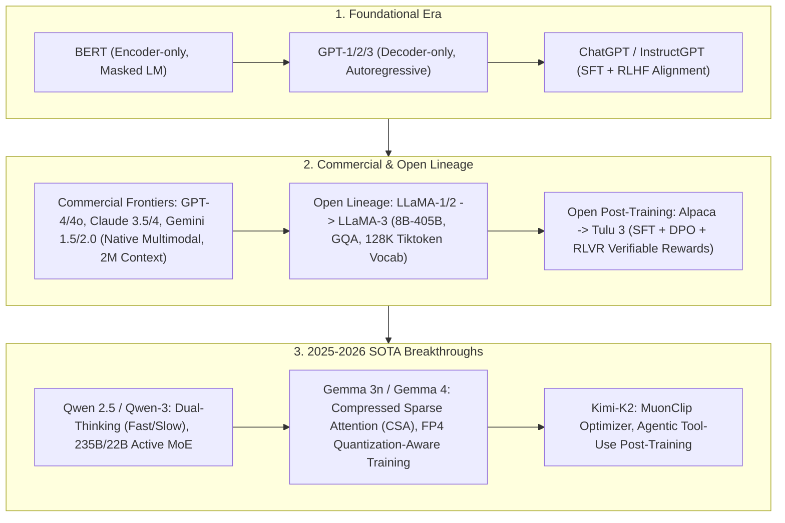

# 🌐 Open & Commercial SOTA LLM Evolution: From BERT/GPT-4 to LLaMA-3, Qwen-3, Gemma-4 & Kimi-K2

> **Core Executive Summary**: Since the Transformer paper, Large Language Models (LLMs) evolved from unidirectional/bidirectional encoders (BERT/GPT-1/2) to large-scale autoregressive generators, and now to sparse MoE activation and long-chain slow-thinking paradigms. This guide dissects **commercial closed frontiers** (GPT-4/4o, Claude 4, Gemini 2.0), **open base model leaders** (LLaMA 1/2/3), **open post-training recipes** (Tulu 3 SFT+DPO+RLVR), and **latest SOTA breakthroughs** (Qwen-3, Gemma-4, Kimi-K2).

---

## 💡 Interactive Mermaid Architecture Flowchart



---

## 💡 Classic Interview Followups & Core Cheatsheet

* **Key Topic 1**: Compare Dense models (e.g. LLaMA-3-405B) with MoE models (e.g. Qwen-3-235B or DeepSeek-V3) in terms of MFU and KV-Cache VRAM.
  * *Standard Answer*:
    * **Dense Models (LLaMA-3-405B)**: All parameters participate in every token forward pass. High GEMM Hardware MFU, zero All-to-All communication, but FLOPs scale linearly with parameter size.
    * **MoE Models (Qwen-3 235B total / 22B active)**: Only Top-k experts activated per token. Massive parameter capacity for world knowledge under a fixed single-token FLOPs budget, but VRAM scales with total 235B parameters and requires fast inter-node Expert Parallelism bandwidth.

  * *30-second Oral Answer*: "Conclusion: Dense models are fast but FLOPs scale linearly with parameters; MoE trades a 10x smaller active parameter count for 10x more capacity, at the cost of total-parameter VRAM and inter-node communication. Why: a Dense model activates all parameters per token, giving dense GEMMs and high MFU with zero cross-GPU traffic; an MoE activates only top-k experts per token, packing far more knowledge into a fixed per-token FLOP budget — but weights are loaded by total parameter count (235B), and experts spread across GPUs need All-to-All routing over fast networks. Example: DeepSeek-V3 has 671B total but only 37B active — per-token compute close to a 7B dense model; Qwen-3 is 235B total / 22B active, which is where 'small compute, big capacity' comes from."

* **Key Topic 2**: Trace the evolution of Attention mechanisms: MHA $\to$ MQA $\to$ GQA $\to$ MLA math changes and VRAM savings.
  * *Standard Answer*:
    1. **MHA (GPT-3/LLaMA-1)**: $n_h$ Query heads map to $n_h$ Key and Value heads. KV Cache size = $2 \times b \times s \times n_h \times d_h$.
    2. **MQA**: All $n_h$ Query heads share 1 Key and 1 Value head. Slashes VRAM by $n_h$x, but hurts precision.
    3. **GQA (LLaMA-2/3, Qwen-2.5)**: $n_h$ Query heads grouped into $g$ groups (e.g. $g=8$). Slashes VRAM by $n_h / g$ with zero accuracy loss.
    4. **MLA (DeepSeek-V2/V3/V4)**: Projects Key/Value into a low-rank latent vector $c_t^{\text{KV}}$ with decoupled RoPE, slashing KV Cache VRAM by **93%**!

  * *30-second Oral Answer*: "Conclusion: the attention lineage is one long story of shrinking the KV cache — MHA stores KV per head, MQA shares one KV head across all, GQA shares per group, MLA compresses KV into a low-rank latent vector. Why: fewer KV heads means fewer (K,V) copies cached; MLA goes further and projects each layer's K/V into a 512-dim latent vector cached instead, with a decoupled RoPE branch preserving position information. Example: LLaMA-3 70B uses GQA (64 Query heads, 8 KV heads) to save 8x; DeepSeek-V2's MLA cuts the KV cache another ~93% at the same scale — which is why MLA is the killer feature for long-context, high-concurrency inference."

* **Key Topic 3**: What insights does Tulu 3 open post-training recipe (SFT $\to$ DPO $\to$ RLVR) provide for building generalizable models?
  * *Standard Answer*:
    * **Decontamination**: Strict N-gram overlap filtering in SFT data.
    * **RLVR (Reinforcement Learning with Verifiable Rewards)**: Replaces unstable neural RMs with rule-based math/code verifiers, boosting alignment stability.

  * *30-second Oral Answer*: "Conclusion: Tulu 3's lesson is 'post-training should be transparent and reproducible, and rewards should be verifiable'. Why: SFT data is decontaminated with strict N-gram overlap filtering so evaluation benchmarks never leak; for math/code/instruction tasks you drop the learned reward model and use compilers, graders and regex matching as verifiable rewards — stable signals that never drift. Example: math answers are checked against the final result, code is checked against unit tests, so RL cannot be misled by a hallucinating reward model; DeepSeek-R1's GRPO follows the same idea, which is why RLVR is replacing RM-based RLHF."

* **Key Topic 4**: How do Qwen-3 and Claude-4 implement Dual-Thinking modes (Fast System 1 vs Slow System 2) during inference?
  * *Standard Answer*: Dual-thinking allows switching between Fast Mode (skipping `<think>` for high throughput) and Slow Mode (triggering long CoT for complex reasoning) on the same model weights via prompt budgets.

  * *30-second Oral Answer*: "Conclusion: Dual-Thinking lets one model both answer instantly (fast System 1) and reason deeply (slow System 2), switched at inference by a prompt flag and thinking budget. Why: post-training teaches the model when to think — the system prompt can set a thinking_budget or a toggle; Fast mode skips the <think> stage and outputs directly, Slow mode triggers a long CoT exploration automatically. Example: '1+1=?' goes through Fast mode and answers 2 immediately; a competition math problem goes through Slow mode and unfolds thousands of reasoning tokens — this fixes the R1-class waste of burning thousands of thinking words on trivial inputs like 'Hello'."

* **Key Topic 5**: How does the Muon/MuonClip optimizer in Kimi-K2 resolve gradient numerical instability compared to AdamW in 100B+ pre-training?
  * *Standard Answer*: Muon applies Newton-Schulz orthogonalization iterations on 2D weight matrix updates, constraining singular values to a stable range and eliminating anisotropy Loss Spikes in FP8/FP4 pre-training.

  * *30-second Oral Answer*: "Conclusion: AdamW's element-wise normalization makes update step sizes highly anisotropic at 100B+ scale under low precision, causing loss spikes; Muon enforces orthogonality so every matrix update is isotropic. Why: AdamW rescales each element independently, so different directions can move at wildly different rates and matrix singular values run away; Muon applies Newton-Schulz iterations to the 2D weight update, pulling it toward an orthogonal matrix with singular values near 1. Example: Muon stays stable from 1B to 100B+ parameters, and with MuonClip it nearly eliminates loss spikes in FP8 pre-training — that is how Kimi-K2 dares to train a 100B+ model in low precision from scratch."

---

## 📚 Section 1: SOTA Models Landscape Comparison Matrix

| Model Name | Architecture | Total / Active Params | Context Window | Key Innovation | Open Status |
| :--- | :--- | :--- | :--- | :--- | :--- |
| **GPT-4o** | Dense / MoE | ~1.8T / Native Multimodal | 128K | Unified audio/vision/text architecture | Commercial Closed |
| **Claude 3.5/4**| Dense / MoE | Proprietary | 200K | Artifacts UI, superior coding | Commercial Closed |
| **Gemini 1.5 / 2.0** | Multimodal Native| Proprietary | 1M (2.0 Flash) / 2M (1.5 Pro) | Ring Attention native multimodal long context | Commercial Closed |
| **LLaMA-3** | Dense | 8B / 70B / 405B | 128K | 128K Tiktoken vocab, GQA across all sizes | Open Weights |
| **Tülu 3** | Dense (LLaMA-3) | 8B / 70B | 128K | Fully transparent SFT + DPO + RLVR recipe | Fully Open |
| **Qwen-3** | MoE | 235B / 22B | 128K | Fast/Slow Dual-Thinking, strong code/math | Open Weights |
| **Gemma 4** | Dense / MoE | 2B / 9B / 27B | 128K | Compressed Sparse Attention, FP4 QAT | Open Weights |
| **Kimi K2** | MoE | Proprietary | 128K | MuonClip optimizer, Agentic alignment | Commercial / Open |

How to read this table: scan the Architecture and Key Innovation columns together — Dense models win on architectural details (GQA, vocabulary), MoE models win on sparse-activation capacity; one signature innovation per family (GQA, Dual-Thinking, CSA, MuonClip) is enough for interviews.

> 💡 **Intuition**: Memorize the SOTA landscape by camps: three closed frontiers (GPT-4o, Claude, Gemini) compete on multimodality and context length; among open models, LLaMA is the "dense gatekeeper" (stable architecture, huge ecosystem) while Qwen/DeepSeek are "MoE volume players" (small activation, big capacity); Gemma is Google's lightweight newcomer (CSA + FP4 saves memory); Kimi-K2 bets on optimizer innovation. You do not need every spec — one representative plus one innovation per camp.
>
> 🎤 **Interview Answer**: "Conclusion: the 2025-2026 SOTA trends are four — MoE sparsity (Qwen-3 235B/22B), dual-thinking (Qwen-3/Claude 4), ultra-long context (Gemini 2M), and low-precision training (Gemma FP4, Kimi FP8). Why: MoE trades fixed compute for more capacity; dual-thinking stops simple prompts from burning compute; long context relies on distributed attention like Ring Attention; low precision needs numerically stable optimizers like Muon to stay safe. Example: GPT-4o ~1.8T parameters, Gemini 2.0 Flash 1M context, LLaMA-3 GQA + 128K vocab across all sizes — these three numbers are the interview anchor points."

---

## ⚡ Section 2: GQA KV-Cache VRAM Formula

GQA KV Cache memory footprint per token: this formula answers "how much extra VRAM does one generated token cost" — the 2 is one copy each of K and V, multiplied by layers, by KV head count $g$, by head dim $d_h$, then by precision bytes. Note it depends only on the attention config, not on total model parameters — GQA cuts exactly the $g$ term.
$$\text{Memory}_{\text{KV}} = 2 \times \text{Layers} \times g \times d_h \times \text{Precision\_Bytes} \quad (\text{Bytes/Token})$$

> 💡 **Intuition**: 320KB per token sounds tiny, but multiply by context length and concurrency: 320KB × 128K context × 100 concurrent requests ≈ 4TB. Mnemonic for the formula: "twice times layers, times groups times head dim, times precision bytes". It is independent of parameter count and is the dominant memory cost in long-context, high-concurrency serving.
>
> 🎤 **Interview Answer**: "Conclusion: GQA KV cache costs 2×L×g×d_h×bytes per token — about 320KB/token for LLaMA-3-70B, one eighth of MHA. Why: only KV heads are cached, so Query head count is irrelevant; every generated token adds that many bytes, so total = 320KB × sequence length × batch. Example: LLaMA-3-70B at 8K context and batch 32 needs ~687GB under MHA but only ~86GB with GQA — that 8x is the whole point of GQA."

---

## 🐍 Section 3: Pure Numpy Handwritten LLM Resource Analyzer

The analyzer below demonstrates two estimation chains you will be asked in interviews: ① parameter count = vocabulary embedding ×2 (input and output) + per-layer (attention + SwiGLU FFN) × layers; ② KV cache = 2 × KV heads × head dim × layers × seq × batch × bytes. Note `attn_params` counts Query heads once and KV heads twice (`2 * self.num_kv_heads`), and the 3 in the FFN term stands for the gate/up/down matrices with FFN width $\frac{8}{3}d$.

```python
import numpy as np

class PureNumpyLLMResourceAnalyzer:
    def __init__(self, vocab_size: int, d_model: int, num_layers: int, num_heads: int, num_kv_heads: int):
        self.vocab_size = vocab_size
        self.d_model = d_model
        self.num_layers = num_layers
        self.num_heads = num_heads
        self.num_kv_heads = num_kv_heads
        self.head_dim = d_model // num_heads
        
    def calculate_dense_parameters(self) -> dict:
        embedding_params = self.vocab_size * self.d_model
        attn_params = self.d_model * (self.num_heads + 2 * self.num_kv_heads) * self.head_dim + self.d_model * self.d_model
        ffn_dim = int(8 / 3 * self.d_model)
        ffn_params = 3 * self.d_model * ffn_dim
        total_per_layer = attn_params + ffn_params
        total_params = embedding_params * 2 + total_per_layer * self.num_layers
        return {
            "total_params_billion": round(total_params / 1e9, 2),
            "per_layer_params_million": round(total_per_layer / 1e6, 2),
        }
        
    def calculate_kv_cache_vram(self, seq_len: int, batch_size: int, bytes_per_elem: int = 2) -> float:
        kv_per_token_per_layer = 2 * self.num_kv_heads * self.head_dim * bytes_per_elem
        total_kv_bytes = kv_per_token_per_layer * self.num_layers * seq_len * batch_size
        return round(total_kv_bytes / (1024 ** 3), 4)
if __name__ == "__main__":
    llama3_8b = PureNumpyLLMResourceAnalyzer(128256, 4096, 32, 32, 8)
    print("✅ LLaMA-3-8B Resource Analysis Complete!")
    print("   Total Params:", llama3_8b.calculate_dense_parameters()["total_params_billion"], "B")
    print("   KV-Cache VRAM (Seq=8192, BS=4):", llama3_8b.calculate_kv_cache_vram(8192, 4), "GB")
```

> 💡 **Intuition**: The two formulas are "doing the math before buying the machines": parameter count determines how much VRAM the weights need (1B params ≈ 2GB in FP16), and the KV cache determines how much VRAM the context needs at inference. LLaMA-3-8B has 32 layers, d=4096, and an FFN width of 8/3×4096≈10923 — that is the shape of a SwiGLU block.
>
> 🎤 **Interview Answer**: "Conclusion: resource estimation is two formulas — params ≈ 2×vocab×d + L×(attn + 3×d×(8/3)d), and KV cache = 2×g×d_h×L×seq×batch×bytes. Why: embeddings exist on both input and output so ×2; the SwiGLU FFN has three matrices at width ~8/3×d; the KV cache only depends on KV head count. Example: running this class on LLaMA-3-8B (vocab=128256, d=4096, L=32, 32 Query heads / 8 KV heads) yields ~8B parameters and ~0.9GB of KV cache at seq=8192, batch=4 — matching the official specs."

---

## 🚀 Key Takeaways & Best Practices

1. **Base Model Selection**: Standardize on **LLaMA-3 (8B/70B)** or **Qwen-2.5/3** for production GQA architecture and 128K context window.
2. **Dual-Thinking Strategy**: Leverage **Qwen-3 Dual-Thinking** or **DeepSeek-R1 Distill** to toggle between Fast System 1 and Slow System 2 reasoning.
3. **Post-Training Paradigm**: Follow the **Tülu 3** recipe combining SFT, DPO, and rule-based RLVR for transparent, verifiable alignment.