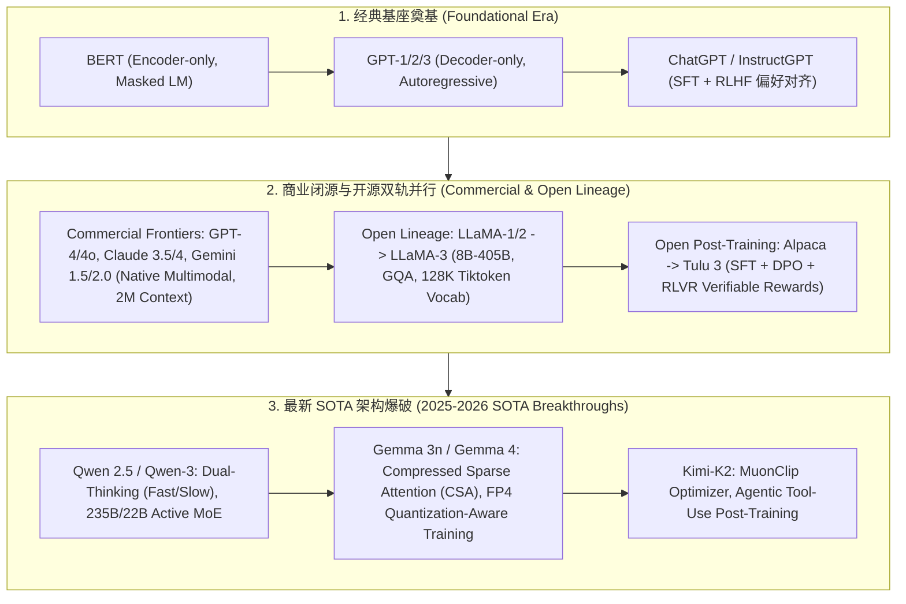

# 🌐 开源与商业 SOTA 大模型演进全景：从 BERT/GPT-4 到 LLaMA-3、Qwen-3、Gemma-4 与 Kimi-K2 架构对比

> **核心摘要**：自 Transformer 论文问世以来，大语言模型 (LLM) 经历了从早期单向/双向编码器（BERT/GPT-1/2）到大规模自回归生成，再到现代高并发 MoE 稀疏激活与长链慢思考的巨幅跨越。本指南系统解构**商业闭源顶级模型**（GPT-4/4o, Claude 4, Gemini 2.0）、**开源基座统治者**（LLaMA 1/2/3 架构细节）、**开放后训练标准**（Tulu 3 的 SFT+DPO+RLVR 流程），以及**最新前沿 SOTA**（Qwen-3、Gemma-4、Kimi-K2）的底层网络设计、词表扩张、上下文窗口延长与优化器创新。

---

## 💡 交互式 Mermaid 架构流程图



---

## 💡 经典面试追问与考点速查

* **考点 1**：对比稠密模型 (如 LLaMA-3-405B) 与巨型 MoE 模型 (如 Qwen-3-235B 或 DeepSeek-V3) 在预训练算力利用率与推理 KV-Cache 的利弊？
  * *标准回答*：
    * **稠密模型 (Dense, 如 LLaMA-3-405B)**：所有参数参与每个 Token 的前向计算。优点是**硬件 GEMM 算子利用率（MFU）极高**，无需跨节点 All-to-All 路由通信；缺点是 FLOPs 与参数量成正比，训练与推理成本随着规模增加成线性剧增。
    * **MoE 模型 (如 Qwen-3 235B 总参数 / 22B 激活)**：仅激活前 $k$ 个专家。优点是**在相同的单 Token 算力预算 (FLOPs) 下拥有极大的参数容量 (Capacity)**，能够吸收更丰富的世界知识；缺点是**显存占用按总参数 (235B) 计算**，且全量专家的 KV-Cache 占据较大显存，跨节点通信（Expert Parallelism）对网络带宽提出极高要求。

  * *面试速答 (30 秒口述版)*: "结论: Dense 模型算得快但 FLOPs 与参数量成正比,MoE 用 1/10 的激活参数换 10 倍的容量,代价是显存按总参数算、通信开销高。原理: Dense 每个 token 激活全部参数,GEMM 密集、MFU 高、无跨卡通信;MoE 每个 token 只激活 top-k 专家,固定算力预算下能塞进更多知识;但权重显存按总参数(235B)计算,专家分散在多卡,All-to-All 路由对网络带宽极敏感。例子: DeepSeek-V3 总参数 671B、激活仅 37B——每 token 算力接近 7B 稠密模型,训练成本远低于同规模 Dense;Qwen-3 235B/22B 同理,这就是'小算力大容量'的来源。"

* **考点 2**：详细梳理 Transformer 注意力机制的演进脉络：MHA $\to$ MQA $\to$ GQA $\to$ MLA 的数学变化与显存节省原理？
  * *标准回答*：
    1. **MHA (Multi-Head Attention, GPT-3/LLaMA-1)**：$n_h$ 个 Query 头对应 $n_h$ 个 Key 头和 $n_h$ 个 Value 头。KV Cache 体积为 $2 \times b \times s \times n_h \times d_h$；
    2. **MQA (Multi-Query Attention)**：所有 $n_h$ 个 Query 头共享**唯一 1 个** Key 头和 Value 头。KV Cache 显存暴降 $n_h$ 倍，但严重损害多头表示能力与模型精度；
    3. **GQA (Grouped-Query Attention, LLaMA-2/3, Qwen-2.5)**：折中方案。将 $n_h$ 个 Query 头划分为 $g$ 组，每组共享 1 个 Key/Value 头（如 $g=8$）。显存减少 $n_h / g$ 倍，且几乎零精度损失，是当前开源大模型的工业标准；
    4. **MLA (Multi-Head Latent Attention, DeepSeek-V2/V3/V4)**：将 KV 进一步投影为一维低秩潜向量 $c_t^{\text{KV}}$（如 512 维），配合同步解耦的 RoPE 位置分支，斩获高达 **93% 的 KV Cache 显存绝杀**！

  * *面试速答 (30 秒口述版)*: "结论: 注意力演进主线是'KV cache 越省越好'——MHA 每头一份 KV,MQA 全头共享一份,GQA 分组共享,MLA 把 KV 压成低秩潜向量。原理: KV 头越少,缓存里存的 (K,V) 份数越少;MLA 更进一步,把每层 K/V 先投影到 512 维潜向量再缓存,并用解耦的 RoPE 分支保住位置信息。例子: LLaMA-3 70B 用 GQA(64 个 Query 头配 8 个 KV 头)省 8 倍;DeepSeek-V2 的 MLA 在同规模下把 KV cache 再砍约 93%——所以 MLA 是长上下文 + 高并发推理效率的杀手锏。"

* **考点 3**：Tulu 3 的开放后训练 recipe (SFT $\to$ DPO $\to$ RLVR) 对构建高泛化开源模型提供了什么启发？
  * *标准回答*：AI2 提出的 **Tülu 3** 开源项目打通了完全透明且可复现的 Post-training 范式。核心启发在于：
    * **数据去污染 (Decontamination)**：在 SFT 阶段必须对微调数据集进行严格的 N-gram 重叠度过滤，防止评估基准泄漏；
    * **RLVR (Reinforcement Learning with Verifiable Rewards)**：在数学、代码与指令遵循任务中，**放弃不稳定的神经网络 Reward Model**，改用基于规则判题、编译器输出与正则匹配的**可验证奖励 (Verifiable Rewards)** 驱动 RL，大幅提升了对齐的稳定性与逻辑严密性！

  * *面试速答 (30 秒口述版)*: "结论: Tulu 3 的启发是'后训练要透明可复现 + 奖励要可验证'。原理: SFT 数据先做 N-gram 去污染,防止基准泄漏到训练集;数学/代码任务不用学出来的 reward model,改用编译器、判题器、正则匹配这类可验证奖励,信号稳定、不会漂移。例子: 数学题直接比对最终答案,代码题看测试用例是否全过——RL 阶段不会因为 reward model 的幻觉学歪,DeepSeek-R1 的 GRPO 也是同一思路;这就是 RLVR 逐渐取代 RM-based RLHF 的原因。"

* **考点 4**：Qwen-3 与 Claude-4 的双思维模式 (Fast System 1 vs Slow System 2) 如何在推理阶段自由切换？
  * *标准回答*：
    * 传统的 Reasoning 模型（如 Early R1-Zero）强制对每一个简单输入（如 *"Hello"*）都生成数千字思考链，造成严重的时间与算力浪费；
    * **双思维模式 (Dual-Thinking Mode)** 通过在 Post-training 中引入**动态思考调优**：系统提示词可以指定 `thinking_budget`（思考预算）或开关标记。在 Fast Mode (System 1) 下，模型跳过 `<think>` 节点直接输出；在 Slow Mode (System 2) 下，模型自动触发连续的长 CoT 探索，实现了**在同一模型权重下高吞吐对话与深层推理的自由按需切换**。

  * *面试速答 (30 秒口述版)*: "结论: 双思维模式让同一个模型既能秒回(快思考)也能长推理(慢思考),通过 prompt 里的开关和思考预算自由切换。原理: 后训练专门教模型'什么时候该思考'——系统提示里加 thinking_budget 或开关标记;Fast 模式跳过 <think> 直接输出,Slow 模式自动触发长 CoT 探索。例子: 问 '1+1=?' 走 Fast 模式直接答 2;问竞赛数学走 Slow 模式自动展开上千 token 的推理链;这解决了 R1 系模型'对 Hello 也烧几万字思考'的算力浪费问题。"

* **考点 5**：Kimi-K2 采用的 Muon / MuonClip 优化器相比传统 AdamW 在千亿级模型预训练中解决了什么梯度的数值稳定性问题？
  * *标准回答*：在千亿级参数模型训练中，传统 **AdamW 优化器** 依赖于元素级的动量 (Element-wise Momentum) 与二阶矩平滑。当模型层数极深或矩阵维度极高时，不同方向的梯度更新步长容易产生极端各向异性（Anisotropy），引发现发性的梯度爆炸与 Loss Spike 崩溃。
  **Muon / MuonClip 优化器** 引入正交化矩阵更新：通过对 2D 权重矩阵更新量施加**牛顿-拉夫逊 (Newton-Schulz) 正交迭代**，将矩阵的奇异值强行归一化限定在稳定范围内。使得每个二维参数矩阵在更新时各向同性，极大地增强了大模型在 FP8/FP4 低精度预训练时的数值稳定性！

  * *面试速答 (30 秒口述版)*: "结论: AdamW 逐元素归一化在千亿参数 + 低精度训练时步长各向异性会引发 Loss Spike,Muon 用正交化约束让每个矩阵更新各向同性。原理: AdamW 对每个元素独立缩放,不同方向的更新步长可能差几个数量级,矩阵奇异值失控;Muon 对 2D 权重更新做 Newton-Schulz 迭代,把更新矩阵拉向正交阵、奇异值压在 1 附近。例子: Muon 在 1B 到 100B+ 规模都稳定,配 MuonClip 后 FP8 预训练几乎消灭 loss spike——这正是 Kimi-K2 敢用低精度从头训千亿模型、省显存又稳的基础。"

---

## 📚 第一章：SOTA 大模型全景架构演进对比矩阵

### 1.1 开源与商业 SOTA 模型特性横向对比

| 模型名称 | 架构类型 | 总参数 / 激活参数 | 上下文窗口 | 核心创新点 | 开源状态 |
| :--- | :--- | :--- | :--- | :--- | :--- |
| **GPT-4o** | Dense / MoE | 约 1.8T / 多模态原生 | 128K | 原生音频/视觉/文本统一架构 | 商业闭源 |
| **Claude 3.5/4**| Dense / MoE | 未公开 | 200K | Artifacts 交互，超强系统级编程能力 | 商业闭源 |
| **Gemini 1.5 / 2.0** | Multimodal Native| 未公开 | 1M (2.0 Flash) / 2M (1.5 Pro) | 环形注意力 (Ring Attn) 原生多模态长上下文 | 商业闭源 |
| **LLaMA-3** | Dense | 8B / 70B / 405B | 128K | 128K Tiktoken 词表，全量 GQA | 开放权重 |
| **Tülu 3** | Dense (LLaMA-3) | 8B / 70B | 128K | 开放 SFT + DPO + RLVR 全流程 Recipe | 完全开源 |
| **Qwen-3** | MoE | 235B / 22B | 128K | Fast/Slow 双思维模式，强大代码与多语言 | 开放权重 |
| **Gemma 4** | Dense / MoE | 2B / 9B / 27B | 128K | Compressed Sparse Attention, FP4 QAT | 开放权重 |
| **Kimi K2** | MoE | 未公开 | 128K | MuonClip 正交优化器，Agentic 数据对齐 | 商业 API / 开源 |

读表技巧: 同时看"架构类型"和"核心创新点"两列——Dense 模型靠架构细节(GQA/词表)取胜,MoE 模型靠稀疏激活堆容量;每家记 1 个标志性创新(GQA、双思维、CSA、MuonClip)就够面试。

> 💡 **直观理解**: 按"阵营"记 SOTA: 闭源三家(GPT-4o、Claude、Gemini)拼多模态和长上下文;开源两派——LLaMA 是"稠密守门人"(架构稳、生态全),Qwen/DeepSeek 走"MoE 卷王"路线(小激活换大容量);Gemma 是谷歌轻量级新秀(CSA + FP4 省显存);Kimi-K2 拼优化器创新。面试不用背全部参数,记每个阵营 1 个代表 + 1 个创新点即可。
>
> 🎤 **面试速答**: "结论: 2025-2026 SOTA 四大趋势——MoE 稀疏化(Qwen-3 235B/22B)、双思维推理(Qwen-3/Claude 4)、超长上下文(Gemini 2M)、低精度训练(Gemma FP4、Kimi FP8)。原理: MoE 用固定算力换更大容量;双思维解决'简单问题也烧算力';长上下文靠 Ring Attention 等分布式注意力;低精度靠 Muon 这类数值稳定优化器兜底。例子: GPT-4o 约 1.8T 参数、Gemini 2.0 Flash 上下文 1M、LLaMA-3 全线 GQA + 128K 词表——这三个数字是面试常考锚点。"

---

## ⚡ 第二章：Dense 与 MoE 模型显存与 FLOPs 计算公式

### 2.1 显存占用与 KV-Cache 计算公式

单 Token 推理时，基于 GQA 架构的 KV Cache 显存占用公式为：这个公式算的是"每生成一个 token 需要新增多少显存"——2 是 K、V 各一份,乘层数、乘 KV 头数 $g$、乘头维 $d_h$,再乘精度字节数。注意它只依赖注意力配置、不依赖模型总参数,GQA 砍掉的就是 $g$ 这一项。
$$\text{Memory}_{\text{KV}} = 2 \times \text{Layers} \times g \times d_h \times \text{Precision\_Bytes} \quad (\text{Bytes/Token})$$
对于 LLaMA-3-70B（80 层, $g=8, d_h=128$, FP16），单 Token KV Cache 仅占用 $2 \times 80 \times 8 \times 128 \times 2 = 327,680 \text{ Bytes} \approx 320 \text{ KB}$，相比传统 MHA 降低了 8 倍！

> 💡 **直观理解**: 单 token 320KB 看着小,但乘上上下文长度和并发就爆炸: 320KB × 128K 上下文 × 100 路并发 ≈ 4TB。公式记忆口诀: "两倍乘层数,乘组数乘头维,再乘精度字节"。它和模型参数量无关,是长上下文 + 高并发场景下显存的大头。
>
> 🎤 **面试速答**: "结论: GQA 的 KV cache 单 token 开销 = 2×L×g×d_h×字节,LLaMA-3-70B 约 320KB/token,是 MHA 的 1/8。原理: 只有 KV 头被缓存,所以和 Query 头数无关;每生成一个 token 就新增这么多字节,总占用 = 320KB × 序列长度 × batch。例子: LLaMA-3-70B 在 8K 上下文、batch=32 下,MHA 需要约 687GB,GQA 只需约 86GB——这个 8 倍就是 GQA 的全部意义。"

---

## 🐍 第三章：Pure Numpy 手写大模型参数量与显存开销计算器

下面的计算器演示两条面试必考的估算链: ① 参数量 = 词表嵌入 ×2(输入/输出各一份)+ 每层(注意力 + SwiGLU FFN)× 层数;② KV cache = 2 × KV头数 × 头维 × 层数 × 序列 × batch × 字节数。注意 `attn_params` 里 Query 头计一次、KV 头计两次(`2 * num_kv_heads`),SwiGLU 的 3 是 gate/up/down 三个权重矩阵,FFN 维度取 $\frac{8}{3}d$。

```python
import numpy as np

class PureNumpyLLMResourceAnalyzer:
    """ Pure Numpy 大模型参数量、FLOPs 与推理 KV-Cache 显存计算器 """
    def __init__(self, vocab_size: int, d_model: int, num_layers: int, num_heads: int, num_kv_heads: int):
        self.vocab_size = vocab_size
        self.d_model = d_model
        self.num_layers = num_layers
        self.num_heads = num_heads
        self.num_kv_heads = num_kv_heads
        self.head_dim = d_model // num_heads
        
    def calculate_dense_parameters(self) -> dict:
        """ 计算标准 Dense Transformer 参数分布 """
        embedding_params = self.vocab_size * self.d_model
        attn_params_per_layer = self.d_model * (self.num_heads + 2 * self.num_kv_heads) * self.head_dim + self.d_model * self.d_model
        # SwiGLU FFN: 3 * d_model * (8/3 * d_model)
        ffn_dim = int(8 / 3 * self.d_model)
        ffn_params_per_layer = 3 * self.d_model * ffn_dim
        
        total_per_layer = attn_params_per_layer + ffn_params_per_layer
        total_params = embedding_params * 2 + total_per_layer * self.num_layers
        
        return {
            "total_params_billion": round(total_params / 1e9, 2),
            "per_layer_params_million": round(total_per_layer / 1e6, 2),
            "embedding_params_million": round(embedding_params / 1e6, 2)
        }
        
    def calculate_kv_cache_vram(self, seq_len: int, batch_size: int, bytes_per_elem: int = 2) -> float:
        """ 计算推理阶段 KV Cache 占用显存 (GB) """
        # KV size per token per layer = 2 * num_kv_heads * head_dim * bytes
        kv_per_token_per_layer = 2 * self.num_kv_heads * self.head_dim * bytes_per_elem
        total_kv_bytes = kv_per_token_per_layer * self.num_layers * seq_len * batch_size
        return round(total_kv_bytes / (1024 ** 3), 4)


# ==================== 测试验证 ====================
if __name__ == "__main__":
    # 配置 LLaMA-3-8B 架构参数
    llama3_8b = PureNumpyLLMResourceAnalyzer(
        vocab_size=128256, 
        d_model=4096, 
        num_layers=32, 
        num_heads=32, 
        num_kv_heads=8  # GQA 8 组
    )
    
    params_info = llama3_8b.calculate_dense_parameters()
    kv_vram = llama3_8b.calculate_kv_cache_vram(seq_len=8192, batch_size=4, bytes_per_elem=2)
    
    print("✅ LLaMA-3-8B 资源计算结果完成！")
    print("   模型总参数量:", params_info["total_params_billion"], "B")
    print("   单层 Transformer 参数量:", params_info["per_layer_params_million"], "M")
    print(f"   BatchSize=4, SeqLen=8192 时 KV-Cache 显存占用: {kv_vram} GB")
```

> 💡 **直观理解**: 代码里的两个公式就是"买机器前先算账": 参数量决定权重占多少显存(FP16 下 1B 参数 ≈ 2GB),KV cache 决定推理时上下文占多少显存。LLaMA-3-8B 的 32 层、d=4096、FFN 维度 8/3×4096≈10923——这就是 SwiGLU 结构的形状。
>
> 🎤 **面试速答**: "结论: 估算资源两条公式——参数 ≈ 2×vocab×d + L×(attn + 3×d×(8/3)d),KV cache = 2×g×d_h×L×seq×batch×bytes。原理: embedding 输入输出各一份所以 ×2;SwiGLU FFN 是三个矩阵、维度约 8/3×d;KV cache 只和 KV 头数有关。例子: 用这个类算 LLaMA-3-8B(vocab=128256, d=4096, L=32, 32 Query 头/8 KV 头)得约 8B 参数;seq=8192、batch=4 时 KV cache 约 0.9GB,和官方口径一致。"

---

## 🚀 总结与工程最佳实践

1. **开源基座选型**：首选 **LLaMA-3 (8B/70B)** 或 **Qwen-2.5/3**，依托强大的 GQA 架构与 128K 词表，兼顾推理速度与多语言能力；
2. **慢思考与长推理选型**：需要兼顾轻量与慢思考的场景，使用 **Qwen-3 双思维模式** 或 **DeepSeek-R1 Distill 蒸馏系** 模型；
3. **后训练开源标准**：参考 **Tülu 3** 开放体系，结合 SFT + DPO + 可验证奖励 RLVR 实现高质量自建对齐。