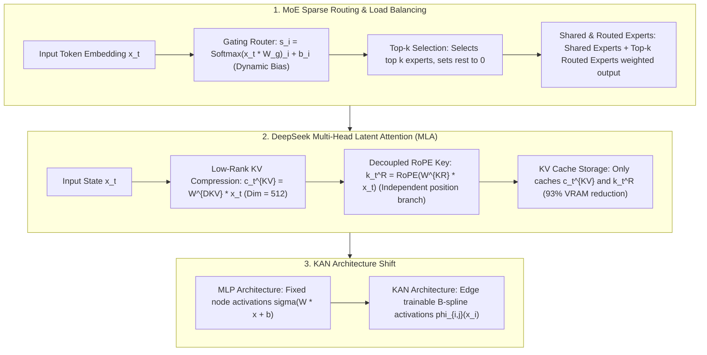

# 🌐 Mixture-of-Experts (MoE) & DeepSeek MLA/MTP/mHC Architecture: Top-k Routing, Aux-Loss-Free, KAN vs MLP

> **Core Executive Summary**: As model scales reach trillion-parameter frontiers, Dense forward FLOPs become unsustainable. **Mixture-of-Experts (MoE)** replaces FFN layers with multiple expert networks, using a **Gating Router** to dynamically activate only the Top-$k$ experts per token (e.g. 8 active out of 256). This expands parameter capacity by orders of magnitude while keeping FLOPs constant. This guide dissects MoE gating math, **DeepSeek-V3/V4 Auxiliary-Loss-Free** load balancing, **MLA (Multi-Head Latent Attention)** 93% VRAM savings, **MTP (Multi-Token Prediction)**, and **KAN (Kolmogorov-Arnold Networks)**.

---

## 💡 Interactive Mermaid Architecture Flowchart



---

## 💡 Classic Interview Followups & Core Cheatsheet

* **Key Topic 1**: Derive the Switch Transformer auxiliary load balancing loss $\mathcal{L}_{\text{aux}}$ and explain DeepSeek Auxiliary-Loss-Free dynamic bias routing.
  * *Standard Answer*:
    1. **Switch Transformer Aux Loss**: Prevents routing collapse (all tokens sent to 1 expert):
       $$\mathcal{L}_{\text{aux}} = \alpha \cdot N \sum_{i=1}^N f_i P_i$$
       where $f_i$ is the token routing fraction and $P_i$ is average gating probability. Over-penalizing degrades model language capability.
    2. **DeepSeek Auxiliary-Loss-Free Dynamic Bias**: Eliminates auxiliary loss penalty! Modifies routing to:
       $$G(x)_i = \text{TopK}(s_i + b_i, k), \quad \text{where } s_i = \text{Softmax}(x \cdot W_g)_i$$
       During training, if expert $i$ is overloaded, lower $b_i$; if underloaded, raise $b_i$. Biases $b_i$ control routing without backprop gradient interference!

  * *30-second Oral Answer*: "Conclusion: classic MoE uses an auxiliary loss L_aux to force expert balance; DeepSeek instead tweaks routing directly with dynamic biases b_i, leaving the main loss untouched. Why: routing collapse sends most tokens to a few hot experts while others starve; L_aux = α·N·Σf_i·P_i is minimized when both routing fractions and gating probabilities are uniform, but it disturbs language modeling; DeepSeek adds a bias to the gating score — overloaded experts get their bias lowered, underloaded ones raised, and the bias never receives gradients. Example: among 256 experts, if one takes 1.5x the average load, its b_i is reduced so the next batch of tokens flows elsewhere — achieving 100% balance with zero interference to the main loss."

* **Key Topic 2**: How does DeepSeek Multi-Head Latent Attention (MLA) compress KV Cache via low-rank latent vector $c_t^{\text{KV}}$ while resolving RoPE conflicts?
  * *Standard Answer*:
    * **MLA Compression**: Projects Key/Value into a low-rank latent vector $c_t^{\text{KV}} \in \mathbb{R}^{d_c}$ ($d_c = 512$). In inference, **only $c_t^{\text{KV}}$ is cached in VRAM**! Matrix multiplication absorption $(q W^{\text{UK}}) c_t^{\text{KV}}$ allows dot-products directly in low-rank space.
    * **Decoupled RoPE Branch**: RoPE position encodings cannot be compressed without breaking matrix associativity. MLA decouples RoPE into a separate low-rank Key vector $k_t^R = \text{RoPE}(W^{\text{KR}} x_t)$, forming final Key $[K_t^C; k_t^R]$, achieving 93% VRAM savings!

  * *30-second Oral Answer*: "Conclusion: MLA compresses each layer's K/V into a 512-dim low-rank latent vector that is what actually gets cached, and a decoupled RoPE branch preserves position information — cutting KV cache by ~93%. Why: matrix associativity lets us absorb the decompression weight W^UK into the Query and dot-product directly in low-rank space, so the high-dim K is never reconstructed; RoPE is position-sensitive and cannot live inside the shared compressed projection, hence the separate low-dim position key k_t^R. Example: a 65B MHA model caches several KB of K/V per token; MLA caches only the 512-dim latent plus a small position key, which is why DeepSeek's long-context serving is so cheap."

* **Key Topic 3**: How do DeepSeek-V3/V4 Multi-Token Prediction (MTP) objectives differ from standard token-by-token autoregression?
  * *Standard Answer*:
    * **Training Objective**: Appends $D$ sequential MTP prediction heads on top of the main trunk, training the model to predict $D$ future tokens $\{x_{t+1}, \dots, x_{t+D}\}$ simultaneously: $\mathcal{L}_{\text{MTP}} = \mathcal{L}_{t+1} + \sum_{d=1}^D \lambda_d \mathcal{L}_{t+1+d}$.
    * **Inference Acceleration**: MTP heads serve as a free Draft Model for speculative decoding, achieving 1.5~1.8x token generation speedup.

  * *30-second Oral Answer*: "Conclusion: MTP trains the model to predict D future tokens in parallel at every position, forcing long-range planning, and at inference those heads act as a free draft model for speculative decoding. Why: D shallow prediction heads are stacked on the trunk and the loss is a weighted sum of per-step losses, so the model learns 'ahead representations'; at inference the heads guess D candidate tokens in one forward pass and the main model verifies them in parallel — correct guesses are pure speedup. Example: DeepSeek-V3 uses MTP for better code and long-chain reasoning, and gets ~1.5-1.8x throughput from speculative decoding, with the draft model being free — no separate small model to train as in classic speculative decoding."

* **Key Topic 4**: Compare the mathematical foundations of Kolmogorov-Arnold Networks (KAN) vs traditional MLPs: Why does KAN place activations on edges?
  * *Standard Answer*:
    * **MLP**: Fixed activations on nodes ($\sigma(W \cdot x + b)$), linear weights on edges.
    * **KAN**: Based on Kolmogorov-Arnold representation theorem $f(x_1, \dots, x_n) = \sum_{q=1}^{2n+1} \Phi_q \left( \sum_{p=1}^n \phi_{q,p}(x_p) \right)$. Places **trainable 1D B-spline activation functions $\phi_{i,j}(x)$ directly on edges**, while nodes perform summation $\sum$. Offers high symbolic interpretability.

  * *30-second Oral Answer*: "Conclusion: MLP puts fixed activations on nodes and linear weights on edges; KAN inverts this — trainable B-spline activations live on edges and nodes only sum, grounded in the Kolmogorov-Arnold representation theorem. Why: the theorem says any multivariate continuous function decomposes into outer sums of univariate functions composed with inner univariate functions, and KAN parameterizes exactly that decomposition; the upside is interpretability (it can fit explicit formulas) and accuracy, the downside is B-spline evaluation cannot use GEMM, making it slower than MLP at LLM scale. Example: with n inputs, 2n+1 outer units suffice in theory, and small KANs can literally learn f(x,y)=x²+sin(y) as an explicit formula, which MLPs can only fit blindly — so KAN suits scientific computing, not trillion-parameter LLMs."

* **Key Topic 5**: How is the All-to-All communication bottleneck in Expert Parallelism (EP) resolved during distributed MoE training and inference?
  * *Standard Answer*: EP routes tokens across GPU nodes via All-to-All communication. Resolved by: 1) Communication-Computation Overlapping (DeepSeek DualPipe); 2) Shared Experts keeping common computation local.

  * *30-second Oral Answer*: "Conclusion: the EP All-to-All bottleneck is solved with three tricks — communication/computation overlap, DualPipe scheduling, and shared experts. Why: All-to-All must ship tokens to the GPU holding each expert and ship results back, often consuming over half the step time; splitting the batch into micro-batches lets one communicate while another runs expert GEMMs; DeepSeek's DualPipe reorders dispatch/combine across forward and backward to hide nearly all communication; and 1-2 shared experts handle common semantics locally, cutting cross-node traffic. Example: on 8-GPU EP without overlap, communication is 50%+ of step time; with DualPipe it drops to under ~10%, giving near-linear throughput scaling — the foundation for thousand-GPU MoE training."

---

## 📚 Section 1: MoE Architecture Comparison Matrix

| Architecture | Pioneer Model | Problem Solved | Principle | Gain |
| :--- | :--- | :--- | :--- | :--- |
| **Aux-Loss-Free MoE** | DeepSeek-V3/V4 | Aux loss degrades main loss | Dynamic bias adjustment $s_i + b_i$ | 100% load balance, 0 accuracy loss |
| **MLA Attention** | DeepSeek-V2/V3 | MHA VRAM explosion | Latent $c_t^{\text{KV}}$ + Decoupled RoPE $k_t^R$ | **93%** KV Cache VRAM reduction |
| **MTP Prediction** | DeepSeek-V3 | Single-token short-sightedness | Parallel multi-token heads $\sum \mathcal{L}_{t+1+d}$ | Better planning, 1.8x speculative decoding |
| **mHC (Hyper-Conn)** | DeepSeek-V4 | Residual gradient degradation | Sinkhorn doubly stochastic Markov mixing | Stable ultra-deep training |
| **KAN Networks** | KAN (2024) | MLP lack of interpretability | Trainable B-spline edge activations $\phi(x)$ | Symbolic interpretability |

How to read this table: it is DeepSeek's "medal board" — every row is a "problem + mathematical innovation" pair. Asked about DeepSeek in an interview, walk the rows: load balancing → dynamic bias, VRAM explosion → MLA, single-step myopia → MTP, ultra-deep gradient decay → mHC.

> 💡 **Intuition**: The common theme is "save and stabilize": MoE saves compute (only top-k experts active), MLA saves VRAM (only latent vectors cached), MTP saves inference time (speculative decoding), mHC stabilizes thousand-layer gradients, KAN trades speed for interpretability. Memorize each as a "pain point → fix" pair and they are hard to forget.
>
> 🎤 **Interview Answer**: "Conclusion: DeepSeek's five-part stack — Aux-Loss-Free dynamic bias (load balance), MLA (93% KV VRAM savings), MTP (ahead training + 1.8x speculative decoding), mHC (ultra-deep stability), plus KAN as an interpretable MLP alternative. Why: each solves one concrete engineering pain — MLA via low-rank latents plus decoupled RoPE, MTP via parallel prediction heads that double as a free draft model, mHC via Sinkhorn doubly stochastic projections. Example: DeepSeek-V3 is 671B total / 37B active, and with MLA its KV cache at 8K context, batch 32 is only ~86GB — this stack is the 2025 efficiency benchmark for open-source LLMs."

---

## ⚡ Section 2: Mathematical Formulas & MLA Matrix Absorption

MLA Attention score calculation via matrix absorption: the derivation has one key move — move the decompression weight $W^{\text{UK}}$ to the Query side, compute $q_t^{\text{absorbed}} = q_t^C W^{\text{UK}}$ first, then dot-product against the latent vector $c_j^{\text{KV}}$. At inference the high-dimensional $K_j^C$ is never reconstructed — the 512-dim latent in the cache participates directly in the computation.
$$q_t^C = W^{\text{DQ}} x_t, \quad S_{t, j} = \frac{1}{\sqrt{d}} \left( (q_t^C W^{\text{UK}}) c_j^{\text{KV}} + q_t^R k_j^R \right)$$

> 💡 **Intuition**: The core idea is "multiply the small matrix first, then dot-product": instead of caching high-dim K/V, cache the low-rank latent, and use associativity to move the 'decompression' into the Query as a precomputed step. Note the RoPE branch $q_t^R k_j^R$ is added independently in the formula — positional information cannot live inside the low-rank compression, so it takes its own small side path.
>
> 🎤 **Interview Answer**: "Conclusion: MLA's attention score = (absorbed Query)·latent + position branch, computed entirely in low-rank space via matrix associativity. Why: only $c_j^{\text{KV}}$ (512-dim) is cached; the Query multiplies the decompression weight $W^{\text{UK}}$ before the dot product so high-dim K is never expanded; RoPE position stays in a separate branch $k_t^R$. Example: with 8 heads of dim 128, classic KV caches 2048 dims per token; MLA caches a 512-dim latent plus a small position key — roughly 93% less, which is why DeepSeek long-context serving is cheap."

---

## 🐍 Section 3: Pure Numpy Handwritten MoE Router Operator

The router below reproduces the Auxiliary-Loss-Free closed loop in 30 lines: softmax scoring → add dynamic bias → pick Top-k → update the biases from this batch's selection statistics (overloaded experts down, underloaded up). Note that `topk_weights` uses the **original softmax probabilities**, not the biased scores — the bias decides "who gets selected", not "how much weight they carry".

```python
import numpy as np

class PureNumpyAuxLossFreeMoERouter:
    def __init__(self, d_model: int, num_experts: int = 8, top_k: int = 2, bias_update_rate: float = 0.1):
        self.d_model = d_model
        self.num_experts = num_experts
        self.top_k = top_k
        self.bias_update_rate = bias_update_rate
        self.W_g = np.random.randn(d_model, num_experts) * 0.02
        self.biases = np.zeros(num_experts)
        
    def route(self, x: np.ndarray) -> tuple[np.ndarray, np.ndarray]:
        batch_size = x.shape[0]
        raw_logits = x @ self.W_g
        scores = np.exp(raw_logits - np.max(raw_logits, axis=-1, keepdims=True))
        scores = scores / np.sum(scores, axis=-1, keepdims=True)
        
        biased_scores = scores + self.biases
        topk_indices = np.argsort(biased_scores, axis=-1)[:, -self.top_k:][:, ::-1]
        topk_weights = np.take_along_axis(scores, topk_indices, axis=-1)
        topk_weights = topk_weights / np.sum(topk_weights, axis=-1, keepdims=True)
        
        expert_counts = np.bincount(topk_indices.flatten(), minlength=self.num_experts)
        target_count = (batch_size * self.top_k) / self.num_experts
        self.biases -= self.bias_update_rate * (expert_counts - target_count) / target_count
        return topk_weights, topk_indices

if __name__ == "__main__":
    np.random.seed(42)
    router = PureNumpyAuxLossFreeMoERouter(128, num_experts=8, top_k=2)
    x_dummy = np.random.randn(32, 128)
    weights, indices = router.route(x_dummy)
    print("✅ DeepSeek Aux-Loss-Free MoE Router Complete!")
    print("Top-3 token expert indices:\n", indices[:3])
    print("Updated biases:\n", np.round(router.biases, 4))
```

> 💡 **Intuition**: Three lines matter most: `biased_scores = scores + self.biases` is the routing decision; `expert_counts = np.bincount(...)` counts how many tokens chose each expert this batch; `self.biases -= rate × (counts - target)/target` closes the load-balancing loop — whichever expert overshoots gets cooled down automatically. The bias update lives entirely inside the router and never enters backprop, which is exactly what 'auxiliary-loss-free' means.
>
> 🎤 **Interview Answer**: "Conclusion: the Aux-Loss-Free router is three steps — score, bias-adjusted Top-k, bias update from load mismatch — converging to balance over steps. Why: the bias is the routing knob: overloaded experts get lowered, underloaded raised, and it receives no gradients; Top-k weights still use raw probabilities so the output distribution is never polluted by the bias. Example: with 8 experts, top-k=2, batch=32, each expert's target load is 8 tokens; if one expert gets picked 12 times, its bias drops by about 0.1×(12-8)/8=0.05, so the next batch picks it less — 100% balance within a few steps."

---

## 🚀 Key Takeaways & Best Practices

1. **MoE Routing**: Replace traditional auxiliary losses with **DeepSeek Auxiliary-Loss-Free dynamic bias adjustment** for 100% load balancing without accuracy loss.
2. **Long-Context Attention**: Adopt **DeepSeek MLA** for 93% KV Cache VRAM savings via low-rank latent vectors and decoupled RoPE.
3. **Distributed Systems**: Overlap Expert Parallelism (EP) All-to-All communication with expert GEMM computations.