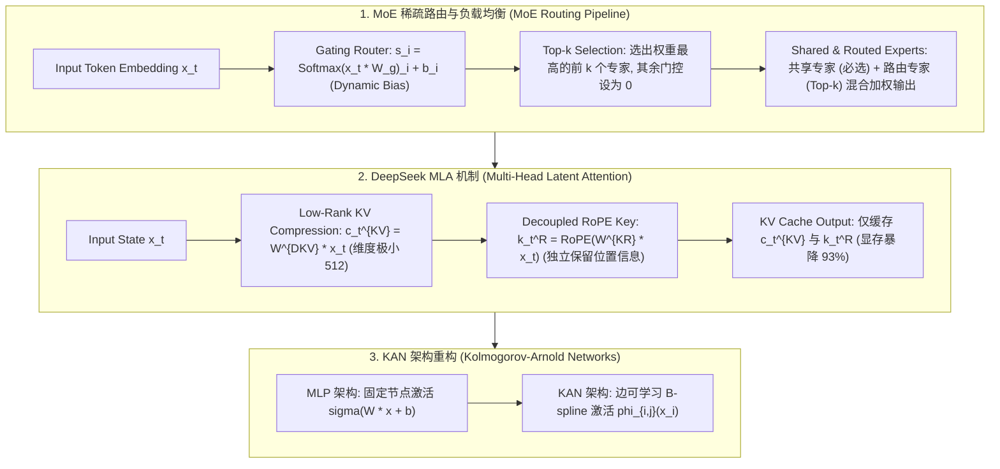

# 🌐 MoE 混合专家模型与 DeepSeek MLA/MTP/mHC 架构解构：Top-k 门控、无辅助损失均衡、低秩潜注意力与 KAN 剖析

> **核心摘要**：随着模型参数量迈向万亿关口，稠密 (Dense) 模型前向计算开销急剧飙升。**混合专家模型 (Mixture-of-Experts, MoE)** 通过将 FFN 全连接层替换为多个独立的专家网络，并由**门控路由 (Gating Router)** 对每个 Token 仅动态激活前 $k$ 个专家（如 256 个专家中激活 8 个），实现了**参数量提升数十倍而计算量 (FLOPs) 保持常数级**的突破。本指南深度拆解经典 MoE 的数学建模、**DeepSeek-V3/V4** 创新的**无辅助损失负载均衡 (Auxiliary-Loss-Free)**、**MLA (Multi-Head Latent Attention)** 93% 显存节省低秩压缩、**MTP (Multi-Token Prediction)** 多步预测，以及 **Kolmogorov-Arnold Networks (KAN)** 对传统 MLP 的范式重构。

---

## 💡 交互式 Mermaid 架构流程图



---

## 💡 经典面试追问与考点速查

* **考点 1**：详细推导经典 Switch Transformer 辅助负载均衡损失 $\mathcal{L}_{\text{aux}}$，并说明 DeepSeek 如何通过无辅助损失 (Aux-Loss-Free) 动态偏置实现负载均衡？
  * *标准回答*：
    1. **传统 Switch Transformer 辅助损失 $\mathcal{L}_{\text{aux}}$**：在 MoE 训练中，门控路由容易陷入**极化崩溃 (Collapse)**——绝大多数 Token 集中发送给极少数热门专家，导致其余专家饥饿且计算资源浪费。为此，引入辅助损失：
       $$\mathcal{L}_{\text{aux}} = \alpha \cdot N \sum_{i=1}^N f_i P_i$$
       其中 $N$ 为专家总数，$f_i = \frac{1}{T} \sum_{t=1}^T \mathbb{I}(\text{token } t \text{ routed to } i)$ 为路由到专家 $i$ 的 Token 实际比例，$P_i = \frac{1}{T} \sum_{t=1}^T P(x_t)_i$ 为门控输出的平均概率。当 $f_i$ 与 $P_i$ 均为均匀分布 $\frac{1}{N}$ 时，$\mathcal{L}_{\text{aux}}$ 取得极小值。
       * **缺陷**：惩罚过度会**损害模型本身的语言建模表现**（即限制了模型根据 Token 语义自主选择专家的能力）。
    2. **DeepSeek Auxiliary-Loss-Free 动态偏置**：**完全放弃在 Loss 中添加辅助项！** 门控计算修改为：
       $$G(x)_i = \text{TopK}(s_i + b_i, k), \quad \text{where } s_i = \text{Softmax}(x \cdot W_g)_i$$
       在训练过程中，根据各专家的实际负载动态监控：若专家 $i$ 的 Token 负载超过预设阈值，在下一 step **自适应减小偏置 $b_i$**；若专家 $i$ 负载不足，则**增大偏置 $b_i$**。偏置 $b_i$ 仅用于路由决策，不参与反向传播梯度更新！这既实现了 100% 完美负载均衡，又完全避免了 Auxiliary Loss 对主 Loss 梯度的干扰破坏。

  * *面试速答 (30 秒口述版)*: "结论: 传统 MoE 用辅助损失 L_aux 逼专家均衡,DeepSeek 改成动态偏置 b_i 直接调路由、完全不碰主损失。原理: 路由极化时多数 token 挤向少数热门专家、其他专家饿死;L_aux = α·N·Σf_i·P_i 在 f_i、P_i 都均匀时最小,但它会干扰主损失的语言建模;DeepSeek 在门控打分上加一个偏置——过载专家减偏置、欠载专家加偏置,偏置只影响路由、不参与梯度。例子: 256 个专家中某个专家负载超过 1.5 倍均值,就把它的 b_i 调低,下一批 token 自动分流,均衡可做到 100% 且主 loss 零损伤。"

* **考点 2**：DeepSeek MLA (Multi-Head Latent Attention) 如何通过低秩矩阵 $c_t^{\text{KV}}$ 压缩 KV Cache，并解决 RoPE 位置编码无法压缩的矛盾？
  * *标准回答*：
    * **KV Cache 显存痛点**：在长文本推理中，MHA 需要为每个 Token 缓存维度为 $2 \times n_h \times d_h$ 的 Key 和 Value 矩阵。对于 65B 模型，单 Token 需占用数 KB 显存，极限制约了 Batch Size。
    * **MLA 低秩 Latent 压缩**：将 Key 和 Value 联合投影压缩为一个维度极小的**低秩潜向量 $c_t^{\text{KV}} \in \mathbb{R}^{d_c}$**（如 $d_c = 512$）：
      $$c_t^{\text{KV}} = W^{\text{DKV}} x_t, \quad K_t^C = W^{\text{UK}} c_t^{\text{KV}}, \quad V_t^C = W^{\text{UV}} c_t^{\text{KV}}$$
      在推理部署时，显存中**只需缓存 $c_t^{\text{KV}}$**！在计算 Attention 时利用矩阵结合律 $(q W^{\text{UK}}) c_t^{\text{KV}}$ 离线吸收投影权重，从而直接在低秩空间点积！
    * **解决 RoPE 旋转位置编码冲突**：RoPE 位置编码具有强位置相关性，若直接作用于压缩后的 $c_t^{\text{KV}}$，矩阵结合律将被打破无法解压。MLA 巧妙设计了**解耦 RoPE 分支 (Decoupled RoPE)**——每个 Token 额外生成一个独立的低维位置 Key $k_t^R = \text{RoPE}(W^{\text{KR}} x_t)$。最终 Key 拼接为 $[K_t^C; k_t^R]$。既实现了 93% 的 KV Cache 显存暴降，又完美保留了旋转位置编码的能力！

  * *面试速答 (30 秒口述版)*: "结论: MLA 把每层的 K/V 先压缩成一个 512 维低秩潜向量再缓存,推理时只存 c_t^KV,并用解耦 RoPE 分支保住位置信息,KV cache 省约 93%。原理: 用矩阵结合律把解压权重 W^UK 吸收进 Query,点积直接在低秩空间算,不需要还原高维 K;RoPE 对位置敏感、没法塞进共享压缩投影,所以单独加一条低维位置 key 分支 k_t^R。例子: 65B 模型 MHA 每 token 要缓存几 KB 的 K/V,MLA 只缓存 512 维潜向量 + 小维度位置 key;DeepSeek-V3 的长上下文 batch 容量因此大幅提升。"

* **考点 3**：DeepSeek-V3/V4 的 MTP (Multi-Token Prediction) 训练目标与传统 Token-by-Token 自回归有何不同？推理阶段如何提速？
  * *标准回答*：
    * **训练目标变化**：传统自回归在位置 $t$ 仅预测下一个 Token $x_{t+1}$（即 $\mathcal{L} = -\log P(x_{t+1} | x_{\le t})$）。DeepSeek **MTP 模块** 在主主干模型之上追加了 $D$ 个串联的 MTP 预测头，要求模型在位置 $t$ **同时并行预测未来第 $t+1, t+2, \dots, t+D$ 个 Tokens**：
      $$\mathcal{L}_{\text{MTP}} = \mathcal{L}_{t+1} + \sum_{d=1}^D \lambda_d \mathcal{L}_{t+1+d}$$
      强迫模型学习更长远的前瞻表示 (Representation Ahead)，极大增强了模型的逻辑规划与代码合成能力。
    * **推理投机采样 (Speculative Decoding) 提速**：在推理部署阶段，可以将这 $D$ 个额外的 MTP 预测头用作**免费的草稿模型 (Draft Model)**——一次前向传播并行输出未来多个候选 Tokens，再通过主模型并行验证，将推理吞吐量提升 1.5 ~ 1.8 倍！

  * *面试速答 (30 秒口述版)*: "结论: MTP 让模型在位置 t 同时并行预测未来 D 个 token,训练强迫长程规划,推理时这些预测头免费充当投机采样的草稿模型。原理: 主干之上串 D 个浅层预测头,损失是各步损失的加权和,模型被迫学习'前瞻表示';推理时预测头一次并行猜出 D 个候选,主模型一次性并行验证,猜对就白赚生成速度。例子: DeepSeek-V3 用 MTP 后训练侧代码/长链推理增强,推理侧投机采样吞吐提升约 1.5-1.8 倍——草稿模型是免费的,不用像传统投机解码那样额外训练一个独立小模型。"

* **考点 4**：对比 Kolmogorov-Arnold Networks (KAN) 与传统 MLP 的理论基础：为什么 KAN 将激活函数放在边上 (Edges) 而非节点 (Nodes)？
  * *标准回答*：
    * **传统 MLP (基于通用近似定理 Universal Approximation Theorem)**：将线性权重 $W$ 放在边上（Edges），将固定非线性激活函数 $\sigma$（如 ReLU, GELU）放在节点上（Nodes）：$y = \sigma(W x + b)$。要提升表达能力必须依靠增加隐藏层宽度与深度。
    * **KAN (基于 Kolmogorov-Arnold 表示定理)**：定理证明任何多元连续函数都可以表示为单变量连续函数的有限次加法与复合：
      $$f(x_1, \dots, x_n) = \sum_{q=1}^{2n+1} \Phi_q \left( \sum_{p=1}^n \phi_{q,p}(x_p) \right)$$
    * **KAN 将可学习的 1D B-spline 样条曲线激活函数 $\phi_{i,j}(x)$ 直接放在边上 (Edges)**，节点（Nodes）仅做简单的加法求和 $\sum$。相比 MLP，KAN 拥有极强的**可解释性 (Symbolic Interpretability)**（可拟合精确的数学公式）与更高的拟合精度；但在高维大模型 Embedding 场景下，KAN 样条计算无法高效调用 GEMM CUDA 算子，计算开销高于同等参数量的 MLP。

  * *面试速答 (30 秒口述版)*: "结论: MLP 把固定激活放在节点、线性权重放在边;KAN 反过来,把可学习的 B-spline 激活放在边上、节点只做加法,理论依据是 Kolmogorov-Arnold 表示定理。原理: 该定理说任何多元连续函数都能分解成'一元函数的外层求和 + 内层一元函数',KAN 把这层分解直接参数化;好处是可解释性(能拟合出显式公式)和拟合精度,坏处是 B-spline 计算无法用 GEMM 加速,大模型里比 MLP 慢。例子: n 变量函数理论上 2n+1 个外层单元就够,小 KAN 能直接学出 f(x,y)=x²+sin(y) 这类显式公式,MLP 只能盲拟合,所以 KAN 适合科学计算,不适合万亿参数 LLM。"

* **考点 5**：在 MoE 模型分布式训练与推理中，专家并行 (Expert Parallelism, EP) 的 All-to-All 通信瓶颈如何解决？
  * *Standard Answer*：在专家并行 (EP) 中，不同专家分布在不同的 GPU 节点上。门控路由计算出每个 Token 对应的专家后，必须通过 **All-to-All 集合通信** 将 Token 向量跨节点发送给对应 GPU，专家计算完毕后再通过第二次 All-to-All 将结果发回。通信耗时常常占总耗时的 50% 以上。
  * **优化方案**：
    1. **通信与计算重叠 (Communication-Computation Overlapping)**：将一个 Batch 划分为多个 Micro-batches，当 Micro-batch $k$ 在进行 All-to-All 通信时，Micro-batch $k-1$ 在 GPU 上执行专家 GEMM 计算；
    2. **DeepSeek 双重通信重叠 (DualPipe)**：在前向与反向传播中精确重排跨节点 Dispatch / Combine 算子，实现接近 100% 的通信掩盖；
    3. **共享专家 (Shared Experts)**：保留 1~2 个总是激活的本地共享专家，承担基础语法语义计算，减少跨节点路由频次。

  * *面试速答 (30 秒口述版)*: "结论: EP 的 All-to-All 瓶颈靠三招解决——通信计算重叠、DualPipe 双管道调度、共享专家本地化。原理: All-to-All 要把 token 发给专家所在卡、算完再发回,通信常占一半以上时间;把 batch 切成 micro-batch,一块在通信时另一块在算 GEMM,让两者重叠;DeepSeek DualPipe 在前反向里精确重排 dispatch/combine 算子,把通信几乎完全掩盖;再留 1-2 个共享专家处理通用语义,减少跨卡流量。例子: 8 卡 EP 下,无重叠时通信占 50%+;DualPipe 重叠后通信占比降到 10% 以内,训练吞吐接近线性扩展,这是 MoE 能千卡训练的基础。"

---

## 📚 第一章：MoE 与 DeepSeek 架构技术矩阵

### 1.1 关键架构对比表

| 架构技术 | 提出模型 | 核心问题 / 解决痛点 | 数学创新 / 算法逻辑 | 推理 / 训练收益 |
| :--- | :--- | :--- | :--- | :--- |
| **Aux-Loss-Free MoE** | DeepSeek-V3/V4 | 传统辅助损失损毁主 Loss | 动态偏置自适应调节 $s_i + b_i$ | 100% 负载均衡，无精度损耗 |
| **MLA (Latent Attention)**| DeepSeek-V2/V3 | 传统 MHA 显存爆炸 | 低秩潜向量 $c_t^{\text{KV}}$ + 解耦 RoPE $k_t^R$ | KV Cache 显存暴降 **93%** |
| **MTP (Multi-Token)** | DeepSeek-V3 | 单 Token 预测缺乏长远规划 | 串联预测头 $\sum_{d=1}^D \mathcal{L}_{t+1+d}$ | 增强长链推理，投机采样提速 1.8x |
| **mHC (Hyper-Conn)** | DeepSeek-V4 | 超深网络残差梯度退化 | Sinkhorn 投影生成双重随机 Markov 矩阵 | 稳定千层极深网络训练梯度 |
| **KAN Networks** | KAN (2024) | MLP 缺乏可解释性 | 边上可学习 B-spline 样条激活 $\phi_{i,j}(x)$ | 强符号可解释性，小模型拟合高 |

读表技巧: 这是 DeepSeek 技术栈的"功劳簿"——每行是一个"问题 + 数学创新"对子。面试被问到 DeepSeek 就按行讲: 负载均衡→动态偏置,显存爆炸→MLA,单步短视→MTP,超深梯度退化→mHC。

> 💡 **直观理解**: 这些技术的共同主题是"省"和"稳": MoE 省算力(只激活 top-k 专家)、MLA 省显存(只缓存潜向量)、MTP 省推理时间(投机采样)、mHC 保稳定性(千层残差)、KAN 换可解释性。每个技术记成"痛点→解法"对子,面试就不容易忘。
>
> 🎤 **面试速答**: "结论: DeepSeek 五件套——Aux-Loss-Free 动态偏置(负载均衡)、MLA(KV 显存省 93%)、MTP(训练前瞻 + 投机采样 1.8x)、mHC(超深网络稳定)、外加 KAN 作为 MLP 的可解释替代。原理: 每项解决一个具体工程痛点: MLA 靠低秩潜向量 + 解耦 RoPE,MTP 靠并行预测头当免费草稿模型,mHC 靠 Sinkhorn 双重随机投影稳定残差。例子: DeepSeek-V3 总参 671B、激活仅 37B,配 MLA 后 8K 上下文 batch=32 的 KV cache 仅约 86GB,这套组合是 2025 年开源 LLM 效率的标杆。"

---

## ⚡ 第二章：MoE 门控路由与 MLA 潜向量推导

### 2.1 DeepSeek MLA 投影与 Attention 结合律推导

这节的推导只有一步关键操作——**矩阵吸收 (Absorption)**: 把解压权重 $W^{\text{UK}}$ 挪到 Query 那边,先算 $q_t^{\text{absorbed}} = q_t^C W^{\text{UK}}$,再与潜向量 $c_j^{\text{KV}}$ 点积。这样推理时根本不需要把 $K_j^C$ 解压回高维,缓存里那份 512 维潜向量直接参与计算。

对于 Query $q_t$ 与解耦的 KV 压缩向量 $c_j^{\text{KV}}$，Attention Score 计算如下：
$$q_t^C = W^{\text{DQ}} x_t, \quad q_t^R = \text{RoPE}(W^{\text{QR}} x_t)$$
$$S_{t, j} = \frac{1}{\sqrt{d}} \left( q_t^C K_j^C + q_t^R k_j^R \right) = \frac{1}{\sqrt{d}} \left( (q_t^C W^{\text{UK}}) c_j^{\text{KV}} + q_t^R k_j^R \right)$$
在离线阶段预先计算矩阵乘法 $q_t^{\text{absorbed}} = q_t^C W^{\text{UK}} \in \mathbb{R}^{d_c}$，随后点积直接在维度仅为 $d_c$ 的低秩潜空间展开，省去解压 Key 矩阵的显存和计算！

> 💡 **直观理解**: 核心思想是"先乘小矩阵,再点积": 原本要缓存高维 K/V,现在只缓存低维潜向量,计算时用结合律把"解压"这个动作转移给 Query 提前做掉。注意公式里 RoPE 那一支 $q_t^R k_j^R$ 是独立相加的——因为位置信息没法塞进低秩压缩,必须单独走一条小路。
>
> 🎤 **面试速答**: "结论: MLA 的注意力分数 = (吸收后的 Query)·潜向量 + 位置分支,靠矩阵结合律在低秩空间完成计算。原理: 缓存里只有 $c_j^{\text{KV}}$(512 维),Query 先乘解压权重 $W^{\text{UK}}$ 再点积,避免解压高维 K;RoPE 位置信息用独立分支 $k_t^R$ 保留。例子: 假设 8 头、头维 128,传统 KV 每 token 缓存 2048 维;MLA 只缓存 512 维潜向量 + 一个小维度位置 key,缓存量下降约 93%,这就是 DeepSeek 长上下文成本低的来源。"

---

## 🐍 第三章：Pure Numpy 手写 MoE 动态偏置 Router 与 MLA 算子

下面的 Router 用 30 行复现 Auxiliary-Loss-Free 的核心闭环: softmax 打分 → 加动态偏置选 Top-k → 用本批被选中的统计更新偏置(过载减、欠载加)。注意 `topk_weights` 取的是**原始 softmax 概率**而不是加偏置后的值——偏置只决定"选谁",不影响"权重多少"。

```python
import numpy as np

class PureNumpyAuxLossFreeMoERouter:
    """ Pure Numpy 实现 DeepSeek Auxiliary-Loss-Free 动态偏置 MoE 门控路由 """
    def __init__(self, d_model: int, num_experts: int = 8, top_k: int = 2, bias_update_rate: float = 0.1):
        self.d_model = d_model
        self.num_experts = num_experts
        self.top_k = top_k
        self.bias_update_rate = bias_update_rate
        
        self.W_g = np.random.randn(d_model, num_experts) * 0.02
        self.biases = np.zeros(num_experts)  # 可变动态偏置 b_i
        
    def route(self, x: np.ndarray) -> tuple[np.ndarray, np.ndarray]:
        """
        Input x: shape [batch_size, d_model]
        Returns: (topk_weights, topk_indices)
        """
        batch_size = x.shape[0]
        # 1. 基础软最大化打分
        raw_logits = x @ self.W_g
        scores = np.exp(raw_logits - np.max(raw_logits, axis=-1, keepdims=True))
        scores = scores / np.sum(scores, axis=-1, keepdims=True)
        
        # 2. 注入动态偏置选择 Top-k: s_i + b_i
        biased_scores = scores + self.biases
        topk_indices = np.argsort(biased_scores, axis=-1)[:, -self.top_k:][:, ::-1]
        
        # 3. 提取 Top-k 原始概率并重新归一化
        topk_weights = np.take_along_axis(scores, topk_indices, axis=-1)
        topk_weights = topk_weights / np.sum(topk_weights, axis=-1, keepdims=True)
        
        # 4. 统计更新动态偏置 b_i (模拟负载均衡反向调节)
        expert_counts = np.bincount(topk_indices.flatten(), minlength=self.num_experts)
        target_count = (batch_size * self.top_k) / self.num_experts
        # 超额则减小 b_i，不足则增大 b_i
        self.biases -= self.bias_update_rate * (expert_counts - target_count) / target_count
        
        return topk_weights, topk_indices


# ==================== 测试验证 ====================
if __name__ == "__main__":
    np.random.seed(42)
    batch_size, d_model = 32, 128
    router = PureNumpyAuxLossFreeMoERouter(d_model, num_experts=8, top_k=2)
    
    x_dummy = np.random.randn(batch_size, d_model)
    weights, indices = router.route(x_dummy)
    
    print("✅ DeepSeek Aux-Loss-Free MoE 门控路由测试完成！")
    print("前 3 个 Token 的选定专家 Index:\n", indices[:3])
    print("前 3 个 Token 的归一化路由权重:\n", np.round(weights[:3], 4))
    print("更新后的专家动态偏置 Biases:\n", np.round(router.biases, 4))
```

> 💡 **直观理解**: 代码里最重要的三处: `biased_scores = scores + self.biases` 是路由决策;`expert_counts = np.bincount(...)` 统计本批每个专家被选中几次;`self.biases -= rate × (counts - target)/target` 是负载均衡的闭环——哪个专家超额就自动降温。偏置更新完全发生在 router 内部、不进反向传播,这正是"无辅助损失"的含义。
>
> 🎤 **面试速答**: "结论: Aux-Loss-Free Router 三步——打分、加偏置选 Top-k、按负载差更新偏置,循环收敛到均衡。原理: 偏置是路由的调节旋钮,过载专家被调低、欠载专家被调高,且不参与梯度;Top-k 权重仍用原始概率,保证输出分布不被偏置污染。例子: 8 专家、top-k=2、batch=32 时每个专家目标负载 8 个 token;某专家被选了 12 次,偏置就下调约 0.1×(12-8)/8=0.05,下一批自然少选它——几个 step 内就能达到 100% 均衡。"

---

## 🚀 总结与工程最佳实践

1. **MoE 路由选型**：全面抛弃传统的 Switch Transformer 辅助损失 $\mathcal{L}_{\text{aux}}$，改用 DeepSeek **Auxiliary-Loss-Free 动态偏置调节**，实现无损害的 100% 负载均衡；
2. **长文本 Attention 架构**：生产环境部署强烈推荐 **DeepSeek MLA (Multi-Head Latent Attention)**，通过低秩 $c_t^{\text{KV}}$ 压缩结合解耦 RoPE，斩获 93% 的 KV Cache 显存节省；
3. **分布式算子优化**：工程实施必须重叠 Expert Parallelism (EP) 的 All-to-All 通信与专家 GEMM 计算，消除通信瓶颈。