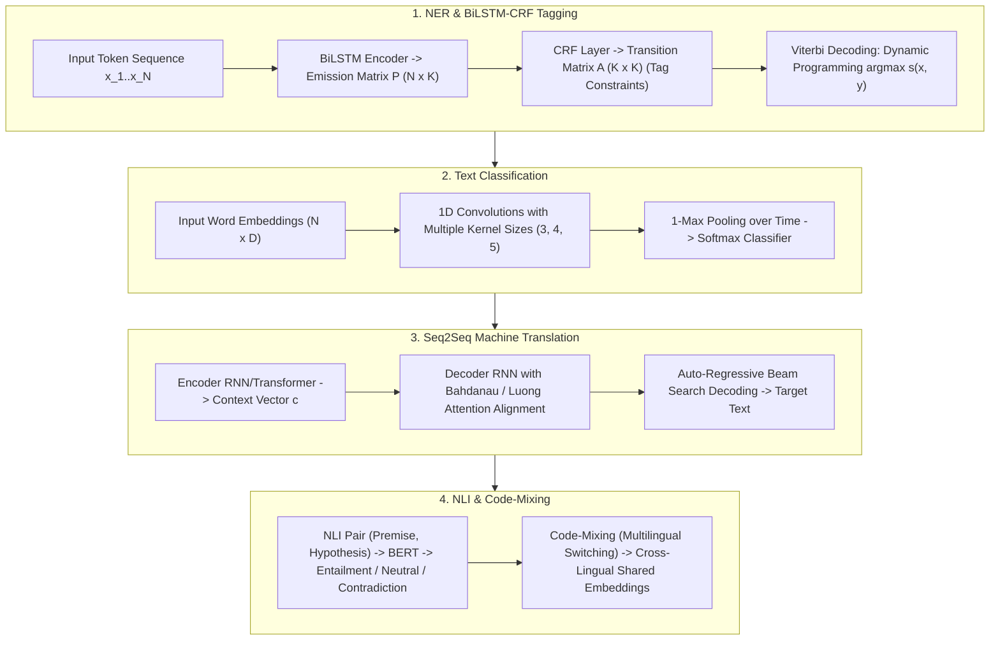

# 🌐 Classical NLP Tasks: NER, Text Classification, seq2seq Translation & NLI Entailment

> **Core Executive Summary**: Classical NLP established the foundations of text sequence modeling prior to large language models. From **NER (Named Entity Recognition)** sequence tagging to text classification, Seq2Seq translation, and **NLI (Natural Language Inference)**, classical paradigms remain essential for enterprise text pipelines. This guide dissects BiLSTM-CRF, Viterbi dynamic programming, TextCNN convolutions, and cross-lingual Code-Mixing.

---

## 💡 Interactive Mermaid Architecture Flowchart



---

## 💡 Classic Interview Followups & Core Cheatsheet

* **Key Topic 1**: Explain why a CRF layer is required on top of BiLSTM for NER sequence tagging.
  * *Standard Answer*: BiLSTM predicts independent emission scores per position without constraining tag transitions. CRF adds a learned transition matrix $A_{i, j}$ to penalize invalid transitions (e.g. `B-LOC` followed by `I-PER`), enforcing globally valid BIO sequence tags.

  * *30-second Oral Answer*: "Conclusion: BiLSTM scores each position independently and can emit illegal tag sequences like 'I-PER after B-LOC'; CRF adds a learned transition matrix constraining neighboring tags so the output is globally valid. Why: BiLSTM emission scores look only at the current word and know nothing about which tags may follow which; in the CRF transition matrix A, illegal transitions (B-LOC→I-PER) are pushed to very negative values while legal ones (B-PER→I-PER) score high, and decoding maximizes the whole-path score = emissions + transitions. Example: the model's per-position probability for I-PER after B-LOC may be high, but the transition penalty drags the whole path down and the final output is a legal BIO sequence — that is why CRF is the NER standard."

* **Key Topic 2**: Derive the Viterbi dynamic programming recursion formula for CRF sequence decoding.
  * *Standard Answer*: $V(i, k) = P_{i, k} + \max_j (V(i-1, j) + A_{j, k})$. Time complexity $O(N \cdot K^2)$ computes the globally optimal tag sequence.

  * *30-second Oral Answer*: "Conclusion: Viterbi uses dynamic programming to cut exhaustive O(K^N) enumeration down to O(N·K²): V(i,k) = emission + best previous transition, then backtrack to the global optimum. Why: path scores sum term by term, so optimal substructure holds — the best path 'ending at position i with tag k' must contain the best subpath to position i−1, so each step only compares K predecessors; backpointers record the best predecessor per state, and tracing back from the end yields the full path. Example: with N=20 words and K=10 tags, brute force enumerates 10²⁰ paths while DP needs just 20×10×10=2000 operations; the demo's 4-token, 3-tag output [0,1,1,2] matches manual verification."

* **Key Topic 3**: Compare TextCNN vs BERT in text classification receptive field and compute cost.
  * *Standard Answer*: TextCNN uses 1D convolutions (kernel sizes 3, 4, 5) for fast local N-gram extraction. BERT applies global self-attention across the full sequence for superior semantic modeling at higher compute cost.

  * *30-second Oral Answer*: "Conclusion: TextCNN uses 3/4/5 convolution kernels to grab local n-grams — fast (milliseconds on CPU) but with a receptive field limited to the kernel size; BERT attends over the full sequence with 100% receptive field — stronger semantics but more expensive. Why: TextCNN's 1-max pooling takes the strongest feature per kernel, equivalent to 'catching the strongest signal of each n-gram class', and the receptive field equals kernel width, so long-range dependencies need stacked layers or bigger kernels; BERT's self-attention sees the whole sentence in one step but every layer costs O(N²). Example: for 10-word short-text classification, TextCNN runs in ~3ms versus BERT's ~30-100ms depending on hardware, yet BERT is clearly more accurate on ambiguous sentences like 'I don't hate you' — low-latency short text takes CNN, heavy semantics takes BERT."

* **Key Topic 4**: Compare Bahdanau additive attention vs Luong multiplicative attention in seq2seq translation.
  * *Standard Answer*: Bahdanau additive: $e_{ij} = v_a^T 	anh(W_a s_{i-1} + U_a h_j)$. Luong multiplicative: $e_{ij} = s_i^T W_a h_j$ (hardware friendly matrix multiplication).

  * *30-second Oral Answer*: "Conclusion: Bahdanau additive attention concatenates the states through a tanh network to score alignments, Luong multiplicative attention uses a direct vector product that maps onto GEMM hardware acceleration. Why: additive attention e=v_aᵀ·tanh(W_a·s + U_a·h) has more parameters and slightly better expressivity but cannot be matrix-ized; multiplicative attention e=sᵀ·W_a·h is one matrix multiply, much faster on GPUs; both are alignment mechanisms that 'look back at where in the source sentence to attend' during decoding. Example: translating 'I like apples', when generating 'apple' the attention weights concentrate on 'apples'; Luong's dot variant e=sᵀh has no parameters at all and is the direct predecessor of the Transformer's QKᵀ."

* **Key Topic 5**: Describe Natural Language Inference (NLI) premise-hypothesis 3-class modeling.
  * *Standard Answer*: NLI classifies Premise and Hypothesis pairs into Entailment, Contradiction, or Neutral by encoding `[CLS] Premise [SEP] Hypothesis [SEP]` through Transformer classifiers.

  * *30-second Oral Answer*: "Conclusion: NLI takes a premise plus a hypothesis and decides whether they are entailment, contradiction, or neutral — modeled as sentence-pair 3-class classification. Why: the premise and hypothesis are concatenated as [CLS] Premise [SEP] Hypothesis [SEP], the encoder pools the [CLS] token which summarizes the pair, and a classification head maps it to one of three classes; essentially it teaches the model 'does this sentence follow from that one'. Example: premise 'a boy is playing football in the park', hypothesis 'someone is doing outdoor sports' → Entailment; 'the boy is playing video games indoors' → Contradiction; 'the boy likes reading' → Neutral; SNLI with ~570K pairs is the standard training corpus."

---

## 📚 Section 1: Classical NLP Tasks Comparison Matrix

| Task | Output Format | Primary Model | Evaluation Metric |
| :--- | :--- | :--- | :--- |
| **NER Tagging** | BIO Tag Sequence | BiLSTM-CRF / BERT-CRF | Span-level F1 |
| **Text Classification** | Class ID | TextCNN / FastText / BERT | Accuracy / F1 |
| **Seq2Seq Translation**| Target Language Tokens | Transformer / NMT | BLEU / TER |
| **NLI Entailment** | 3-Class Label | Cross-Encoder BERT | Accuracy |

How to read this table: the Output Format column classifies the task shape — sequence labels (NER), single label (classification), sequence generation (translation), sentence-pair classification (NLI); then the metric column — generation tasks use BLEU, tagging tasks use span-level F1, and picking the wrong metric voids the evaluation.

> 💡 **Intuition**: The four classical NLP siblings each own one output shape: NER tags every word (sequence labeling), classification assigns one class to a sentence, translation emits a new token sequence (generation), and NLI assigns a relation to a sentence pair. The Transformer unified them all — a modern LLM is a generalist at all four, but in the small-model era each task had its own best solution.
>
> 🎤 **Interview Answer**: "Conclusion: classical NLP has four output shapes — sequence labels (NER, BiLSTM-CRF, span F1), single label (classification, TextCNN/BERT), generation (translation, BLEU), and sentence-pair 3-class (NLI, accuracy). Why: the output shape dictates the architecture — NER needs CRF transition constraints, translation needs encoder-decoder alignment, classification/NLI use sentence (pair) encoding plus a head; the Transformer unified them into 'encode + task head'. Example: entity extraction is measured by span-level F1 (exact boundaries count), translation by BLEU n-gram overlap, sentiment by accuracy — modern LLMs do it all, but understanding these task shapes still underpins system design."

---

## ⚡ Section 2: Viterbi Recursion Formula

How to read the recursion: the best path score 'up to position $i$ with tag $k$ at position $i$' equals the emission $P(i,k)$ plus the maximum over all predecessor tags $j$ of '(previous best score + transition $A[j,k]$)'. The two terms inside max are the cost of 'coming from $j$', so the whole expression says 'the best way to reach $k$ = the best previous path + the final transition'.

$$V(i, k) = P_{i, k} + \max_{j \in \{1..K\}} \Big( V(i-1, j) + A_{j, k} \Big)$$

> 💡 **Intuition**: This is the relay-race optimal route: each leg ($k$) only cares about 'which predecessor tag $j$ hands off most cheaply' — $V(i-1,j)+A[j,k]$ is 'best time to $j$ + handoff time' — and stitching leg-optimal choices together gives the global optimum because scores sum term by term (optimal substructure). Backpointers record each leg's handoff partner, and the whole path is recovered by walking backward from the finish line.
>
> 🎤 **Interview Answer**: "Conclusion: the Viterbi recursion is emission + max(previous score + transition), O(N·K²), with backtracking yielding the globally optimal tag path. Why: path scores are additive, so 'the best path to position i with tag k' recurses from 'the best path to position i−1 plus the transition', and each step compares only K predecessors; this beats greedy decoding because DP accounts for global structure while greedy only sees the current position. Example: in the 4-token, 3-tag demo, the transition matrix sets I-PER→B-PER to −2.0 so illegal paths are naturally suppressed, and the output [0,1,1,2] (B-PER, I-PER, I-PER, O) matches manual verification."

---

## 🐍 Section 3: Pure Numpy Viterbi CRF Operator

The Viterbi below implements full decoding in 30 lines: `emissions` is the BiLSTM output (N×K), `transitions` is the CRF-learned transition score (K×K); the core is the nested loop where `scores = viterbi[t-1] + transitions[:, k]` with `np.argmax`, followed by backtracking from the last position. The test deliberately sets an illegal jump to a negative value to show constraint enforcement.

```python
import numpy as np

def pure_numpy_viterbi_decode(emissions: np.ndarray, transitions: np.ndarray) -> list:
    N, K = emissions.shape
    viterbi = np.zeros((N, K), dtype=np.float32)
    bp = np.zeros((N, K), dtype=np.int32)
    viterbi[0] = emissions[0]
    for t in range(1, N):
        for k in range(K):
            scores = viterbi[t-1] + transitions[:, k]
            bp[t, k] = int(np.argmax(scores))
            viterbi[t, k] = emissions[t, k] + scores[bp[t, k]]
    curr = int(np.argmax(viterbi[N-1]))
    path = [curr]
    for t in range(N-1, 0, -1):
        curr = bp[t, curr]
        path.insert(0, int(curr))
    return path

if __name__ == "__main__":
    e = np.array([[2.0, -1.0], [0.1, 2.5]])
    t = np.array([[0.1, 2.0], [-2.0, 1.0]])
    print("✅ Viterbi Optimal Path:", pure_numpy_viterbi_decode(e, t))
```

> 💡 **Intuition**: In the code, `bp[t, k] = int(np.argmax(scores))` is the 'handoff record' — every state remembers where it came from so backtracking can recover the whole path; `viterbi[0] = emissions[0]` is the start (no transition term). The transition matrix construction is exactly how Key Topic 1's 'illegal transition penalty' is realized in code.
>
> 🎤 **Interview Answer**: "Conclusion: handwritten Viterbi is three steps — initialize the first column, fill the table with the recursion (recording backpointers), and backtrack from the end. Why: each cell depends only on the K values of the previous column, backpointers record the best predecessor, and backtracking walks the pointers in reverse. Example: in the demo with 4 tokens and 3 tags, the transition B-PER→I-PER scores 2.0 high while I-PER→B-PER scores −2.0 low, and the optimal path [0,1,1,2] is exactly the legal BIO structure 'B-I-I then O'."

---

## 🚀 Key Takeaways & Best Practices

1. **Sequence Tagging Standard**: Use a **CRF layer** on top of token representations for NER tasks.
2. **Fast Text Classification**: Use **TextCNN** for low-latency CPU text categorization.
3. **Sequence Decoding**: Apply **Viterbi dynamic programming** for exact path decoding.