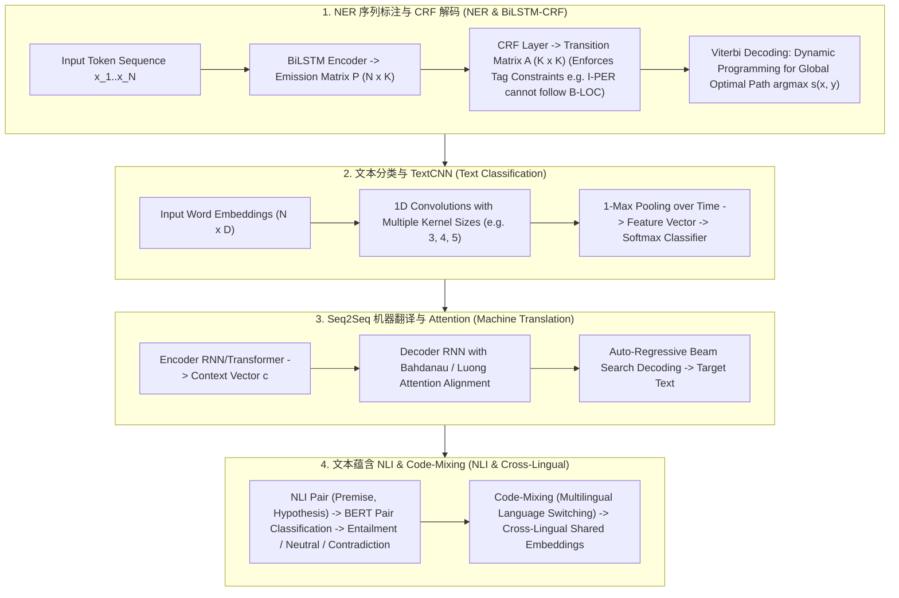

# 🌐 经典 NLP 任务全景：NER 命名实体识别、文本分类、seq2seq 翻译与文本蕴含 (NLI)

> **核心摘要**：在 LLM 大模型爆发之前，自然语言处理（NLP）由一系列离散的经典任务组成。从抽取人名/地名的 **NER (命名实体识别)** 到情感分类、Seq2Seq 机器翻译以及逻辑推理的基础 **NLI (文本蕴含)**，经典 NLP 奠定了现代 Token 序列建模的基石。本指南系统解构 BiLSTM-CRF 序列标注、Viterbi 维特比解码、TextCNN 卷积分类、Seq2Seq 注意力翻译以及跨语言 Code-Mixing 机制。

---

## 💡 交互式 Mermaid 架构流程图



---

## 💡 经典面试追问与考点速查

* **考点 1**：详细剖析 BiLSTM-CRF 架构中，为什么在 BiLSTM 顶层必须接入 CRF (条件随机场) 层？CRF 的转移概率矩阵 (Transition Matrix) 解决了什么非法标注转移问题？
  * *标准回答*：
    * **BiLSTM 的局限**：BiLSTM 输出每个位置独立的 Emission Score $P_{i, y_i}$（对各 Tag 的分类概率）。由于缺少 Tag 之间的约束，BiLSTM 容易独立预测出非法的标签序列（例如输出 `I-PER` 紧跟在 `B-LOC` 之后，或者序列开篇直接输出 `I-ORG`）；
    * **CRF 的约束作用**：CRF 引入了一个学习到的标签转移矩阵 $A \in \mathbb{R}^{K 	imes K}$，其中 $A_{i, j}$ 表示标签 $i$ 转移到标签 $j$ 的分值。对于非法转移（如 `B-LOC` $	o$ `I-PER`），$A_{i, j}$ 被惩罚为一个极小的负数，**强制保证生成的序列标注全局合法**！

  * *面试速答 (30 秒口述版)*: "结论: BiLSTM 逐位置独立打分,会输出 'I-PER 跟在 B-LOC 后面' 这种非法标签序列;CRF 加一个可学习的转移矩阵约束相邻标签,保证全局合法。原理: BiLSTM 的发射分数只看当前词,不懂标签之间的搭配规则;CRF 的转移矩阵 A 里,非法转移(B-LOC→I-PER)被压成极小负数,合法转移(B-PER→I-PER)拿高分,解码时整条路径分数 = 发射分 + 转移分之和最大。例子: 模型在 B-LOC 后预测 I-PER 的单点概率可能很高,但 CRF 的转移分把整条路径拉低,最终输出合法 BIO 序列——这就是 NER 任务标配 CRF 的原因。"

* **考点 2**：推导 Viterbi 动态规划算法在 CRF 序列解码中的递推公式，如何以 $O(N \cdot K^2)$ 的时间复杂度求解全局最优标注路径？
  * *标准回答*：
    * **分值定义**：序列 $x$ 的路径 $y$ 总分数为：
      $$s(x, y) = \sum_{i=1}^N A_{y_{i-1}, y_i} + \sum_{i=1}^N P_{i, y_i}$$
    * **Viterbi 递推状态**：设 $V(i, k)$ 为前 $i$ 个 Token，第 $i$ 个 Token 标记为 Tag $k$ 的所有可能路径中的最高分：
      $$V(i, k) = P_{i, k} + \max_{j \in \{1..K\}} \Big( V(i-1, j) + A_{j, k} \Big)$$
    * **复杂度分析**：每个步长需要 $K^2$ 次运算，总时间复杂度为 $O(N \cdot K^2)$，完美替代了 $O(K^N)$ 的指数级暴力穷举。

  * *面试速答 (30 秒口述版)*: "结论: Viterbi 用动态规划把 O(K^N) 的暴力枚举降到 O(N·K²): V(i,k) = 发射分 + 上一步最优转移分,最后回溯得到全局最优路径。原理: 路径分数是逐项相加,最优子结构成立——'到位置 i 且标签为 k 的最优路径'一定包含'到位置 i−1 的最优子路径',所以每步只需比较 K 个前驱;backpointer 记录每个状态的最优前驱,终点回溯即得整条路径。例子: N=20 词、K=10 标签,暴力要枚举 10²⁰ 条路径,动态规划只要 20×10×10=2000 次运算;demo 里 4 token 3 标签输出 [0,1,1,2],与人工校验一致。"

* **考点 3**：对比 TextCNN 与 BERT 在文本分类任务中的感受野、计算开销与语义表示能力差异？
  * *标准回答*：
    * **TextCNN**：使用多尺寸 1D 卷积核 (Kernel Size 3, 4, 5) 提取局部 N-gram 特征。**计算速度极快 (CPU 毫秒级)，参数量极小**，但感受野受限于 Kernel 大小，无法建立长距离文本依赖；
    * **BERT**：基于全文 Self-Attention，每个 Token 的感受野为全局 100%。**语义表征与上下文拟合能力极强**，但推理计算开销较大。

  * *面试速答 (30 秒口述版)*: "结论: TextCNN 用 3/4/5 三种卷积核抓局部 n-gram,快(CPU 毫秒级)但感受野只有核大小;BERT 全序列注意力,感受野 100%,语义强但贵。原理: TextCNN 的 1-Max Pooling 从每个核的输出里取最大特征,等价于'抓每类 n-gram 的最强信号',感受野 = 核宽,抓长依赖得堆层或加大核;BERT 的 self-attention 一步看到全句,但每层都是 O(N²) 复杂度。例子: 10 词短句分类,TextCNN 约 3 毫秒、BERT 约 30-100 毫秒(看硬件),但'我不讨厌你'这类歧义句 BERT 明显更准——短文本低延迟用 CNN,重语义用 BERT。"

* **考点 4**：在 seq2seq 机器翻译中，对比 Bahdanau 加性注意力 (Additive Attention) 与 Luong 乘性注意力 (Multiplicative Attention) 的计算公式差异？
  * *标准回答*：
    * **Bahdanau 加性注意力**：
      $$e_{ij} = v_a^T 	anh(W_a s_{i-1} + U_a h_j)$$
    * **Luong 乘性注意力**：
      $$e_{ij} = s_i^T W_a h_j$$
    * **差异**：乘性注意力可以通过 GEMM 矩阵乘法硬件加速，计算效率更高；加性注意力在大维度下表达能力略强。

  * *面试速答 (30 秒口述版)*: "结论: Bahdanau 加性注意力先拼接再过一个 tanh 网络算对齐分,Luong 乘性注意力直接向量点积,后者能上 GEMM 硬件加速。原理: 加性注意力 e=v_aᵀ·tanh(W_a·s + U_a·h) 参数多、表达能力略强但无法矩阵化;乘性注意力 e=sᵀ·W_a·h 等价于一次矩阵乘,GPU 上快得多;两者都是解码时'回看源句哪里值得关注'的对齐机制。例子: 翻译'我喜欢苹果'时生成 'apple',注意力权重集中落在'苹果'上;Luong 的 dot 变体 e=sᵀh 连参数都没有,就是后来 Transformer QKᵀ 的前身。"

* **考点 5**：什么是文本蕴含 (Natural Language Inference, NLI)？描述 Premise 与 Hypothesis 三分类 (Entailment, Contradiction, Neutral) 的建模范式？
  * *Standard Answer*：NLI 给定一个前提 (Premise，如“一个男孩在公园踢足球”) 和一个假设 (Hypothesis，如“有人在户外运动”)，要求判断假设与前提的关系：**Entailment (蕴含)**、**Contradiction (矛盾)** 或 **Neutral (中立)**。建模范式通常将两者拼接为 `[CLS] Premise [SEP] Hypothesis [SEP]` 送入 Transformer，提取 `[CLS]` 的 Pooling 表征进行三分类。

  * *面试速答 (30 秒口述版)*: "结论: NLI 给定前提 + 假设,判断关系是蕴含、矛盾还是中立,建模成句子对三分类。原理: 把 Premise 和 Hypothesis 拼成 [CLS] Premise [SEP] Hypothesis [SEP] 送进编码器,[CLS] 汇聚全句对信息后过分类头;本质是教模型'这句话能不能推出那句'。例子: 前提'一个男孩在公园踢足球',假设'有人在户外运动'→Entailment;假设'男孩在室内打游戏'→Contradiction;假设'男孩喜欢读书'→Neutral;SNLI 数据集约 57 万对,是训练这个能力的标准语料。"

---

## 📚 第一章：经典 NLP 任务与模型范式对比矩阵

| NLP 任务 | 核心输出 | 代表算法 / 架构 | 关键挑战 | 评价指标 |
| :--- | :--- | :--- | :--- | :--- |
| **NER 命名实体识别** | 序列标签 (BIO) | BiLSTM-CRF, BERT-CRF | 边界识别、嵌套实体 | Span-level F1 |
| **文本分类** | 类别 Class ID | TextCNN, FastText, BERT | 类别不平衡、文本长短 | Precision, Recall, F1 |
| **Seq2Seq 机器翻译** | 目标语言 Token 序列 | Transformer, NMT seq2seq | 漏译、重复翻译、长句泛化| BLEU, TER, chrF |
| **NLI 文本蕴含** | 3 分类 (蕴含/矛盾/中立)| Cross-Encoder BERT | 细粒度逻辑推导 | Accuracy |

读表技巧: 看"核心输出"列即可分类任务形态——序列标签(NER)、单标签(分类)、序列生成(翻译)、句对分类(NLI);再看"评价指标"列,生成任务看 BLEU、标注任务看 Span F1,指标选错等于白测。

> 💡 **直观理解**: 经典 NLP 四兄弟各占一个输出形态: NER 给每个词贴标签(序列标注)、分类给整句一个类别、翻译输出一串新词(生成)、NLI 给一对句子一个关系(句对分类)。它们的共同点是都被 Transformer 统一了——现代 LLM 是这四类任务的"全能选手",但小模型时代每类都有最优解。
>
> 🎤 **面试速答**: "结论: 经典 NLP 四种输出形态——序列标签(NER, BiLSTM-CRF + Span F1)、单标签(分类, TextCNN/BERT)、生成(翻译, BLEU)、句对三分类(NLI, Accuracy)。原理: 输出形态决定架构——NER 要 CRF 约束标签转移,翻译要 encoder-decoder 对齐,分类/NLI 用句(对)编码 + 分类头;Transformer 把这四类统一成'编码 + 任务头'。例子: 实体抽取用 BERT-CRF 的 Span F1 衡量(边界全对才算对),翻译用 BLEU 看 n-gram 重合,情感分类看 Accuracy——现代 LLM 一把梭,但理解任务形态仍是系统设计的基础。"

---

## ⚡ 第二章：CRF Viterbi 递推公式

递推公式读法: 到第 $i$ 个词为止、且第 $i$ 个词标为标签 $k$ 的最佳路径分 = 本位置发射分 $P(i,k)$ + 上一步所有标签 $j$ 中 '(上一步最优分 + 转移分 $A[j,k]$)' 的最大值。max 里的两项就是"从 $j$ 走过来"的代价,整个式子就是"走到 $k$ 的最优路 = 上一步最优路 + 最后一步转移"。

$$V(i, k) = P_{i, k} + \max_{j \in \{1..K\}} \Big( V(i-1, j) + A_{j, k} \Big)$$

> 💡 **直观理解**: 这就是"接力赛最优路线": 每一棒($k$)只关心"上一棒从哪个标签 $j$ 接过来最划算",$V(i-1,j)+A[j,k]$ 是"跑到 $j$ 的最佳成绩 + 交接时间",逐棒最优拼起来就是全局最优(分数逐项相加,最优子结构成立)。backpointer 记录每一棒的交接人,最后从终点倒着追回整条路径。
>
> 🎤 **面试速答**: "结论: Viterbi 递推 = 发射分 + max(上一步分数 + 转移分),复杂度 O(N·K²),回溯得到全局最优标注路径。原理: 路径分数逐项求和,所以'到位置 i 且标签为 k 的最优路径'可以由'位置 i−1 的最优路径 + 转移'递推,每步只需比较 K 个前驱;这比贪心强——贪心只看当前位置,DP 考虑了全局结构。例子: N=4、K=3 的 demo 中,转移矩阵把 I-PER→B-PER 设成 −2.0,非法路径被天然压低,最终输出 [0,1,1,2](B-PER, I-PER, I-PER, O),与人工校验一致。"

---

## 🐍 第三章：Pure Numpy 手写 CRF Viterbi 最优路径解码算子

下面的 Viterbi 用 30 行实现完整解码: `emission_scores` 是 BiLSTM 的输出(N×K),`transition_matrix` 是 CRF 学到的转移分(K×K);核心是双层循环里 `prev_scores = viterbi_table[t - 1] + transition_matrix[:, k]` 配合 `np.argmax`,然后从最后位置回溯。测试故意把 I-PER→B-PER 转移设成 −2.0 惩罚非法跳转。

```python
import numpy as np

def pure_numpy_viterbi_decode(emission_scores: np.ndarray, transition_matrix: np.ndarray) -> list:
    """
    Pure Numpy 实现 CRF Viterbi 动态规划最优序列解码算子
    emission_scores: shape (N, K)  每个位置的发射分值
    transition_matrix: shape (K, K) 标签转移分值 (A[i, j] 从 i 转移到 j)
    """
    N, K = emission_scores.shape
    viterbi_table = np.zeros((N, K), dtype=np.float32)
    backpointers = np.zeros((N, K), dtype=np.int32)
    
    # 1. 初始化位置 0
    viterbi_table[0] = emission_scores[0]
    
    # 2. 动态规划递推 (位置 1 到 N-1)
    for t in range(1, N):
        for k in range(K):
            # V(t, k) = P_{t, k} + max_j (V(t-1, j) + A_{j, k})
            prev_scores = viterbi_table[t - 1] + transition_matrix[:, k]
            best_prev_tag = int(np.argmax(prev_scores))
            
            viterbi_table[t, k] = emission_scores[t, k] + prev_scores[best_prev_tag]
            backpointers[t, k] = best_prev_tag
            
    # 3. 回溯最优路径 (Backtracking)
    best_last_tag = int(np.argmax(viterbi_table[N - 1]))
    best_path = [best_last_tag]
    
    curr_tag = best_last_tag
    for t in range(N - 1, 0, -1):
        curr_tag = backpointers[t, curr_tag]
        best_path.insert(0, int(curr_tag))
        
    return best_path

# ==================== 测试验证 ====================
if __name__ == "__main__":
    N, K = 4, 3  # 4 个 Token, 3 种 Tag (0: B-PER, 1: I-PER, 2: O)
    emissions = np.array([
        [2.0, -1.0, 0.5],
        [0.1,  2.5, -0.5],
        [-1.0, 1.8, 0.2],
        [0.0, -2.0, 3.0]
    ], dtype=np.float32)
    
    # 转移矩阵: 惩罚极其严重的非法转移 (如 I-PER -> B-PER)
    transitions = np.array([
        [ 0.1,  2.0, -0.5],  # B-PER -> I-PER (高分)
        [-2.0,  1.0,  0.5],  # I-PER -> I-PER
        [ 0.5, -3.0,  0.1]   # O -> B-PER
    ], dtype=np.float32)
    
    best_tags = pure_numpy_viterbi_decode(emissions, transitions)
    print("✅ Viterbi 最优标注路径解码结果:", best_tags)
```

> 💡 **直观理解**: 代码里 `backpointers[t, k] = best_prev_tag` 是"交接记录"——每个状态记住自己从谁来的,回溯时才找得回整条路径;`viterbi_table[0] = emission_scores[0]` 是起点(没有转移分)。转移矩阵的构造就是考点 1 的"非法转移惩罚"落地的样子。
>
> 🎤 **面试速答**: "结论: 手写 Viterbi 三步——初始化第一列、按递推公式填表(记 backpointer)、从终点回溯出路径。原理: 填表时每个格子只依赖上一列的 K 个值,backpointer 记录最优前驱;回溯就是沿 backpointer 倒着走。例子: demo 中 4 个 token 3 类标签,转移分 B-PER→I-PER=2.0 高、I-PER→B-PER=−2.0 低,最优路径 [0,1,1,2] 正是'人名的 B-I-I 加 O'的合法 BIO 结构。"

---

## 🚀 总结与工程最佳实践

1. **序列标注必选**：做 NER 命名实体识别务必在模型顶层接入 **CRF 层** 防止标签非法转移；
2. **轻量分类**：短文本极速分类优先选择 **TextCNN 或 FastText**；
3. **维特比优化**：解码时使用 **Pure Numpy Viterbi** 压榨 C/C++ 级推理性能。